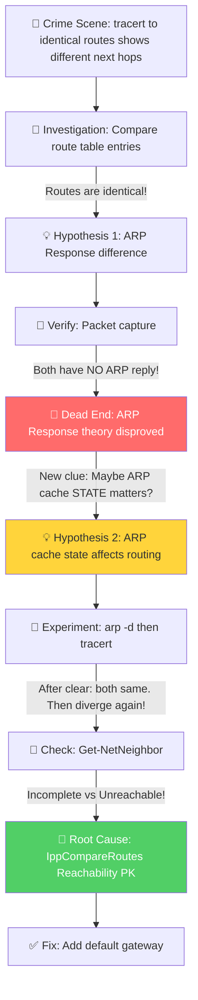

# 🔍 幽灵路由 — 一模一样的路由表，为何走了不同的路？

**Product/Service:** Windows TCP/IP Routing
**Difficulty:** ⭐⭐⭐⭐ (4/5)
**Duration:** 约 2 小时
**Key Technique:** ARP Cache 状态对 `IppCompareRoutes()` Reachability 判定的影响

---

## 🚨 案件报告 (The Crime Scene)

客户报警了："我的服务器到 `10.50.6.1` 完全不通！"

乍一看，这就是个简单的网络不可达问题。检查路由表，发现确实配错了 — 缺少一条默认网关。加上就完事了，对吧？

但就在排查的过程中，客户发现了一个**诡异的现象**：

```
C:\Users\appadmin> tracert 10.50.6.1
通过最多 30 个跃点跟踪到 10.50.6.1 的路由
  1   168-18-14-227 [10.20.11.15]   报告：无法访问目标主机。
跟踪完成。

C:\Users\appadmin> tracert 10.50.135.1
通过最多 30 个跃点跟踪到 10.50.135.1 的路由
  1   <1 毫秒   <1 毫秒   <1 毫秒   198.51.100.2
  2   *         *         *         请求超时。
  ...
```

`tracert 10.50.6.1` 的第一跳是 **10.20.11.15**（本机网卡 IP），报告"无法访问目标主机"。
`tracert 10.50.135.1` 的第一跳却是 **198.51.100.2**（上游网关），正常返回了 Time Exceeded。

但是！**打开路由表一看，这两个 IP 的路由配置是一模一样的：**

| 目标 | 掩码 | 接口 |
|------|------|------|
| 10.50.5.1 | 255.255.255.255 | 10.20.11.15 |
| 10.50.6.1 | 255.255.255.255 | 10.20.11.15 |
| 10.50.135.1 | 255.255.255.255 | 10.20.11.15 |
| 10.50.136.1 | 255.255.255.255 | 10.20.11.15 |

都是 `/32` 的 host route，都指向同一个接口 `10.20.11.15`。**配置一模一样，行为却截然不同 — 这不科学！**

> 💡 **给听众的思考题**：如果你是接案的侦探，面对"一模一样的路由配置却走了不同的路"，你会从哪里开始调查？

---

## 🔎 初步调查 (First Investigation)

### Round 1：ARP Response 假设

面对这个诡异现象，我的第一反应是从 ARP 层面推理：

- `tracert 10.50.6.1` 显示下一跳是 **10.20.11.15**（网卡自身 IP），并且报告"无法访问目标主机" — 这意味着系统尝试通过这个接口直接发送，但 **ARP 解析失败**，没人回复 ARP Request，于是本机自己生成了一个 ICMP Destination Host Unreachable。

- `tracert 10.50.135.1` 显示下一跳是 **198.51.100.2** — 这是上游设备的 IP。说明数据包不是从本地接口直接发的，而是**走了默认路由**（`0.0.0.0/0 → 198.51.100.1 via 198.51.101.22`），到达了上游网关 `198.51.100.2`。

**初步推理：** 也许 `10.50.135.1` 的 ARP Request 被某台设备回复了？如果有设备回复了 ARP Response，系统就拿到了 MAC 地址，包就能发出去。而 `10.50.6.1` 没人回复，所以发不出去。

这个推理很合理，对吧？**于是让客户抓了网络包来验证。**

---

## 🧱 遇到阻碍 (The Blocker / Dead End)

网络包一拿到手，我的假设**立刻被推翻了**。

```
# 针对 10.50.6.1 的 ARP — 全是 Request，没有任何 Reply！
17:34:22  10.20.11.15 → 10.50.6.1    ARP:Request, 10.20.11.15 asks for 10.50.6.1
17:34:22  10.20.11.15 → 10.50.6.1    ARP:Request, 10.20.11.15 asks for 10.50.6.1
17:34:23  10.20.11.15 → 10.50.6.1    ARP:Request, 10.20.11.15 asks for 10.50.6.1
17:35:24  10.20.11.15 → 10.50.6.1    ARP:Request, 10.20.11.15 asks for 10.50.6.1
17:36:25  10.20.11.15 → 10.50.6.1    ARP:Request, 10.20.11.15 asks for 10.50.6.1
...

# 针对 10.50.135.1 的 ARP — 同样全是 Request，也没有任何 Reply！
17:37:44  10.20.11.15 → 10.50.135.1  ARP:Request, 10.20.11.15 asks for 10.50.135.1
17:37:45  10.20.11.15 → 10.50.135.1  ARP:Request, 10.20.11.15 asks for 10.50.135.1
17:37:46  10.20.11.15 → 10.50.135.1  ARP:Request, 10.20.11.15 asks for 10.50.135.1
17:38:47  10.20.11.15 → 10.50.135.1  ARP:Request, 10.20.11.15 asks for 10.50.135.1
```

**两个 IP 都没有收到 ARP Reply！** 没有任何设备回复了 MAC 地址。

那我的"ARP Response 差异"假设就完全不成立了。如果两个 IP 的 ARP 行为一模一样（都是只有 Request 没有 Reply），**到底是什么导致了 tracert 结果的差异？**

案件陷入了僵局。我们知道的确有差异，但差异的根源找不到了...

> ⚠️ **关键转折点**：既然"有没有人回复 ARP"不是原因，那是不是**系统内部对 ARP 结果的记忆（Cache）**才是罪魁祸首？同样是没有回复，系统有可能用**不同的方式记住这个失败** — 也就是 ARP Cache 的状态！

---

## 💡 大胆假设 (The Hypothesis)

### 猜想：ARP Cache 的状态不同，导致了路由选择的分歧

虽然两个 IP 都没收到 ARP Reply，但 ARP Cache 里**记录"失败"的方式可能不同**。就像同样是考试没及格 — 一个是"0 分"（彻底不可达），一个是"还在答卷中"（还在尝试）。系统对这两种"失败"的处理方式可能不同。

**推理链：**
- 线索 A：tracert 结果确实不同 → 路由选择确实发生了分歧
- 线索 B：ARP 行为一模一样（都没有 Reply）→ 排除了 ARP Response 差异
- 线索 C：路由表配置一模一样 → 排除了路由表配置差异
- 排除法 → 差异只可能来自**路由选择过程中的动态状态**，最可能的就是 **ARP Cache 状态**

**如果假设成立，我们应该能看到：**
1. 清除 ARP Cache 后，两个 tracert 的行为应该**变成一致**（因为缓存状态被清空了）
2. 一段时间后，ARP Cache 重新建立，两个 tracert 的行为**再次分化**
3. `Get-NetNeighbor` 应该显示两个 IP 对应的 ARP Cache 状态**不同**

---

## 🧪 验证求证 (Verification)

### 实验 1：清除 ARP Cache

```powershell
# 清除所有 ARP Cache
arp -d *

# 立即 tracert 两个目标
tracert 10.50.6.1
tracert 10.50.135.1
```

**验证结果：** 清除 ARP Cache 后，两个 tracert **第一跳都是 10.20.11.15** — **行为完全一致！** ✅

这符合预期 — ARP Cache 清空后，没有了状态差异，系统对两个 IP 的处理方式完全相同。

### 实验 2：等待分化

再次执行：

```powershell
tracert 10.50.6.1    # → 下一跳: 10.20.11.15 （未变）
tracert 10.50.135.1  # → 下一跳: 198.51.100.2 （变了！走了默认路由！）
```

**果然分化了！** 第二轮 tracert 中，`10.50.135.1` 又走了默认路由。

### 实验 3：检查 ARP Cache 状态

```powershell
Get-NetNeighbor | Format-List * | Out-File -FilePath C:\netneighbor_detail.txt -Encoding UTF8
```

**关键发现：** ARP Cache 中两个 IP 的状态不同：

| 目标 IP | ARP Cache 状态 | tracert 下一跳 |
|---------|---------------|---------------|
| 10.50.6.1 | **Incomplete** | 10.20.11.15（本地接口） |
| 10.50.135.1 | **Unreachable** | 198.51.100.2（默认路由网关） |

**推理确认：** ARP Cache 状态确实不同！而且状态的差异直接对应了 tracert 结果的差异。

---

## 🎯 真相大白 (The Resolution)

### Root Cause — "凶手"是谁？

**ARP Cache 的 `Unreachable` 和 `Incomplete` 两种"失败"状态，在 Windows TCP/IP 路由选择引擎 `IppCompareRoutes()` 中被区别对待了。**

### "作案手法" — Windows 路由选择的隐藏逻辑

Windows 选择路由时，内部使用 `IppCompareRoutes()` 函数，按以下**严格优先级**逐项 PK：

```
Reachability > Prefix Length > Dead Gateway > Metric > ECMP Hash
```

注意！**Reachability（可达性）排在 Prefix Length（最长前缀）前面！**

这意味着：

**场景 A — `10.50.6.1`（ARP = Incomplete）：**
```
路由候选：/32 host route via 10.20.11.15 (ARP=Incomplete)
          /0  default route via 198.51.100.1

PK Round 1 - Reachability:
  /32 route: ARP=Incomplete → 系统还在尝试，没有判定为不可达 → ✅ 可参与竞选
  /0  route: 默认网关可达 → ✅ 可参与竞选

PK Round 2 - Prefix Length:
  /32 > /0 → /32 胜出！

结果：走 host route → 本地发 ARP → 无人回复 → 报告"无法访问目标主机"
```

**场景 B — `10.50.135.1`（ARP = Unreachable）：**
```
路由候选：/32 host route via 10.20.11.15 (ARP=Unreachable)
          /0  default route via 198.51.100.1

PK Round 1 - Reachability:
  /32 route: ARP=Unreachable → 系统已判定不可达 → ❌ 直接淘汰！
  /0  route: 默认网关可达 → ✅ 唯一幸存者

结果：走默认路由 → 198.51.100.1 → 到达上游网关 198.51.100.2
```

**用人话说：** `Incomplete` 就像一个嫌疑人"还在审讯中" — 系统不会放弃这条路径。而 `Unreachable` 就像嫌疑人"已经证明不在场" — 系统直接把这条路排除了，转而使用默认路由。

### 那 tracert 结果不同的最后一环呢？

网络包验证了另一层差异 — 不在 Windows 客户端，而在**上游网关 198.51.100.2**：

```
# 针对 10.50.6.1 — 走默认路由后，网关静默丢弃，不回复任何消息
198.51.101.22 → 10.50.6.1  ICMP Echo Request  （无回复）
198.51.101.22 → 10.50.6.1  ICMP Echo Request  （无回复）

# 针对 10.50.135.1 — 走默认路由后，网关正常回复 Time Exceeded
198.51.101.22 → 10.50.135.1  ICMP Echo Request
198.51.100.2  → 198.51.101.22  ICMP Time Exceeded  ← 网关有回复！
```

网关对 `10.50.6.1` 静默丢弃（可能是 ACL、路由黑洞或策略路由），但对 `10.50.135.1` 正常转发并回复 Time Exceeded。

### 解决方案

原始问题（网络不可达）的修复很简单：

```powershell
# 为缺少默认网关的路由添加正确的网关配置
route add 0.0.0.0 mask 0.0.0.0 198.51.100.1 -p
```

添加默认网关后，所有流量都能正常通过网关转发出去。

---

## 📋 案件复盘 (Case Review)

### 🗺️ 排查路径可视化



### 🎒 Takeaways

1. **技术知识**：Windows 路由选择中，`IppCompareRoutes()` 的 **Reachability 优先于 Prefix Length**。一条可达的 `/0` 默认路由会赢过一条不可达的 `/32` host route。ARP Cache 的 `Unreachable` 和 `Incomplete` 虽然都是"失败"，但在路由选择中被**区别对待**。
2. **排查方法**：当路由表配置完全相同但行为不同时，不要只看静态配置 — 要关注**动态状态**（ARP Cache、Path Cache、接口状态等）。`Get-NetNeighbor` 是查看 ARP Cache 详细状态的利器。
3. **经验法则**：`arp -d` 清除缓存后重试，是验证"ARP 缓存状态是否影响路由选择"的快速方法。如果清除后行为一致，说明问题就在缓存。
4. **踩坑提醒**：不要假设"ARP 失败 = ARP 失败"。同样是拿不到 MAC 地址，`Incomplete`（还在尝试中）和 `Unreachable`（已放弃）对系统来说是完全不同的信号。

### 🔧 工具箱 (Useful Commands & Tools)

| 命令/工具 | 用途 | 在本案中的作用 |
|----------|------|--------------|
| `tracert <IP>` | 追踪路由路径 | 发现了两个 IP 走了不同的路径 |
| `Get-NetNeighbor \| Format-List *` | 查看完整 ARP Cache（含状态） | 揭示了 Incomplete vs Unreachable 的关键差异 |
| `arp -d *` | 清除所有 ARP Cache | 验证了 ARP Cache 是行为差异的根源 |
| `route print` | 查看路由表 | 确认两个 IP 的路由配置完全一致 |
| Network Monitor / Wireshark | 网络包抓取 | 推翻了 ARP Response 假设，验证了默认路由行为 |

### 📚 References

- [ARP Caching Behavior in Windows TCP/IP (KB949589)](https://learn.microsoft.com/troubleshoot/windows-server/networking/address-resolution-protocol-arp-caching-behavior) — Windows ARP 缓存行为的官方说明，包含 Neighbor Cache 状态机
- [How to use TRACERT to troubleshoot TCP/IP problems](https://learn.microsoft.com/troubleshoot/windows-server/networking/trace-route-troubleshoot-tcp-ip-problems) — tracert 使用指南
- [Get-NetNeighbor PowerShell](https://learn.microsoft.com/powershell/module/nettcpip/get-netneighbor) — Get-NetNeighbor cmdlet 参考
- [Routing Table (Windows RRAS)](https://learn.microsoft.com/windows/win32/rras/routing-table) — Windows 路由表数据结构参考

---

## 📝 一句话破案总结 (One-liner)

> 客户发现路由表配置一模一样的两个 IP 走了不同的路。真相是 ARP Cache 的 `Unreachable` 和 `Incomplete` 两种"失败"状态，被 Windows 路由引擎 `IppCompareRoutes()` 的 **Reachability 优先级**区别对待了 — `Unreachable` 的路由在第一轮 PK 就被淘汰，包改走了默认路由。**同样是走不通的路，"已确认走不通"和"还在试"在系统眼里完全不同。**

---
---

# 🔍 The Phantom Route — Why Identical Routes Led to Different Destinations

**Product/Service:** Windows TCP/IP Routing
**Difficulty:** ⭐⭐⭐⭐ (4/5)
**Duration:** ~2 hours
**Key Technique:** Impact of ARP Cache states on `IppCompareRoutes()` Reachability evaluation

---

## 🚨 The Crime Scene

The customer called in: "My server can't reach `10.50.6.1` at all!"

At first glance, a straightforward network unreachability issue. Check the route table — yep, misconfigured, missing a default gateway. Add it and done, right?

But during the investigation, the customer stumbled upon a **bizarre behavior**:

```
C:\Users\appadmin> tracert 10.50.6.1
Tracing route to 10.50.6.1 over a maximum of 30 hops
  1   168-18-14-227 [10.20.11.15]   reports: Destination host unreachable.
Trace complete.

C:\Users\appadmin> tracert 10.50.135.1
Tracing route to 10.50.135.1 over a maximum of 30 hops
  1   <1 ms   <1 ms   <1 ms   198.51.100.2
  2   *        *        *       Request timed out.
  ...
```

`tracert 10.50.6.1` — first hop is **10.20.11.15** (the local NIC IP), reporting "Destination host unreachable."
`tracert 10.50.135.1` — first hop is **198.51.100.2** (an upstream gateway), returning a normal Time Exceeded.

But here's the twist: **the route table entries for both IPs are IDENTICAL:**

| Destination | Mask | Interface |
|-------------|------|-----------|
| 10.50.5.1 | 255.255.255.255 | 10.20.11.15 |
| 10.50.6.1 | 255.255.255.255 | 10.20.11.15 |
| 10.50.135.1 | 255.255.255.255 | 10.20.11.15 |
| 10.50.136.1 | 255.255.255.255 | 10.20.11.15 |

All `/32` host routes, all pointing to the same interface `10.20.11.15`. **Same config, different behavior — something doesn't add up!**

> 💡 **Think about it**: If you were the detective on this case, where would you start investigating "identical route config but different routing behavior"?

---

## 🔎 First Investigation

### Round 1: The ARP Response Hypothesis

My first instinct was to reason from the ARP layer:

- `tracert 10.50.6.1` shows **10.20.11.15** (local NIC) with "Destination host unreachable" → The system tried to send directly via this interface, ARP resolution failed (no one replied), so Windows generated a local ICMP Destination Host Unreachable.

- `tracert 10.50.135.1` shows **198.51.100.2** → This is an upstream device. The packet didn't go out directly — it took the **default route** (`0.0.0.0/0 → 198.51.100.1 via 198.51.101.22`) and reached upstream gateway `198.51.100.2`.

**Initial reasoning:** Maybe some device replied to the ARP Request for `10.50.135.1`? If a device sent back an ARP Reply, the system would have a MAC address and could forward the packet. While `10.50.6.1` had no reply, so it was stuck.

Sounds logical, right? **So I asked the customer to capture network packets.**

---

## 🧱 The Blocker / Dead End

The packet capture **immediately destroyed my hypothesis**.

```
# ARP for 10.50.6.1 — All Requests, ZERO Replies!
17:34:22  10.20.11.15 → 10.50.6.1    ARP:Request, 10.20.11.15 asks for 10.50.6.1
17:34:22  10.20.11.15 → 10.50.6.1    ARP:Request, 10.20.11.15 asks for 10.50.6.1
17:34:23  10.20.11.15 → 10.50.6.1    ARP:Request, 10.20.11.15 asks for 10.50.6.1
...

# ARP for 10.50.135.1 — Also all Requests, ZERO Replies!
17:37:44  10.20.11.15 → 10.50.135.1  ARP:Request, 10.20.11.15 asks for 10.50.135.1
17:37:45  10.20.11.15 → 10.50.135.1  ARP:Request, 10.20.11.15 asks for 10.50.135.1
17:37:46  10.20.11.15 → 10.50.135.1  ARP:Request, 10.20.11.15 asks for 10.50.135.1
...
```

**Neither IP received any ARP Reply!** No device responded with a MAC address.

If both IPs had identical ARP behavior (only Requests, no Replies), **what on earth was causing the tracert difference?**

The case hit a dead end. We knew the difference existed, but the root cause had vanished...

> ⚠️ **Turning Point**: Since "whether ARP was replied to" wasn't the answer, could it be the **system's internal memory of that failure (the Cache)**? Even though both failed, the system might **remember the failure differently** — through different ARP Cache states!

---

## 💡 The Hypothesis

### Guess: Different ARP Cache states are causing a fork in route selection

Even though neither IP received an ARP Reply, the ARP Cache might **record the failure differently**. Think of it like two students who both failed an exam — one scored 0 (confirmed failure), the other's paper is still being graded (status unknown). The school treats them very differently.

**Deduction chain:**
- Clue A: tracert results ARE different → route selection IS diverging
- Clue B: ARP behavior is identical (no Replies) → eliminates ARP Response as the cause
- Clue C: Route table config is identical → eliminates static configuration as the cause
- By elimination → the difference can only come from **dynamic state during route selection**, most likely **ARP Cache state**

**If this hypothesis is correct, we should observe:**
1. After clearing ARP Cache, both tracerts should **behave identically** (cache wiped)
2. After some time, ARP Cache rebuilds and tracerts **diverge again**
3. `Get-NetNeighbor` should show **different states** for the two IPs

---

## 🧪 Verification

### Experiment 1: Clear ARP Cache

```powershell
# Clear all ARP Cache
arp -d *

# Immediately tracert both targets
tracert 10.50.6.1
tracert 10.50.135.1
```

**Result:** After clearing, both tracerts show **10.20.11.15 as the first hop — behavior is identical!** ✅

This matches our prediction — with no cached state, the system treats both IPs the same way.

### Experiment 2: Wait for divergence

Run tracert again:

```powershell
tracert 10.50.6.1    # → Next hop: 10.20.11.15 (unchanged)
tracert 10.50.135.1  # → Next hop: 198.51.100.2 (CHANGED! Took default route!)
```

**Diverged again!** On the second round, `10.50.135.1` switched to the default route.

### Experiment 3: Inspect ARP Cache states

```powershell
Get-NetNeighbor | Format-List * | Out-File -FilePath C:\netneighbor_detail.txt -Encoding UTF8
```

**Key discovery:** The two IPs have different ARP Cache states:

| Target IP | ARP Cache State | tracert Next Hop |
|-----------|----------------|-----------------|
| 10.50.6.1 | **Incomplete** | 10.20.11.15 (local interface) |
| 10.50.135.1 | **Unreachable** | 198.51.100.2 (default route gateway) |

**Hypothesis confirmed:** ARP Cache states ARE different, and the difference directly maps to the tracert behavior!

---

## 🎯 The Resolution

### Root Cause — The "Culprit"

**The `Unreachable` and `Incomplete` ARP Cache states — both representing "failure" — are treated differently by Windows TCP/IP's route selection engine `IppCompareRoutes()`.**

### The "Modus Operandi" — How Windows route selection really works

Windows uses `IppCompareRoutes()` internally, with this **strict priority order**:

```
Reachability > Prefix Length > Dead Gateway > Metric > ECMP Hash
```

The critical insight: **Reachability ranks ABOVE Prefix Length!**

**Scenario A — `10.50.6.1` (ARP = Incomplete):**
```
Candidate routes: /32 host route via 10.20.11.15 (ARP=Incomplete)
                  /0  default route via 198.51.100.1

PK Round 1 - Reachability:
  /32 route: ARP=Incomplete → Still trying, not yet declared unreachable → ✅ Eligible
  /0  route: Gateway reachable → ✅ Eligible

PK Round 2 - Prefix Length:
  /32 > /0 → /32 wins!

Result: Takes host route → Sends ARP locally → No reply → Reports "Destination host unreachable"
```

**Scenario B — `10.50.135.1` (ARP = Unreachable):**
```
Candidate routes: /32 host route via 10.20.11.15 (ARP=Unreachable)
                  /0  default route via 198.51.100.1

PK Round 1 - Reachability:
  /32 route: ARP=Unreachable → Confirmed unreachable → ❌ Eliminated!
  /0  route: Gateway reachable → ✅ Sole survivor

Result: Takes default route → 198.51.100.1 → Reaches upstream gateway 198.51.100.2
```

**In plain English:** `Incomplete` is like a suspect "still being interrogated" — the system won't give up on that path yet. `Unreachable` is like a suspect with a "confirmed alibi" — the system eliminates that path immediately and falls back to the default route.

### The final piece of the puzzle

Packet capture also revealed a second layer — not on the Windows client, but on **upstream gateway 198.51.100.2**:

```
# For 10.50.6.1 — Gateway silently drops, no response
198.51.101.22 → 10.50.6.1  ICMP Echo Request  (no reply)

# For 10.50.135.1 — Gateway responds normally with Time Exceeded
198.51.101.22 → 10.50.135.1  ICMP Echo Request
198.51.100.2  → 198.51.101.22  ICMP Time Exceeded  ← Gateway replies!
```

The gateway treats the two destination IPs differently (likely due to ACLs, route blackholes, or policy routing).

### The Fix

The original issue (network unreachability) was straightforward:

```powershell
# Add the missing default gateway
route add 0.0.0.0 mask 0.0.0.0 198.51.100.1 -p
```

---

## 📋 Case Review

### 🗺️ Investigation Path


### 🎒 Takeaways

1. **Technical Knowledge**: In Windows route selection, `IppCompareRoutes()` ranks **Reachability above Prefix Length**. A reachable `/0` default route beats an unreachable `/32` host route. ARP Cache states `Unreachable` and `Incomplete` — though both represent "failure" — are **treated differently** in route selection.
2. **Troubleshooting Method**: When route table config is identical but behavior differs, look beyond static configuration — investigate **dynamic state** (ARP Cache, Path Cache, interface status). `Get-NetNeighbor` is the go-to tool for detailed ARP Cache inspection.
3. **Rule of Thumb**: `arp -d` followed by retry is a quick way to verify whether ARP cache state is influencing route selection. If behavior becomes consistent after clearing, the cache is your culprit.
4. **Pitfall Warning**: Don't assume "ARP failure = ARP failure." Both `Incomplete` (still trying) and `Unreachable` (given up) mean the MAC address wasn't obtained, but the system treats them as fundamentally different signals.

### 🔧 Useful Commands & Tools

| Command/Tool | General Purpose | Role in This Case |
|-------------|-----------------|-------------------|
| `tracert <IP>` | Trace routing path | Revealed different paths for identically-routed IPs |
| `Get-NetNeighbor \| Format-List *` | View detailed ARP Cache with states | Exposed the Incomplete vs Unreachable key difference |
| `arp -d *` | Clear all ARP Cache entries | Proved ARP Cache was the root cause of divergence |
| `route print` | Display route table | Confirmed identical route configurations |
| Network Monitor / Wireshark | Packet capture & analysis | Disproved the ARP Response hypothesis; verified default route behavior |

### 📚 References

- [ARP Caching Behavior in Windows TCP/IP (KB949589)](https://learn.microsoft.com/troubleshoot/windows-server/networking/address-resolution-protocol-arp-caching-behavior) — Official documentation on Windows ARP cache behavior and Neighbor Cache state machine
- [How to use TRACERT to troubleshoot TCP/IP problems](https://learn.microsoft.com/troubleshoot/windows-server/networking/trace-route-troubleshoot-tcp-ip-problems) — TRACERT usage guide
- [Get-NetNeighbor PowerShell](https://learn.microsoft.com/powershell/module/nettcpip/get-netneighbor) — Get-NetNeighbor cmdlet reference
- [Routing Table (Windows RRAS)](https://learn.microsoft.com/windows/win32/rras/routing-table) — Windows routing table data structure reference

---

## 📝 One-liner

> The customer discovered two identically-routed IPs taking different paths. The culprit? ARP Cache states `Unreachable` vs `Incomplete` — though both mean "no MAC address," Windows' `IppCompareRoutes()` **Reachability check** eliminates `Unreachable` routes before even comparing prefix length, causing traffic to silently fall back to the default route. **Same failure, different memory of that failure, completely different outcome.**
