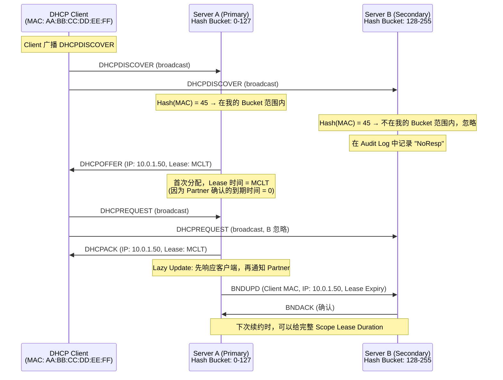
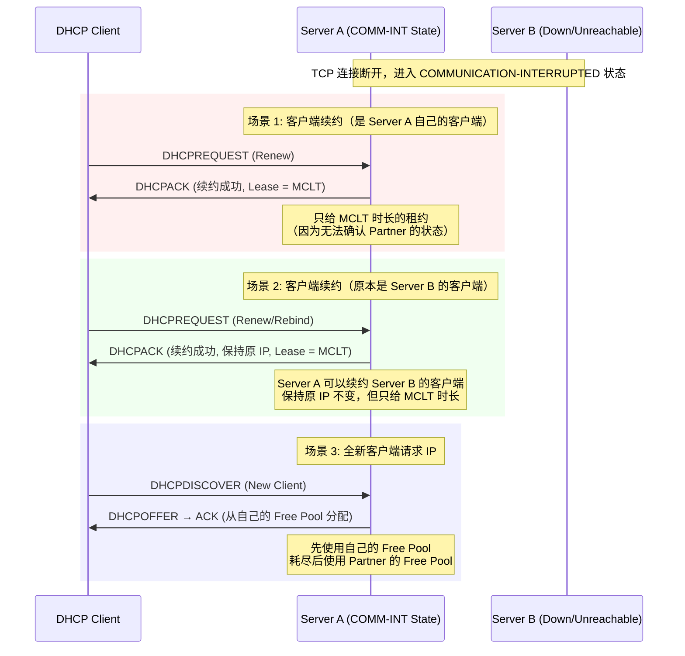
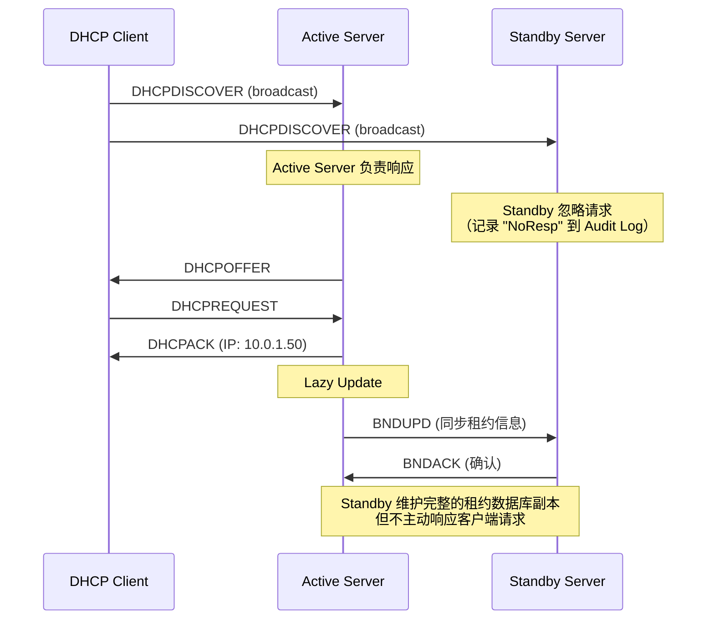
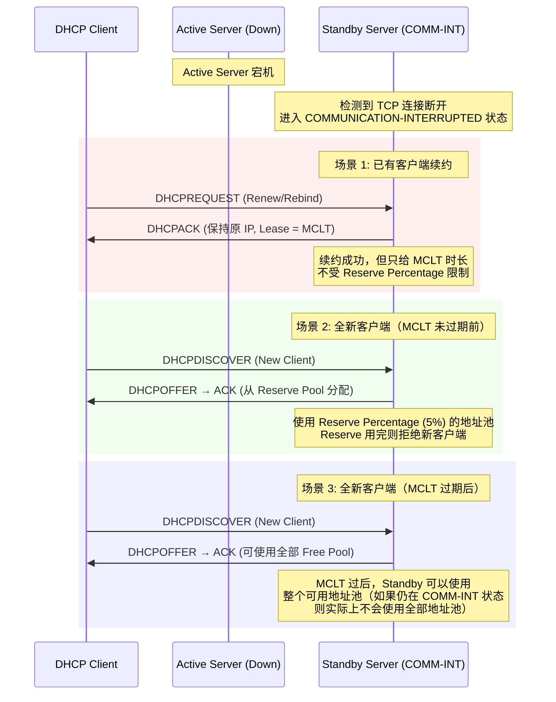
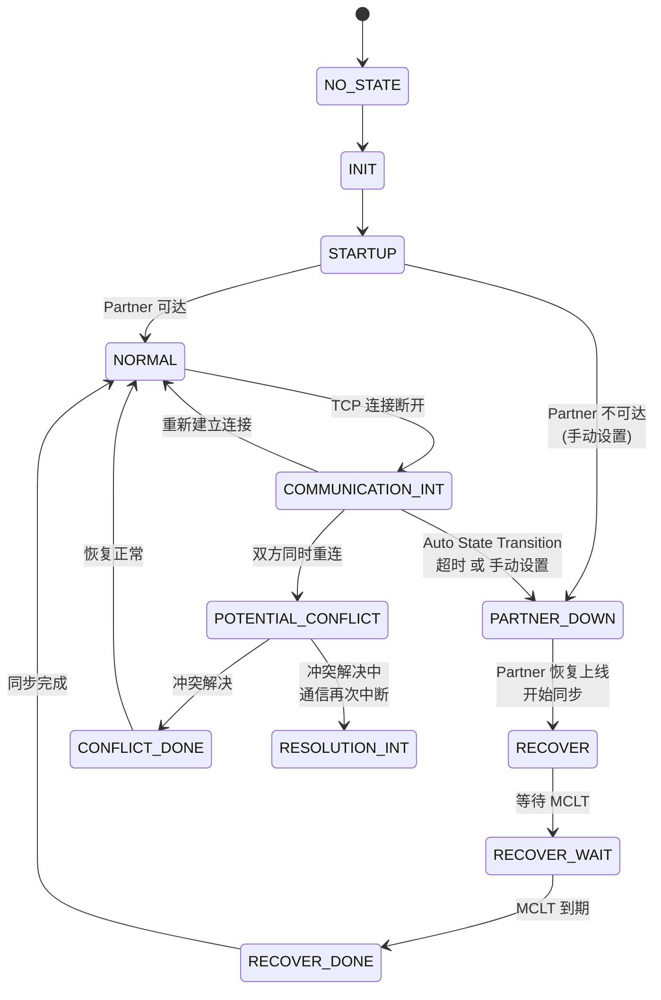
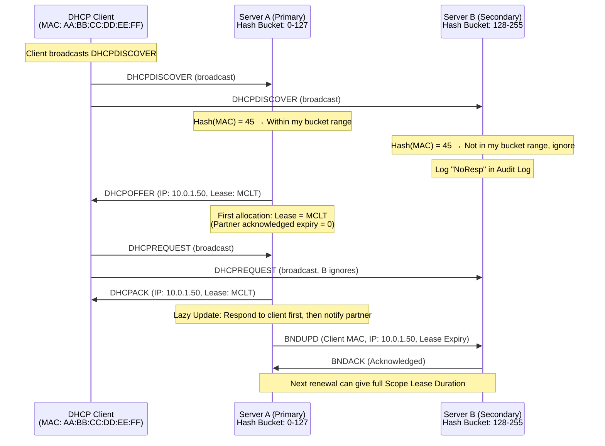

# Deep Dive: Windows DHCP Failover

**Topic:** Windows Server DHCP Failover — Load Balance & Hot Standby  
**Category:** Networking  
**Level:** 高级 / Advanced  
**Last Updated:** 2026-03-17

---

## 1. 概述 (Overview)

Windows Server DHCP Failover 是一种高可用性机制，允许两台 DHCP 服务器共享和同步 IPv4 地址租约数据库，确保当一台服务器不可用时，另一台可以继续为客户端提供 IP 地址租约服务。

DHCP Failover 解决了传统 DHCP 部署中的**单点故障**问题。在没有 Failover 的情况下，如果唯一的 DHCP 服务器宕机，所有客户端在租约到期后都将无法获取或续约 IP 地址。Failover 通过维护两份同步的租约数据库，确保任一服务器都能接管 DHCP 服务。

Microsoft 的 DHCP Failover 实现基于 IETF DHCP Failover Protocol Draft (draft-ietf-dhc-failover-12)，从 **Windows Server 2012** 开始引入，支持两种工作模式：**Load Balance（负载均衡/Active-Active）** 和 **Hot Standby（热备/Active-Standby）**。注意：DHCP Failover **仅支持 IPv4 Scope**，不支持 DHCPv6。

---

## 2. 核心概念 (Core Concepts)

### 2.1 Failover Relationship（故障转移关系）

Failover Relationship 是两台 DHCP 服务器之间的一个逻辑配置对象，定义了它们如何共享和同步 DHCP Scope 数据。

- 一个 Failover Relationship **只能在两台 DHCP 服务器之间建立**（不支持三台或更多）
- 一台 DHCP 服务器最多支持 **31 个 Failover Relationship**
- 一个 Failover Relationship 可以包含多个 DHCP Scope
- 同一台服务器可以与不同的服务器建立不同的 Failover Relationship，且可以混合使用 Load Balance 和 Hot Standby 模式

> 类比：把 Failover Relationship 想象成两个人之间的一份"合作协议"，协议里规定了谁负责什么范围的工作、怎么交接、出了问题怎么处理。

### 2.2 Maximum Client Lead Time (MCLT) — 最大客户端领先时间

**MCLT 是整个 DHCP Failover 协议中最核心的概念**，它是保证数据一致性和防止 IP 地址冲突的关键机制。

- **定义**：MCLT 是一台服务器可以将客户端租约延长到其 Partner 服务器已知的租约到期时间**之外**的最大时间长度
- **默认值**：1 小时
- **核心规则**：`客户端实际租约到期时间 ≤ Partner 确认的租约到期时间 + MCLT`

**为什么需要 MCLT？**

由于 DHCP Failover 使用 **Lazy Update**（延迟更新）机制——服务器先响应客户端，之后再通知 Partner——存在一个时间窗口，两台服务器的租约数据库不完全一致。MCLT 确保了即使在这个不一致的时间窗口内发生故障切换，也不会出现 IP 地址冲突。

```
场景举例：
- Server A 给客户端续租了 8 小时，但还没来得及通知 Server B
- Server A 突然宕机
- Server B 此时对这个客户端的租约记录还是旧的（例如还剩 2 小时）
- 如果 MCLT = 1 小时，那 Server B 知道：Server A 最多只可能比我多给了 1 小时
- 所以 Server B 可以安全地用 "旧记录 + MCLT" 来续租，不会冲突
```

### 2.3 Lazy Update（延迟更新）/ Binding Update

Lazy Update 是 DHCP Failover 中的**性能优化机制**：

1. 服务器先响应客户端的 DHCP 请求（ACK）
2. **之后**再向 Partner 服务器发送 **BNDUPD (Binding Update)** 消息同步租约信息
3. Partner 收到后回复 **BNDACK (Binding Acknowledgement)**

这种"先服务客户端、后同步 Partner"的设计确保了 DHCP 响应速度不受 Partner 通信延迟的影响。但也正因为此，MCLT 成为了必要的安全网。

### 2.4 Failover Protocol Messages（故障转移协议消息）

两台服务器通过 **TCP Port 647** 通信，核心消息类型：

| 消息类型 | 方向 | 作用 |
|---------|------|------|
| **CONNECT** | Primary → Secondary | 建立 Failover 连接 |
| **CONNECTACK** | Secondary → Primary | 确认/拒绝连接请求 |
| **STATE** | 双向 | 通知 Partner 自身状态变化 |
| **BNDUPD** | 双向 | 同步租约绑定更新 |
| **BNDACK** | 双向 | 确认收到绑定更新 |
| **UPDREQ** | 双向 | 请求 Partner 发送所有未同步的绑定更新 |
| **UPDREQALL** | 双向 | 请求 Partner 发送全部绑定数据（灾难恢复） |
| **UPDDONE** | 双向 | 通知 UPDREQ 已完成 |
| **CONTACT** | 双向 | 心跳/保活消息 |

### 2.5 Primary Server 与 Secondary Server

在 Failover Relationship 中，一台被指定为 **Primary**，另一台为 **Secondary**。这不等同于 Active/Standby：

- **Primary** 负责 TCP 连接建立和初始化，以及 IP 地址池的分配（Allocation）
- **Secondary** 等待 Primary 的连接
- 在 **Load Balance** 模式下，两者都是 Active 的
- 在 **Hot Standby** 模式下，Primary/Secondary 的角色与 Active/Standby 的角色独立

---

## 3. 工作原理 (How It Works)

### 3.1 整体架构

```
                    ┌─────────────────────────────────┐
                    │        DHCP Clients              │
                    │   (Broadcast DHCPDISCOVER)       │
                    └────────────┬────────────────────┘
                                 │
                    ┌────────────▼────────────────────┐
                    │      Network / DHCP Relay        │
                    │   (ip helper-address x 2)        │
                    └────┬───────────────────┬────────┘
                         │                   │
              ┌──────────▼──────┐  ┌─────────▼───────┐
              │  DHCP Server A  │  │  DHCP Server B   │
              │  (Primary)      │  │  (Secondary)     │
              │                 │  │                  │
              │  Scope: x.x.x.0│  │  Scope: x.x.x.0 │
              │  Lease DB ◄─────┼──┼──► Lease DB      │
              │                 │  │                  │
              └────────┬────────┘  └────────┬─────────┘
                       │    TCP Port 647     │
                       └────────────────────-┘
                       Failover Protocol Messages
                       (BNDUPD, BNDACK, STATE, etc.)
```

**关键要点：**
- 客户端的 DHCP 广播被两台服务器同时接收（通过 Relay 或在同一子网）
- 两台服务器必须都能被客户端访问到（需要配置两个 ip helper-address）
- 两台服务器通过 TCP 647 持续同步租约数据

### 3.2 Load Balance 模式（负载均衡 / Active-Active）

#### 3.2.1 IP 地址分配机制 — Hash Bucket

Load Balance 模式使用 **RFC 3074** 定义的 Hash Bucket 算法来决定哪台服务器响应哪个客户端：

```
┌──────────────────────────────────────────────────────────┐
│               Hash Bucket 算法 (RFC 3074)                 │
│                                                          │
│  1. 取客户端 MAC 地址                                      │
│  2. 计算 Hash 值 → 得到 0-255 之间的数字                    │
│  3. 将 256 个 Hash Bucket 按比例分配给两台服务器              │
│                                                          │
│  默认 50:50 分配:                                         │
│  ┌─────────────────────┬─────────────────────┐           │
│  │   Server A: 0-127   │  Server B: 128-255  │           │
│  │   (50% clients)     │  (50% clients)      │           │
│  └─────────────────────┴─────────────────────┘           │
│                                                          │
│  自定义 70:30 分配:                                        │
│  ┌──────────────────────────┬────────────────┐           │
│  │   Server A: 0-178        │ Server B:      │           │
│  │   (70% clients)          │ 179-255        │           │
│  │                          │ (30% clients)  │           │
│  └──────────────────────────┴────────────────┘           │
└──────────────────────────────────────────────────────────┘
```

> **重要：** 两台服务器共享**同一个完整的 IP 地址池**，Hash Bucket 分的是**客户端责任**（谁来响应哪个客户端），而不是**地址空间**。

#### 3.2.2 正常状态下的 IP 租约流程 (NORMAL State)



**首次分配的租约时间计算：**
- 首次分配时，Partner 确认的到期时间 = 0（Partner 不知道这个客户端）
- 因此：`客户端租约 = 0 + MCLT = MCLT`（通常 1 小时）
- 这就是为什么新客户端第一次获取的租约往往只有 1 小时

**续约时的租约时间计算：**
- 续约时，Partner 已经通过 BNDUPD/BNDACK 确认了上次的租约到期时间
- 因此：`客户端租约 = Partner确认的到期时间 + MCLT`
- 如果这个值 ≥ Scope Lease Duration，则使用完整的 Scope Lease Duration

#### 3.2.3 Partner 通信中断时的行为 (COMMUNICATION-INTERRUPTED State)



**关键行为说明：**
- Server A 开始响应**所有客户端**（不再只响应自己 Hash Bucket 范围内的）
- 续约请求：保持客户端原有 IP，但只给 MCLT 时长
- 新分配请求：先用自己的 Free Pool，耗尽后可以使用 Partner 的 Free Pool
- Server A **不会立即接管 Partner 100% 的地址池**

#### 3.2.4 Partner Down 状态

当管理员手动设置或 Auto State Transition 触发后，服务器进入 **PARTNER-DOWN** 状态：

```
COMMUNICATION-INTERRUPTED ──(等待 StateSwitchInterval 超时)──► PARTNER-DOWN
                                  或手动设置

PARTNER-DOWN 状态下的行为：
1. 等待 MCLT 时长
2. MCLT 过后，接管 100% 的 IP 地址池
3. 可以给客户端完整的 Scope Lease Duration
```

### 3.3 Hot Standby 模式（热备 / Active-Standby）

#### 3.3.1 角色与地址池分配

```
┌────────────────────────────────────────────────────────────┐
│                   Hot Standby 模式                          │
│                                                            │
│  ┌──────────────────────┐    ┌──────────────────────┐      │
│  │   Active Server      │    │   Standby Server     │      │
│  │                      │    │                      │      │
│  │  负责所有客户端的     │    │  Reserve Percentage  │      │
│  │  IP 地址分配和续约    │    │  (默认 5%) 的地址     │      │
│  │                      │    │  预留给 Standby 使用  │      │
│  │  95% 地址池          │    │  5% 地址池            │      │
│  └──────────────────────┘    └──────────────────────┘      │
│                                                            │
│  Active Server 处理所有请求                                  │
│  Standby Server 只在 Active 不可用时才响应                   │
└────────────────────────────────────────────────────────────┘
```

**Reserve Percentage（预留百分比）：**
- 默认 5%，可配置
- 这部分地址预留给 Standby 服务器在 Active 不可用时分配给**全新客户端**
- 对于**续约请求**，Standby 可以续约任何已有租约（不受 Reserve Percentage 限制）

#### 3.3.2 正常状态下的 IP 租约流程



#### 3.3.3 Active Server 不可用时的行为



**关键区别：**
- 在 COMMUNICATION-INTERRUPTED 状态下，Standby Server 对新客户端**只能使用 Reserve Pool**
- Reserve Pool 耗尽后，**拒绝新客户端请求**，但继续续约已有客户端
- MCLT 过期后（且 Standby 仍在 COMM-INT），Standby 可以使用更多地址池
- 只有进入 **PARTNER-DOWN** 状态，Standby 等待 MCLT 后才完全接管 100% 地址池

### 3.4 Failover 状态机 (Finite State Machine)



**关键状态说明：**

| 状态 | 说明 | 服务能力 |
|------|------|---------|
| **NORMAL** | 双方通信正常，完全同步 | 按配置模式正常工作 |
| **COMMUNICATION-INTERRUPTED** | 检测到 Partner 不可达，但不确定 Partner 是否真的宕机 | 可服务所有客户端，但租约受限于 MCLT |
| **PARTNER-DOWN** | 确认 Partner 已宕机（手动或自动转换） | 等待 MCLT 后完全接管所有地址 |
| **RECOVER** | Partner 恢复，正在同步数据 | 正在恢复中 |
| **POTENTIAL-CONFLICT** | 双方在尝试重新建立关系时检测到潜在冲突 | 需要解决冲突后才能恢复 |

### 3.5 MCLT 如何控制租约时间 — 完整示例

```
Scope Lease Duration = 8 天
MCLT = 1 小时

═══ 首次分配（NEW Client）═══
  Partner 确认的到期时间 = 0（Partner 不认识这个客户端）
  客户端获得的租约 = 0 + MCLT = 1 小时
  
═══ 第一次续约（T1 = 50% = 30 分钟后）═══
  此时 BNDUPD/BNDACK 已完成
  Partner 确认的到期时间 = 首次分配的到期时间（约 1 小时后）
  可用最大租约 = Partner 确认的到期时间 + MCLT ≈ 2 小时
  客户端获得的租约 = 2 小时（因为 2 小时 < 8 天）

═══ 第二次续约 ═══
  Partner 确认的到期时间 = 第一次续约的到期时间（约 2 小时后）
  可用最大租约 = 2 小时 + MCLT = 3 小时
  
═══ 逐次递增 ═══
  每次续约，Partner 确认的到期时间向上增长
  直到 Partner 确认的到期时间 + MCLT ≥ 8 天
  
═══ 达到稳态 ═══
  客户端获得的租约 = Scope Lease Duration = 8 天
```

> **实战注意**：这就是为什么新部署 DHCP Failover 后，客户端的租约时间会从很短（1 小时）逐步增长到配置值的原因。如果看到大量短租约，这是**正常行为**。

---

## 4. 关键配置与参数 (Key Configurations)

| 配置项/参数 | 默认值 | 说明 | 常见调优场景 |
|------------|--------|------|------------|
| **Mode** | Load Balance | Load Balance 或 Hot Standby | 根据部署拓扑选择 |
| **MaxClientLeadTime (MCLT)** | 1 小时 | 服务器可以领先 Partner 的最大租约时间 | 降低则提高安全性但增加同步频率；通常保持默认 |
| **LoadBalancePercent** | 50% | Load Balance 模式下本地服务器的负载比例 | 一台性能强可以调高其比例 |
| **ReservePercent** | 5% | Hot Standby 模式下 Standby 的预留地址百分比 | 新客户端多的环境可适当提高 |
| **StateSwitchInterval** | 未设置（禁用） | 从 COMM-INT 自动切换到 PARTNER-DOWN 的等待时间 | 建议设置（如 1-2 小时），避免长期处于 COMM-INT |
| **AutoStateTransition** | False | 是否启用自动状态转换 | 建议设为 True 并配合 StateSwitchInterval |
| **SharedSecret** | 无 | HMAC-MD5 消息认证密钥 | 建议在跨网络部署时启用 |
| **EnableAuth** | False | 是否启用消息认证 | 设置 SharedSecret 后自动启用 |

### 关键 PowerShell 命令

```powershell
# 创建 Load Balance Failover
Add-DhcpServerv4Failover -ComputerName "dhcp01.contoso.com" `
    -Name "Site1-Failover" `
    -PartnerServer "dhcp02.contoso.com" `
    -ScopeId 10.10.10.0,10.20.20.0 `
    -LoadBalancePercent 50 `
    -MaxClientLeadTime 1:00:00 `
    -SharedSecret "MySecretKey" `
    -AutoStateTransition $True `
    -StateSwitchInterval 2:00:00

# 创建 Hot Standby Failover
Add-DhcpServerv4Failover -ComputerName "dhcp01.contoso.com" `
    -Name "Site2-Failover" `
    -PartnerServer "dhcp03.contoso.com" `
    -ServerRole Standby `
    -ScopeId 10.30.30.0 `
    -ReservePercent 10 `
    -MaxClientLeadTime 1:00:00 `
    -AutoStateTransition $True `
    -StateSwitchInterval 2:00:00

# 查看 Failover 状态
Get-DhcpServerv4Failover | Format-List *

# 手动复制 Scope 配置到 Partner
Invoke-DhcpServerv4FailoverReplication -ComputerName "dhcp01.contoso.com" -Name "Site1-Failover"

# 修改 Failover 设置
Set-DhcpServerv4Failover -Name "Site1-Failover" -LoadBalancePercent 70
```

---

## 5. 常见问题与排查 (Common Issues & Troubleshooting)

### 问题 A: Failover 状态卡在 COMMUNICATION-INTERRUPTED

- **可能原因**：
  - Partner 服务器真的宕机或网络不可达
  - Windows Firewall 阻止了 TCP 647 端口
  - 时间不同步（两台服务器时间差 > 1 分钟）
  - Shared Secret 不匹配
- **排查思路**：
  1. `Test-NetConnection -ComputerName <PartnerServer> -Port 647` 测试连通性
  2. 检查 Event Viewer: `Applications and Services Logs\Microsoft\Windows\DHCP-Server\Admin`
  3. 检查 Event ID 20252（状态变化）和 20253（时间不同步）
  4. 验证 `w32tm /query /status` 时间同步状态
- **关键命令/工具**：
  ```powershell
  Get-DhcpServerv4Failover -Name "Site1-Failover" | Select State, PartnerServer
  Get-WinEvent -LogName "Microsoft-Windows-DHCP Server Events/Admin" -MaxEvents 20
  ```

### 问题 B: 客户端租约时间异常短（如只有 1 小时）

- **可能原因**：
  - 正常行为：首次分配或刚建立 Failover 后，租约从 MCLT 开始逐步递增
  - Partner 不可达导致只给 MCLT 时长
  - BNDUPD/BNDACK 同步失败
- **排查思路**：
  1. 检查 Failover 状态是否为 NORMAL
  2. 如果是新部署，等待几个续约周期后租约会自动增长
  3. 检查 Performance Counter: "Number of pending outbound binding updates"

### 问题 C: IP 地址冲突（Duplicate IP）

- **可能原因**：
  - 双 Relay 配置 + VRRP 导致 DHCP 请求被重复转发
  - 两台服务器同时响应了同一客户端的请求（MCLT 机制本应防止这种情况）
  - DAI (Dynamic ARP Inspection) 与 DHCP Failover 不一致的租约时长产生冲突
- **排查思路**：
  1. 检查网络中继配置，确保 ip helper-address 配置正确
  2. 检查 DHCP Audit Log 中的 "NoResp" 记录
  3. 查看 KB 文章关于 DAI 与 DHCP Failover 的已知问题

### 问题 D: Scope 配置不同步

- **可能原因**：
  - Scope 配置变更后**未手动复制**到 Partner
  - DHCP Failover 只自动同步**租约数据**，Scope 设置（如 Options、Reservations、Exclusions）需要手动复制
- **排查思路**：
  1. 对比两台服务器的 Scope 设置: `Get-DhcpServerv4Scope`、`Get-DhcpServerv4OptionValue`
  2. 从正确的服务器发起复制: `Invoke-DhcpServerv4FailoverReplication`
  3. **重要**: 始终从**配置正确的服务器**发起复制，因为复制会**覆盖** Partner 的配置

### 问题 E: DNS 动态更新失败

- **可能原因**：
  - 两台 DHCP 服务器使用不同的 DNS 凭据
  - Server A 为客户端创建了 DNS 记录并成为 Owner，Server B 接管后无法更新
- **排查思路**：
  1. 确保两台服务器使用相同的 DNS 凭据（专用服务账号）
  2. 考虑使用 DnsUpdateProxy 组
  3. 参考 MS Docs: "DNS Record Ownership and the DnsUpdateProxy Group"

---

## 6. 实战经验 (Practical Tips)

### 最佳实践

- **始终配置两个 DHCP Relay（ip helper-address）**：确保客户端能到达两台 DHCP 服务器
- **启用 Auto State Transition**：设置合理的 StateSwitchInterval（建议 1-2 小时），避免服务器长期卡在 COMMUNICATION-INTERRUPTED 状态
- **使用 Shared Secret**：启用消息认证，防止伪造的 Failover 消息
- **时间同步**：确保两台服务器时间差 < 1 分钟（使用 NTP/W32Time）
- **手动复制 Scope 变更**：每次修改 Scope Options、Reservations、Exclusions 后，务必手动 `Invoke-DhcpServerv4FailoverReplication`
- **DNS 凭据一致**：两台服务器使用相同的 DNS Update 凭据
- **限制 Failover 关系数量**：最多 31 个，尽量复用现有关系

### 常见误区

- ❌ **误以为 Failover 会自动同步 Scope Options**：只有租约数据自动同步，Scope 配置需手动复制
- ❌ **误以为 Load Balance = 地址池平分**：分的是客户端责任（Hash Bucket），不是地址空间
- ❌ **误以为 COMMUNICATION-INTERRUPTED = Partner Down**：COMM-INT 是保守状态，服务器不确定 Partner 是否真的宕机
- ❌ **误以为 Primary = Active**：Primary/Secondary 是连接建立角色，Active/Standby 是服务角色（Hot Standby 模式）
- ❌ **忘记 MCLT 对首次租约的影响**：新客户端首次获得的租约 = MCLT（通常 1 小时），需多次续约才能达到 Scope Lease Duration

### 性能考量

- **MCLT 值的权衡**：MCLT 越小，同步频率越高（更安全但更多 BNDUPD 流量）；MCLT 越大，故障切换后的恢复时间越长
- **Binding Update Queue**：监控 "Number of pending outbound binding updates" Performance Counter，高值表示同步积压
- **网络延迟**：两台服务器之间的网络延迟会直接影响 BNDUPD/BNDACK 的同步速度

### 安全注意

- TCP 647 端口需在 Windows Firewall 中放行（安装 DHCP 角色时自动添加）
- Shared Secret 在 Cluster 环境中需手动复制到所有节点
- 避免在不受信任的网络上传输未加密的 Failover 消息

---

## 7. 与相关技术的对比 (Comparison with Related Technologies)

| 维度 | DHCP Failover | DHCP Split Scope | DHCP Cluster (WSFC) |
|------|---------------|------------------|---------------------|
| **高可用模型** | 两台独立服务器同步 | 两台服务器各持部分地址 | 共享存储 + Failover Cluster |
| **地址利用率** | 100%（共享全部地址池） | < 100%（地址被分割） | 100%（共享数据库） |
| **自动故障切换** | 是 | 否（依赖客户端 Rebind） | 是（Cluster Service 管理） |
| **租约同步** | 实时同步（BNDUPD） | 不同步 | 共享存储（无需同步） |
| **配置复杂度** | 中等 | 简单 | 高（需要共享存储和 Cluster） |
| **IPv6 支持** | ❌ 不支持 | ✅ 支持 | ✅ 支持 |
| **服务器数量** | 严格 2 台 | 2+ 台 | 2+ 节点 |
| **适用场景** | 同站点/跨站点高可用 | 简单冗余 | 需要最高可用性的场景 |
| **WAN 部署** | ✅ 可以跨子网 | ✅ 可以 | ❌ 通常需要 SAN |
| **引入版本** | Windows Server 2012 | 一直支持 | 一直支持 |

**选型建议：**
- **同站点两台服务器**：推荐 Load Balance 模式
- **跨站点（总部+分支）**：推荐 Hot Standby 模式（分支为 Active，总部为 Standby）
- **需要 IPv6 高可用**：使用 Split Scope 或 DHCP Cluster
- **最高可用性要求**：可以组合使用（如 DHCP Cluster + Failover）

---

## 8. 参考资料 (References)

- [DHCP failover overview — Microsoft Learn](https://learn.microsoft.com/windows-server/networking/technologies/dhcp/dhcp-failover) — 官方 DHCP Failover 概述文档
- [Manage DHCP failover relationships — Microsoft Learn](https://learn.microsoft.com/windows-server/networking/technologies/dhcp/manage-dhcp-failover-relationships) — 配置和管理 Failover 关系的操作指南
- [DHCP failover events — Microsoft Learn](https://learn.microsoft.com/windows-server/networking/technologies/dhcp/dhcp-failover-events) — Failover 事件日志和 Performance Counter 参考
- [[MS-DHCPF] DHCP Failover Protocol — Microsoft Open Specs](https://learn.microsoft.com/en-us/openspecs/windows_protocols/ms-dhcpf/819b06e2-809d-4331-bd0a-75a9348eb5c2) — 微软 DHCP Failover 协议规范
- [IETF DHCP Failover Protocol Draft (draft-ietf-dhc-failover-12)](https://datatracker.ietf.org/doc/html/draft-ietf-dhc-failover-12) — IETF 故障转移协议草案，Windows 实现的基础

---
---

# Deep Dive: Windows DHCP Failover (English Version)

**Topic:** Windows Server DHCP Failover — Load Balance & Hot Standby  
**Category:** Networking  
**Level:** Advanced  
**Last Updated:** 2026-03-17

---

## 1. Overview

Windows Server DHCP Failover is a high-availability mechanism that allows two DHCP servers to share and synchronize their IPv4 address lease databases. When one server becomes unavailable, the other can continue providing IP address lease services to clients.

DHCP Failover solves the **single point of failure** problem in traditional DHCP deployments. Without failover, if the sole DHCP server goes down, all clients lose the ability to acquire or renew IP addresses once their leases expire. Failover maintains two synchronized lease databases, ensuring either server can take over DHCP services.

Microsoft's DHCP Failover implementation is based on the IETF DHCP Failover Protocol Draft (draft-ietf-dhc-failover-12), introduced starting with **Windows Server 2012**. It supports two operating modes: **Load Balance (Active-Active)** and **Hot Standby (Active-Standby)**. Note: DHCP Failover **only supports IPv4 scopes** — DHCPv6 is not supported.

---

## 2. Core Concepts

### 2.1 Failover Relationship

A Failover Relationship is a logical configuration object between two DHCP servers that defines how they share and synchronize DHCP scope data.

- A Failover Relationship can only exist between **exactly two DHCP servers** (not three or more)
- A single DHCP server supports up to **31 Failover Relationships**
- One Failover Relationship can include multiple DHCP scopes
- The same server can have different Failover Relationships with different servers, mixing Load Balance and Hot Standby modes

> Analogy: Think of a Failover Relationship as a "partnership agreement" between two people, specifying who handles which workload, how handoffs work, and what happens when things go wrong.

### 2.2 Maximum Client Lead Time (MCLT)

**MCLT is the single most important concept in the entire DHCP Failover protocol** — it is the key mechanism for ensuring data consistency and preventing IP address conflicts.

- **Definition**: The maximum time one server can extend a client's lease beyond the lease expiration time acknowledged by its partner server
- **Default value**: 1 hour
- **Core rule**: `Client's actual lease expiry ≤ Partner-acknowledged lease expiry + MCLT`

**Why is MCLT necessary?**

Because DHCP Failover uses a **Lazy Update** mechanism — the server responds to the client first, then notifies its partner — there is a time window where the two servers' lease databases are not perfectly synchronized. MCLT ensures that even if a failover occurs during this inconsistency window, no IP address conflicts can arise.

```
Example scenario:
- Server A renews a client's lease for 8 hours, but hasn't notified Server B yet
- Server A suddenly crashes
- Server B still has the old lease record for this client (e.g., 2 hours remaining)
- If MCLT = 1 hour, Server B knows: Server A could have given at most 1 hour more than what I know
- So Server B can safely renew using "old record + MCLT" without creating a conflict
```

### 2.3 Lazy Update / Binding Update

Lazy Update is a **performance optimization mechanism** in DHCP Failover:

1. The server responds to the client's DHCP request (ACK) first
2. **Then** sends a **BNDUPD (Binding Update)** message to the partner server to synchronize the lease information
3. The partner replies with a **BNDACK (Binding Acknowledgement)**

This "serve the client first, sync the partner later" design ensures DHCP response time is not affected by partner communication latency. But it's precisely why MCLT is a necessary safety net.

### 2.4 Failover Protocol Messages

The two servers communicate over **TCP Port 647**. Core message types:

| Message Type | Direction | Purpose |
|-------------|-----------|---------|
| **CONNECT** | Primary → Secondary | Establish failover connection |
| **CONNECTACK** | Secondary → Primary | Accept/reject connection request |
| **STATE** | Bidirectional | Notify partner of state changes |
| **BNDUPD** | Bidirectional | Synchronize lease binding updates |
| **BNDACK** | Bidirectional | Acknowledge binding update received |
| **UPDREQ** | Bidirectional | Request partner to send all unsynchronized binding updates |
| **UPDREQALL** | Bidirectional | Request partner to send all binding data (disaster recovery) |
| **UPDDONE** | Bidirectional | Notify that UPDREQ has been fulfilled |
| **CONTACT** | Bidirectional | Heartbeat/keepalive message |

### 2.5 Primary Server vs. Secondary Server

In a Failover Relationship, one server is designated as **Primary** and the other as **Secondary**. This is NOT the same as Active/Standby:

- **Primary** is responsible for TCP connection establishment, initialization, and IP address pool allocation
- **Secondary** waits for the Primary's connection
- In **Load Balance** mode, both are Active
- In **Hot Standby** mode, the Primary/Secondary roles are independent from the Active/Standby roles

---

## 3. How It Works

### 3.1 Overall Architecture

```
                    ┌─────────────────────────────────┐
                    │        DHCP Clients              │
                    │   (Broadcast DHCPDISCOVER)       │
                    └────────────┬────────────────────┘
                                 │
                    ┌────────────▼────────────────────┐
                    │      Network / DHCP Relay        │
                    │   (ip helper-address x 2)        │
                    └────┬───────────────────┬────────┘
                         │                   │
              ┌──────────▼──────┐  ┌─────────▼───────┐
              │  DHCP Server A  │  │  DHCP Server B   │
              │  (Primary)      │  │  (Secondary)     │
              │                 │  │                  │
              │  Scope: x.x.x.0│  │  Scope: x.x.x.0 │
              │  Lease DB ◄─────┼──┼──► Lease DB      │
              │                 │  │                  │
              └────────┬────────┘  └────────┬─────────┘
                       │    TCP Port 647     │
                       └─────────────────────┘
                       Failover Protocol Messages
                       (BNDUPD, BNDACK, STATE, etc.)
```

**Key points:**
- The client's DHCP broadcast is received by both servers simultaneously (via relay or same subnet)
- Both servers must be reachable by clients (requires two ip helper-address entries)
- Both servers continuously synchronize lease data over TCP 647

### 3.2 Load Balance Mode (Active-Active)

#### 3.2.1 IP Address Assignment Mechanism — Hash Bucket

Load Balance mode uses the **RFC 3074** Hash Bucket algorithm to determine which server responds to which client:

```
┌──────────────────────────────────────────────────────────┐
│               Hash Bucket Algorithm (RFC 3074)            │
│                                                          │
│  1. Take the client's MAC address                        │
│  2. Compute a hash value → number between 0-255          │
│  3. Divide 256 hash buckets between the two servers      │
│     based on the configured ratio                        │
│                                                          │
│  Default 50:50 split:                                    │
│  ┌─────────────────────┬─────────────────────┐           │
│  │   Server A: 0-127   │  Server B: 128-255  │           │
│  │   (50% clients)     │  (50% clients)      │           │
│  └─────────────────────┴─────────────────────┘           │
│                                                          │
│  Custom 70:30 split:                                     │
│  ┌──────────────────────────┬────────────────┐           │
│  │   Server A: 0-178        │ Server B:      │           │
│  │   (70% clients)          │ 179-255        │           │
│  │                          │ (30% clients)  │           │
│  └──────────────────────────┴────────────────┘           │
└──────────────────────────────────────────────────────────┘
```

> **Important:** Both servers share the **entire IP address pool**. Hash buckets divide **client responsibility** (which server responds to which client), NOT the **address space**.

#### 3.2.2 Normal State IP Lease Flow



**First allocation lease time calculation:**
- On first allocation, partner-acknowledged expiry = 0 (partner doesn't know this client)
- Therefore: `Client lease = 0 + MCLT = MCLT` (typically 1 hour)
- This is why new clients first get a lease of only 1 hour

**Renewal lease time calculation:**
- On renewal, the partner has already confirmed the previous expiry via BNDUPD/BNDACK
- Therefore: `Client lease = Partner-acknowledged expiry + MCLT`
- If this value ≥ Scope Lease Duration, the full Scope Lease Duration is used

#### 3.2.3 Behavior During Communication Interruption (COMMUNICATION-INTERRUPTED State)

When a server loses contact with its failover partner:

1. **Renewing its own clients**: The surviving server renews the lease with the same IP, but only for MCLT duration
2. **Renewing the partner's clients** (Rebind): The surviving server can renew any client's lease with the original IP, but only for MCLT duration
3. **New clients**: The surviving server allocates from its own free pool first; when exhausted, it uses the partner's free pool
4. The server does **NOT** immediately take over 100% of the address pool

#### 3.2.4 Partner Down State

After an administrator manually sets PARTNER-DOWN or the Auto State Transition timer expires:

```
COMMUNICATION-INTERRUPTED ──(Wait StateSwitchInterval)──► PARTNER-DOWN
                              or manual override

PARTNER-DOWN behavior:
1. Wait for MCLT duration
2. After MCLT, take over 100% of the IP address pool
3. Can grant full Scope Lease Duration to clients
```

### 3.3 Hot Standby Mode (Active-Standby)

#### 3.3.1 Roles and Address Pool Allocation

```
┌────────────────────────────────────────────────────────────┐
│                   Hot Standby Mode                          │
│                                                            │
│  ┌──────────────────────┐    ┌──────────────────────┐      │
│  │   Active Server      │    │   Standby Server     │      │
│  │                      │    │                      │      │
│  │  Handles ALL client  │    │  Reserve Percentage  │      │
│  │  IP allocation and   │    │  (default 5%) of     │      │
│  │  renewals            │    │  addresses reserved  │      │
│  │                      │    │  for Standby use     │      │
│  │  95% address pool    │    │  5% address pool     │      │
│  └──────────────────────┘    └──────────────────────┘      │
│                                                            │
│  Active Server handles all requests                         │
│  Standby Server only responds when Active is unavailable    │
└────────────────────────────────────────────────────────────┘
```

**Reserve Percentage:**
- Default 5%, configurable
- Reserved for the Standby server to allocate to **new clients** when Active is unavailable
- For **renewal requests**, Standby can renew any existing lease (not limited by Reserve Percentage)

#### 3.3.2 Normal State Lease Flow

In normal operation, only the Active server responds to all DHCP requests. The Standby server receives broadcasts but ignores them (logging "NoResp" to audit log). The Active server sends BNDUPD messages to keep the Standby's lease database synchronized.

#### 3.3.3 Behavior When Active Server is Unavailable

When the Active server goes down and the Standby detects the TCP connection loss:

1. **Existing client renewals**: Standby renews with the original IP, lease duration = MCLT. Not limited by Reserve Percentage.
2. **New clients (before MCLT expires)**: Standby allocates from the Reserve Pool (5%). If Reserve Pool is exhausted, **refuses new client requests** but continues renewing existing leases.
3. **New clients (after MCLT expires)**: Standby can use a larger portion of the available address pool.
4. **PARTNER-DOWN state**: Only after entering PARTNER-DOWN and waiting for MCLT does the Standby fully take over 100% of the address pool.

### 3.4 Failover State Machine (FSM)

| State | Description | Service Capability |
|-------|-------------|-------------------|
| **NORMAL** | Both partners communicating normally, fully synchronized | Operates per configured mode |
| **COMMUNICATION-INTERRUPTED** | Partner unreachable, but unsure if partner is truly down | Can serve all clients, but leases limited to MCLT |
| **PARTNER-DOWN** | Confirmed partner is down (manual or auto transition) | After MCLT wait, takes over 100% of address pool |
| **RECOVER** | Partner has come back online, synchronizing data | Recovering state |
| **POTENTIAL-CONFLICT** | Both servers reconnecting and detecting potential conflicts | Must resolve conflicts before returning to NORMAL |
| **RECOVER-WAIT** | Waiting for MCLT before transitioning to RECOVER-DONE | Waiting |
| **RECOVER-DONE** | Ready to transition back to NORMAL | Interlocked transition |

**State transitions:**
```
STARTUP → NORMAL (partner reachable)
NORMAL → COMMUNICATION-INTERRUPTED (TCP connection lost)
COMMUNICATION-INTERRUPTED → NORMAL (connection restored)
COMMUNICATION-INTERRUPTED → PARTNER-DOWN (auto/manual after StateSwitchInterval)
PARTNER-DOWN → RECOVER → RECOVER-WAIT → RECOVER-DONE → NORMAL
```

### 3.5 How MCLT Controls Lease Duration — Complete Example

```
Scope Lease Duration = 8 days
MCLT = 1 hour

═══ First Allocation (NEW Client) ═══
  Partner-acknowledged expiry = 0 (partner doesn't know this client)
  Client gets lease = 0 + MCLT = 1 hour
  
═══ First Renewal (T1 = 50% = 30 minutes later) ═══
  BNDUPD/BNDACK has been completed by now
  Partner-acknowledged expiry = first allocation expiry (~1 hour from now)
  Maximum available lease = Partner-acknowledged expiry + MCLT ≈ 2 hours
  Client gets lease = 2 hours (since 2 hours < 8 days)

═══ Second Renewal ═══
  Partner-acknowledged expiry = first renewal expiry (~2 hours)
  Maximum available lease = 2 hours + MCLT = 3 hours
  
═══ Progressive Increase ═══
  Each renewal, the partner-acknowledged expiry grows
  Until partner-acknowledged expiry + MCLT ≥ 8 days
  
═══ Steady State ═══
  Client gets lease = Scope Lease Duration = 8 days
```

> **Practical note**: This is why after deploying DHCP Failover, client lease durations start short (1 hour) and gradually increase to the configured value. Seeing many short leases initially is **normal behavior**.

---

## 4. Key Configurations

| Parameter | Default | Description | Common Tuning Scenario |
|-----------|---------|-------------|----------------------|
| **Mode** | Load Balance | Load Balance or Hot Standby | Choose based on deployment topology |
| **MaxClientLeadTime (MCLT)** | 1 hour | Maximum time one server can lead the partner in lease duration | Lower = more secure but higher sync frequency; usually keep default |
| **LoadBalancePercent** | 50% | Local server's load percentage in Load Balance mode | Increase for a higher-capacity server |
| **ReservePercent** | 5% | Standby's reserved address percentage in Hot Standby mode | Increase in environments with many new clients |
| **StateSwitchInterval** | Not set (disabled) | Wait time before auto-transition from COMM-INT to PARTNER-DOWN | Recommended to set (e.g., 1-2 hours) |
| **AutoStateTransition** | False | Whether to enable automatic state transition | Recommended to set True with StateSwitchInterval |
| **SharedSecret** | None | HMAC-MD5 message authentication key | Recommended for cross-network deployments |

---

## 5. Common Issues & Troubleshooting

### Issue A: Failover State Stuck in COMMUNICATION-INTERRUPTED
- **Possible causes**: Partner truly down, firewall blocking TCP 647, time out of sync (>1 minute), shared secret mismatch
- **Troubleshooting**: Test `Test-NetConnection -Port 647`, check Event ID 20252/20253, verify `w32tm /query /status`

### Issue B: Abnormally Short Client Lease Duration (e.g., 1 Hour)
- **Possible causes**: Normal behavior for initial allocation, partner unreachable, BNDUPD/BNDACK sync failure
- **Troubleshooting**: Check failover state, wait for renewal cycles, monitor "pending outbound binding updates" counter

### Issue C: IP Address Conflicts (Duplicate IP)
- **Possible causes**: Duplicate relay with VRRP causing duplicate DHCP requests, DAI incompatibility with inconsistent lease durations
- **Troubleshooting**: Check relay configuration, review DHCP Audit Log "NoResp" entries

### Issue D: Scope Configuration Out of Sync
- **Key point**: Failover only auto-syncs **lease data**. Scope settings (Options, Reservations, Exclusions) must be **manually replicated** via `Invoke-DhcpServerv4FailoverReplication`

### Issue E: DNS Dynamic Update Failures
- **Cause**: Two DHCP servers using different DNS credentials. Server A creates DNS record, becomes owner; Server B cannot update after failover
- **Solution**: Use the same DNS credentials (dedicated service account) on both servers; consider DnsUpdateProxy group

---

## 6. Practical Tips

### Best Practices
- **Always configure two DHCP relays** (ip helper-address) to ensure clients can reach both servers
- **Enable Auto State Transition** with a reasonable StateSwitchInterval (1-2 hours recommended)
- **Use Shared Secret** for message authentication
- **Time synchronization**: Keep time difference < 1 minute between partners (use NTP/W32Time)
- **Manually replicate scope changes**: After modifying scope options/reservations/exclusions, always run `Invoke-DhcpServerv4FailoverReplication`
- **Consistent DNS credentials** across both servers
- **Limit failover relationships**: Maximum 31; reuse existing relationships when possible

### Common Misconceptions
- ❌ Failover auto-syncs scope options → Only **lease data** is auto-synced
- ❌ Load Balance = address pool split → It splits **client responsibility** (Hash Buckets), not addresses
- ❌ COMMUNICATION-INTERRUPTED = Partner Down → COMM-INT is a conservative state; the server doesn't know if the partner is truly down
- ❌ Primary = Active → Primary/Secondary are connection roles; Active/Standby are service roles (Hot Standby mode)
- ❌ Forgetting MCLT's impact on initial leases → New clients first get MCLT-length leases; multiple renewals needed to reach full Scope Lease Duration

### Performance Considerations
- **MCLT value trade-off**: Smaller = more frequent sync (safer but more BNDUPD traffic); Larger = longer recovery time after failover
- **Binding Update Queue**: Monitor "Number of pending outbound binding updates" performance counter; high values indicate sync backlog
- **Network latency**: Directly impacts BNDUPD/BNDACK synchronization speed

---

## 7. Comparison with Related Technologies

| Dimension | DHCP Failover | DHCP Split Scope | DHCP Cluster (WSFC) |
|-----------|---------------|------------------|---------------------|
| **HA Model** | Two independent servers sync | Two servers each hold partial addresses | Shared storage + Failover Cluster |
| **Address Utilization** | 100% (shared pool) | < 100% (addresses split) | 100% (shared database) |
| **Auto Failover** | Yes | No (relies on client Rebind) | Yes (Cluster Service managed) |
| **Lease Sync** | Real-time (BNDUPD) | No sync | Shared storage (no sync needed) |
| **Configuration Complexity** | Medium | Simple | High (requires shared storage + cluster) |
| **IPv6 Support** | ❌ Not supported | ✅ Supported | ✅ Supported |
| **Server Count** | Strictly 2 | 2+ | 2+ nodes |
| **Best For** | Same-site/cross-site HA | Simple redundancy | Highest availability requirements |

**Selection guidelines:**
- **Same-site, two servers**: Load Balance mode recommended
- **Cross-site (HQ + branch)**: Hot Standby mode (branch = Active, HQ = Standby)
- **Need IPv6 HA**: Use Split Scope or DHCP Cluster
- **Highest availability**: Combine approaches (e.g., DHCP Cluster + Failover)

---

## 8. References

- [DHCP failover overview — Microsoft Learn](https://learn.microsoft.com/windows-server/networking/technologies/dhcp/dhcp-failover) — Official DHCP Failover overview documentation
- [Manage DHCP failover relationships — Microsoft Learn](https://learn.microsoft.com/windows-server/networking/technologies/dhcp/manage-dhcp-failover-relationships) — Step-by-step guide for configuring and managing Failover relationships
- [DHCP failover events — Microsoft Learn](https://learn.microsoft.com/windows-server/networking/technologies/dhcp/dhcp-failover-events) — Failover event logging and performance counter reference
- [[MS-DHCPF] DHCP Failover Protocol — Microsoft Open Specs](https://learn.microsoft.com/en-us/openspecs/windows_protocols/ms-dhcpf/819b06e2-809d-4331-bd0a-75a9348eb5c2) — Microsoft DHCP Failover Protocol specification
- [IETF DHCP Failover Protocol Draft (draft-ietf-dhc-failover-12)](https://datatracker.ietf.org/doc/html/draft-ietf-dhc-failover-12) — IETF failover protocol draft, the basis for Microsoft's implementation
