# 深入理解：Azure 负载均衡与应用交付 — LB、Application Gateway、Front Door 与 Traffic Manager

## 1. 概述

Azure 提供多种负载均衡服务，选择取决于两个维度：

```mermaid
graph TD
    Start[需要负载均衡] --> Q1{全球 or 区域?}
    Q1 -->|全球 Global| Q2{HTTP(S)?}
    Q1 -->|区域 Regional| Q3{HTTP(S)?}
    
    Q2 -->|是| FD[Azure Front Door]
    Q2 -->|否| TM[Traffic Manager<br/>+ 区域 LB]
    
    Q3 -->|是| AppGW[Application Gateway]
    Q3 -->|否| LB[Azure Load Balancer]
    
    style FD fill:#0078d4,color:white
    style TM fill:#50e6ff,color:black
    style AppGW fill:#ff6b35,color:white
    style LB fill:#00aa00,color:white
```

| 服务 | 层级 | 范围 | 协议 | 是否代理 |
|------|------|------|------|---------|
| **Azure Load Balancer** | L4 | 区域 | TCP/UDP | 否 (DSR 可选) |
| **Application Gateway** | L7 | 区域 | HTTP/HTTPS | 是 |
| **Azure Front Door** | L7 | 全球 (边缘) | HTTP/HTTPS | 是 |
| **Traffic Manager** | DNS | 全球 | 任何 (DNS 级) | 否 (仅 DNS) |

## 2. 核心概念详解

### 2.1 Azure Load Balancer

Azure Load Balancer 是**高性能、低延迟的 L4 负载均衡器**，支持所有 TCP 和 UDP 协议。

#### 组件架构

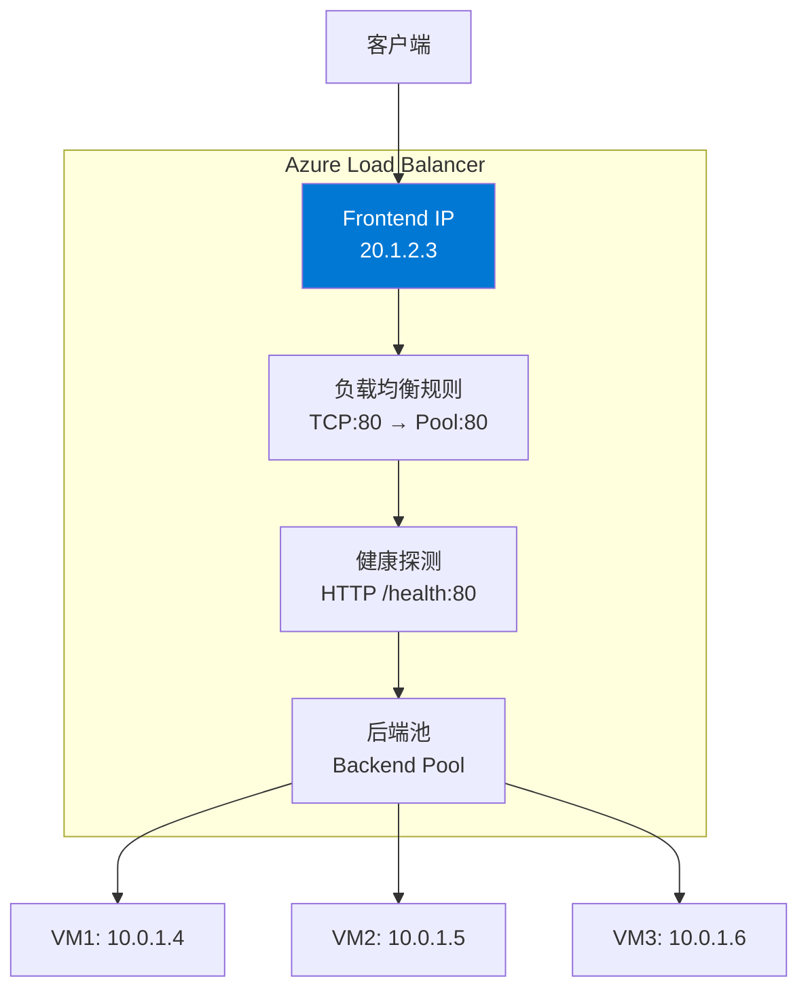

#### SKU 对比

| 特性 | Basic (已弃用) | Standard | Gateway |
|------|--------------|----------|---------|
| 后端池规模 | 300 | 5000 | NVA 场景 |
| 健康探测 | TCP, HTTP | TCP, HTTP, HTTPS | TCP, HTTP, HTTPS |
| 可用区支持 | ❌ | ✅ (Zone-redundant) | ✅ |
| HA Ports | ❌ | ✅ | ✅ |
| 出站规则 | ❌ | ✅ | N/A |
| 跨区域 LB | ❌ | ✅ (Global Tier) | ❌ |

> ⚠️ **Basic SKU 将于 2025.9.30 退役，始终使用 Standard SKU。**

#### 负载分配模式

| 模式 | 哈希元素 | 适用场景 |
|------|---------|---------|
| **5-tuple** (默认) | 源 IP + 源端口 + 目标 IP + 目标端口 + 协议 | 通用（最佳分布） |
| **Source IP Affinity (2-tuple)** | 源 IP + 目标 IP | 需要会话保持 |
| **Source IP Affinity (3-tuple)** | 源 IP + 目标 IP + 协议 | 需要协议级会话保持 |

#### HA Ports (高可用端口)

HA Ports 允许在**单条规则**中均衡所有端口的所有协议流量，专为 **NVA (网络虚拟设备)** 场景设计：

```bash
# 创建 HA Ports 规则
az network lb rule create \
  --lb-name ContosoILB \
  --resource-group ContosoRG \
  --name HAPortsRule \
  --protocol All \
  --frontend-port 0 \
  --backend-port 0 \
  --frontend-ip-name FrontendIP \
  --backend-pool-name NVAPool
```

#### 出站连接 (SNAT)

Standard LB 的出站规则配置 SNAT：
- 后端池成员通过 Frontend IP 的 SNAT 端口进行出站
- 每个 Frontend IP 提供 ~64K SNAT 端口
- **SNAT 端口耗尽** 是常见问题 — 推荐使用 NAT Gateway 替代

```bash
# 健康探测源 IP: 168.63.129.16
# NSG 必须允许此 IP 的入站流量，否则探测失败！
```

#### Cross-Region Load Balancer

Standard LB 的 **Global Tier** 支持跨区域负载均衡：
- 前端: 全球任播 (Anycast) IP
- 后端: 区域 Standard LB
- 适用于非 HTTP 的全球负载均衡

### 2.2 Application Gateway

Application Gateway 是**区域级 L7 负载均衡器**，专为 Web 流量设计。

#### 核心组件

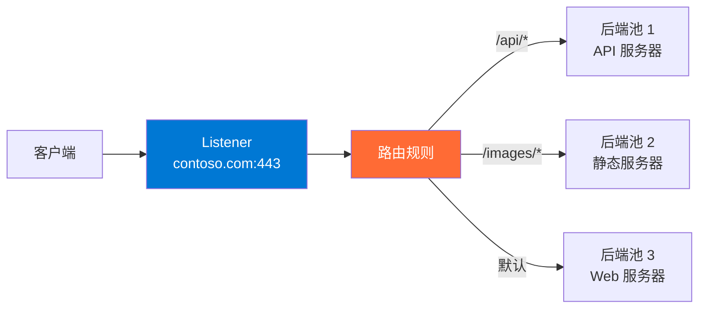

#### 关键特性

| 特性 | 说明 |
|------|------|
| **URL 路径路由** | /api/* → 池1, /images/* → 池2 |
| **多站点托管** | contoso.com → 池1, fabrikam.com → 池2 (基于 Host Header) |
| **SSL 终止** | 在 Gateway 卸载 SSL，减轻后端负担 |
| **端到端 SSL** | Gateway ↔ 后端之间也加密 |
| **自动缩放** | v2 SKU 支持基于流量自动扩展 |
| **会话亲和性** | Cookie-based 会话保持 |
| **连接排空** | 优雅地关闭到后端的连接 |
| **Header 重写** | 修改请求/响应 HTTP 头 |
| **URL 重写** | 修改 URL 路径和查询字符串 |
| **WebSocket / HTTP/2** | 完全支持 |
| **WAF 集成** | 内置 Web 应用防火墙 |

#### v1 vs v2

| 特性 | v1 (Standard/WAF) | v2 (Standard_v2/WAF_v2) |
|------|-------------------|------------------------|
| 自动缩放 | ❌ (固定实例) | ✅ |
| Zone 冗余 | ❌ | ✅ |
| 静态 VIP | ❌ | ✅ |
| Header 重写 | ❌ | ✅ |
| 性能 | 较低 | 5x 改进 |
| 部署时间 | 较长 | 更快 |

> ⚠️ **始终使用 v2 SKU**。v1 已不推荐。

```bash
# 创建 Application Gateway v2
az network application-gateway create \
  --name ContosoAppGW \
  --resource-group ContosoRG \
  --sku Standard_v2 \
  --capacity 2 \
  --vnet-name ContosoVNet \
  --subnet AppGwSubnet \
  --http-settings-port 80 \
  --http-settings-protocol Http \
  --frontend-port 443 \
  --public-ip-address AppGwPublicIP
```

#### Application Gateway for Containers (新)

新一代应用负载均衡器，专为容器化工作负载设计：
- 与 AKS Gateway API 原生集成
- 支持流量拆分 (Traffic Splitting) 用于蓝绿/金丝雀部署
- 近实时配置更新

### 2.3 Azure Front Door

Azure Front Door 是**全球分布的 L7 负载均衡器 + CDN + WAF**，运行在 Microsoft 全球边缘网络。

#### 工作原理

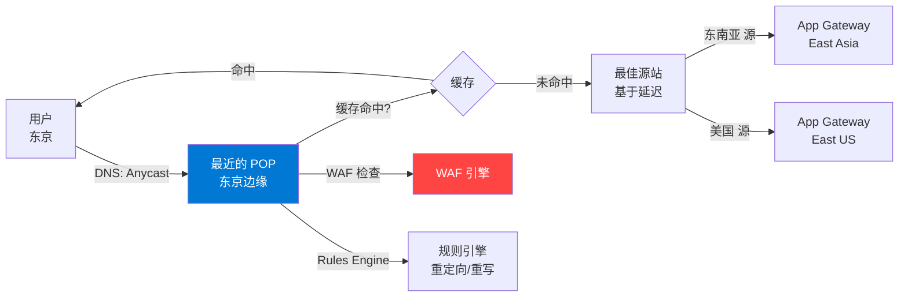

**关键优势：**
- **Anycast**: 用户流量自动进入最近的 Microsoft POP (190+ PoP)
- **Split TCP**: 在 POP 终止 TCP 连接，使用优化的 Microsoft 骨干网到源站（减少延迟）
- **连接池**: 复用到源站的连接，减少源站负载

#### Front Door Standard vs Premium

| 特性 | Standard | Premium |
|------|----------|---------|
| 自定义域名 + HTTPS | ✅ | ✅ |
| CDN 缓存 | ✅ | ✅ |
| 压缩 | ✅ | ✅ |
| 地理过滤 | ✅ | ✅ |
| WAF 托管规则 | ✅ (DRS) | ✅ (DRS + Bot) |
| **Private Link 源站** | ❌ | ✅ |
| **WAF Premium 规则** | ❌ | ✅ |
| **增强分析** | ❌ | ✅ |

#### 路由方法

- **延迟 (Latency)**: 选择延迟最低的源站（默认）
- **优先级 (Priority)**: 主源站 + 备用源站
- **加权 (Weighted)**: 按百分比分配流量
- **会话亲和性 (Session Affinity)**: 同一用户始终到同一源站

### 2.4 Traffic Manager

Traffic Manager 是**基于 DNS 的全球流量管理器**——它不是代理，不处理数据流量。

#### 工作原理

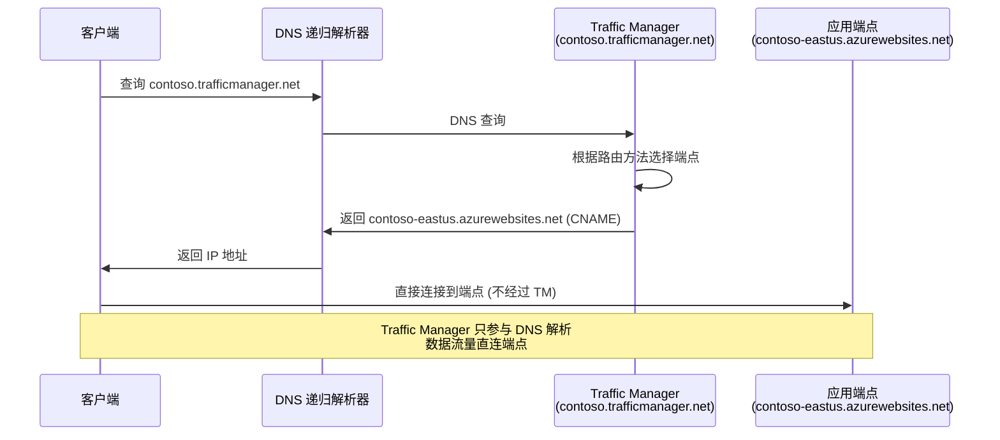

> ⚠️ **关键区别**：Traffic Manager 只做 DNS 解析，客户端**直接连接**到端点。Front Door/AppGW 是代理，所有流量都经过它们。

#### 路由方法

| 路由方法 | 说明 | 适用场景 |
|---------|------|---------|
| **Priority** | 主端点 + 故障转移端点 | 主备模式 (Active-Passive) |
| **Weighted** | 按权重分配流量 (0-1000) | 蓝绿部署、金丝雀发布 |
| **Performance** | 返回延迟最低的端点 | 最佳用户体验 |
| **Geographic** | 按用户地理位置路由 | 数据驻留要求 |
| **MultiValue** | 返回所有健康端点 IP | 客户端负载均衡 |
| **Subnet** | 按源 IP 子网路由 | 特定网络到特定端点 |

#### 端点类型

- **Azure 端点**: Azure 资源 (App Service, Public IP, etc.)
- **外部端点**: 非 Azure 资源 (IPv4/FQDN)
- **嵌套端点**: 另一个 Traffic Manager 配置文件（用于复杂路由）

#### 快速故障转移配置

```bash
# 创建 Traffic Manager 配置文件
az network traffic-manager profile create \
  --name ContosoTM \
  --resource-group ContosoRG \
  --routing-method Priority \
  --unique-dns-name contoso-tm \
  --monitor-path "/health" \
  --monitor-port 443 \
  --monitor-protocol HTTPS \
  --monitor-interval 10 \
  --monitor-timeout 5 \
  --monitor-tolerated-failures 1
# 快速故障转移: 10s 间隔, 5s 超时, 1 次失败 = ~15s 切换
```

### 2.5 Azure CDN

Azure CDN 通过在全球 POP 节点缓存内容来加速交付：

> 📝 **注意**: Azure CDN 正在向 Front Door 整合。新部署推荐使用 Front Door Standard/Premium。

## 3. 底层原理

### Load Balancer 流量路径

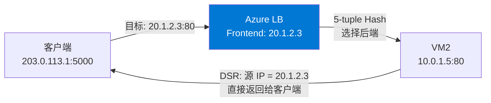

**L4 处理流程**：
1. 客户端发送 SYN 到 Frontend IP
2. Azure SDN (VFP) 在物理主机上进行 DNAT: 目标 IP 从 20.1.2.3 → 10.0.1.5
3. 后端 VM 收到包（源 IP 是客户端原始 IP — LB 不做 SNAT for 入站）
4. 后端 VM 回包时，VFP 将源 IP 改回 Frontend IP 20.1.2.3（DSR/Direct Server Return）

### Application Gateway 流量路径

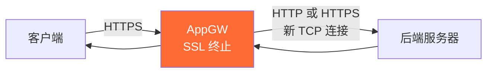

**L7 处理流程**：
1. 客户端与 AppGW 建立 TLS 连接（SSL 终止在 AppGW）
2. AppGW 解析 HTTP 请求（Host header, URL path）
3. 根据路由规则选择后端池
4. AppGW 与后端建立**新的 TCP 连接**（可选重新加密）
5. 后端看到的源 IP 是 **AppGW 的子网 IP**（不是客户端 IP）
6. 客户端原始 IP 在 **X-Forwarded-For** header 中

### Front Door 请求流程

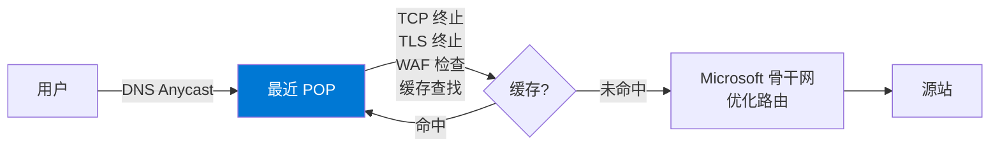

**性能优化**：
- **Split TCP**: 用户到 POP 的连接延迟低 (短距离), POP 到源站用持久连接
- **连接复用**: POP 到源站维持连接池，避免频繁三次握手
- **协议优化**: HTTP/2, gRPC 支持

## 4. 常见问题与排查

### 问题 1：Load Balancer 健康探测失败

**最常见原因**：NSG 阻止了探测源 IP `168.63.129.16`

```bash
# 检查健康探测状态
az network lb show \
  --name ContosoLB \
  --resource-group ContosoRG \
  --query "probes[].{Name:name, Protocol:protocol, Port:port}"

# 确保 NSG 允许探测
az network nsg rule create \
  --nsg-name BackendNSG \
  --resource-group ContosoRG \
  --name AllowHealthProbe \
  --priority 100 \
  --source-address-prefixes AzureLoadBalancer \
  --destination-port-ranges 80 \
  --access Allow
```

### 问题 2：SNAT 端口耗尽

**症状**：出站连接间歇性失败
**诊断**：检查 LB 的 SNAT 连接计数指标
**解决**：使用 **NAT Gateway** 替代 LB SNAT（64K 端口/公共 IP vs LB 的有限分配）

### 问题 3：Application Gateway 502 Bad Gateway

**排查步骤**：
1. 后端健康探测是否通过
2. NSG 是否阻止 AppGW 子网到后端子网的流量
3. 后端响应是否超时 (默认 20s)
4. 后端 SSL 证书链是否完整

### 问题 4：Traffic Manager 故障转移慢

**原因**：DNS TTL 过高 + 探测间隔过长
**解决**：
- 降低 TTL 到 10-30 秒
- 启用快速探测 (Fast Probing): 间隔 10s, 超时 5s, 容忍 1 次失败
- 注意：客户端 DNS 缓存可能不遵守 TTL

### 问题 5：Front Door 503 错误

**排查**：
- 所有源站不健康 → 检查源站健康探测
- 源站超时 → 增加 originResponseTimeoutSeconds
- 源站返回非预期状态码 → 检查源站应用

## 5. 最佳实践

1. **始终使用 Standard LB**，配合可用区部署
2. **Application Gateway**: 生产环境设置最小实例数 (min 2)，启用连接排空
3. **Front Door**: 静态内容启用缓存，使用托管证书
4. **Traffic Manager**: 降低 TTL + 快速探测实现快速故障转移
5. **全球 HTTP 应用**: Front Door (前端) + Application Gateway (区域级 WAF)
6. **全球非 HTTP**: Cross-Region Load Balancer 或 Traffic Manager + Regional LB
7. **健康探测**: 使用 HTTP 路径检查（如 /health），而非简单 TCP 检查

## 6. 综合对比

| 特性 | Load Balancer | Application Gateway | Front Door | Traffic Manager |
|------|--------------|--------------------|-----------|-----------------| 
| **层级** | L4 | L7 | L7 | DNS |
| **范围** | 区域 | 区域 | 全球 | 全球 |
| **协议** | TCP/UDP | HTTP/HTTPS | HTTP/HTTPS | 任何 |
| **代理** | 否 | 是 | 是 | 否 |
| **SSL 卸载** | ❌ | ✅ | ✅ | ❌ |
| **WAF** | ❌ | ✅ | ✅ | ❌ |
| **缓存/CDN** | ❌ | ❌ | ✅ | ❌ |
| **URL 路由** | ❌ | ✅ | ✅ | ❌ |
| **会话保持** | Source IP | Cookie | Cookie | ❌ |
| **成本** | 低 | 中 | 中-高 | 低 |
| **典型用途** | 内部服务/NVA | 区域 Web 应用 | 全球 Web 应用 | 全球 DNS 路由 |

## 7. 实战场景

### 场景 1：全球电商平台

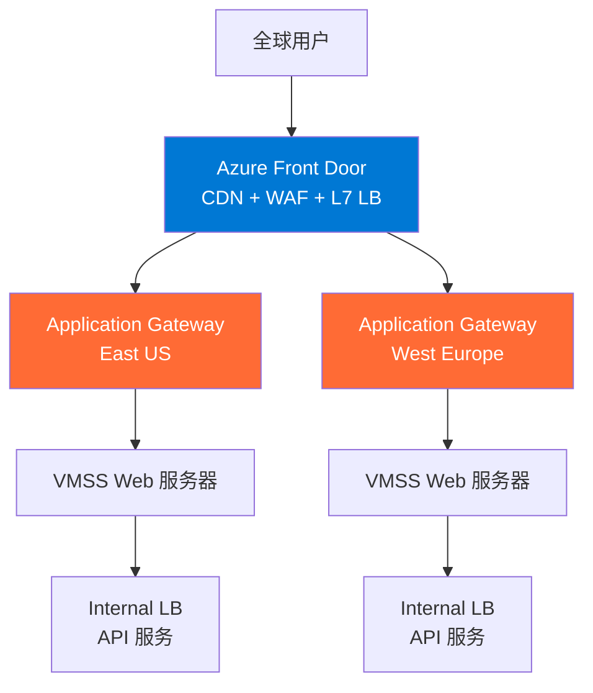

### 场景 2：蓝绿部署

```
Traffic Manager (Weighted Routing)
├── 权重 90 → Production (Blue) 环境
└── 权重 10 → New Release (Green) 环境

逐步调整权重: 90/10 → 80/20 → 50/50 → 0/100
```

### 场景 3：内部微服务

```
Internal Load Balancer (Standard)
├── Service A (10.0.1.0/24) → Port 8080
├── Service B (10.0.2.0/24) → Port 8081
└── Service C (10.0.3.0/24) → Port 8082

每个服务有独立的 Internal LB
服务间通过 ILB Frontend IP 通信
```

## 8. 参考资源

- [Azure Load Balancer 文档](https://learn.microsoft.com/azure/load-balancer/load-balancer-overview)
- [Application Gateway 文档](https://learn.microsoft.com/azure/application-gateway/overview)
- [Azure Front Door 文档](https://learn.microsoft.com/azure/frontdoor/front-door-overview)
- [Traffic Manager 文档](https://learn.microsoft.com/azure/traffic-manager/traffic-manager-overview)
- [负载均衡选择指南](https://learn.microsoft.com/azure/architecture/guide/technology-choices/load-balancing-overview)

---

# Deep Dive: Azure Load Balancing & Application Delivery — LB, Application Gateway, Front Door & Traffic Manager

## 1. Overview

Azure offers multiple load balancing services. The choice depends on two dimensions:

```mermaid
graph TD
    Start[Need Load Balancing] --> Q1{Global or Regional?}
    Q1 -->|Global| Q2{HTTP(S)?}
    Q1 -->|Regional| Q3{HTTP(S)?}
    
    Q2 -->|Yes| FD[Azure Front Door]
    Q2 -->|No| TM[Traffic Manager<br/>+ Regional LB]
    
    Q3 -->|Yes| AppGW[Application Gateway]
    Q3 -->|No| LB[Azure Load Balancer]
    
    style FD fill:#0078d4,color:white
    style TM fill:#50e6ff,color:black
    style AppGW fill:#ff6b35,color:white
    style LB fill:#00aa00,color:white
```

| Service | Layer | Scope | Protocol | Proxy |
|---------|-------|-------|----------|-------|
| **Azure Load Balancer** | L4 | Regional | TCP/UDP | No (DSR optional) |
| **Application Gateway** | L7 | Regional | HTTP/HTTPS | Yes |
| **Azure Front Door** | L7 | Global (Edge) | HTTP/HTTPS | Yes |
| **Traffic Manager** | DNS | Global | Any (DNS-level) | No (DNS only) |

## 2. Core Concepts in Depth

### 2.1 Azure Load Balancer

Azure Load Balancer is a **high-performance, low-latency L4 load balancer** supporting all TCP and UDP protocols.

#### Component Architecture

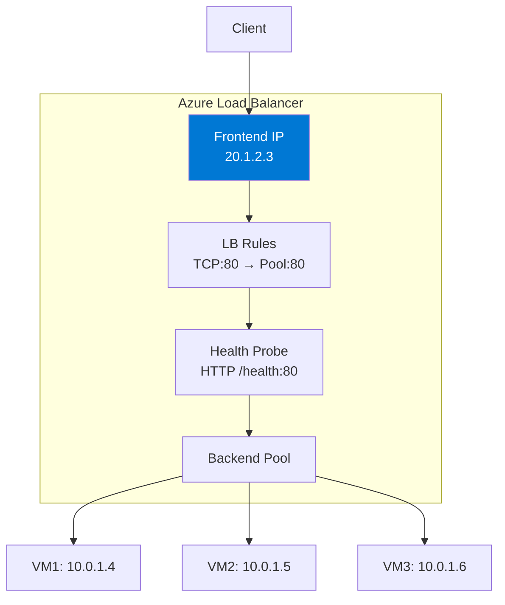

#### SKU Comparison

| Feature | Basic (Deprecated) | Standard | Gateway |
|---------|-------------------|----------|---------|
| Backend Pool Size | 300 | 5000 | NVA scenarios |
| Health Probes | TCP, HTTP | TCP, HTTP, HTTPS | TCP, HTTP, HTTPS |
| Availability Zone | ❌ | ✅ (Zone-redundant) | ✅ |
| HA Ports | ❌ | ✅ | ✅ |
| Outbound Rules | ❌ | ✅ | N/A |
| Cross-Region LB | ❌ | ✅ (Global Tier) | ❌ |

> ⚠️ **Basic SKU retires September 30, 2025. Always use Standard SKU.**

#### Load Distribution Modes

| Mode | Hash Elements | Use Case |
|------|--------------|----------|
| **5-tuple** (default) | Source IP + Source Port + Dest IP + Dest Port + Protocol | General (best distribution) |
| **Source IP Affinity (2-tuple)** | Source IP + Dest IP | Session persistence needed |
| **Source IP Affinity (3-tuple)** | Source IP + Dest IP + Protocol | Protocol-level persistence |

#### HA Ports

HA Ports balance **all ports and all protocols** in a single rule, designed for **NVA** scenarios:

```bash
# Create HA Ports rule
az network lb rule create \
  --lb-name ContosoILB \
  --resource-group ContosoRG \
  --name HAPortsRule \
  --protocol All \
  --frontend-port 0 \
  --backend-port 0 \
  --frontend-ip-name FrontendIP \
  --backend-pool-name NVAPool
```

#### Outbound Connections (SNAT)

Standard LB outbound rules configure SNAT:
- Backend pool members use Frontend IP's SNAT ports for outbound
- ~64K SNAT ports per Frontend IP
- **SNAT port exhaustion** is common — recommend NAT Gateway instead

```bash
# Health probe source IP: 168.63.129.16
# NSG must allow inbound from this IP, otherwise probes fail!
```

#### Cross-Region Load Balancer

Standard LB **Global Tier** supports cross-region load balancing:
- Frontend: Global Anycast IP
- Backend: Regional Standard LBs
- For non-HTTP global load balancing

### 2.2 Application Gateway

Application Gateway is a **regional L7 load balancer** designed for web traffic.

#### Core Components

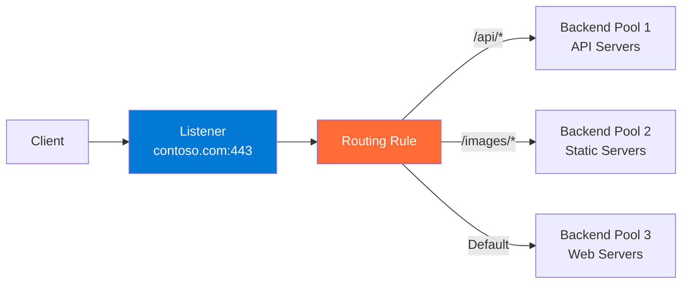

#### Key Features

| Feature | Description |
|---------|-------------|
| **URL Path Routing** | /api/* → Pool1, /images/* → Pool2 |
| **Multi-site Hosting** | contoso.com → Pool1, fabrikam.com → Pool2 (via Host Header) |
| **SSL Termination** | Offload SSL at Gateway, reduce backend load |
| **End-to-End SSL** | Re-encrypt Gateway ↔ Backend traffic |
| **Autoscaling** | v2 SKU scales based on traffic |
| **Session Affinity** | Cookie-based session persistence |
| **Connection Draining** | Gracefully close connections to backends |
| **Header Rewrite** | Modify request/response HTTP headers |
| **URL Rewrite** | Modify URL path and query string |
| **WebSocket / HTTP/2** | Full support |
| **WAF Integration** | Built-in Web Application Firewall |

#### v1 vs v2

| Feature | v1 (Standard/WAF) | v2 (Standard_v2/WAF_v2) |
|---------|-------------------|------------------------|
| Autoscaling | ❌ (Fixed instances) | ✅ |
| Zone Redundancy | ❌ | ✅ |
| Static VIP | ❌ | ✅ |
| Header Rewrite | ❌ | ✅ |
| Performance | Lower | 5x improvement |
| Deploy Time | Longer | Faster |

> ⚠️ **Always use v2 SKU.** v1 is not recommended.

```bash
# Create Application Gateway v2
az network application-gateway create \
  --name ContosoAppGW \
  --resource-group ContosoRG \
  --sku Standard_v2 \
  --capacity 2 \
  --vnet-name ContosoVNet \
  --subnet AppGwSubnet \
  --http-settings-port 80 \
  --http-settings-protocol Http \
  --frontend-port 443 \
  --public-ip-address AppGwPublicIP
```

### 2.3 Azure Front Door

Azure Front Door is a **globally distributed L7 load balancer + CDN + WAF** running on Microsoft's global edge network.

#### How It Works

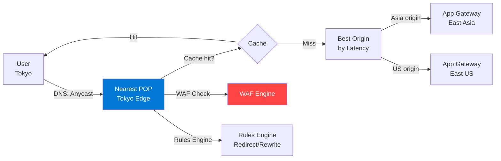

**Key advantages:**
- **Anycast**: User traffic automatically enters nearest Microsoft POP (190+ PoPs)
- **Split TCP**: TCP connection terminates at POP, uses optimized Microsoft backbone to origin (reduces latency)
- **Connection Pooling**: Reuses connections to origin, reduces origin load

#### Front Door Standard vs Premium

| Feature | Standard | Premium |
|---------|----------|---------|
| Custom Domains + HTTPS | ✅ | ✅ |
| CDN Caching | ✅ | ✅ |
| Compression | ✅ | ✅ |
| Geo-filtering | ✅ | ✅ |
| WAF Managed Rules | ✅ (DRS) | ✅ (DRS + Bot) |
| **Private Link Origins** | ❌ | ✅ |
| **WAF Premium Rules** | ❌ | ✅ |
| **Enhanced Analytics** | ❌ | ✅ |

#### Routing Methods

- **Latency**: Select lowest-latency origin (default)
- **Priority**: Primary + failover origins
- **Weighted**: Distribute by percentage
- **Session Affinity**: Same user always to same origin

### 2.4 Traffic Manager

Traffic Manager is a **DNS-based global traffic manager** — it's NOT a proxy, it doesn't handle data traffic.

#### How It Works

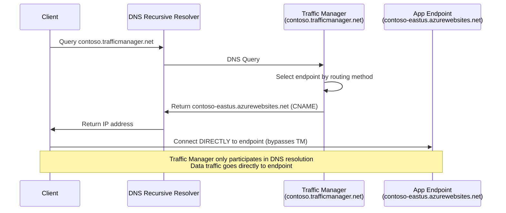

> ⚠️ **Key difference**: Traffic Manager only does DNS resolution — client connects **directly** to endpoint. Front Door/AppGW are proxies where all traffic flows through them.

#### Routing Methods

| Method | Description | Use Case |
|--------|------------|----------|
| **Priority** | Primary + failover endpoints | Active-Passive |
| **Weighted** | Distribute by weight (0-1000) | Blue/Green, Canary |
| **Performance** | Return lowest-latency endpoint | Best UX |
| **Geographic** | Route by user geo-location | Data residency |
| **MultiValue** | Return all healthy endpoint IPs | Client-side LB |
| **Subnet** | Route by source IP subnet | Specific networks to specific endpoints |

```bash
# Create Traffic Manager profile with fast failover
az network traffic-manager profile create \
  --name ContosoTM \
  --resource-group ContosoRG \
  --routing-method Priority \
  --unique-dns-name contoso-tm \
  --monitor-path "/health" \
  --monitor-port 443 \
  --monitor-protocol HTTPS \
  --monitor-interval 10 \
  --monitor-timeout 5 \
  --monitor-tolerated-failures 1
# Fast failover: 10s interval, 5s timeout, 1 failure = ~15s switchover
```

## 3. Under the Hood

### Load Balancer Traffic Path

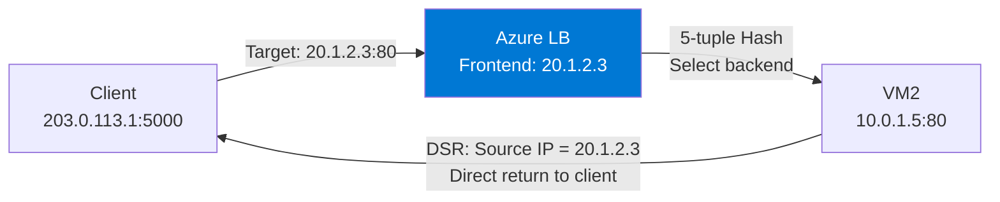

**L4 Processing:**
1. Client sends SYN to Frontend IP
2. Azure SDN (VFP) on physical host performs DNAT: dest IP from 20.1.2.3 → 10.0.1.5
3. Backend VM receives packet (source IP is client's original IP — LB doesn't SNAT for inbound)
4. Backend VM response: VFP changes source IP back to Frontend IP 20.1.2.3 (DSR)

### Application Gateway Traffic Path

**L7 Processing:**
1. Client establishes TLS connection with AppGW (SSL termination at AppGW)
2. AppGW parses HTTP request (Host header, URL path)
3. Routing rule selects backend pool
4. AppGW opens **new TCP connection** to backend (optional re-encryption)
5. Backend sees source IP as **AppGW subnet IP** (not client IP)
6. Client original IP is in **X-Forwarded-For** header

### Front Door Request Flow

**Performance optimizations:**
- **Split TCP**: User-to-POP connection has low latency (short distance), POP-to-origin uses persistent connections
- **Connection Reuse**: POP maintains connection pool to origins, avoids frequent TCP handshakes
- **Protocol Optimization**: HTTP/2, gRPC support

## 4. Common Issues & Troubleshooting

### Issue 1: Load Balancer Health Probe Failing

**Most common cause**: NSG blocking probe source IP `168.63.129.16`

```bash
# Check health probe status
az network lb show \
  --name ContosoLB \
  --resource-group ContosoRG \
  --query "probes[].{Name:name, Protocol:protocol, Port:port}"

# Ensure NSG allows probes
az network nsg rule create \
  --nsg-name BackendNSG \
  --resource-group ContosoRG \
  --name AllowHealthProbe \
  --priority 100 \
  --source-address-prefixes AzureLoadBalancer \
  --destination-port-ranges 80 \
  --access Allow
```

### Issue 2: SNAT Port Exhaustion

**Symptoms**: Intermittent outbound connection failures
**Diagnose**: Check LB SNAT connection count metrics
**Solution**: Use **NAT Gateway** instead (64K ports/public IP vs LB's limited allocation)

### Issue 3: Application Gateway 502 Bad Gateway

1. Check backend health probe passing
2. Check NSG not blocking AppGW subnet → backend subnet
3. Check backend response timeout (default 20s)
4. Check backend SSL certificate chain completeness

### Issue 4: Traffic Manager Slow Failover

**Cause**: DNS TTL too high + probe interval too long
**Solution**:
- Lower TTL to 10-30 seconds
- Enable fast probing: 10s interval, 5s timeout, 1 tolerated failure
- Note: Client DNS caching may not respect TTL

### Issue 5: Front Door 503 Errors

- All origins unhealthy → Check origin health probes
- Origin timeout → Increase originResponseTimeoutSeconds
- Origin returning unexpected status code → Check origin application

## 5. Best Practices

1. **Always use Standard LB** with availability zone deployment
2. **Application Gateway**: Set minimum instances for production (min 2), enable connection draining
3. **Front Door**: Enable caching for static content, use managed certificates
4. **Traffic Manager**: Lower TTL + fast probing for rapid failover
5. **Global HTTP apps**: Front Door (frontend) + Application Gateway (regional WAF)
6. **Global non-HTTP**: Cross-Region Load Balancer or Traffic Manager + Regional LB
7. **Health probes**: Use HTTP path checks (e.g., /health), not just TCP

## 6. Comprehensive Comparison

| Feature | Load Balancer | Application Gateway | Front Door | Traffic Manager |
|---------|--------------|--------------------|-----------|-----------------| 
| **Layer** | L4 | L7 | L7 | DNS |
| **Scope** | Regional | Regional | Global | Global |
| **Protocol** | TCP/UDP | HTTP/HTTPS | HTTP/HTTPS | Any |
| **Proxy** | No | Yes | Yes | No |
| **SSL Offload** | ❌ | ✅ | ✅ | ❌ |
| **WAF** | ❌ | ✅ | ✅ | ❌ |
| **Caching/CDN** | ❌ | ❌ | ✅ | ❌ |
| **URL Routing** | ❌ | ✅ | ✅ | ❌ |
| **Session Persistence** | Source IP | Cookie | Cookie | ❌ |
| **Cost** | Low | Medium | Medium-High | Low |
| **Typical Use** | Internal services/NVA | Regional web apps | Global web apps | Global DNS routing |

## 7. Real-World Scenarios

### Scenario 1: Global E-commerce Platform

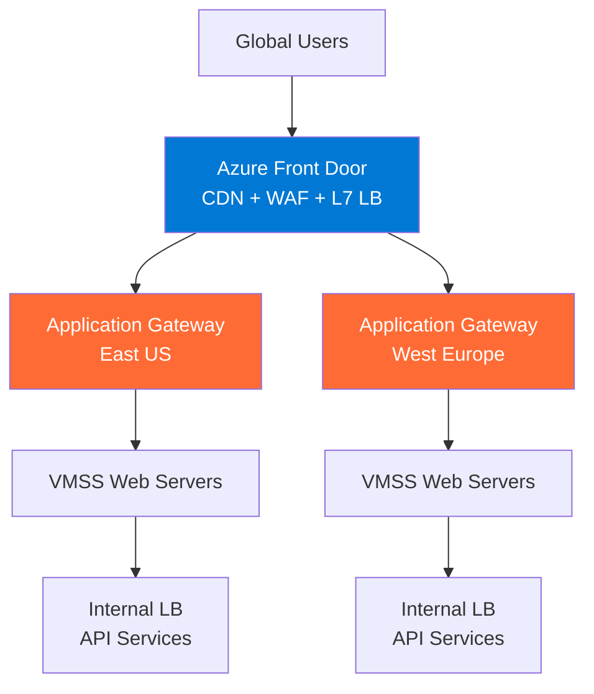

### Scenario 2: Blue/Green Deployment

```
Traffic Manager (Weighted Routing)
├── Weight 90 → Production (Blue) environment
└── Weight 10 → New Release (Green) environment

Gradually adjust: 90/10 → 80/20 → 50/50 → 0/100
```

### Scenario 3: Internal Microservices

```
Internal Load Balancer (Standard)
├── Service A (10.0.1.0/24) → Port 8080
├── Service B (10.0.2.0/24) → Port 8081
└── Service C (10.0.3.0/24) → Port 8082

Each service has its own Internal LB
Services communicate via ILB Frontend IPs
```

## 8. References

- [Azure Load Balancer Documentation](https://learn.microsoft.com/azure/load-balancer/load-balancer-overview)
- [Application Gateway Documentation](https://learn.microsoft.com/azure/application-gateway/overview)
- [Azure Front Door Documentation](https://learn.microsoft.com/azure/frontdoor/front-door-overview)
- [Traffic Manager Documentation](https://learn.microsoft.com/azure/traffic-manager/traffic-manager-overview)
- [Load Balancing Decision Guide](https://learn.microsoft.com/azure/architecture/guide/technology-choices/load-balancing-overview)
