# 深入理解：Azure 网络连接 — VPN Gateway、ExpressRoute 与 Virtual WAN

## 1. 概述

Azure 网络连接是将分散的网络环境——Azure 云、本地数据中心、远程分支机构——统一互联的关键。Azure 提供了四种核心连接方式：

| 连接类型 | 适用场景 | 延迟 | 带宽 | 加密 | 成本 |
|---------|---------|------|------|------|------|
| **VNet Peering** | Azure VNet 之间 | 最低 (~1ms) | 无限制 (网络带宽) | 默认加密 (Azure 骨干) | 按流量计费 |
| **VPN Gateway** | 加密隧道 (本地/VNet) | 中等 (10-30ms) | 最高 10 Gbps | IPsec/IKE | 网关+流量 |
| **ExpressRoute** | 专线连接到 Microsoft | 低 (可预测) | 50M-100G | 可选 (MACsec) | 电路+流量 |
| **Virtual WAN** | 大规模分支互联 | 取决于连接类型 | 取决于连接类型 | 取决于连接类型 | Hub+连接 |

### Microsoft 全球骨干网

所有 Azure 连接服务都运行在 Microsoft 全球骨干网络上：
- 超过 **200,000 km** 光纤
- 超过 **190 个边缘节点** (PoP)
- 跨 **60+ Azure 区域**
- 冷土豆路由 (Cold Potato Routing)：流量尽早进入 Microsoft 网络

## 2. 核心概念详解

### 2.1 VNet Peering

VNet Peering 允许两个 VNet 通过 Azure 骨干网直接通信，无需 VPN 或网关。

**类型：**
- **Regional Peering**：同一区域内的两个 VNet
- **Global Peering**：不同区域的两个 VNet

**关键特性：**
- **非传递性 (Non-transitive)**：A↔B 和 B↔C **不等于** A↔C。如需传递，需使用 NVA/Firewall 或 VPN Gateway 网关传输
- **地址空间不能重叠**
- **Gateway Transit**：允许 spoke VNet 使用 hub VNet 的 VPN/ER Gateway
- **Use Remote Gateways**：spoke 端配置，使用对等 VNet 的网关

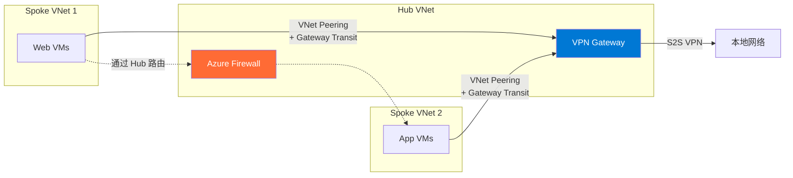

**Peering 状态：**
1. 从 VNet-A 创建 peering → 状态: **Initiated**
2. 从 VNet-B 创建 peering → 两端状态变为: **Connected**
3. 只有 Connected 状态才能通信

```bash
# 创建 VNet Peering
az network vnet peering create \
  --name HubToSpoke1 \
  --vnet-name HubVNet \
  --resource-group ContosoRG \
  --remote-vnet Spoke1VNet \
  --allow-vnet-access \
  --allow-gateway-transit

az network vnet peering create \
  --name Spoke1ToHub \
  --vnet-name Spoke1VNet \
  --resource-group ContosoRG \
  --remote-vnet HubVNet \
  --allow-vnet-access \
  --use-remote-gateways
```

### 2.2 VPN Gateway

VPN Gateway 通过公共互联网建立**加密的 IPsec/IKE 隧道**。

#### Site-to-Site (S2S) VPN

连接本地网络到 Azure VNet：

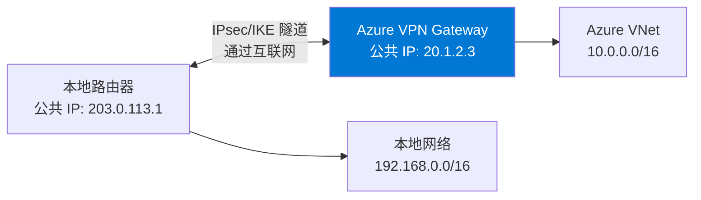

**Policy-based vs Route-based VPN：**

| 特征 | Policy-based | Route-based |
|------|-------------|-------------|
| IKE 版本 | IKEv1 only | IKEv1 + IKEv2 |
| 流量选择 | 基于 ACL/策略 | 基于路由表 (any-to-any) |
| 隧道数量 | 1 个 | 多个 (取决于 SKU) |
| 共存连接 | 不支持 | 支持 ER+VPN 共存 |
| BGP | 不支持 | 支持 |
| Active-Active | 不支持 | 支持 |

> ⚠️ **始终使用 Route-based VPN**，除非第三方设备仅支持 Policy-based。

**Active-Active VPN Gateway：**

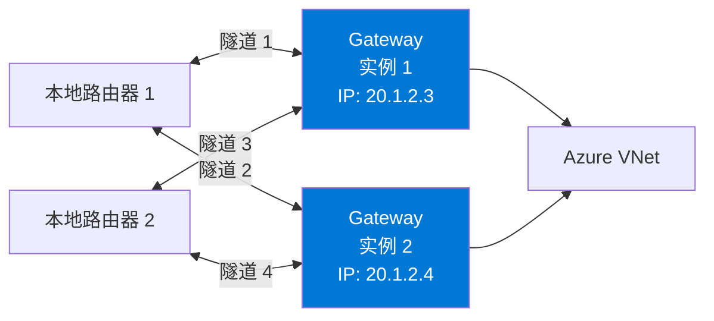

**Gateway SKU 和吞吐量：**

| SKU | 最大隧道 (S2S) | 最大 P2S | 吞吐量基准 | BGP |
|-----|--------------|---------|-----------|-----|
| VpnGw1 | 30 | 250 | 650 Mbps | ✅ |
| VpnGw2 | 30 | 500 | 1 Gbps | ✅ |
| VpnGw3 | 30 | 1000 | 1.25 Gbps | ✅ |
| VpnGw4 | 100 | 5000 | 5 Gbps | ✅ |
| VpnGw5 | 100 | 10000 | 10 Gbps | ✅ |
| VpnGw1AZ-5AZ | 同上 | 同上 | 同上 | ✅ (Zone-redundant) |

#### Point-to-Site (P2S) VPN

单个客户端连接到 Azure VNet（适用于远程办公）：

**支持的协议：**
- **OpenVPN**: TCP 443，跨平台，推荐
- **IKEv2**: UDP 500/4500，原生 macOS/Windows/iOS
- **SSTP**: TCP 443，仅 Windows

**认证方式：**
- **Azure 证书**: 自签名根证书 + 客户端证书
- **Azure AD (Entra ID)**: SSO，支持 MFA 和条件访问（推荐企业使用）
- **RADIUS**: 集成现有认证基础设施

**Split Tunneling vs Forced Tunneling：**
- **Split Tunneling**：仅 Azure 流量走 VPN，其余走本地互联网（默认，性能更好）
- **Forced Tunneling**：所有流量走 VPN（安全要求高的场景）

#### VNet-to-VNet VPN

通过 IPsec 隧道连接两个 VNet（可跨区域/跨订阅）：
- 类似 S2S VPN，但两端都是 Azure VPN Gateway
- 适用于不适合使用 VNet Peering 的场景（如需要加密）

### 2.3 ExpressRoute

ExpressRoute 提供**专用的私有连接**到 Microsoft 云（不走公共互联网）。


#### 连接模型

| 模型 | 描述 | 适用场景 |
|------|------|---------|
| **CloudExchange Co-location** | 在同一数据中心与提供商交叉连接 | Equinix, Megaport |
| **Point-to-Point Ethernet** | 从数据中心到 MSEE 的专用链路 | 专线连接 |
| **Any-to-Any (IPVPN)** | 通过 MPLS WAN 连接 | 已有 MPLS 网络 |
| **ExpressRoute Direct** | 直接连接到 Microsoft 端口 (10G/100G) | 大带宽、合规需求 |

#### Peering 类型

**Private Peering (私有对等)**：
- 访问 Azure VNet 中的资源（私有 IP）
- BGP 交换 VNet 地址前缀和本地地址前缀
- 最常用的 peering 类型

**Microsoft Peering (Microsoft 对等)**：
- 访问 Microsoft 365、Dynamics 365、Azure PaaS 公共端点
- BGP 交换 Microsoft 服务的公共 IP 前缀
- 需要 NAT (使用公共 IP)
- 需要 Route Filter 来选择要接收的服务前缀

#### 关键特性

| 特性 | 说明 |
|------|------|
| **Global Reach** | 通过 Microsoft 骨干网连接两个不同 peering 位置的本地站点 |
| **FastPath** | 绕过 ExpressRoute Gateway，直接从 MSEE 到 VNet（减少延迟） |
| **BFD** | 双向转发检测，亚秒级故障检测 |
| **冗余** | 每个电路有 2 条连接 (Primary + Secondary)，来自 2 个 MSEE 路由器 |
| **加密** | 可选 MACsec (ExpressRoute Direct) 或 IPsec over ER |

**ExpressRoute SKU：**

| SKU | 连接范围 | 适用场景 |
|-----|---------|---------|
| **Local** | 同一城市的 Azure 区域 | 同城数据中心（无出站数据费） |
| **Standard** | 同一地理区域的所有 Azure 区域 | 区域内连接 |
| **Premium** | 全球所有 Azure 区域 | 跨地理区域连接 |

```bash
# 创建 ExpressRoute 电路
az network express-route create \
  --name ContosoER \
  --resource-group ContosoRG \
  --bandwidth 1000 \
  --peering-location "Silicon Valley" \
  --provider "Equinix" \
  --sku-family MeteredData \
  --sku-tier Premium
```

### 2.4 Virtual WAN

Azure Virtual WAN 是**托管的大规模网络服务**，将 VPN、ExpressRoute 和 VNet 连接整合到统一的架构中。

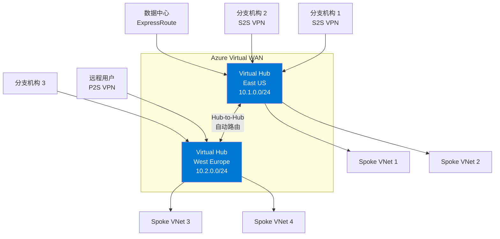

**Virtual WAN SKU：**

| 特性 | Basic | Standard |
|------|-------|----------|
| S2S VPN | ✅ | ✅ |
| P2S VPN | ❌ | ✅ |
| ExpressRoute | ❌ | ✅ |
| Hub-to-Hub 传输 | ❌ | ✅ |
| VNet-to-VNet 通过 Hub | ❌ | ✅ |
| Azure Firewall 集成 | ❌ | ✅ (Secured Hub) |
| NVA 集成 | ❌ | ✅ |

**路由概念：**
- **Route Table**：Hub 路由器维护的路由表
- **Route Association**：连接关联到路由表（决定使用哪个路由表进行查找）
- **Route Propagation**：连接将路由传播到路由表（决定路由来源）
- 默认所有连接关联到 Default 路由表并互相传播（any-to-any）

**Secured Virtual Hub**：在 Hub 中集成 Azure Firewall，通过 Azure Firewall Manager 统一管理安全策略。

## 3. 连接建立的底层原理

### VPN Gateway — IPsec 隧道建立过程

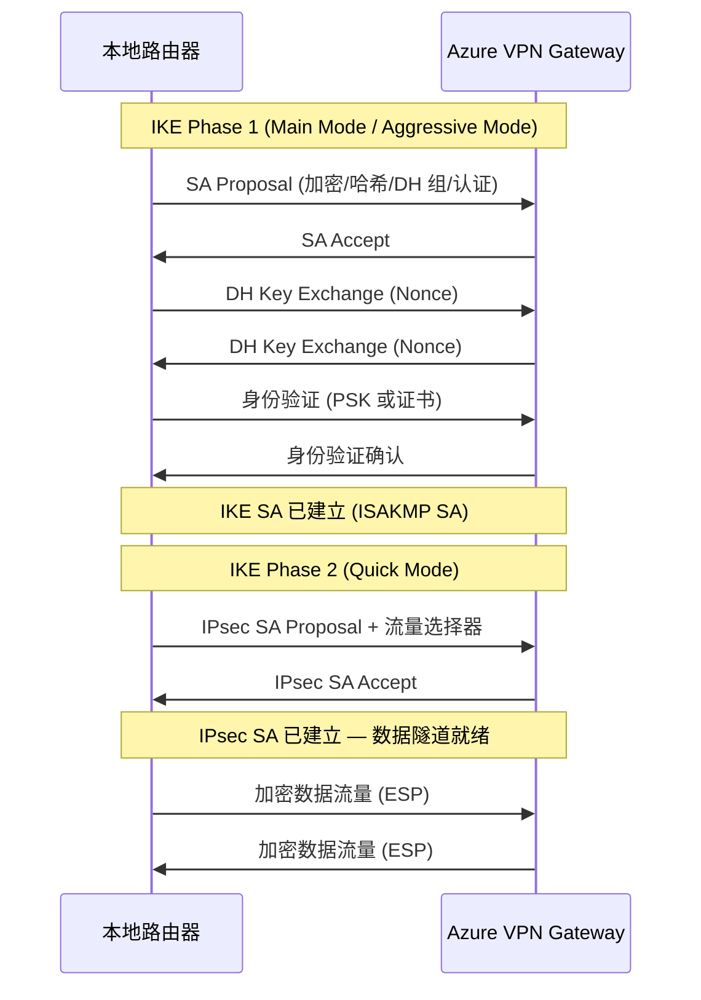

**推荐的加密参数：**
- IKE: AES-256-GCM, SHA-256, DH Group 14 (2048-bit) 或 24 (2048-bit MODP)
- IPsec: AES-256-GCM, SHA-256
- SA Lifetime: IKE 28800s, IPsec 27000s
- DPD (Dead Peer Detection): 每 10s 检测对端存活

### ExpressRoute — BGP 路由交换

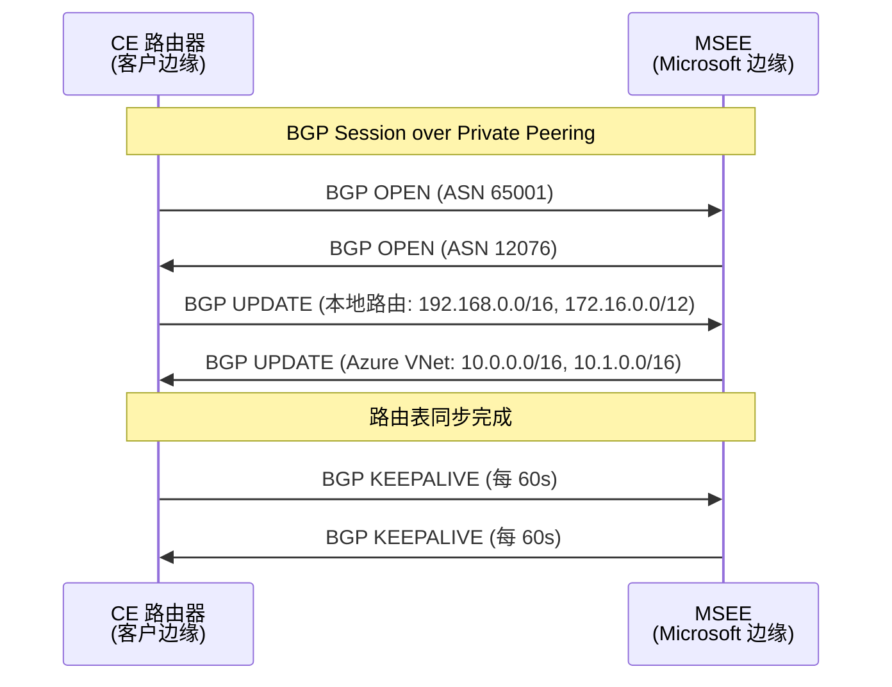

**Microsoft ASN**: 12076（所有 ExpressRoute peering）
**默认 Azure VPN Gateway ASN**: 65515（可自定义）

## 4. 常见问题与排查

### 问题 1：VPN 隧道已建立但无流量

**排查步骤：**
1. 检查本地路由表是否有指向 Azure VNet 的路由
2. 检查 Azure 有效路由 (Effective Routes) 是否有指向本地网络的路由
3. 检查 NSG 是否阻止了流量
4. 检查是否存在**非对称路由** (Asymmetric Routing)
5. 检查 VPN 流量选择器 (Traffic Selector) 是否匹配

```bash
# 检查 VPN 连接状态
az network vpn-connection show \
  --name ContosoS2S \
  --resource-group ContosoRG \
  --query "{Status:connectionStatus, IngressBytes:ingressBytesTransferred, EgressBytes:egressBytesTransferred}"

# 查看有效路由
az network nic show-effective-route-table \
  --name myVMNic \
  --resource-group ContosoRG
```

### 问题 2：ExpressRoute BGP Session 未建立

**常见原因：**
- ASN 冲突（本地 ASN 不能是 12076 或 65515）
- BGP Peer IP 不匹配
- VLAN ID 配置错误
- MTU 问题（ExpressRoute 需要 1500 MTU）
- MD5 认证密钥不匹配

### 问题 3：P2S VPN 客户端无法连接

**排查：**
- 证书问题：根证书未上传或过期，客户端证书链不完整
- DNS 解析：检查 VPN 客户端是否能解析 Azure 内部域名
- Split Tunnel 配置：检查路由是否正确推送到客户端

### 问题 4：VNet Peering 显示 "Disconnected"

**原因：**
- 一端的 Peering 被删除
- 地址空间发生了变化导致重叠
- **解决**：删除两端 Peering 后重新创建

### 问题 5：ExpressRoute + VPN 故障转移不工作

- ExpressRoute 路由优先于 VPN（更长的 AS-path 在 BGP 中优先级更低）
- 确保 VPN 和 ER 都在同一个 VNet 的 GatewaySubnet 中
- 使用 AS-path prepending 控制路由优先级

## 5. 最佳实践

1. **Active-Active VPN**：生产环境始终使用 Active-Active VPN Gateway
2. **ExpressRoute + VPN 共存**：使用 ExpressRoute 作为主连接，VPN 作为备份
3. **ExpressRoute 冗余**：部署 2 条电路、2 个 Peering 位置
4. **使用 BGP**：VPN 连接启用 BGP 实现动态路由交换
5. **Hub-Spoke + Gateway Transit**：使用 VNet Peering + Gateway Transit 优化成本
6. **Azure Route Server**：需要 NVA 与 VPN/ER Gateway 交换路由时使用

## 6. 实战场景

### 场景 1：企业混合连接

```
本地总部 (192.168.0.0/16)
├── ExpressRoute (主连接, 1 Gbps, Private Peering)
├── S2S VPN (备份连接, Active-Active)
└── BGP: ASN 65001

Azure Hub VNet (10.0.0.0/16)
├── ExpressRoute Gateway (ErGw2AZ)
├── VPN Gateway (VpnGw2AZ, Active-Active)
├── Azure Firewall
└── VNet Peering → Spoke VNets

分支办公室 1,2,3
└── S2S VPN → Azure VPN Gateway
```

### 场景 2：多区域全球连接

```
Azure East US (10.0.0.0/16) ←→ Global VNet Peering ←→ Azure West Europe (10.1.0.0/16)
        ↑                                                        ↑
   ExpressRoute                                             ExpressRoute
   (Silicon Valley)                                         (Amsterdam)
        ↑                                                        ↑
   纽约数据中心 ←──── ExpressRoute Global Reach ────→ 伦敦数据中心
```

### 场景 3：大规模分支互联 (Virtual WAN)

```
200+ 分支办公室
├── SD-WAN 设备 → Virtual Hub (S2S VPN)
├── Hub-to-Hub 自动路由
├── Secured Virtual Hub (Azure Firewall)
├── 远程用户 → P2S VPN (Azure AD 认证)
└── 数据中心 → ExpressRoute → Virtual Hub
```

## 7. 参考资源

- [VPN Gateway 文档](https://learn.microsoft.com/azure/vpn-gateway/vpn-gateway-about-vpngateways)
- [ExpressRoute 文档](https://learn.microsoft.com/azure/expressroute/expressroute-introduction)
- [Virtual WAN 文档](https://learn.microsoft.com/azure/virtual-wan/virtual-wan-about)
- [VNet Peering 文档](https://learn.microsoft.com/azure/virtual-network/virtual-network-peering-overview)
- [Azure Route Server](https://learn.microsoft.com/azure/route-server/overview)

---

# Deep Dive: Azure Network Connectivity — VPN Gateway, ExpressRoute & Virtual WAN

## 1. Overview

Azure network connectivity is the key to unifying distributed network environments — Azure cloud, on-premises data centers, and remote branch offices. Azure provides four core connectivity options:

| Connectivity Type | Use Case | Latency | Bandwidth | Encryption | Cost |
|------------------|----------|---------|-----------|------------|------|
| **VNet Peering** | Between Azure VNets | Lowest (~1ms) | Unlimited (network bandwidth) | Default encrypted (Azure backbone) | Per-traffic |
| **VPN Gateway** | Encrypted tunnels (on-prem/VNet) | Medium (10-30ms) | Up to 10 Gbps | IPsec/IKE | Gateway + traffic |
| **ExpressRoute** | Dedicated connection to Microsoft | Low (predictable) | 50M-100G | Optional (MACsec) | Circuit + traffic |
| **Virtual WAN** | Large-scale branch connectivity | Depends on connection type | Depends on connection type | Depends on connection type | Hub + connections |

### Microsoft Global Backbone

All Azure connectivity services run on the Microsoft global backbone network:
- Over **200,000 km** of fiber
- Over **190 edge nodes** (PoPs)
- Across **60+ Azure regions**
- Cold Potato Routing: traffic enters Microsoft network as early as possible

## 2. Core Concepts in Depth

### 2.1 VNet Peering

VNet Peering allows two VNets to communicate directly via the Azure backbone — no VPN or gateway needed.

**Types:**
- **Regional Peering**: Two VNets in the same region
- **Global Peering**: Two VNets in different regions

**Key characteristics:**
- **Non-transitive**: A↔B and B↔C does **NOT** mean A↔C. For transitivity, use NVA/Firewall or VPN Gateway transit
- **Address spaces cannot overlap**
- **Gateway Transit**: Allows spoke VNet to use hub VNet's VPN/ER Gateway
- **Use Remote Gateways**: Configured on spoke side to use peer VNet's gateway

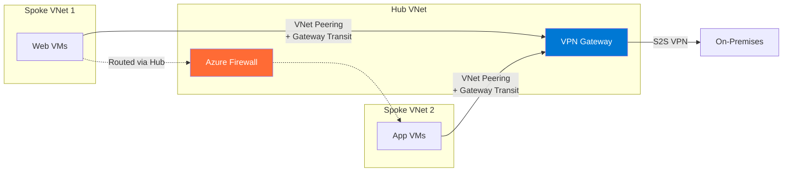

**Peering States:**
1. Create peering from VNet-A → State: **Initiated**
2. Create peering from VNet-B → Both sides become: **Connected**
3. Only Connected state enables communication

```bash
# Create VNet Peering
az network vnet peering create \
  --name HubToSpoke1 \
  --vnet-name HubVNet \
  --resource-group ContosoRG \
  --remote-vnet Spoke1VNet \
  --allow-vnet-access \
  --allow-gateway-transit

az network vnet peering create \
  --name Spoke1ToHub \
  --vnet-name Spoke1VNet \
  --resource-group ContosoRG \
  --remote-vnet HubVNet \
  --allow-vnet-access \
  --use-remote-gateways
```

### 2.2 VPN Gateway

VPN Gateway creates **encrypted IPsec/IKE tunnels** over the public internet.

#### Site-to-Site (S2S) VPN

Connects on-premises network to Azure VNet:

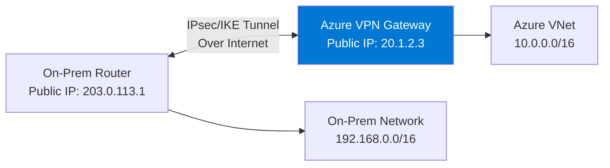

**Policy-based vs Route-based VPN:**

| Feature | Policy-based | Route-based |
|---------|-------------|-------------|
| IKE Version | IKEv1 only | IKEv1 + IKEv2 |
| Traffic Selection | ACL/Policy-based | Route table (any-to-any) |
| Tunnel Count | 1 | Multiple (SKU-dependent) |
| Coexistence | Not supported | Supports ER+VPN coexistence |
| BGP | Not supported | Supported |
| Active-Active | Not supported | Supported |

> ⚠️ **Always use Route-based VPN** unless the third-party device only supports Policy-based.

**Active-Active VPN Gateway:**

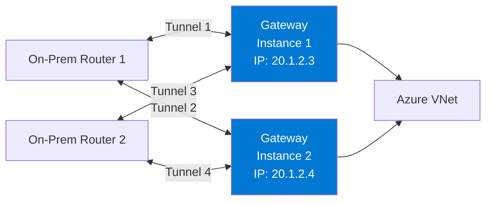

**Gateway SKU and Throughput:**

| SKU | Max Tunnels (S2S) | Max P2S | Throughput Benchmark | BGP |
|-----|-------------------|---------|---------------------|-----|
| VpnGw1 | 30 | 250 | 650 Mbps | ✅ |
| VpnGw2 | 30 | 500 | 1 Gbps | ✅ |
| VpnGw3 | 30 | 1000 | 1.25 Gbps | ✅ |
| VpnGw4 | 100 | 5000 | 5 Gbps | ✅ |
| VpnGw5 | 100 | 10000 | 10 Gbps | ✅ |
| VpnGw1AZ-5AZ | Same as above | Same | Same | ✅ (Zone-redundant) |

#### Point-to-Site (P2S) VPN

Individual client connects to Azure VNet (ideal for remote work):

**Supported Protocols:**
- **OpenVPN**: TCP 443, cross-platform, recommended
- **IKEv2**: UDP 500/4500, native macOS/Windows/iOS
- **SSTP**: TCP 443, Windows only

**Authentication Methods:**
- **Azure Certificates**: Self-signed root cert + client certificates
- **Azure AD (Entra ID)**: SSO with MFA and Conditional Access (recommended for enterprise)
- **RADIUS**: Integration with existing authentication infrastructure

**Split Tunneling vs Forced Tunneling:**
- **Split Tunneling**: Only Azure traffic goes through VPN, rest goes local internet (default, better performance)
- **Forced Tunneling**: All traffic goes through VPN (for strict security requirements)

#### VNet-to-VNet VPN

Connect two VNets via IPsec tunnel (cross-region/cross-subscription):
- Similar to S2S VPN but both ends are Azure VPN Gateways
- Useful when VNet Peering isn't suitable (e.g., encryption required)

### 2.3 ExpressRoute

ExpressRoute provides a **dedicated private connection** to Microsoft cloud (not over public internet).

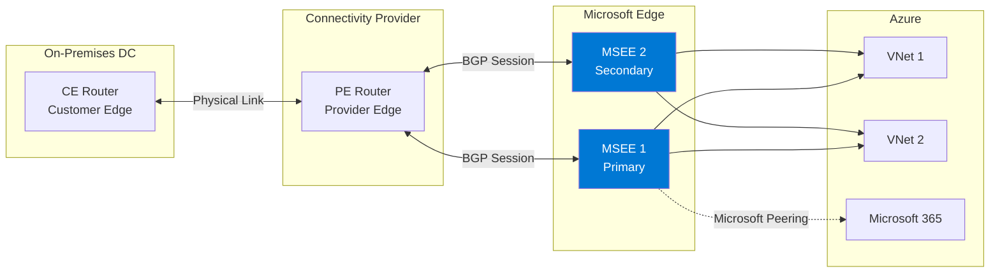

#### Connectivity Models

| Model | Description | Use Case |
|-------|------------|----------|
| **CloudExchange Co-location** | Cross-connect in same data center | Equinix, Megaport |
| **Point-to-Point Ethernet** | Dedicated link from DC to MSEE | Private line |
| **Any-to-Any (IPVPN)** | Via MPLS WAN | Existing MPLS network |
| **ExpressRoute Direct** | Direct connection to Microsoft ports (10G/100G) | High bandwidth, compliance |

#### Peering Types

**Private Peering:**
- Access Azure VNet resources (private IPs)
- BGP exchanges VNet and on-prem address prefixes
- Most commonly used peering type

**Microsoft Peering:**
- Access Microsoft 365, Dynamics 365, Azure PaaS public endpoints
- BGP exchanges Microsoft service public IP prefixes
- Requires NAT (using public IPs)
- Requires Route Filter to select service prefixes

#### Key Features

| Feature | Description |
|---------|-------------|
| **Global Reach** | Connect two on-prem sites through Microsoft backbone across peering locations |
| **FastPath** | Bypass ExpressRoute Gateway for data path performance |
| **BFD** | Bidirectional Forwarding Detection, sub-second failover |
| **Redundancy** | Each circuit has 2 connections (Primary + Secondary) from 2 MSEE routers |
| **Encryption** | Optional MACsec (ER Direct) or IPsec over ER |

**ExpressRoute SKUs:**

| SKU | Connectivity Scope | Use Case |
|-----|-------------------|----------|
| **Local** | Azure regions in same metro | Same-city DC (no egress data charges) |
| **Standard** | All Azure regions in same geo | Regional connectivity |
| **Premium** | All Azure regions globally | Cross-geo connectivity |

```bash
# Create ExpressRoute circuit
az network express-route create \
  --name ContosoER \
  --resource-group ContosoRG \
  --bandwidth 1000 \
  --peering-location "Silicon Valley" \
  --provider "Equinix" \
  --sku-family MeteredData \
  --sku-tier Premium
```

### 2.4 Virtual WAN

Azure Virtual WAN is a **managed large-scale networking service** that unifies VPN, ExpressRoute, and VNet connectivity into a single architecture.

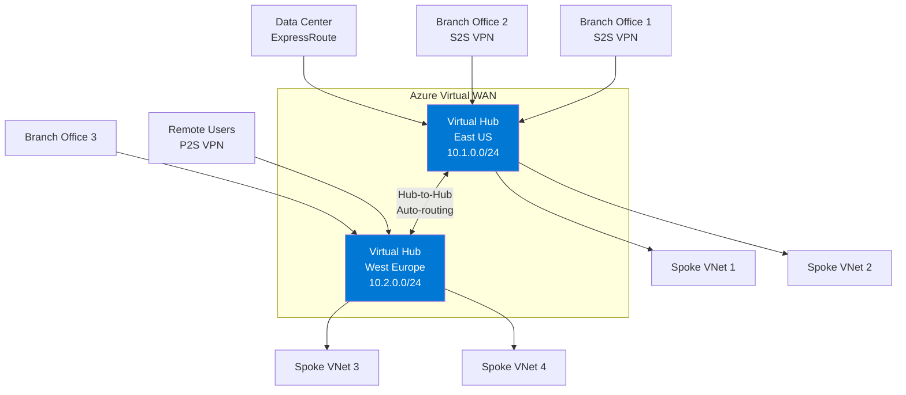

**Virtual WAN SKUs:**

| Feature | Basic | Standard |
|---------|-------|----------|
| S2S VPN | ✅ | ✅ |
| P2S VPN | ❌ | ✅ |
| ExpressRoute | ❌ | ✅ |
| Hub-to-Hub Transit | ❌ | ✅ |
| VNet-to-VNet via Hub | ❌ | ✅ |
| Azure Firewall Integration | ❌ | ✅ (Secured Hub) |
| NVA Integration | ❌ | ✅ |

**Routing Concepts:**
- **Route Table**: Routes maintained by hub router
- **Route Association**: Connection associated to a route table (determines lookup table)
- **Route Propagation**: Connection propagates routes to route tables (determines route source)
- Default: all connections associate to Default route table and propagate to each other (any-to-any)

**Secured Virtual Hub**: Integrates Azure Firewall into Hub, managed centrally via Azure Firewall Manager.

## 3. Under the Hood: Connection Establishment

### VPN Gateway — IPsec Tunnel Establishment

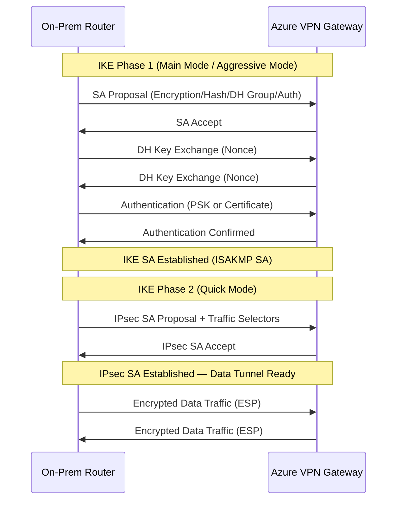

**Recommended Encryption Parameters:**
- IKE: AES-256-GCM, SHA-256, DH Group 14 (2048-bit) or 24 (2048-bit MODP)
- IPsec: AES-256-GCM, SHA-256
- SA Lifetime: IKE 28800s, IPsec 27000s
- DPD (Dead Peer Detection): Every 10s to detect peer liveness

### ExpressRoute — BGP Route Exchange

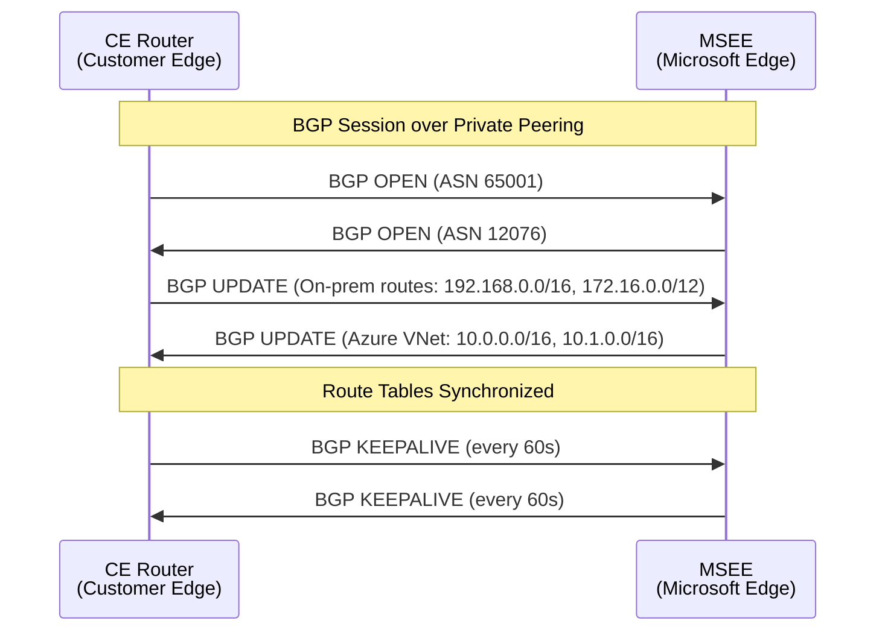

**Microsoft ASN**: 12076 (all ExpressRoute peering)
**Default Azure VPN Gateway ASN**: 65515 (customizable)

## 4. Common Issues & Troubleshooting

### Issue 1: VPN Tunnel Up But No Traffic

**Troubleshooting steps:**
1. Check on-prem route table for routes to Azure VNet
2. Check Azure effective routes for routes to on-prem network
3. Check NSG not blocking traffic
4. Check for **asymmetric routing**
5. Check VPN traffic selectors match

```bash
# Check VPN connection status
az network vpn-connection show \
  --name ContosoS2S \
  --resource-group ContosoRG \
  --query "{Status:connectionStatus, IngressBytes:ingressBytesTransferred, EgressBytes:egressBytesTransferred}"

# View effective routes
az network nic show-effective-route-table \
  --name myVMNic \
  --resource-group ContosoRG
```

### Issue 2: ExpressRoute BGP Session Not Establishing

**Common causes:**
- ASN conflict (on-prem ASN cannot be 12076 or 65515)
- BGP Peer IP mismatch
- VLAN ID misconfigured
- MTU issues (ExpressRoute requires 1500 MTU)
- MD5 authentication key mismatch

### Issue 3: P2S VPN Client Cannot Connect

**Troubleshoot:**
- Certificate issues: Root cert not uploaded or expired, incomplete client cert chain
- DNS resolution: Check if VPN client can resolve Azure internal domain names
- Split tunnel config: Verify routes are correctly pushed to client

### Issue 4: VNet Peering Shows "Disconnected"

**Causes:**
- One side's peering was deleted
- Address space changed causing overlap
- **Solution**: Delete both sides and recreate

### Issue 5: ExpressRoute + VPN Failover Not Working

- ExpressRoute routes take priority over VPN (longer AS-path has lower BGP priority)
- Ensure both VPN and ER are in the same VNet's GatewaySubnet
- Use AS-path prepending to control route priority

## 5. Best Practices

1. **Active-Active VPN**: Always use Active-Active VPN Gateway for production
2. **ExpressRoute + VPN Coexistence**: Use ExpressRoute as primary, VPN as backup
3. **ExpressRoute Redundancy**: Deploy 2 circuits, 2 peering locations
4. **Use BGP**: Enable BGP on VPN connections for dynamic route exchange
5. **Hub-Spoke + Gateway Transit**: Use VNet Peering + Gateway Transit for cost optimization
6. **Azure Route Server**: Use when NVAs need to exchange routes with VPN/ER Gateway

## 6. Real-World Scenarios

### Scenario 1: Enterprise Hybrid Connectivity

```
On-Prem HQ (192.168.0.0/16)
├── ExpressRoute (Primary, 1 Gbps, Private Peering)
├── S2S VPN (Backup, Active-Active)
└── BGP: ASN 65001

Azure Hub VNet (10.0.0.0/16)
├── ExpressRoute Gateway (ErGw2AZ)
├── VPN Gateway (VpnGw2AZ, Active-Active)
├── Azure Firewall
└── VNet Peering → Spoke VNets

Branch Offices 1,2,3
└── S2S VPN → Azure VPN Gateway
```

### Scenario 2: Multi-Region Global Connectivity

```
Azure East US (10.0.0.0/16) ←→ Global VNet Peering ←→ Azure West Europe (10.1.0.0/16)
        ↑                                                        ↑
   ExpressRoute                                             ExpressRoute
   (Silicon Valley)                                         (Amsterdam)
        ↑                                                        ↑
   New York DC ←──── ExpressRoute Global Reach ────→ London DC
```

### Scenario 3: Large-Scale Branch Connectivity (Virtual WAN)

```
200+ Branch Offices
├── SD-WAN Appliances → Virtual Hub (S2S VPN)
├── Hub-to-Hub Auto-routing
├── Secured Virtual Hub (Azure Firewall)
├── Remote Users → P2S VPN (Azure AD Auth)
└── Data Center → ExpressRoute → Virtual Hub
```

## 7. References

- [VPN Gateway Documentation](https://learn.microsoft.com/azure/vpn-gateway/vpn-gateway-about-vpngateways)
- [ExpressRoute Documentation](https://learn.microsoft.com/azure/expressroute/expressroute-introduction)
- [Virtual WAN Documentation](https://learn.microsoft.com/azure/virtual-wan/virtual-wan-about)
- [VNet Peering Documentation](https://learn.microsoft.com/azure/virtual-network/virtual-network-peering-overview)
- [Azure Route Server](https://learn.microsoft.com/azure/route-server/overview)
