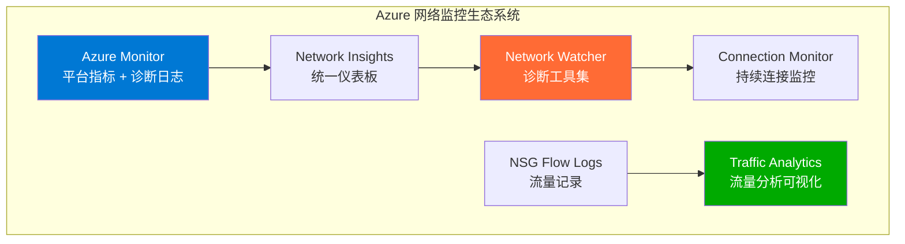
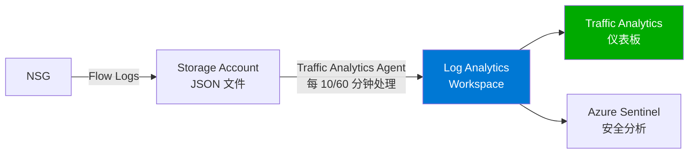
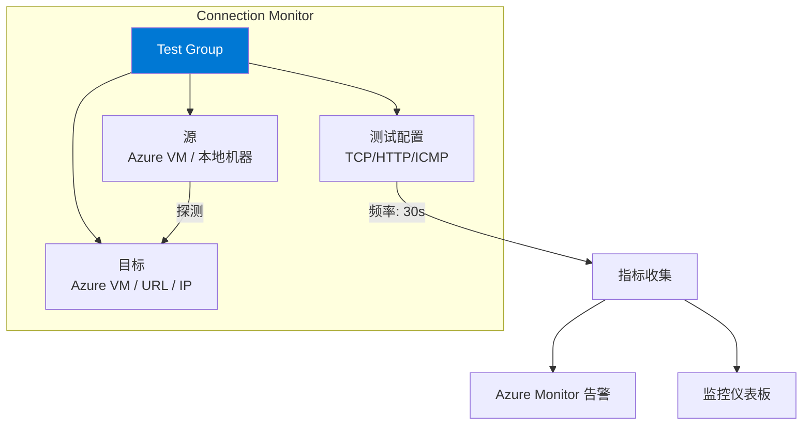
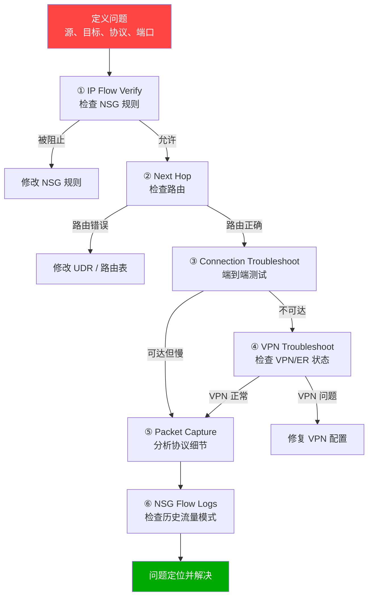
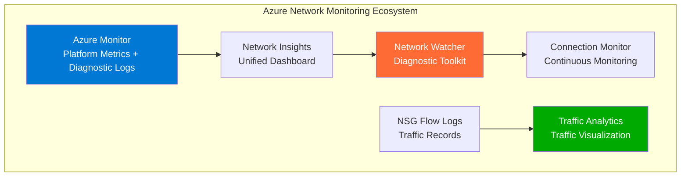
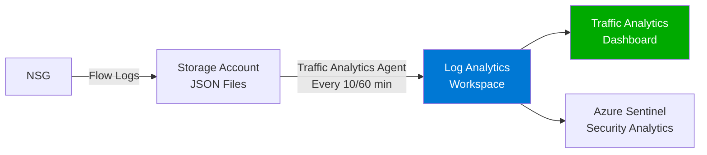
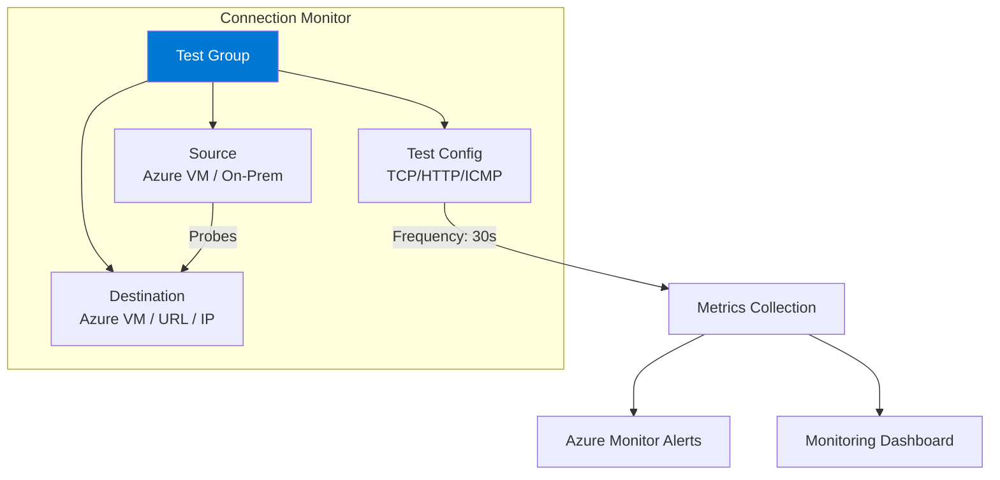
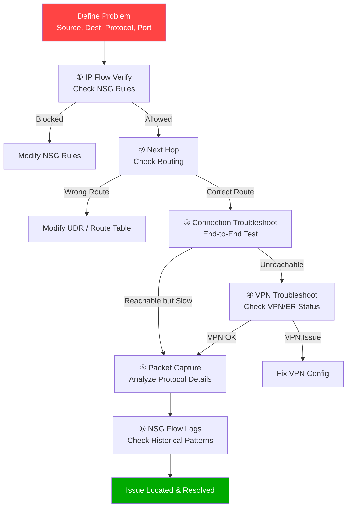

# 深入理解：Azure 网络监控与排查 — Network Watcher、Connection Monitor 与 Traffic Analytics

## 1. 概述

云环境的网络问题排查与本地环境有根本区别——你无法直接访问物理交换机、路由器或抓包设备。Azure 提供了一套完整的网络监控和诊断工具生态系统：



### 主动监控 vs 被动排查

| 类型 | 工具 | 目的 |
|------|------|------|
| **主动监控** | Connection Monitor, Azure Monitor 告警, Traffic Analytics | 持续监控，提前发现问题 |
| **被动排查** | IP Flow Verify, Next Hop, Connection Troubleshoot, Packet Capture | 问题发生时快速定位 |

## 2. 核心工具详解

### 2.1 Network Watcher

Network Watcher 是 Azure 的**区域级网络诊断服务**，每个订阅在每个区域自动启用。

#### IP Flow Verify

测试特定数据包是否被 NSG 允许或拒绝。

**使用场景**："为什么我的 VM 无法访问另一个 VM 的端口 443？"

```bash
az network watcher test-ip-flow \
  --direction Inbound \
  --protocol TCP \
  --local 10.0.1.4:443 \
  --remote 10.0.2.5:12345 \
  --vm myVM \
  --nic myVMNic \
  --resource-group ContosoRG

# 输出示例:
# Access: Deny
# RuleName: DenyAllInBound
# NSG: /subscriptions/.../networkSecurityGroups/myNSG
```

**工作原理**：
1. 输入：VM NIC、方向、协议、本地 IP:端口、远程 IP:端口
2. 处理：检查 NIC 级 NSG 规则 → 检查子网级 NSG 规则
3. 输出：Access (Allow/Deny)、匹配的规则名、NSG 名称

#### Next Hop

显示从 VM 出发的流量的**下一跳类型和 IP**。

**使用场景**："为什么我的流量走了防火墙而不是直连？"

```bash
az network watcher show-next-hop \
  --vm myVM \
  --resource-group ContosoRG \
  --source-ip 10.0.1.4 \
  --dest-ip 10.0.2.5

# 输出示例:
# NextHopType: VirtualAppliance
# NextHopIpAddress: 10.0.0.4
# RouteTableId: /subscriptions/.../routeTables/SpokeRT
```

**Next Hop 类型**：

| 类型 | 说明 |
|------|------|
| VirtualNetwork | 目标在同一 VNet（系统路由） |
| Internet | 流量发往互联网 |
| VirtualAppliance | 流量经过 NVA/Firewall（UDR） |
| VNetGateway | 流量经过 VPN/ER Gateway |
| VNetPeering | 流量经过 VNet Peering |
| None | 流量被丢弃（黑洞路由） |

#### Connection Troubleshoot

**端到端的连接诊断**，显示延迟、丢包、跳数。

```bash
az network watcher test-connectivity \
  --source-resource myVM \
  --resource-group ContosoRG \
  --dest-address 10.0.2.5 \
  --dest-port 1433

# 输出示例:
# ConnectionStatus: Reachable
# AvgLatencyInMs: 1.5
# MinLatencyInMs: 1.2
# MaxLatencyInMs: 2.1
# ProbesSent: 10
# ProbesFailed: 0
# Hops:
#   - Type: Source, Address: 10.0.1.4
#   - Type: VirtualAppliance, Address: 10.0.0.4 (Azure Firewall)
#   - Type: VNetPeering
#   - Type: Destination, Address: 10.0.2.5
```

#### Packet Capture

在 VM 的 NIC 上**捕获网络数据包**，支持过滤条件。

**前提条件**：VM 上必须安装 Network Watcher Agent 扩展。

```bash
# 安装 Network Watcher Agent
az vm extension set \
  --vm-name myVM \
  --resource-group ContosoRG \
  --name NetworkWatcherAgentWindows \
  --publisher Microsoft.Azure.NetworkWatcher

# 开始抓包
az network watcher packet-capture create \
  --name myCapture \
  --vm myVM \
  --resource-group ContosoRG \
  --storage-account ContosoStorage \
  --time-limit 300 \
  --filters '[{"protocol":"TCP","localIPAddress":"10.0.1.4","localPort":"443"}]'

# 停止抓包
az network watcher packet-capture stop \
  --name myCapture \
  --location eastus

# 下载 .cap 文件后用 Wireshark 分析
```

**最佳实践**：
- 始终使用过滤器（避免捕获所有流量导致文件过大）
- 最大抓包大小 1 GB，最长时间 5 小时
- 存储到 Storage Account 以便后续分析

#### NSG Diagnostics

显示应用于网络接口的**所有 NSG 规则**，并评估特定流量的允许/拒绝结果。

```bash
az network watcher show-security-group-view \
  --vm myVM \
  --resource-group ContosoRG
```

#### VPN Troubleshoot

诊断 VPN Gateway 和连接的健康状态。

```bash
az network watcher troubleshooting start \
  --resource /subscriptions/.../vpnGateways/ContosoVPNGW \
  --resource-group ContosoRG \
  --resource-type vpnGateway \
  --storage-account ContosoStorage \
  --storage-path "https://contososa.blob.core.windows.net/vpnlogs"
```

**返回详细的错误代码和建议**，如：
- IKE 协商失败原因
- 证书验证问题
- 配置不匹配

#### Topology

可视化显示 VNet 中的网络资源和关系：

```bash
az network watcher show-topology \
  --resource-group ContosoRG \
  --location eastus
```

### 2.2 NSG Flow Logs

NSG Flow Logs 记录通过 NSG 的**所有 IP 流量**（L4 流记录）。

#### 版本对比

| 特性 | Version 1 | Version 2 |
|------|-----------|-----------|
| 基本流信息 | ✅ | ✅ |
| 字节数/包数 | ❌ | ✅ |
| 流状态 | ❌ | ✅ (Begin, Continue, End) |
| 带宽信息 | ❌ | ✅ |

> 📝 **始终使用 Version 2**

#### 流日志字段

```json
{
  "time": "2026-03-18T02:00:00Z",
  "systemId": "...",
  "macAddress": "000D3A12ABCD",
  "rule": "DefaultRule_AllowInternetOutBound",
  "flows": [
    {
      "mac": "000D3A12ABCD",
      "flowTuples": [
        "1710720000,10.0.1.4,52.168.1.1,49152,443,T,O,A,B,,,,",
        "1710720060,10.0.1.4,52.168.1.1,49152,443,T,O,A,C,1024,2048,10,20"
      ]
    }
  ]
}
```

**Flow Tuple 格式**：
```
时间戳,源IP,目标IP,源端口,目标端口,协议,方向,动作,流状态,发送包数,发送字节,接收包数,接收字节
```

| 字段 | 值 | 说明 |
|------|-----|------|
| 协议 | T/U | TCP / UDP |
| 方向 | I/O | Inbound / Outbound |
| 动作 | A/D | Allow / Deny |
| 流状态 | B/C/E | Begin / Continue / End |

```bash
# 启用 NSG Flow Logs v2
az network watcher flow-log create \
  --name ContosoFlowLog \
  --nsg ContosoNSG \
  --resource-group ContosoRG \
  --storage-account ContosoStorage \
  --enabled true \
  --format JSON \
  --log-version 2 \
  --retention 30 \
  --traffic-analytics true \
  --workspace ContosoLogAnalytics
```

### 2.3 Traffic Analytics

Traffic Analytics 处理 NSG Flow Logs，提供**可视化的流量洞察**。



**提供的洞察：**

| 洞察类型 | 内容 |
|---------|------|
| **Top Talkers** | 流量最大的源/目标 IP |
| **流量分布** | 允许/拒绝的流量比例 |
| **地理分布** | 流量的地理来源 |
| **开放端口** | VNet 中开放的端口 |
| **恶意流量** | 已知恶意 IP 的通信 |
| **协议分布** | TCP/UDP/ICMP 比例 |

**处理间隔**：
- **10 分钟**：近实时分析（成本更高）
- **60 分钟**：标准分析（默认）

### 2.4 Connection Monitor

Connection Monitor 提供**持续的连接监控**，是 Network Performance Monitor (NPM) 的继任者。



**测试配置类型**：

| 协议 | 检测内容 | 适用场景 |
|------|---------|---------|
| **TCP** | 端口可达性 + RTT | 通用连接监控 |
| **HTTP** | 状态码 + 响应时间 + 内容 | Web 应用监控 |
| **ICMP** | Ping 可达性 + RTT | 基本连通性 |

**关键指标**：
- **RTT (Round-Trip Time)**：往返延迟
- **丢包率 (Packet Loss)**：探测失败比例
- **检查成功率**：通过的探测百分比

```bash
# 创建 Connection Monitor
az network watcher connection-monitor create \
  --name ContosoConnMon \
  --location eastus \
  --test-group-name ProdTests \
  --endpoint-source-name WebVM \
  --endpoint-source-resource-id /subscriptions/.../virtualMachines/WebVM \
  --endpoint-dest-name SQLEndpoint \
  --endpoint-dest-address 10.0.2.5 \
  --test-config-name TCPTest \
  --protocol Tcp \
  --tcp-port 1433 \
  --test-config-frequency 30
```

### 2.5 Azure Monitor Network Insights

Network Insights 提供**统一的网络健康仪表板**：
- 跨订阅的网络拓扑视图
- VM 依赖关系图
- 关键指标概览（吞吐量、延迟、连接状态）
- 集成 Workbook 自定义视图

### 2.6 Azure Monitor 网络指标

每个网络资源都有平台指标和诊断日志：

**关键监控指标：**

| 资源 | 关键指标 | 告警阈值建议 |
|------|---------|-------------|
| **Load Balancer** | Health Probe Status | < 100% |
| | SNAT Connection Count | 接近端口限制 |
| | Byte/Packet Count | 基线偏差 |
| **Application Gateway** | Unhealthy Host Count | > 0 |
| | Backend Response Time | > 基线 2x |
| | Response Status (4xx/5xx) | 突增 |
| | Throughput | 接近 SKU 限制 |
| **VPN Gateway** | Tunnel Bandwidth | 接近限制 |
| | Tunnel Packet Drop | > 0 持续 |
| | BGP Peer Status | Disconnected |
| **ExpressRoute** | Bits In/Out | 接近电路带宽 |
| | BGP Availability | < 100% |
| | ARP Availability | < 100% |
| **Azure Firewall** | Throughput | 接近限制 |
| | Application Rule Hit Count | 异常变化 |
| | SNAT Port Utilization | > 80% |

```bash
# 启用诊断日志 (以 Application Gateway 为例)
az monitor diagnostic-settings create \
  --name AppGWDiagnostics \
  --resource /subscriptions/.../applicationGateways/ContosoAppGW \
  --workspace ContosoLogAnalytics \
  --logs '[{"category":"ApplicationGatewayAccessLog","enabled":true},{"category":"ApplicationGatewayPerformanceLog","enabled":true},{"category":"ApplicationGatewayFirewallLog","enabled":true}]' \
  --metrics '[{"category":"AllMetrics","enabled":true}]'
```

## 3. 系统化排查方法论

### 排查流程图



### 常见排查场景

#### 场景 1："VM 无法访问互联网"

```bash
# Step 1: 检查 NSG 出站规则
az network watcher test-ip-flow \
  --direction Outbound --protocol TCP \
  --local 10.0.1.4:0 --remote 8.8.8.8:443 \
  --vm myVM --nic myVMNic -g ContosoRG

# Step 2: 检查路由 (是否有 0.0.0.0/0 指向 NVA?)
az network watcher show-next-hop \
  --vm myVM -g ContosoRG \
  --source-ip 10.0.1.4 --dest-ip 8.8.8.8

# Step 3: 检查是否有 NAT Gateway / LB 出站 / Public IP
az network vnet subnet show \
  --name mySubnet --vnet-name myVNet -g ContosoRG \
  --query natGateway

# Step 4: 如果流量经过 NVA，检查 NVA 是否正常转发
```

#### 场景 2："本地无法访问 Azure VM"

```bash
# Step 1: 检查 VPN/ER 连接状态
az network vpn-connection show --name myS2S -g ContosoRG \
  --query connectionStatus

# Step 2: VPN 排查
az network watcher troubleshooting start \
  --resource /subscriptions/.../vpnConnections/myS2S \
  --resource-type vpnConnection -g ContosoRG \
  --storage-account myStorage \
  --storage-path "https://mystorage.blob.core.windows.net/vpnlogs"

# Step 3: 检查路由传播
az network nic show-effective-route-table \
  --name myVMNic -g ContosoRG

# Step 4: 检查 NSG
az network watcher test-ip-flow \
  --direction Inbound --protocol TCP \
  --local 10.0.1.4:3389 --remote 192.168.1.100:0 \
  --vm myVM --nic myVMNic -g ContosoRG
```

#### 场景 3："应用间歇性变慢"

```bash
# Step 1: Connection Monitor 检查延迟趋势
# (通过 Azure Portal → Network Watcher → Connection Monitor)

# Step 2: 检查 LB/AppGW 指标
az monitor metrics list \
  --resource /subscriptions/.../loadBalancers/myLB \
  --metric "SnatConnectionCount" \
  --interval PT1M --aggregation Total

# Step 3: Packet Capture 分析 TCP 行为
az network watcher packet-capture create \
  --name slowCapture --vm myVM -g ContosoRG \
  --storage-account myStorage --time-limit 600 \
  --filters '[{"protocol":"TCP","remotePort":"1433"}]'

# Step 4: 检查 SNAT 端口耗尽
az monitor metrics list \
  --resource /subscriptions/.../loadBalancers/myLB \
  --metric "UsedSnatPorts" \
  --interval PT1M
```

#### 场景 4："安全调查 — 异常出站流量"

```bash
# Step 1: Traffic Analytics 查看异常模式
# Portal → Network Watcher → Traffic Analytics → 查看 "Malicious flows"

# Step 2: 查询 NSG Flow Logs (Log Analytics)
# KQL 查询:
# AzureNetworkAnalytics_CL
# | where FlowDirection_s == "O"
# | where FlowStatus_s == "A"
# | where DestIP_s !startswith "10."
# | summarize TotalBytes = sum(OutboundBytes_d) by DestIP_s
# | order by TotalBytes desc
# | take 20

# Step 3: 检查是否有与已知恶意 IP 的通信
```

## 4. 关键配置参数

| 参数 | 默认值 | 说明 | 建议 |
|------|--------|------|------|
| NSG Flow Log 版本 | v2 | 日志详细程度 | 始终使用 v2 |
| Flow Log 保留期 | 0 (永久) | 保留天数 | 30-90 天 |
| Traffic Analytics 间隔 | 60 分钟 | 处理频率 | 关键环境用 10 分钟 |
| Connection Monitor 频率 | 30s | 探测间隔 | 关键路径降低到 10s |
| Packet Capture 最大大小 | 1 GB | 文件大小限制 | 使用过滤器减少数据 |
| Packet Capture 最长时间 | 5 小时 | 抓包时长 | 根据需要调整 |

## 5. 最佳实践

1. **NSG Flow Logs**：在**所有** NSG 上启用 v2 Flow Logs + Traffic Analytics
2. **Connection Monitor**：为所有关键路径设置（混合连接、跨区域、到 PaaS）
3. **IP Flow Verify**：作为任何连通性问题的**第一步**
4. **Azure Monitor 告警**：为关键网络指标创建告警规则
5. **诊断设置**：在所有网络资源上启用诊断日志（发送到 Log Analytics）
6. **Network Insights**：使用 Workbook 创建 NOC 仪表板
7. **Packet Capture**：始终使用过滤器，避免捕获所有流量
8. **Flow Log 保留**：至少保留 30 天用于安全和排查

## 6. 实战场景

### 场景 1：生产环境连通性中断快速排查

```
告警: WebVM → SQL Database 连接超时

排查步骤:
1. IP Flow Verify → NSG 允许 (排除 NSG 问题)
2. Next Hop → 指向 Azure Firewall (路由正确)
3. Connection Troubleshoot → Unreachable at Firewall hop
4. 检查 Azure Firewall 规则 → 发现规则被误删
5. 恢复 Firewall 规则 → 连通性恢复
时间: ~5 分钟定位
```

### 场景 2：安全审计 — 识别未授权出站

```
Traffic Analytics 仪表板发现:
- 异常出站流量到非预期地理位置
- 大量数据传输到未知 IP

调查:
1. Traffic Analytics → 识别 Top Talker IP
2. NSG Flow Logs → 精确时间和流量模式
3. Packet Capture → 分析数据内容
4. 与安全团队协作 → 确认为数据泄露
5. 紧急 NSG 规则阻断 + 隔离受影响 VM
```

### 场景 3：性能基线建立

```
设置:
├── Connection Monitor: 所有环境 (Dev/Stage/Prod)
│   ├── WebVM → AppVM (TCP 8080, 每 30s)
│   ├── AppVM → SQL PE (TCP 1433, 每 30s)
│   ├── Azure → On-prem (TCP/ICMP, 每 30s)
│   └── Cross-region (TCP 443, 每 60s)
│
├── Traffic Analytics: 所有 NSG (10 分钟间隔)
│
├── Azure Monitor 告警:
│   ├── RTT > 基线 2x → Warning
│   ├── 丢包 > 1% → Critical
│   ├── LB Health Probe < 100% → Critical
│   └── VPN Tunnel Down → Critical
│
└── 月度报告: 趋势分析 + 容量规划
```

### 场景 4：混合网络全面监控

```
ExpressRoute 监控:
├── BGP Availability → 告警 < 100%
├── ARP Availability → 告警 < 100%
├── Bits In/Out → 告警接近电路带宽 80%
└── Connection Monitor: Azure ↔ On-prem 关键服务

VPN 监控:
├── Tunnel Bandwidth → 趋势监控
├── Packet Drop → 告警 > 0 持续
├── BGP Peer Status → 告警 Disconnected
└── VPN Troubleshoot: 定期健康检查

端到端:
├── Connection Monitor: 全链路延迟监控
├── Traffic Analytics: 流量模式异常检测
└── Network Insights: 统一仪表板
```

## 7. 参考资源

- [Network Watcher 文档](https://learn.microsoft.com/azure/network-watcher/network-watcher-monitoring-overview)
- [NSG Flow Logs 文档](https://learn.microsoft.com/azure/network-watcher/nsg-flow-logs-overview)
- [Traffic Analytics 文档](https://learn.microsoft.com/azure/network-watcher/traffic-analytics)
- [Connection Monitor 文档](https://learn.microsoft.com/azure/network-watcher/connection-monitor-overview)
- [Azure Monitor 网络指标](https://learn.microsoft.com/azure/azure-monitor/essentials/metrics-supported)

---

# Deep Dive: Azure Network Monitoring & Troubleshooting — Network Watcher, Connection Monitor & Traffic Analytics

## 1. Overview

Troubleshooting network issues in the cloud is fundamentally different from on-premises — you can't access physical switches, routers, or capture devices directly. Azure provides a complete ecosystem of network monitoring and diagnostic tools:



### Proactive Monitoring vs Reactive Troubleshooting

| Type | Tools | Purpose |
|------|-------|---------|
| **Proactive** | Connection Monitor, Azure Monitor Alerts, Traffic Analytics | Continuous monitoring, detect issues early |
| **Reactive** | IP Flow Verify, Next Hop, Connection Troubleshoot, Packet Capture | Rapid diagnosis when issues occur |

## 2. Core Tools in Depth

### 2.1 Network Watcher

Network Watcher is Azure's **regional network diagnostic service**, auto-enabled per subscription per region.

#### IP Flow Verify

Tests whether a specific packet is allowed or denied by NSG.

**Use case**: "Why can't my VM reach port 443 on another VM?"

```bash
az network watcher test-ip-flow \
  --direction Inbound \
  --protocol TCP \
  --local 10.0.1.4:443 \
  --remote 10.0.2.5:12345 \
  --vm myVM \
  --nic myVMNic \
  --resource-group ContosoRG

# Example output:
# Access: Deny
# RuleName: DenyAllInBound
# NSG: /subscriptions/.../networkSecurityGroups/myNSG
```

**How it works:**
1. Input: VM NIC, direction, protocol, local IP:port, remote IP:port
2. Process: Check NIC-level NSG rules → Check Subnet-level NSG rules
3. Output: Access (Allow/Deny), matching rule name, NSG name

#### Next Hop

Shows the **next hop type and IP** for traffic from a VM.

**Use case**: "Why is my traffic going through the firewall instead of directly?"

```bash
az network watcher show-next-hop \
  --vm myVM \
  --resource-group ContosoRG \
  --source-ip 10.0.1.4 \
  --dest-ip 10.0.2.5

# Example output:
# NextHopType: VirtualAppliance
# NextHopIpAddress: 10.0.0.4
# RouteTableId: /subscriptions/.../routeTables/SpokeRT
```

**Next Hop Types:**

| Type | Description |
|------|-------------|
| VirtualNetwork | Destination in same VNet (system route) |
| Internet | Traffic to internet |
| VirtualAppliance | Traffic via NVA/Firewall (UDR) |
| VNetGateway | Traffic via VPN/ER Gateway |
| VNetPeering | Traffic via VNet Peering |
| None | Traffic dropped (black hole route) |

#### Connection Troubleshoot

**End-to-end connectivity diagnosis** showing latency, packet loss, hops.

```bash
az network watcher test-connectivity \
  --source-resource myVM \
  --resource-group ContosoRG \
  --dest-address 10.0.2.5 \
  --dest-port 1433

# Example output:
# ConnectionStatus: Reachable
# AvgLatencyInMs: 1.5
# Hops:
#   - Type: Source, Address: 10.0.1.4
#   - Type: VirtualAppliance, Address: 10.0.0.4 (Azure Firewall)
#   - Type: VNetPeering
#   - Type: Destination, Address: 10.0.2.5
```

#### Packet Capture

**Capture network packets** on a VM's NIC with filter support.

**Prerequisite**: Network Watcher Agent extension must be installed on the VM.

```bash
# Install Network Watcher Agent
az vm extension set \
  --vm-name myVM \
  --resource-group ContosoRG \
  --name NetworkWatcherAgentWindows \
  --publisher Microsoft.Azure.NetworkWatcher

# Start capture
az network watcher packet-capture create \
  --name myCapture \
  --vm myVM \
  --resource-group ContosoRG \
  --storage-account ContosoStorage \
  --time-limit 300 \
  --filters '[{"protocol":"TCP","localIPAddress":"10.0.1.4","localPort":"443"}]'

# Stop capture
az network watcher packet-capture stop \
  --name myCapture \
  --location eastus

# Download .cap file and analyze with Wireshark
```

**Best practices:**
- Always use filters (avoid capturing all traffic — files get too large)
- Max capture size 1 GB, max duration 5 hours
- Store to Storage Account for later analysis

#### VPN Troubleshoot

Diagnoses VPN Gateway and connection health.

```bash
az network watcher troubleshooting start \
  --resource /subscriptions/.../vpnGateways/ContosoVPNGW \
  --resource-type vpnGateway \
  --resource-group ContosoRG \
  --storage-account ContosoStorage \
  --storage-path "https://contososa.blob.core.windows.net/vpnlogs"
```

Returns detailed error codes and recommendations (IKE negotiation failures, certificate issues, configuration mismatches).

### 2.2 NSG Flow Logs

NSG Flow Logs record **all IP traffic** through NSGs (L4 flow records).

#### Version Comparison

| Feature | Version 1 | Version 2 |
|---------|-----------|-----------|
| Basic Flow Info | ✅ | ✅ |
| Bytes/Packets Count | ❌ | ✅ |
| Flow State | ❌ | ✅ (Begin, Continue, End) |
| Bandwidth Info | ❌ | ✅ |

> 📝 **Always use Version 2**

#### Flow Tuple Format

```
Timestamp,SourceIP,DestIP,SourcePort,DestPort,Protocol,Direction,Action,FlowState,SentPackets,SentBytes,RecvPackets,RecvBytes
```

| Field | Values | Description |
|-------|--------|-------------|
| Protocol | T/U | TCP / UDP |
| Direction | I/O | Inbound / Outbound |
| Action | A/D | Allow / Deny |
| Flow State | B/C/E | Begin / Continue / End |

```bash
# Enable NSG Flow Logs v2
az network watcher flow-log create \
  --name ContosoFlowLog \
  --nsg ContosoNSG \
  --resource-group ContosoRG \
  --storage-account ContosoStorage \
  --enabled true \
  --format JSON \
  --log-version 2 \
  --retention 30 \
  --traffic-analytics true \
  --workspace ContosoLogAnalytics
```

### 2.3 Traffic Analytics

Traffic Analytics processes NSG Flow Logs for **visual traffic insights**.



**Insights provided:**

| Insight | Content |
|---------|---------|
| **Top Talkers** | Highest-traffic source/destination IPs |
| **Traffic Distribution** | Allowed vs denied traffic ratio |
| **Geo Distribution** | Geographic origins of traffic |
| **Open Ports** | Open ports in VNet |
| **Malicious Traffic** | Communication with known malicious IPs |
| **Protocol Distribution** | TCP/UDP/ICMP ratios |

**Processing intervals:**
- **10 minutes**: Near-real-time analysis (higher cost)
- **60 minutes**: Standard analysis (default)

### 2.4 Connection Monitor

Connection Monitor provides **continuous connectivity monitoring**, successor to Network Performance Monitor (NPM).



**Test configuration types:**

| Protocol | What It Checks | Use Case |
|----------|---------------|----------|
| **TCP** | Port reachability + RTT | General connectivity |
| **HTTP** | Status code + Response time + Content | Web app monitoring |
| **ICMP** | Ping reachability + RTT | Basic connectivity |

**Key metrics:**
- **RTT (Round-Trip Time)**: Latency
- **Packet Loss**: Failed probe percentage
- **Check Success Rate**: Passed probes percentage

```bash
# Create Connection Monitor
az network watcher connection-monitor create \
  --name ContosoConnMon \
  --location eastus \
  --test-group-name ProdTests \
  --endpoint-source-name WebVM \
  --endpoint-source-resource-id /subscriptions/.../virtualMachines/WebVM \
  --endpoint-dest-name SQLEndpoint \
  --endpoint-dest-address 10.0.2.5 \
  --test-config-name TCPTest \
  --protocol Tcp \
  --tcp-port 1433 \
  --test-config-frequency 30
```

### 2.5 Azure Monitor Network Metrics

Each network resource has platform metrics and diagnostic logs:

**Key monitoring metrics:**

| Resource | Key Metrics | Alert Threshold |
|----------|------------|----------------|
| **Load Balancer** | Health Probe Status | < 100% |
| | SNAT Connection Count | Near port limit |
| | Byte/Packet Count | Baseline deviation |
| **Application Gateway** | Unhealthy Host Count | > 0 |
| | Backend Response Time | > 2x baseline |
| | Response Status (4xx/5xx) | Spike |
| **VPN Gateway** | Tunnel Bandwidth | Near limit |
| | Tunnel Packet Drop | > 0 sustained |
| | BGP Peer Status | Disconnected |
| **ExpressRoute** | Bits In/Out | Near circuit bandwidth |
| | BGP Availability | < 100% |
| | ARP Availability | < 100% |
| **Azure Firewall** | Throughput | Near limit |
| | SNAT Port Utilization | > 80% |

```bash
# Enable diagnostic logs (Application Gateway example)
az monitor diagnostic-settings create \
  --name AppGWDiagnostics \
  --resource /subscriptions/.../applicationGateways/ContosoAppGW \
  --workspace ContosoLogAnalytics \
  --logs '[{"category":"ApplicationGatewayAccessLog","enabled":true},{"category":"ApplicationGatewayPerformanceLog","enabled":true},{"category":"ApplicationGatewayFirewallLog","enabled":true}]' \
  --metrics '[{"category":"AllMetrics","enabled":true}]'
```

## 3. Systematic Troubleshooting Methodology

### Troubleshooting Flowchart



### Common Troubleshooting Scenarios

#### Scenario 1: "VM Cannot Access Internet"

```bash
# Step 1: Check NSG outbound rules
az network watcher test-ip-flow \
  --direction Outbound --protocol TCP \
  --local 10.0.1.4:0 --remote 8.8.8.8:443 \
  --vm myVM --nic myVMNic -g ContosoRG

# Step 2: Check routing (is there 0.0.0.0/0 to NVA?)
az network watcher show-next-hop \
  --vm myVM -g ContosoRG \
  --source-ip 10.0.1.4 --dest-ip 8.8.8.8

# Step 3: Check for NAT Gateway / LB outbound / Public IP
az network vnet subnet show \
  --name mySubnet --vnet-name myVNet -g ContosoRG \
  --query natGateway
```

#### Scenario 2: "On-Premises Cannot Reach Azure VM"

```bash
# Step 1: Check VPN/ER connection status
az network vpn-connection show --name myS2S -g ContosoRG \
  --query connectionStatus

# Step 2: VPN troubleshoot
az network watcher troubleshooting start \
  --resource /subscriptions/.../vpnConnections/myS2S \
  --resource-type vpnConnection -g ContosoRG \
  --storage-account myStorage \
  --storage-path "https://mystorage.blob.core.windows.net/vpnlogs"

# Step 3: Check route propagation
az network nic show-effective-route-table \
  --name myVMNic -g ContosoRG

# Step 4: Check NSG
az network watcher test-ip-flow \
  --direction Inbound --protocol TCP \
  --local 10.0.1.4:3389 --remote 192.168.1.100:0 \
  --vm myVM --nic myVMNic -g ContosoRG
```

#### Scenario 3: "Application Intermittently Slow"

```bash
# Step 1: Check Connection Monitor latency trends
# (Azure Portal → Network Watcher → Connection Monitor)

# Step 2: Check LB/AppGW metrics
az monitor metrics list \
  --resource /subscriptions/.../loadBalancers/myLB \
  --metric "SnatConnectionCount" \
  --interval PT1M --aggregation Total

# Step 3: Packet Capture for TCP analysis
az network watcher packet-capture create \
  --name slowCapture --vm myVM -g ContosoRG \
  --storage-account myStorage --time-limit 600 \
  --filters '[{"protocol":"TCP","remotePort":"1433"}]'

# Step 4: Check SNAT port exhaustion
az monitor metrics list \
  --resource /subscriptions/.../loadBalancers/myLB \
  --metric "UsedSnatPorts" --interval PT1M
```

#### Scenario 4: "Security Investigation — Unusual Outbound Traffic"

```
# Step 1: Traffic Analytics → View "Malicious flows" section
# Step 2: Query NSG Flow Logs (KQL in Log Analytics):
#   AzureNetworkAnalytics_CL
#   | where FlowDirection_s == "O" and FlowStatus_s == "A"
#   | where DestIP_s !startswith "10."
#   | summarize TotalBytes = sum(OutboundBytes_d) by DestIP_s
#   | order by TotalBytes desc | take 20
# Step 3: Packet Capture for content analysis
# Step 4: Collaborate with security team
```

## 4. Best Practices

1. **NSG Flow Logs**: Enable v2 Flow Logs + Traffic Analytics on **all** NSGs
2. **Connection Monitor**: Set up for all critical paths (hybrid, cross-region, to PaaS)
3. **IP Flow Verify**: Use as **first step** for any connectivity issue
4. **Azure Monitor Alerts**: Create alert rules for key network metrics
5. **Diagnostic Settings**: Enable on all network resources (send to Log Analytics)
6. **Network Insights**: Use Workbooks for NOC dashboards
7. **Packet Capture**: Always use filters to avoid capturing everything
8. **Flow Log Retention**: Keep at least 30 days for security and troubleshooting

## 5. Real-World Scenarios

### Scenario 1: Production Outage Rapid Response

```
Alert: WebVM → SQL Database connection timeout

Steps:
1. IP Flow Verify → NSG allows (rule out NSG)
2. Next Hop → Points to Azure Firewall (routing correct)
3. Connection Troubleshoot → Unreachable at Firewall hop
4. Check Azure Firewall rules → Rule accidentally deleted
5. Restore Firewall rule → Connectivity restored
Time to resolution: ~5 minutes
```

### Scenario 2: Security Audit — Identify Unauthorized Outbound

```
Traffic Analytics dashboard reveals:
- Anomalous outbound to unexpected geo-locations
- Large data transfers to unknown IPs

Investigation:
1. Traffic Analytics → Identify Top Talker IPs
2. NSG Flow Logs → Exact timestamps and patterns
3. Packet Capture → Analyze data content
4. Security team collaboration → Confirm data exfiltration
5. Emergency NSG rule block + isolate affected VMs
```

### Scenario 3: Performance Baseline

```
Setup:
├── Connection Monitor: All environments (Dev/Stage/Prod)
│   ├── WebVM → AppVM (TCP 8080, every 30s)
│   ├── AppVM → SQL PE (TCP 1433, every 30s)
│   ├── Azure → On-prem (TCP/ICMP, every 30s)
│   └── Cross-region (TCP 443, every 60s)
│
├── Traffic Analytics: All NSGs (10-min interval)
│
├── Azure Monitor Alerts:
│   ├── RTT > 2x baseline → Warning
│   ├── Packet loss > 1% → Critical
│   ├── LB Health Probe < 100% → Critical
│   └── VPN Tunnel Down → Critical
│
└── Monthly Reports: Trend analysis + capacity planning
```

### Scenario 4: Hybrid Network Comprehensive Monitoring

```
ExpressRoute Monitoring:
├── BGP Availability → Alert < 100%
├── ARP Availability → Alert < 100%
├── Bits In/Out → Alert at 80% circuit bandwidth
└── Connection Monitor: Azure ↔ On-prem critical services

VPN Monitoring:
├── Tunnel Bandwidth → Trend monitoring
├── Packet Drop → Alert > 0 sustained
├── BGP Peer Status → Alert Disconnected
└── VPN Troubleshoot: Periodic health checks

End-to-End:
├── Connection Monitor: Full path latency monitoring
├── Traffic Analytics: Traffic pattern anomaly detection
└── Network Insights: Unified dashboard
```

## 6. References

- [Network Watcher Documentation](https://learn.microsoft.com/azure/network-watcher/network-watcher-monitoring-overview)
- [NSG Flow Logs Documentation](https://learn.microsoft.com/azure/network-watcher/nsg-flow-logs-overview)
- [Traffic Analytics Documentation](https://learn.microsoft.com/azure/network-watcher/traffic-analytics)
- [Connection Monitor Documentation](https://learn.microsoft.com/azure/network-watcher/connection-monitor-overview)
- [Azure Monitor Network Metrics](https://learn.microsoft.com/azure/azure-monitor/essentials/metrics-supported)
