# 深入理解：Azure 网络安全 — NSG、Firewall、WAF、Private Link 与 DDoS 防护

## 1. 概述

Azure 网络安全采用**纵深防御 (Defense-in-Depth)** 策略，在多个层级提供保护：

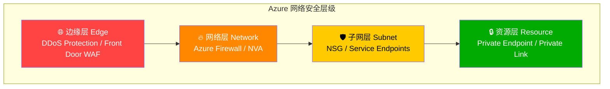

### 零信任 (Zero Trust) 网络原则

| 原则 | Azure 实现 |
|------|-----------|
| 验证明确 (Verify Explicitly) | NSG + Azure AD 条件访问 |
| 最小权限 (Least Privilege) | NSG deny-by-default + Private Endpoints |
| 假设违规 (Assume Breach) | 微分段 + Azure Firewall 东西向流量检查 |

## 2. 核心概念详解

### 2.1 网络安全组 (NSG)

NSG 是一个**有状态的 L3/L4 包过滤器**，可以控制 Azure 资源的入站和出站网络流量。

#### NSG 规则组成

每条规则包含：
- **优先级 (Priority)**：100-4096，数字越小优先级越高
- **源/目标**：IP 地址、CIDR、Service Tag、ASG
- **协议**：TCP、UDP、ICMP、ESP、AH 或 Any
- **端口范围**：单个端口、端口范围或 Any
- **动作**：Allow 或 Deny

#### 默认规则

**入站默认规则：**

| 优先级 | 名称 | 源 | 目标 | 动作 |
|--------|------|-----|------|------|
| 65000 | AllowVnetInBound | VirtualNetwork | VirtualNetwork | Allow |
| 65001 | AllowAzureLoadBalancerInBound | AzureLoadBalancer | Any | Allow |
| 65500 | DenyAllInBound | Any | Any | **Deny** |

**出站默认规则：**

| 优先级 | 名称 | 源 | 目标 | 动作 |
|--------|------|-----|------|------|
| 65000 | AllowVnetOutBound | VirtualNetwork | VirtualNetwork | Allow |
| 65001 | AllowInternetOutBound | Any | Internet | Allow |
| 65500 | DenyAllOutBound | Any | Any | **Deny** |

#### NSG 关联级别


**关键**：入站流量先经过**子网 NSG**，再经过**NIC NSG**；出站流量先经过**NIC NSG**，再经过**子网 NSG**。两级 NSG 都必须允许，流量才能通过。

#### Service Tag (服务标记)

Service Tag 是 Microsoft 维护的 IP 地址组前缀，自动更新：

| Service Tag | 说明 | 常见用途 |
|-------------|------|---------|
| `VirtualNetwork` | VNet + Peered VNet + VPN 连接的地址 | 允许 VNet 内部通信 |
| `AzureLoadBalancer` | Azure 健康探测源 IP (168.63.129.16) | 允许 LB 探测 |
| `Internet` | VNet 之外的所有公共 IP | 控制互联网访问 |
| `Storage` | Azure Storage 的 IP 范围 | 允许访问存储 |
| `Sql` | Azure SQL Database 的 IP 范围 | 允许访问 SQL |
| `AzureCloud` | 所有 Azure 数据中心 IP | 允许访问 Azure 服务 |
| `GatewayManager` | VPN/ER Gateway 管理流量 | Gateway 管理 |
| `AzureMonitor` | Azure Monitor 数据收集端点 | 监控流量 |

#### 应用安全组 (ASG)

ASG 允许按**逻辑分组**定义 NSG 规则，而非使用 IP 地址：

```bash
# 创建 ASG
az network asg create --name WebServers --resource-group ContosoRG
az network asg create --name AppServers --resource-group ContosoRG
az network asg create --name DbServers --resource-group ContosoRG

# NSG 规则使用 ASG
az network nsg rule create \
  --nsg-name ContosoNSG \
  --resource-group ContosoRG \
  --name AllowWebToApp \
  --priority 100 \
  --source-asgs WebServers \
  --destination-asgs AppServers \
  --destination-port-ranges 8080 \
  --protocol Tcp \
  --access Allow
```

### 2.2 Azure Firewall

Azure Firewall 是一个**托管的、有状态的中央化防火墙即服务**，提供 L3-L7 网络保护。

#### Standard vs Premium

| 特性 | Standard | Premium |
|------|----------|---------|
| L3-L7 过滤 | ✅ | ✅ |
| 威胁情报 (Threat Intel) | ✅ (Alert/Deny) | ✅ |
| FQDN 过滤 | ✅ | ✅ |
| FQDN Tags | ✅ | ✅ |
| NAT 规则 (DNAT) | ✅ | ✅ |
| **TLS 检查 (TLS Inspection)** | ❌ | ✅ |
| **IDPS (入侵检测/防御)** | ❌ | ✅ |
| **URL 过滤** | ❌ | ✅ (完整 URL 路径) |
| **Web 分类** | ❌ | ✅ |

#### 规则处理顺序

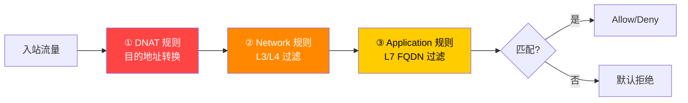

> 📝 **重要**：DNAT 规则 → Network 规则 → Application 规则。如果 Network 规则匹配了流量，Application 规则不会被评估。

#### Hub-Spoke 中的 Azure Firewall 流量路径

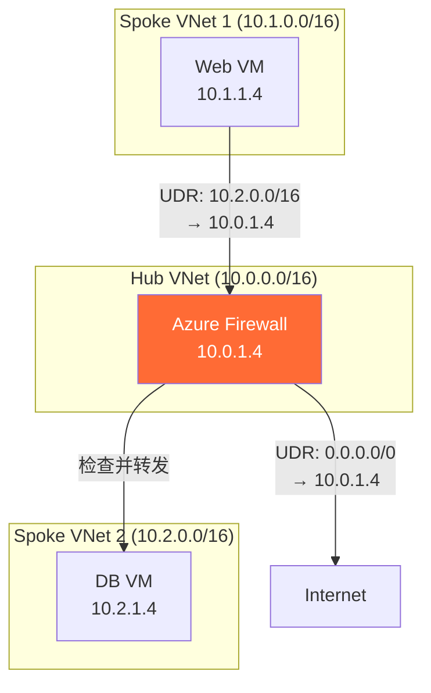

**关键 UDR 配置**：在 Spoke VNet 的子网路由表中：
- `0.0.0.0/0` → Azure Firewall 私有 IP（强制所有互联网流量经过防火墙）
- 其他 Spoke 网段 → Azure Firewall 私有 IP（东西向流量检查）

```bash
# 创建 Azure Firewall
az network firewall create \
  --name ContosoFirewall \
  --resource-group ContosoRG \
  --location eastus \
  --sku AZFW_VNet \
  --tier Premium

# 创建 UDR
az network route-table create \
  --name SpokeRouteTable \
  --resource-group ContosoRG

az network route-table route create \
  --route-table-name SpokeRouteTable \
  --resource-group ContosoRG \
  --name ToInternet \
  --address-prefix 0.0.0.0/0 \
  --next-hop-type VirtualAppliance \
  --next-hop-ip-address 10.0.1.4
```

### 2.3 Web Application Firewall (WAF)

WAF 保护 Web 应用免受 **OWASP Top 10** 攻击（SQL 注入、XSS、CSRF 等）。

#### 部署选项

| 部署位置 | 保护范围 | 适用场景 |
|---------|---------|---------|
| **Application Gateway + WAF** | 区域级 (Regional) | 单区域 Web 应用 |
| **Front Door + WAF** | 全球边缘 (Global Edge) | 多区域、全球分布的应用 |
| **CDN + WAF** | CDN 边缘 | 静态内容保护 |

#### WAF 模式

- **检测模式 (Detection)**：仅记录日志，不阻止流量 — 用于初始调优
- **防护模式 (Prevention)**：检测并阻止匹配的流量 — 生产环境使用

#### WAF 规则类型

| 规则类型 | 说明 |
|---------|------|
| **托管规则集 (Managed Rules)** | Microsoft 维护的 OWASP 规则集 (DRS 2.1) |
| **Bot 防护规则** | 检测并阻止恶意 Bot |
| **自定义规则 (Custom Rules)** | 用户自定义的匹配条件和动作 |
| **排除规则 (Exclusions)** | 排除特定请求属性不受托管规则检查 |

### 2.4 DDoS Protection

Azure 提供两个级别的 DDoS 防护：

| 特性 | DDoS Infrastructure Protection | DDoS Network Protection |
|------|-------------------------------|------------------------|
| 成本 | 免费 (默认) | ~$2,944/月 |
| 保护范围 | Azure 平台级别 | 特定 VNet |
| 自适应调优 | ❌ | ✅ (基于流量模式学习) |
| 攻击分析 | ❌ | ✅ (详细指标和日志) |
| DDoS 快速响应团队 (DRR) | ❌ | ✅ |
| 成本保护 | ❌ | ✅ (攻击期间扩展资源的积分) |
| WAF 折扣 | ❌ | ✅ |

**DDoS 保护的工作原理**：
- 在 Azure 网络边缘进行 L3/L4 流量清洗
- 基于机器学习的自适应调优，学习正常流量模式
- 攻击时自动分流恶意流量，合法流量正常通过
- 支持 TCP SYN Flood、UDP Flood、DNS Amplification 等攻击类型

### 2.5 Private Link & Private Endpoint

#### Private Endpoint

Private Endpoint 是 VNet 中的一个**网络接口 (NIC)**，使用私有 IP 连接到 Azure PaaS 服务。

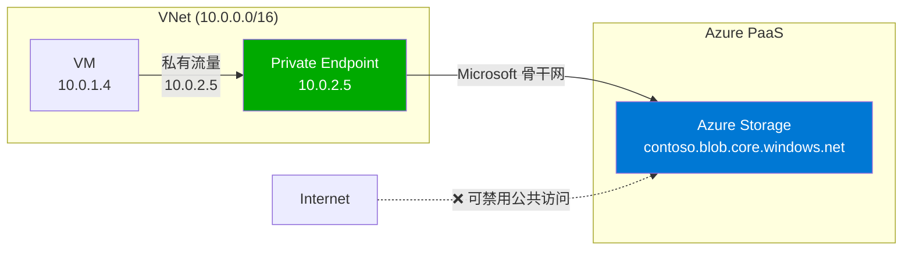

**支持 Private Endpoint 的主要服务**：
- Azure Storage (Blob, File, Queue, Table)
- Azure SQL Database / MySQL / PostgreSQL
- Azure Cosmos DB
- Azure Key Vault
- Azure App Service
- Azure Container Registry
- Azure Event Hub / Service Bus
- Azure Monitor (Log Analytics, App Insights)

#### DNS 解析变化

Private Endpoint 的关键机制是**DNS 重定向**：

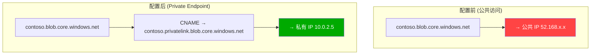

**Private DNS Zone 集成**：
```bash
# 创建 Private Endpoint
az network private-endpoint create \
  --name ContosoStoragePE \
  --resource-group ContosoRG \
  --vnet-name ContosoVNet \
  --subnet PrivateEndpointSubnet \
  --private-connection-resource-id /subscriptions/.../storageAccounts/contososa \
  --group-id blob \
  --connection-name ContosoStorageConnection

# 创建 Private DNS Zone
az network private-dns zone create \
  --name privatelink.blob.core.windows.net \
  --resource-group ContosoRG

# 链接到 VNet
az network private-dns link vnet create \
  --zone-name privatelink.blob.core.windows.net \
  --resource-group ContosoRG \
  --name StorageDNSLink \
  --virtual-network ContosoVNet \
  --registration-enabled false

# 创建 DNS Zone Group（自动管理 DNS 记录）
az network private-endpoint dns-zone-group create \
  --endpoint-name ContosoStoragePE \
  --resource-group ContosoRG \
  --name StorageDNSZoneGroup \
  --private-dns-zone privatelink.blob.core.windows.net \
  --zone-name blob
```

#### 从本地访问 Private Endpoint

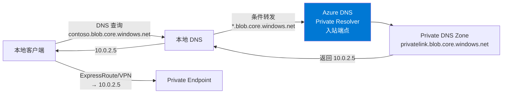

#### Private Link Service

Private Link Service 允许你将**自己的服务**（运行在 Standard Load Balancer 后面）通过 Private Endpoint 暴露给消费者。

### 2.6 Service Endpoints vs Private Endpoint

| 特征 | Service Endpoint | Private Endpoint |
|------|-----------------|-----------------|
| 流量路径 | Azure 骨干网（仍用公共 IP） | 完全私有（私有 IP） |
| 源 IP | VNet 私有 IP (服务端看到) | VNet 私有 IP |
| DNS 变化 | 无 | FQDN → 私有 IP |
| 本地访问 | ❌（仅 VNet 内有效） | ✅（通过 VPN/ER） |
| 成本 | 免费 | 按小时 + 数据处理费 |
| 精细控制 | 服务级别 | 资源实例级别 |

> **推荐**：新部署优先使用 **Private Endpoint**。Service Endpoint 适合简单场景或成本敏感场景。

## 3. 常见问题与排查

### 问题 1：流量被意外阻止

**排查步骤：**
```bash
# 使用 Network Watcher IP Flow Verify
az network watcher test-ip-flow \
  --direction Inbound \
  --protocol TCP \
  --local 10.0.1.4:80 \
  --remote 203.0.113.1:12345 \
  --vm myVM \
  --nic myVMNic \
  --resource-group ContosoRG

# 查看有效安全规则
az network nic list-effective-nsg \
  --name myVMNic \
  --resource-group ContosoRG
```

### 问题 2：Private Endpoint — 应用仍走公共 IP

**原因**：DNS 未正确配置
- 缺少 Private DNS Zone
- Private DNS Zone 未链接到 VNet
- 自定义 DNS 未配置转发

**诊断**：
```bash
# 检查 DNS 解析结果
nslookup contoso.blob.core.windows.net
# 应返回: contoso.privatelink.blob.core.windows.net → 10.0.x.x
# 如果返回公共 IP，说明 DNS 配置有问题
```

### 问题 3：WAF 误报阻止合法流量

**解决**：
1. 切换到 Detection 模式分析日志
2. 识别触发的规则 ID
3. 添加排除规则或自定义规则
4. 验证后切回 Prevention 模式

### 问题 4：从本地无法访问 Private Endpoint

**常见原因**：
- DNS 条件转发链断裂
- Azure DNS Private Resolver 入站端点未配置
- ExpressRoute/VPN 路由未包含 PE 子网
- NSG 阻止了流量

## 4. 最佳实践

1. **NSG**：每个子网都关联 NSG；使用 ASG 简化规则管理
2. **Azure Firewall**：Hub-Spoke 中集中部署，检查东西向和南北向流量
3. **Private Endpoint**：所有 PaaS 服务优先使用 Private Endpoint；正确配置 Private DNS Zone
4. **WAF**：先 Detection 调优，再 Prevention 生产
5. **DDoS**：关键工作负载启用 DDoS Network Protection
6. **NSG Flow Logs**：在所有 NSG 上启用 Flow Logs + Traffic Analytics
7. **Azure Policy**：强制要求所有子网关联 NSG

## 5. 实战场景

### 场景 1：零信任 PaaS 访问

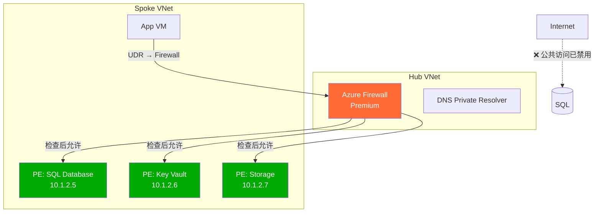

### 场景 2：安全 Web 应用

```
Internet → Front Door (Global WAF) → Application Gateway (Regional WAF)
    → NSG → Web VMs → NSG → App VMs → Private Endpoint → SQL Database
         ↓
    Azure Firewall (检查出站到第三方 API)
```

### 场景 3：合规行业 (金融/医疗)

```
安全措施：
├── DDoS Network Protection (全 VNet)
├── Azure Firewall Premium (TLS 检查 + IDPS)
├── 所有 PaaS → Private Endpoint (禁用公共访问)
├── NSG Flow Logs → Traffic Analytics → Sentinel
├── WAF (Prevention Mode, OWASP 3.2)
└── Azure Policy: 强制 NSG、禁止公共 IP、强制 PE
```

## 6. 参考资源

- [NSG 文档](https://learn.microsoft.com/azure/virtual-network/network-security-groups-overview)
- [Azure Firewall 文档](https://learn.microsoft.com/azure/firewall/overview)
- [Private Link 文档](https://learn.microsoft.com/azure/private-link/private-link-overview)
- [WAF 文档](https://learn.microsoft.com/azure/web-application-firewall/overview)
- [DDoS Protection 文档](https://learn.microsoft.com/azure/ddos-protection/ddos-protection-overview)

---

# Deep Dive: Azure Network Security — NSG, Firewall, WAF, Private Link & DDoS Protection

## 1. Overview

Azure network security follows a **Defense-in-Depth** strategy, providing protection at multiple layers:

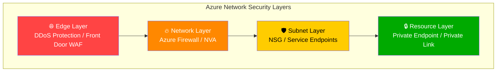

### Zero Trust Network Principles

| Principle | Azure Implementation |
|-----------|---------------------|
| Verify Explicitly | NSG + Azure AD Conditional Access |
| Least Privilege | NSG deny-by-default + Private Endpoints |
| Assume Breach | Micro-segmentation + Azure Firewall east-west inspection |

## 2. Core Concepts in Depth

### 2.1 Network Security Groups (NSG)

An NSG is a **stateful L3/L4 packet filter** that controls inbound and outbound network traffic for Azure resources.

#### NSG Rule Components

Each rule contains:
- **Priority**: 100-4096, lower number = higher priority
- **Source/Destination**: IP address, CIDR, Service Tag, ASG
- **Protocol**: TCP, UDP, ICMP, ESP, AH, or Any
- **Port Range**: Single port, port range, or Any
- **Action**: Allow or Deny

#### Default Rules

**Inbound defaults:**

| Priority | Name | Source | Destination | Action |
|----------|------|--------|-------------|--------|
| 65000 | AllowVnetInBound | VirtualNetwork | VirtualNetwork | Allow |
| 65001 | AllowAzureLoadBalancerInBound | AzureLoadBalancer | Any | Allow |
| 65500 | DenyAllInBound | Any | Any | **Deny** |

**Outbound defaults:**

| Priority | Name | Source | Destination | Action |
|----------|------|--------|-------------|--------|
| 65000 | AllowVnetOutBound | VirtualNetwork | VirtualNetwork | Allow |
| 65001 | AllowInternetOutBound | Any | Internet | Allow |
| 65500 | DenyAllOutBound | Any | Any | **Deny** |

#### NSG Association Levels

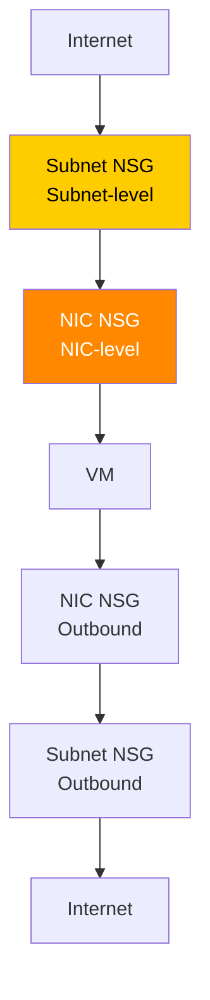

**Key**: Inbound traffic goes through **Subnet NSG** first, then **NIC NSG**; outbound goes through **NIC NSG** first, then **Subnet NSG**. Both must allow for traffic to pass.

#### Service Tags

Service Tags are Microsoft-maintained IP address group prefixes, automatically updated:

| Service Tag | Description | Common Use |
|-------------|------------|------------|
| `VirtualNetwork` | VNet + Peered VNet + VPN addresses | Allow VNet internal communication |
| `AzureLoadBalancer` | Azure health probe source (168.63.129.16) | Allow LB probes |
| `Internet` | All public IPs outside VNet | Control internet access |
| `Storage` | Azure Storage IP ranges | Allow storage access |
| `Sql` | Azure SQL Database IP ranges | Allow SQL access |
| `AzureCloud` | All Azure datacenter IPs | Allow Azure service access |
| `GatewayManager` | VPN/ER Gateway management | Gateway management |
| `AzureMonitor` | Azure Monitor endpoints | Monitoring traffic |

#### Application Security Groups (ASG)

ASGs allow defining NSG rules using **logical groupings** instead of IP addresses:

```bash
# Create ASGs
az network asg create --name WebServers --resource-group ContosoRG
az network asg create --name AppServers --resource-group ContosoRG
az network asg create --name DbServers --resource-group ContosoRG

# NSG rule using ASGs
az network nsg rule create \
  --nsg-name ContosoNSG \
  --resource-group ContosoRG \
  --name AllowWebToApp \
  --priority 100 \
  --source-asgs WebServers \
  --destination-asgs AppServers \
  --destination-port-ranges 8080 \
  --protocol Tcp \
  --access Allow
```

### 2.2 Azure Firewall

Azure Firewall is a **managed, stateful, centralized firewall-as-a-service** providing L3-L7 network protection.

#### Standard vs Premium

| Feature | Standard | Premium |
|---------|----------|---------|
| L3-L7 Filtering | ✅ | ✅ |
| Threat Intelligence | ✅ (Alert/Deny) | ✅ |
| FQDN Filtering | ✅ | ✅ |
| FQDN Tags | ✅ | ✅ |
| NAT Rules (DNAT) | ✅ | ✅ |
| **TLS Inspection** | ❌ | ✅ |
| **IDPS** | ❌ | ✅ |
| **URL Filtering** | ❌ | ✅ (Full URL path) |
| **Web Categories** | ❌ | ✅ |

#### Rule Processing Order

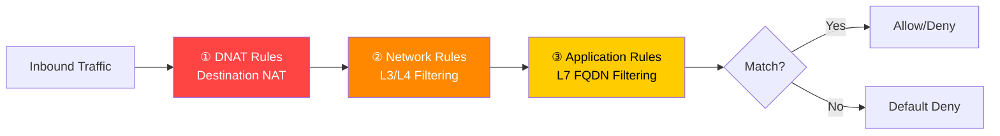

> 📝 **Important**: DNAT rules → Network rules → Application rules. If a Network rule matches, Application rules are NOT evaluated.

#### Azure Firewall in Hub-Spoke

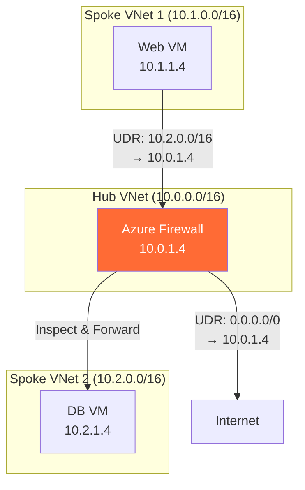

**Key UDR configuration** in Spoke subnet route tables:
- `0.0.0.0/0` → Azure Firewall private IP (force all internet traffic through firewall)
- Other spoke prefixes → Azure Firewall private IP (east-west traffic inspection)

```bash
# Create Azure Firewall
az network firewall create \
  --name ContosoFirewall \
  --resource-group ContosoRG \
  --location eastus \
  --sku AZFW_VNet \
  --tier Premium

# Create UDR
az network route-table create \
  --name SpokeRouteTable \
  --resource-group ContosoRG

az network route-table route create \
  --route-table-name SpokeRouteTable \
  --resource-group ContosoRG \
  --name ToInternet \
  --address-prefix 0.0.0.0/0 \
  --next-hop-type VirtualAppliance \
  --next-hop-ip-address 10.0.1.4
```

### 2.3 Web Application Firewall (WAF)

WAF protects web applications from **OWASP Top 10** attacks (SQL injection, XSS, CSRF, etc.).

#### Deployment Options

| Deployment | Protection Scope | Use Case |
|-----------|-----------------|----------|
| **Application Gateway + WAF** | Regional | Single-region web app |
| **Front Door + WAF** | Global Edge | Multi-region, globally distributed apps |
| **CDN + WAF** | CDN Edge | Static content protection |

#### WAF Modes

- **Detection Mode**: Log only, don't block — for initial tuning
- **Prevention Mode**: Detect and block matching traffic — for production

#### WAF Rule Types

| Rule Type | Description |
|-----------|-------------|
| **Managed Rules** | Microsoft-maintained OWASP rule sets (DRS 2.1) |
| **Bot Protection** | Detect and block malicious bots |
| **Custom Rules** | User-defined match conditions and actions |
| **Exclusions** | Exclude specific request attributes from managed rule checks |

### 2.4 DDoS Protection

Azure provides two levels of DDoS protection:

| Feature | DDoS Infrastructure Protection | DDoS Network Protection |
|---------|-------------------------------|------------------------|
| Cost | Free (default) | ~$2,944/month |
| Scope | Azure platform-level | Specific VNet |
| Adaptive Tuning | ❌ | ✅ (ML-based traffic learning) |
| Attack Analytics | ❌ | ✅ (Detailed metrics & logs) |
| DDoS Rapid Response (DRR) | ❌ | ✅ |
| Cost Protection | ❌ | ✅ (Credits for scale-out during attack) |
| WAF Discount | ❌ | ✅ |

### 2.5 Private Link & Private Endpoint

#### Private Endpoint

A Private Endpoint is a **network interface (NIC)** in your VNet with a private IP connecting to an Azure PaaS service.

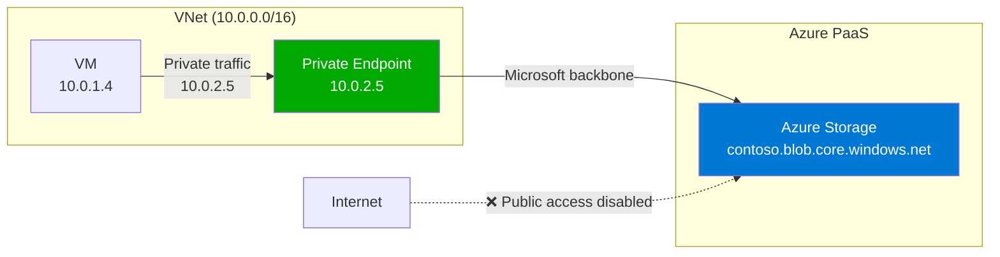

#### DNS Resolution Change

The key mechanism of Private Endpoint is **DNS redirection**:

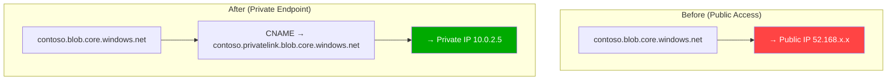

```bash
# Create Private Endpoint
az network private-endpoint create \
  --name ContosoStoragePE \
  --resource-group ContosoRG \
  --vnet-name ContosoVNet \
  --subnet PrivateEndpointSubnet \
  --private-connection-resource-id /subscriptions/.../storageAccounts/contososa \
  --group-id blob \
  --connection-name ContosoStorageConnection

# Create Private DNS Zone
az network private-dns zone create \
  --name privatelink.blob.core.windows.net \
  --resource-group ContosoRG

# Link to VNet
az network private-dns link vnet create \
  --zone-name privatelink.blob.core.windows.net \
  --resource-group ContosoRG \
  --name StorageDNSLink \
  --virtual-network ContosoVNet \
  --registration-enabled false
```

#### Accessing Private Endpoint from On-Premises

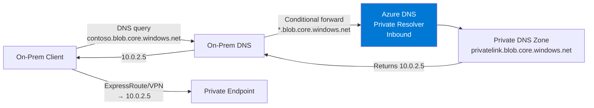

### 2.6 Service Endpoints vs Private Endpoint

| Feature | Service Endpoint | Private Endpoint |
|---------|-----------------|-----------------|
| Traffic Path | Azure backbone (still uses public IP) | Fully private (private IP) |
| Source IP | VNet private IP (seen by service) | VNet private IP |
| DNS Change | None | FQDN → Private IP |
| On-Prem Access | ❌ (VNet only) | ✅ (via VPN/ER) |
| Cost | Free | Hourly + data processing |
| Granularity | Service-level | Resource instance-level |

> **Recommendation**: Prefer **Private Endpoint** for new deployments. Service Endpoints for simple or cost-sensitive scenarios.

## 3. Common Issues & Troubleshooting

### Issue 1: Traffic Blocked Unexpectedly

```bash
# Use Network Watcher IP Flow Verify
az network watcher test-ip-flow \
  --direction Inbound \
  --protocol TCP \
  --local 10.0.1.4:80 \
  --remote 203.0.113.1:12345 \
  --vm myVM \
  --nic myVMNic \
  --resource-group ContosoRG

# View effective security rules
az network nic list-effective-nsg \
  --name myVMNic \
  --resource-group ContosoRG
```

### Issue 2: Private Endpoint — App Still Uses Public IP

**Cause**: DNS not configured correctly
- Missing Private DNS Zone
- Private DNS Zone not linked to VNet
- Custom DNS not configured with forwarding

**Diagnose**:
```bash
nslookup contoso.blob.core.windows.net
# Should return: contoso.privatelink.blob.core.windows.net → 10.0.x.x
# If public IP returned, DNS configuration is wrong
```

### Issue 3: WAF False Positives Blocking Legitimate Traffic

1. Switch to Detection mode to analyze logs
2. Identify triggered rule IDs
3. Add exclusion rules or custom rules
4. Verify, then switch back to Prevention mode

### Issue 4: Cannot Access Private Endpoint from On-Premises

**Common causes:**
- DNS conditional forwarding chain broken
- Azure DNS Private Resolver inbound endpoint not configured
- ExpressRoute/VPN routes don't include PE subnet
- NSG blocking traffic

## 4. Best Practices

1. **NSG**: Associate NSG with every subnet; use ASGs to simplify rule management
2. **Azure Firewall**: Deploy centrally in Hub-Spoke, inspect east-west and north-south traffic
3. **Private Endpoint**: Use for all PaaS services; configure Private DNS Zones correctly
4. **WAF**: Start Detection mode, tune, then switch to Prevention
5. **DDoS**: Enable DDoS Network Protection for critical workloads
6. **NSG Flow Logs**: Enable on all NSGs with Traffic Analytics
7. **Azure Policy**: Enforce NSG on all subnets

## 5. Real-World Scenarios

### Scenario 1: Zero Trust PaaS Access

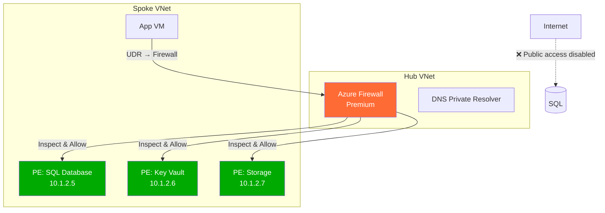

### Scenario 2: Secure Web Application

```
Internet → Front Door (Global WAF) → Application Gateway (Regional WAF)
    → NSG → Web VMs → NSG → App VMs → Private Endpoint → SQL Database
         ↓
    Azure Firewall (inspect outbound to third-party APIs)
```

### Scenario 3: Regulated Industry (Finance/Healthcare)

```
Security Stack:
├── DDoS Network Protection (full VNet)
├── Azure Firewall Premium (TLS Inspection + IDPS)
├── All PaaS → Private Endpoint (public access disabled)
├── NSG Flow Logs → Traffic Analytics → Sentinel
├── WAF (Prevention Mode, OWASP 3.2)
└── Azure Policy: Enforce NSG, deny public IP, require PE
```

## 6. References

- [NSG Documentation](https://learn.microsoft.com/azure/virtual-network/network-security-groups-overview)
- [Azure Firewall Documentation](https://learn.microsoft.com/azure/firewall/overview)
- [Private Link Documentation](https://learn.microsoft.com/azure/private-link/private-link-overview)
- [WAF Documentation](https://learn.microsoft.com/azure/web-application-firewall/overview)
- [DDoS Protection Documentation](https://learn.microsoft.com/azure/ddos-protection/ddos-protection-overview)
