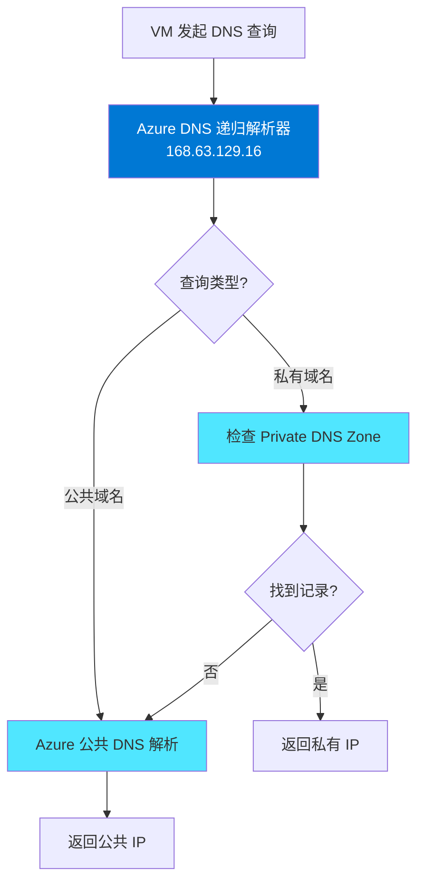
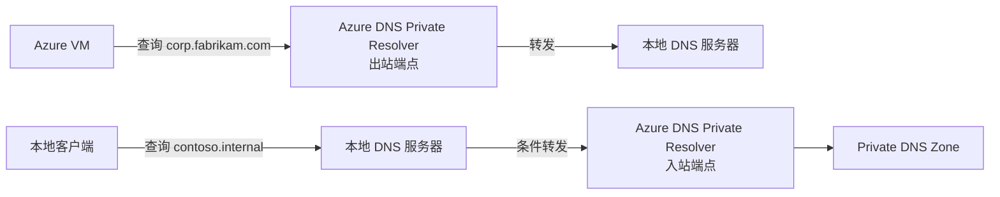
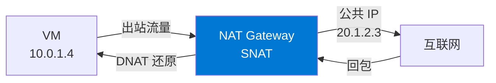
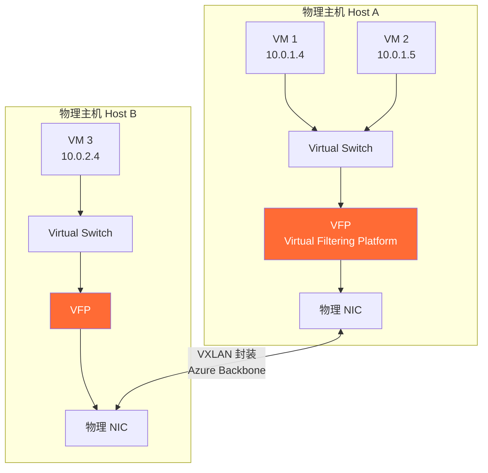
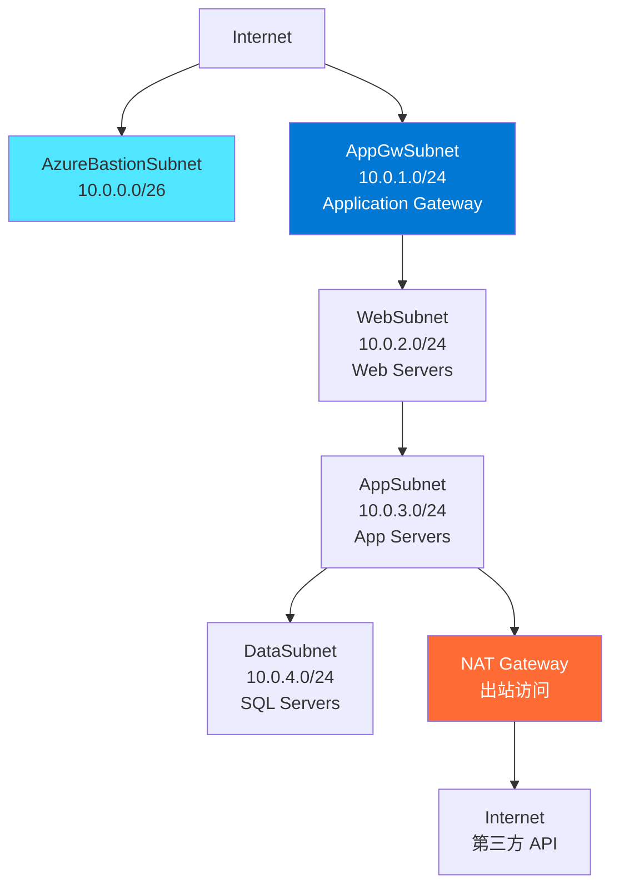
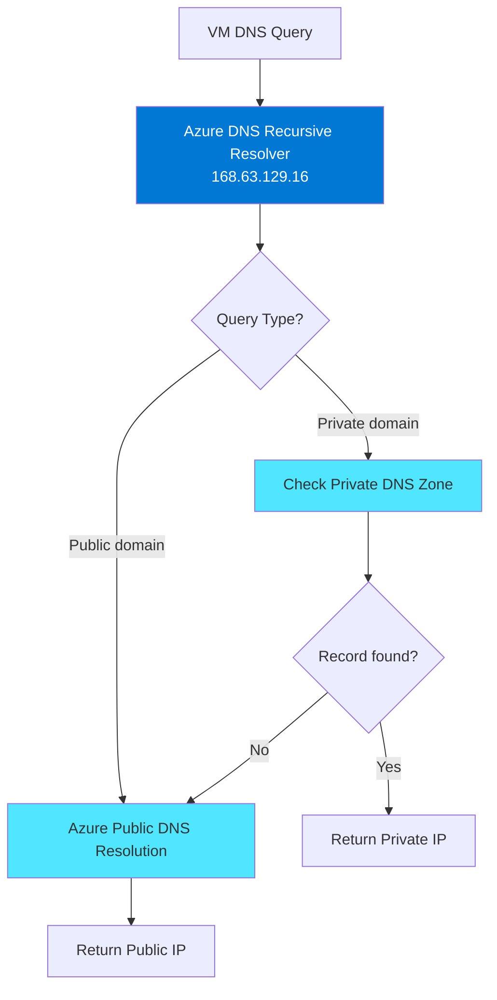
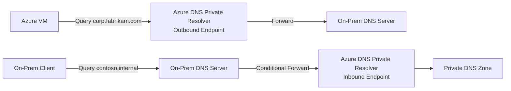
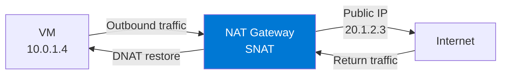
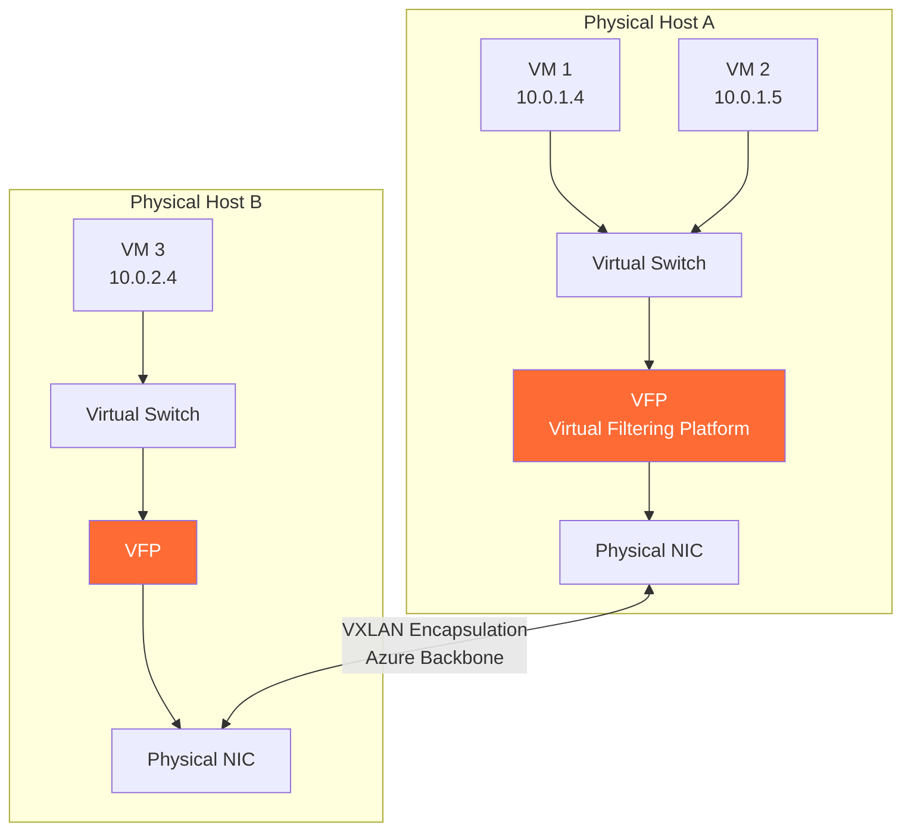
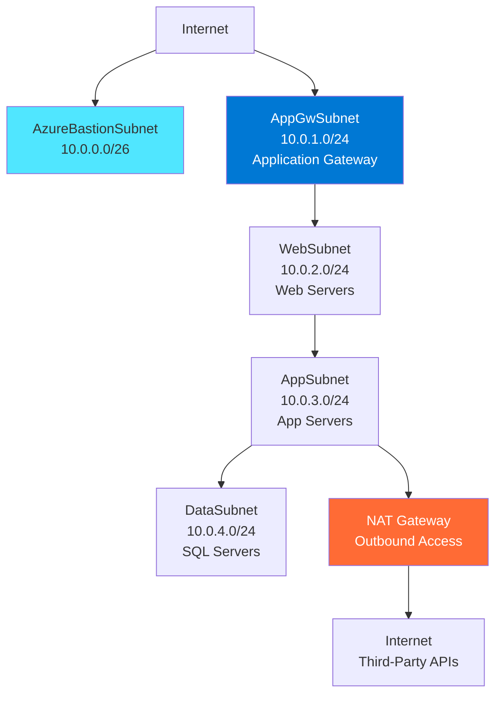

# 深入理解：Azure 网络基础 — VNet、子网、IP 与 DNS

## 1. 概述

Azure 虚拟网络 (Virtual Network, VNet) 是 Azure 云中的**基础网络构建模块**。它提供了一个逻辑隔离的网络环境，让 Azure 资源（如虚拟机、应用服务、数据库等）能够安全地相互通信、与互联网通信、以及与本地网络通信。

理解 VNet 的核心概念，是掌握整个 Azure 网络体系的基石。

### Azure 网络与本地网络的关键区别

| 特征 | 传统本地网络 | Azure VNet |
|------|-------------|------------|
| 网络隔离 | VLAN + 物理分段 | VNet 逻辑隔离（软件定义） |
| 路由 | 物理路由器 | Azure 系统路由（自动） |
| IP 分配 | DHCP 服务器 | Azure Fabric DHCP（无限租期） |
| 防火墙 | 硬件设备 | NSG / Azure Firewall (软件) |
| DNS | 本地 DNS 服务器 | Azure DNS (168.63.129.16) |
| 跨区域连接 | WAN 专线/VPN | VNet Peering / VPN Gateway |

## 2. 核心概念详解

### 2.1 Azure 虚拟网络 (VNet)

VNet 是 Azure 中的**软件定义网络 (SDN)**，具有以下特点：

- **区域绑定 (Region-scoped)**：每个 VNet 属于一个 Azure 区域，但可以跨该区域内的所有可用区 (Availability Zones)
- **订阅绑定 (Subscription-scoped)**：VNet 属于某个订阅和资源组
- **地址空间 (Address Space)**：使用 CIDR 表示法定义私有 IP 范围

**推荐使用的 RFC 1918 私有地址范围：**

| 范围 | CIDR | 可用地址数 |
|------|------|-----------|
| 10.0.0.0 – 10.255.255.255 | 10.0.0.0/8 | ~16.7M |
| 172.16.0.0 – 172.31.255.255 | 172.16.0.0/12 | ~1M |
| 192.168.0.0 – 192.168.255.255 | 192.168.0.0/16 | ~65K |

> ⚠️ **重要**：VNet 地址空间不能与其他 peered VNet 或本地网络重叠！

**创建 VNet 示例：**

```bash
# Azure CLI
az network vnet create \
  --name ContosoVNet \
  --resource-group ContosoRG \
  --address-prefixes 10.0.0.0/16 \
  --location eastus

# PowerShell
New-AzVirtualNetwork `
  -Name ContosoVNet `
  -ResourceGroupName ContosoRG `
  -Location eastus `
  -AddressPrefix 10.0.0.0/16
```

### 2.2 子网 (Subnet)

子网是 VNet 地址空间的**细分**。每个子网获得 VNet 地址空间的一个子集。

**Azure 在每个子网中保留 5 个 IP 地址：**

| 保留地址 | 用途 | 示例 (10.0.1.0/24) |
|---------|------|-------------------|
| 第一个 | 网络地址 | 10.0.1.0 |
| 第二个 | 默认网关 | 10.0.1.1 |
| 第三个 | Azure DNS 映射 | 10.0.1.2 |
| 第四个 | Azure DNS 映射 | 10.0.1.3 |
| 最后一个 | 广播地址 | 10.0.1.255 |

> 📝 对于 /24 子网 (256 个地址)，实际可用地址为 **251 个**。最小子网为 /29 (8 地址 - 5 保留 = 3 可用)。

**子网委托 (Subnet Delegation)**：某些 Azure 服务需要专用子网：
- **AzureBastionSubnet**：Azure Bastion（最小 /26）
- **GatewaySubnet**：VPN Gateway / ExpressRoute Gateway（推荐 /27）
- 容器实例 (ACI)、App Service 等也需要子网委托

```bash
# 添加子网
az network vnet subnet create \
  --name FrontendSubnet \
  --vnet-name ContosoVNet \
  --resource-group ContosoRG \
  --address-prefixes 10.0.1.0/24

az network vnet subnet create \
  --name BackendSubnet \
  --vnet-name ContosoVNet \
  --resource-group ContosoRG \
  --address-prefixes 10.0.2.0/24
```

### 2.3 IP 地址

#### 私有 IP (Private IP)

- 由 Azure Fabric DHCP 分配（不是传统 DHCP 服务器）
- **动态分配**：从子网范围中自动选择可用 IP（默认）
- **静态分配**：指定固定 IP（适用于 DNS 服务器、域控等）
- 租期为"无限"——VM 运行期间不会改变（即使重启也不变，除非 deallocate）

#### 公共 IP (Public IP)

| 特征 | Basic SKU (已弃用) | Standard SKU |
|------|-------------------|--------------|
| 分配方式 | 动态或静态 | 仅静态 |
| 可用区支持 | 否 | Zone-redundant |
| 安全 | 默认开放 | 默认关闭（需 NSG） |
| 负载均衡器 | Basic LB | Standard LB |

> ⚠️ **始终使用 Standard SKU**——Basic SKU 将于 2025.9.30 退役。

#### IPv6 双栈 (Dual-Stack)

Azure VNet 支持 IPv4 + IPv6 双栈配置：
- VNet 可同时拥有 IPv4 和 IPv6 地址空间
- VM NIC 可分配双栈 IP
- Standard Load Balancer 和 NSG 都支持 IPv6

### 2.4 Azure DNS

Azure DNS 提供两种类型的 DNS 区域：

#### 公共 DNS 区域 (Public Zone)

- 托管在 Azure 上的权威 DNS（替代 GoDaddy/Cloudflare DNS）
- 使用 Azure 全球 anycast 网络提供低延迟解析
- 支持所有标准记录类型 (A, AAAA, CNAME, MX, NS, TXT, SRV, SOA)

```bash
# 创建公共 DNS 区域
az network dns zone create \
  --name contoso.com \
  --resource-group ContosoRG

# 添加 A 记录
az network dns record-set a add-record \
  --zone-name contoso.com \
  --resource-group ContosoRG \
  --record-set-name www \
  --ipv4-address 40.112.72.205
```

#### 私有 DNS 区域 (Private Zone)

- 为 VNet 内部提供名称解析（不需要自建 DNS 服务器）
- 支持 **自动注册 (Auto-registration)**：VM 创建时自动注册 DNS 记录
- 可以链接到多个 VNet（但自动注册只能链接到一个）

```bash
# 创建私有 DNS 区域
az network private-dns zone create \
  --name contoso.internal \
  --resource-group ContosoRG

# 链接到 VNet（启用自动注册）
az network private-dns link vnet create \
  --name ContosoVNetLink \
  --zone-name contoso.internal \
  --resource-group ContosoRG \
  --virtual-network ContosoVNet \
  --registration-enabled true
```

#### DNS 解析流程



#### 混合 DNS 场景

在混合环境中（Azure + 本地），DNS 解析需要特殊配置：

- **Azure → 本地**：配置 VNet 自定义 DNS 指向本地 DNS，或使用 **Azure DNS Private Resolver** 的转发规则
- **本地 → Azure**：本地 DNS 配置条件转发器，将 Azure 域名转发到 Azure DNS Private Resolver 的入站端点



### 2.5 NAT Gateway

NAT Gateway 为子网中的资源提供**仅出站的互联网连接**。

**为什么需要 NAT Gateway？**
- Azure 正在**弃用隐式出站访问** (Default Outbound Access) — 2025年9月30日后新创建的 VM 将不再有默认出站
- NAT Gateway 提供确定性的 SNAT (Source NAT)，使用静态公共 IP
- 避免 Load Balancer SNAT 端口耗尽问题

**核心工作原理：**



| 参数 | 值 | 说明 |
|------|-----|------|
| SNAT 端口 | 64,512 per public IP | 每个公共 IP 提供约 64K 个 SNAT 端口 |
| 公共 IP 数量 | 最多 16 个 | 最多 ~1M 并发出站连接 |
| 空闲超时 | 4-120 分钟 | 可配置 TCP 空闲超时 |
| 协议 | TCP, UDP | 支持 TCP 和 UDP |

```bash
# 创建 NAT Gateway
az network nat gateway create \
  --name ContosoNatGW \
  --resource-group ContosoRG \
  --public-ip-addresses ContosoNatPublicIP \
  --idle-timeout 10

# 关联到子网
az network vnet subnet update \
  --name BackendSubnet \
  --vnet-name ContosoVNet \
  --resource-group ContosoRG \
  --nat-gateway ContosoNatGW
```

### 2.6 Azure Bastion

Azure Bastion 提供**安全的 RDP/SSH 连接**，无需在 VM 上暴露公共 IP。

**工作原理：**
1. 用户通过 Azure 门户 / CLI 发起连接
2. 流量通过 TLS (443) 到 Bastion 服务
3. Bastion 通过 VNet 内部连接到目标 VM（私有 IP，端口 3389/22）
4. VM 无需公共 IP，无需 NSG 允许 RDP/SSH from Internet

| SKU | Developer | Basic | Standard |
|-----|-----------|-------|----------|
| 并发连接 | 有限 | 25 | 50+ (可扩展) |
| 文件传输 | ❌ | ❌ | ✅ |
| 可共享链接 | ❌ | ❌ | ✅ |
| 原生客户端支持 | ❌ | ❌ | ✅ |
| IP 连接 | ❌ | ❌ | ✅ |
| 价格 | 低 | 中 | 高 |

## 3. 底层架构：Azure SDN 如何工作

### Azure 软件定义网络 (SDN) 架构

Azure 的网络是完全**软件定义**的：



**关键组件：**

1. **Host Agent**：每个物理主机上运行，接收来自 Azure Fabric Controller 的网络策略
2. **Virtual Switch (vSwitch)**：Hyper-V 虚拟交换机，连接 VM 到物理网络
3. **VFP (Virtual Filtering Platform)**：在 vSwitch 上运行的可编程数据平面
   - 执行 NSG 规则（ACL 过滤）
   - 执行路由策略（UDR）
   - 执行 VNET 封装/解封装
   - 执行 Load Balancer 的数据平面操作
4. **封装 (Encapsulation)**：跨主机的 VM 流量使用类 VXLAN 的封装协议

### 流量路径详解

**同子网 VM-to-VM（同主机）：**
```
VM1 → vSwitch → VFP(NSG检查) → vSwitch → VM2
```
不经过物理网络，全部在内存中完成。

**同子网 VM-to-VM（跨主机）：**
```
VM1 → vSwitch → VFP(NSG+封装) → 物理NIC → Azure Backbone → 物理NIC → VFP(解封装+NSG) → vSwitch → VM3
```

**VM-to-Internet：**
```
VM → vSwitch → VFP(NSG+SNAT) → 物理NIC → Azure Edge → Internet
```

## 4. 常见问题与排查

### 问题 1：VM 无法解析 Peered VNet 中的 DNS 名称

**原因**：Azure 默认 DNS 只解析同一 VNet 中的名称。Peered VNet 中的名称需要：
- 使用 **Private DNS Zone** 并链接到两个 VNet
- 或配置自定义 DNS 服务器

**解决**：
```bash
# 将私有 DNS 区域链接到两个 VNet
az network private-dns link vnet create \
  --zone-name contoso.internal \
  --resource-group ContosoRG \
  --name VNet1Link \
  --virtual-network VNet1 \
  --registration-enabled false

az network private-dns link vnet create \
  --zone-name contoso.internal \
  --resource-group ContosoRG \
  --name VNet2Link \
  --virtual-network VNet2 \
  --registration-enabled false
```

### 问题 2：VM 没有出站互联网访问

**排查步骤**：
1. 检查是否有 NAT Gateway 关联到子网
2. 检查是否有 Public IP 或 Load Balancer 提供出站
3. 检查 NSG 出站规则是否允许
4. 检查 UDR 是否将流量导向了 NVA

### 问题 3：子网 IP 耗尽

**预防**：
- 规划地址空间时预留增长空间
- /24 子网 (251 可用) 适合大多数工作负载
- 使用 Azure Monitor 监控 IP 使用率
- 记录所有 IP 分配

### 问题 4：混合 DNS 解析失败

**常见原因**：
- 条件转发器配置错误（目标 IP 不正确）
- Azure DNS Private Resolver 未部署入站端点
- VNet DNS 设置指向了错误的 DNS 服务器
- 防火墙阻止了 DNS 流量 (UDP/TCP 53)

## 5. 最佳实践

1. **Hub-Spoke 拓扑**：使用中心 VNet (Hub) 放置共享服务（Firewall, DNS, Bastion），辐射 VNet (Spoke) 用于工作负载
2. **IP 地址规划**：预留充足地址空间，记录所有分配，避免与本地网络重叠
3. **使用 Private DNS Zone**：优先使用 Azure DNS 私有区域，而非自建 DNS 服务器
4. **始终使用 Standard SKU**：Public IP、Load Balancer 都使用 Standard SKU
5. **NAT Gateway for 出站**：为所有需要出站访问的子网配置 NAT Gateway
6. **标记和文档**：为所有网络资源打标签 (tag)，维护网络架构文档

## 6. 实战场景

### 场景 1：多层 Web 应用



### 场景 2：混合 DNS 解析

```
Azure VNet (10.0.0.0/16)
├── DNS Private Resolver (入站: 10.0.0.4, 出站: 10.0.0.5)
├── Private DNS Zone: contoso.internal (链接到 VNet)
└── 转发规则集: *.corp.fabrikam.com → 192.168.1.10 (本地 DNS)

本地网络 (192.168.0.0/16)
├── DNS Server: 192.168.1.10
└── 条件转发: *.contoso.internal → 10.0.0.4 (Azure 入站端点)
```

### 场景 3：安全出站 — NAT Gateway + 静态 IP

第三方服务商要求 IP 白名单时：
- 创建 NAT Gateway 并分配静态 Public IP (如 20.1.2.3)
- 关联到工作负载子网
- 提供 20.1.2.3 给第三方做白名单
- 所有出站流量都使用该固定 IP

## 7. 参考资源

- [Azure Virtual Network 文档](https://learn.microsoft.com/azure/virtual-network/virtual-networks-overview)
- [Azure DNS 文档](https://learn.microsoft.com/azure/dns/dns-overview)
- [Azure DNS Private Zones](https://learn.microsoft.com/azure/dns/private-dns-overview)
- [Azure DNS Private Resolver](https://learn.microsoft.com/azure/dns/dns-private-resolver-overview)
- [NAT Gateway 文档](https://learn.microsoft.com/azure/nat-gateway/nat-overview)
- [Azure Bastion 文档](https://learn.microsoft.com/azure/bastion/bastion-overview)

---

# Deep Dive: Azure Networking Foundations — VNet, Subnet, IP & DNS

## 1. Overview

Azure Virtual Network (VNet) is the **fundamental networking building block** in Azure. It provides a logically isolated network environment where Azure resources (VMs, App Services, databases, etc.) can securely communicate with each other, with the internet, and with on-premises networks.

Understanding VNet core concepts is the foundation for mastering the entire Azure networking stack.

### Key Differences: Azure Networking vs On-Premises

| Feature | Traditional On-Premises | Azure VNet |
|---------|------------------------|------------|
| Network Isolation | VLANs + Physical Segmentation | VNet Logical Isolation (Software-defined) |
| Routing | Physical Routers | Azure System Routes (Automatic) |
| IP Assignment | DHCP Server | Azure Fabric DHCP (Infinite Lease) |
| Firewall | Hardware Appliances | NSG / Azure Firewall (Software) |
| DNS | On-premises DNS Servers | Azure DNS (168.63.129.16) |
| Cross-Region | WAN Links / VPN | VNet Peering / VPN Gateway |

## 2. Core Concepts in Depth

### 2.1 Azure Virtual Network (VNet)

VNet is Azure's **Software-Defined Network (SDN)** with these characteristics:

- **Region-scoped**: Each VNet belongs to one Azure region but spans all Availability Zones within that region
- **Subscription-scoped**: VNet belongs to a specific subscription and resource group
- **Address Space**: Defined using CIDR notation with private IP ranges

**Recommended RFC 1918 Private Address Ranges:**

| Range | CIDR | Available Addresses |
|-------|------|-------------------|
| 10.0.0.0 – 10.255.255.255 | 10.0.0.0/8 | ~16.7M |
| 172.16.0.0 – 172.31.255.255 | 172.16.0.0/12 | ~1M |
| 192.168.0.0 – 192.168.255.255 | 192.168.0.0/16 | ~65K |

> ⚠️ **Important**: VNet address spaces must NOT overlap with other peered VNets or on-premises networks!

**Create VNet Example:**

```bash
# Azure CLI
az network vnet create \
  --name ContosoVNet \
  --resource-group ContosoRG \
  --address-prefixes 10.0.0.0/16 \
  --location eastus

# PowerShell
New-AzVirtualNetwork `
  -Name ContosoVNet `
  -ResourceGroupName ContosoRG `
  -Location eastus `
  -AddressPrefix 10.0.0.0/16
```

### 2.2 Subnets

Subnets are **subdivisions** of the VNet address space. Each subnet receives a subset of IP addresses.

**Azure reserves 5 IP addresses per subnet:**

| Reserved Address | Purpose | Example (10.0.1.0/24) |
|-----------------|---------|----------------------|
| First | Network address | 10.0.1.0 |
| Second | Default gateway | 10.0.1.1 |
| Third | Azure DNS mapping | 10.0.1.2 |
| Fourth | Azure DNS mapping | 10.0.1.3 |
| Last | Broadcast address | 10.0.1.255 |

> 📝 For a /24 subnet (256 addresses), only **251** are usable. Minimum subnet is /29 (8 - 5 reserved = 3 usable).

**Subnet Delegation**: Some Azure services require dedicated subnets:
- **AzureBastionSubnet**: Azure Bastion (minimum /26)
- **GatewaySubnet**: VPN Gateway / ExpressRoute Gateway (recommended /27)
- Container Instances (ACI), App Service also require subnet delegation

```bash
# Add subnets
az network vnet subnet create \
  --name FrontendSubnet \
  --vnet-name ContosoVNet \
  --resource-group ContosoRG \
  --address-prefixes 10.0.1.0/24

az network vnet subnet create \
  --name BackendSubnet \
  --vnet-name ContosoVNet \
  --resource-group ContosoRG \
  --address-prefixes 10.0.2.0/24
```

### 2.3 IP Addressing

#### Private IP

- Assigned by Azure Fabric DHCP (not a traditional DHCP server)
- **Dynamic**: Auto-selects available IP from subnet range (default)
- **Static**: Specify a fixed IP (recommended for DNS servers, domain controllers)
- Lease is "infinite" — IP doesn't change while VM runs (persists across reboots, changes only on deallocate)

#### Public IP

| Feature | Basic SKU (Deprecated) | Standard SKU |
|---------|----------------------|--------------|
| Allocation | Dynamic or Static | Static only |
| Availability Zone | No | Zone-redundant |
| Security | Open by default | Closed by default (requires NSG) |
| Load Balancer | Basic LB | Standard LB |

> ⚠️ **Always use Standard SKU** — Basic SKU retires September 30, 2025.

#### IPv6 Dual-Stack

Azure VNet supports IPv4 + IPv6 dual-stack:
- VNet can have both IPv4 and IPv6 address spaces
- VM NIC can have dual-stack IPs
- Standard Load Balancer and NSG both support IPv6

### 2.4 Azure DNS

Azure DNS provides two types of DNS zones:

#### Public DNS Zones

- Authoritative DNS hosted on Azure (replaces GoDaddy/Cloudflare DNS)
- Uses Azure's global anycast network for low-latency resolution
- Supports all standard record types (A, AAAA, CNAME, MX, NS, TXT, SRV, SOA)

```bash
# Create public DNS zone
az network dns zone create \
  --name contoso.com \
  --resource-group ContosoRG

# Add A record
az network dns record-set a add-record \
  --zone-name contoso.com \
  --resource-group ContosoRG \
  --record-set-name www \
  --ipv4-address 40.112.72.205
```

#### Private DNS Zones

- Name resolution within VNets (no custom DNS server needed)
- Supports **auto-registration**: VMs automatically register DNS records on creation
- Can be linked to multiple VNets (but auto-registration links to only one)

```bash
# Create private DNS zone
az network private-dns zone create \
  --name contoso.internal \
  --resource-group ContosoRG

# Link to VNet with auto-registration
az network private-dns link vnet create \
  --name ContosoVNetLink \
  --zone-name contoso.internal \
  --resource-group ContosoRG \
  --virtual-network ContosoVNet \
  --registration-enabled true
```

#### DNS Resolution Flow



#### Hybrid DNS Scenario

In hybrid environments (Azure + on-premises), DNS resolution requires special configuration:

- **Azure → On-prem**: Configure VNet custom DNS pointing to on-prem DNS, or use **Azure DNS Private Resolver** forwarding rules
- **On-prem → Azure**: Configure conditional forwarders on on-prem DNS to forward Azure domain queries to Azure DNS Private Resolver inbound endpoint



### 2.5 NAT Gateway

NAT Gateway provides **outbound-only internet connectivity** for subnet resources.

**Why NAT Gateway?**
- Azure is **deprecating implicit outbound access** (Default Outbound Access) — VMs created after Sept 30, 2025 will no longer have default outbound
- NAT Gateway provides deterministic SNAT with static public IPs
- Avoids Load Balancer SNAT port exhaustion issues

**How it works:**



| Parameter | Value | Description |
|-----------|-------|-------------|
| SNAT Ports | 64,512 per public IP | ~64K SNAT ports per public IP |
| Public IPs | Up to 16 | Up to ~1M concurrent outbound connections |
| Idle Timeout | 4-120 minutes | Configurable TCP idle timeout |
| Protocol | TCP, UDP | Supports both TCP and UDP |

```bash
# Create NAT Gateway
az network nat gateway create \
  --name ContosoNatGW \
  --resource-group ContosoRG \
  --public-ip-addresses ContosoNatPublicIP \
  --idle-timeout 10

# Associate to subnet
az network vnet subnet update \
  --name BackendSubnet \
  --vnet-name ContosoVNet \
  --resource-group ContosoRG \
  --nat-gateway ContosoNatGW
```

### 2.6 Azure Bastion

Azure Bastion provides **secure RDP/SSH connectivity** without exposing public IPs on VMs.

**How it works:**
1. User initiates connection via Azure Portal / CLI
2. Traffic travels over TLS (port 443) to Bastion service
3. Bastion connects to target VM via private IP within the VNet (port 3389/22)
4. VM needs no public IP, no NSG rule allowing RDP/SSH from Internet

| SKU | Developer | Basic | Standard |
|-----|-----------|-------|----------|
| Concurrent Sessions | Limited | 25 | 50+ (scalable) |
| File Transfer | ❌ | ❌ | ✅ |
| Shareable Link | ❌ | ❌ | ✅ |
| Native Client | ❌ | ❌ | ✅ |
| IP-based Connect | ❌ | ❌ | ✅ |
| Cost | Low | Medium | High |

## 3. Under the Hood: Azure SDN Architecture

### Software-Defined Networking Architecture

Azure networking is completely **software-defined**:



**Key Components:**

1. **Host Agent**: Runs on each physical host, receives network policies from Azure Fabric Controller
2. **Virtual Switch (vSwitch)**: Hyper-V virtual switch connecting VMs to the physical network
3. **VFP (Virtual Filtering Platform)**: Programmable data plane running on vSwitch
   - Enforces NSG rules (ACL filtering)
   - Enforces routing policies (UDR)
   - Handles VNet encapsulation/decapsulation
   - Executes Load Balancer data plane operations
4. **Encapsulation**: Cross-host VM traffic uses VXLAN-like encapsulation protocol

### Traffic Path Details

**Same-subnet VM-to-VM (same host):**
```
VM1 → vSwitch → VFP(NSG check) → vSwitch → VM2
```
No physical network traversal — entirely in memory.

**Same-subnet VM-to-VM (cross-host):**
```
VM1 → vSwitch → VFP(NSG+encap) → Physical NIC → Azure Backbone → Physical NIC → VFP(decap+NSG) → vSwitch → VM3
```

**VM-to-Internet:**
```
VM → vSwitch → VFP(NSG+SNAT) → Physical NIC → Azure Edge → Internet
```

## 4. Common Issues & Troubleshooting

### Issue 1: VM Cannot Resolve DNS Names in Peered VNet

**Cause**: Azure default DNS only resolves names within the same VNet. Names in peered VNets require:
- **Private DNS Zone** linked to both VNets
- Or custom DNS server configuration

**Solution:**
```bash
# Link private DNS zone to both VNets
az network private-dns link vnet create \
  --zone-name contoso.internal \
  --resource-group ContosoRG \
  --name VNet1Link \
  --virtual-network VNet1 \
  --registration-enabled false

az network private-dns link vnet create \
  --zone-name contoso.internal \
  --resource-group ContosoRG \
  --name VNet2Link \
  --virtual-network VNet2 \
  --registration-enabled false
```

### Issue 2: VM Has No Outbound Internet Access

**Troubleshooting steps:**
1. Check if NAT Gateway is associated with the subnet
2. Check if Public IP or Load Balancer provides outbound
3. Check NSG outbound rules for allow
4. Check UDR for routes redirecting traffic to an NVA

### Issue 3: Subnet IP Exhaustion

**Prevention:**
- Plan address space with room for growth
- /24 subnets (251 usable) are suitable for most workloads
- Monitor IP usage with Azure Monitor
- Document all IP allocations

### Issue 4: Hybrid DNS Resolution Failures

**Common causes:**
- Conditional forwarder misconfigured (wrong target IP)
- Azure DNS Private Resolver inbound endpoint not deployed
- VNet DNS settings pointing to wrong DNS server
- Firewall blocking DNS traffic (UDP/TCP 53)

## 5. Best Practices

1. **Hub-Spoke Topology**: Use a hub VNet for shared services (Firewall, DNS, Bastion), spoke VNets for workloads
2. **IP Address Planning**: Reserve sufficient address space, document all allocations, avoid overlaps with on-premises
3. **Use Private DNS Zones**: Prefer Azure DNS private zones over custom DNS servers where possible
4. **Always Use Standard SKU**: Use Standard for Public IPs and Load Balancers
5. **NAT Gateway for Outbound**: Configure NAT Gateway for all subnets needing outbound access
6. **Tag and Document**: Tag all network resources, maintain network architecture documentation

## 6. Real-World Scenarios

### Scenario 1: Multi-Tier Web Application



### Scenario 2: Hybrid DNS Resolution

```
Azure VNet (10.0.0.0/16)
├── DNS Private Resolver (Inbound: 10.0.0.4, Outbound: 10.0.0.5)
├── Private DNS Zone: contoso.internal (linked to VNet)
└── Forwarding Ruleset: *.corp.fabrikam.com → 192.168.1.10 (On-prem DNS)

On-Premises Network (192.168.0.0/16)
├── DNS Server: 192.168.1.10
└── Conditional Forwarder: *.contoso.internal → 10.0.0.4 (Azure inbound endpoint)
```

### Scenario 3: Secure Outbound — NAT Gateway + Static IP

When third-party services require IP allowlisting:
- Create NAT Gateway with static Public IP (e.g., 20.1.2.3)
- Associate to workload subnet
- Provide 20.1.2.3 to third party for allowlisting
- All outbound traffic uses that fixed IP

## 7. References

- [Azure Virtual Network Documentation](https://learn.microsoft.com/azure/virtual-network/virtual-networks-overview)
- [Azure DNS Documentation](https://learn.microsoft.com/azure/dns/dns-overview)
- [Azure DNS Private Zones](https://learn.microsoft.com/azure/dns/private-dns-overview)
- [Azure DNS Private Resolver](https://learn.microsoft.com/azure/dns/dns-private-resolver-overview)
- [NAT Gateway Documentation](https://learn.microsoft.com/azure/nat-gateway/nat-overview)
- [Azure Bastion Documentation](https://learn.microsoft.com/azure/bastion/bastion-overview)
