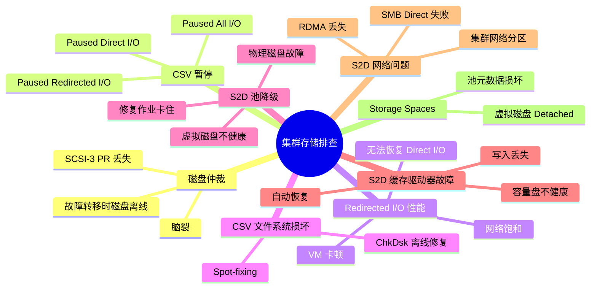
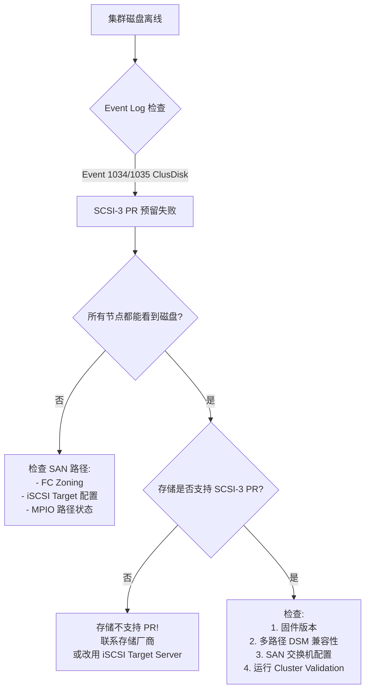
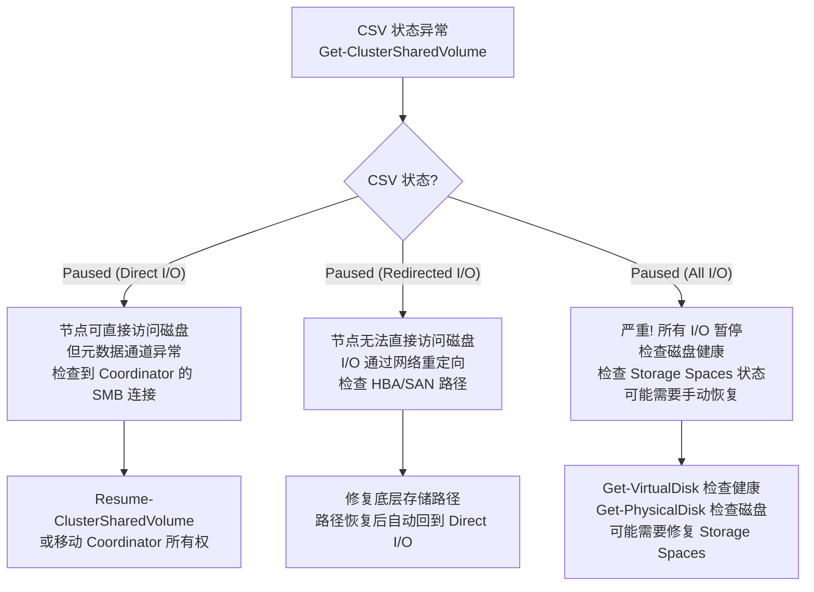
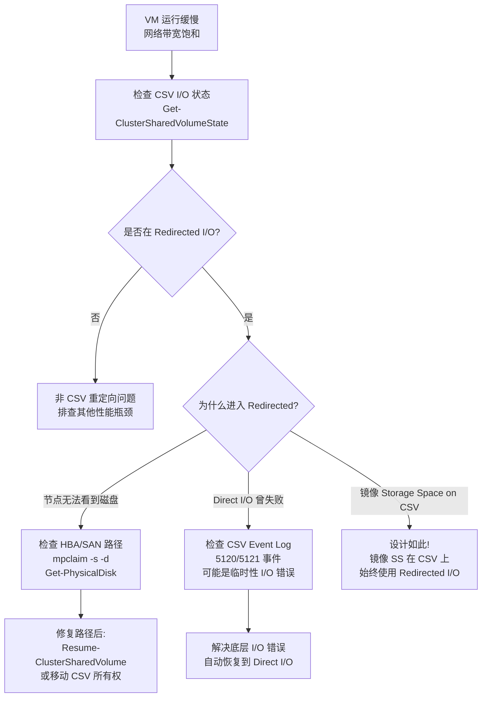
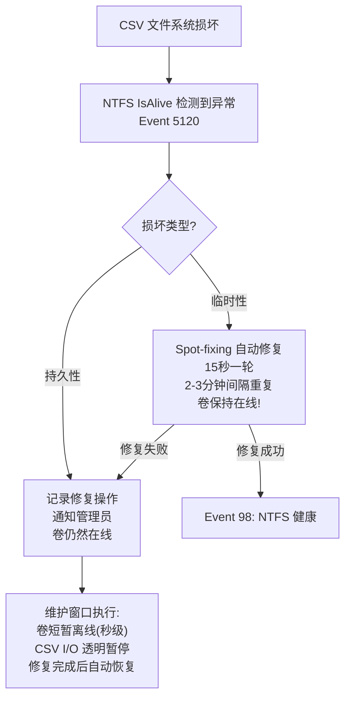
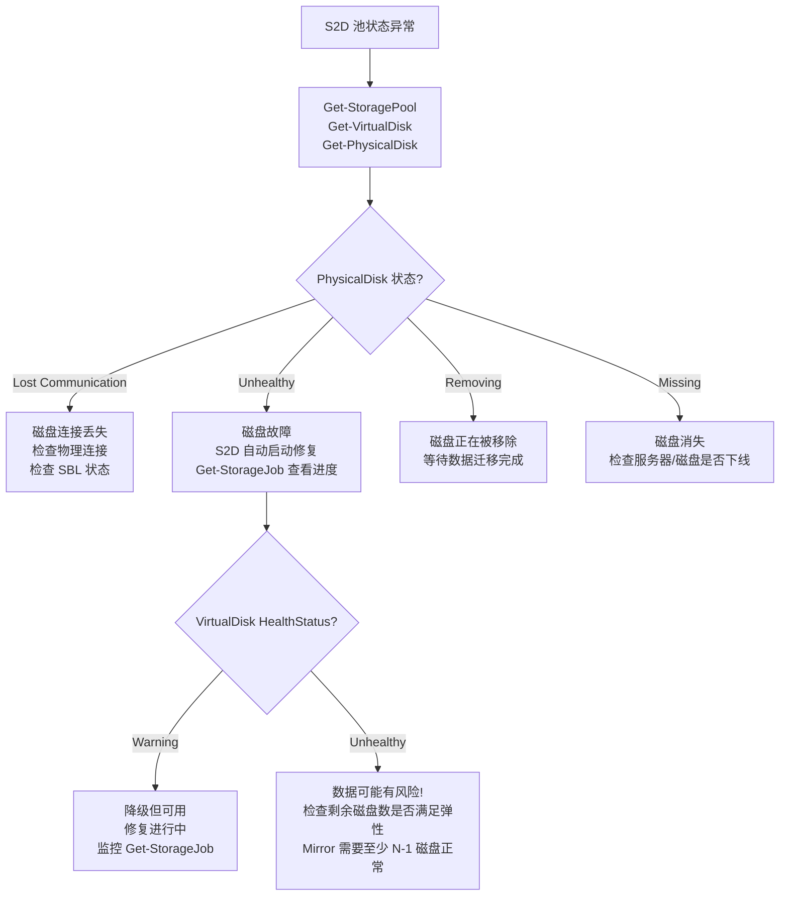
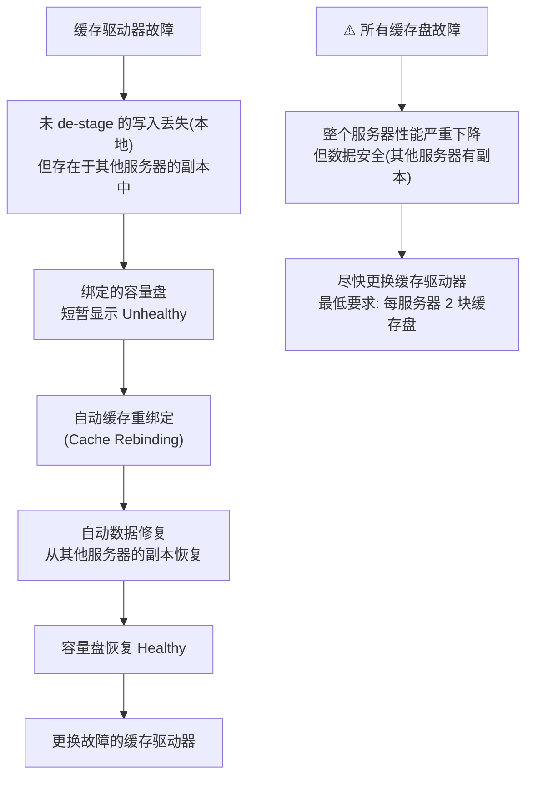
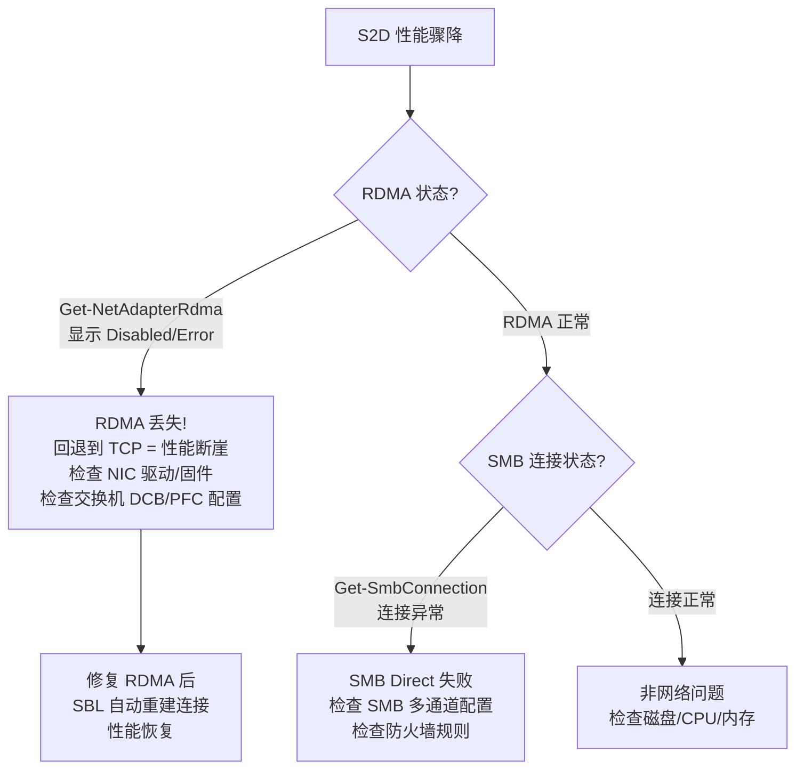
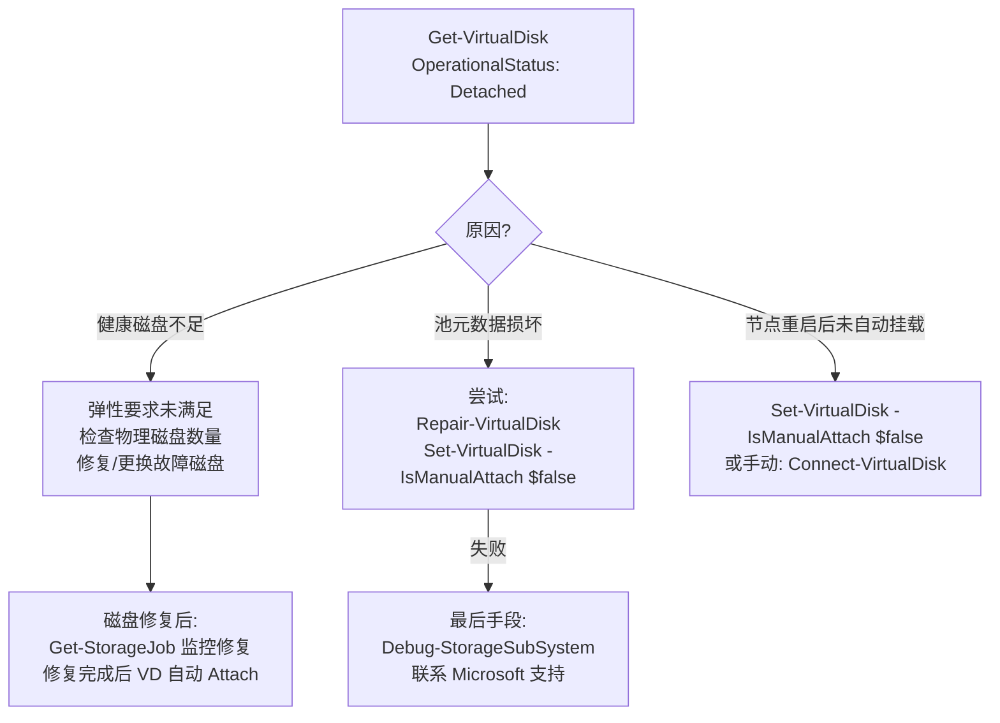
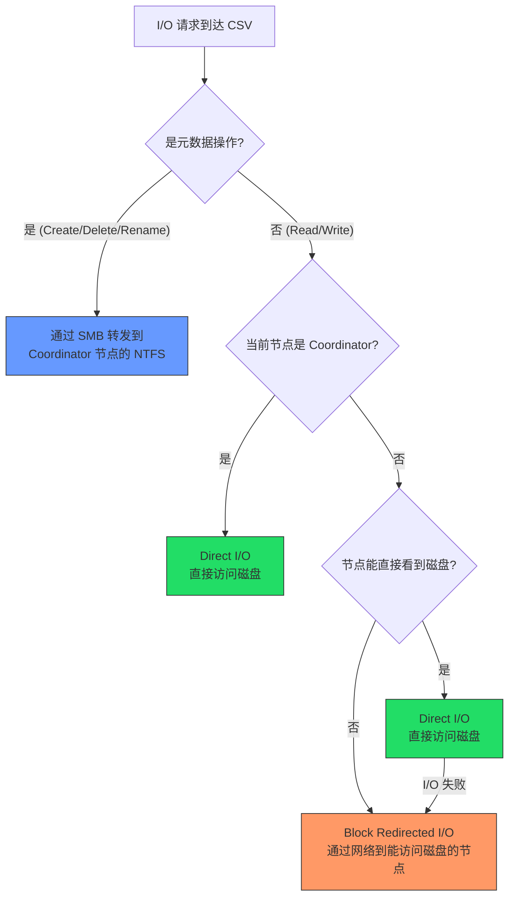

# Scenario Map: 集群存储 CSV 与 S2D 排查导航

**Topic:** Cluster Storage, CSV & S2D Troubleshooting  
**Category:** Storage / Failover Clustering  
**Last Updated:** 2026-03-17

---

## 总览思维导图



---

## 场景 A: 磁盘仲裁失败



### 关键事件 ID

| Event ID | 来源 | 含义 |
|----------|------|------|
| **1034** | ClusDisk | 磁盘仲裁：无法获取 SCSI-3 预留 |
| **1035** | ClusDisk | 磁盘仲裁：预留被其他节点持有 |
| **1069** | FailoverClustering | 集群资源上线失败 |
| **1205** | ClusDisk | 集群磁盘资源离线 |

---

## 场景 B: CSV 暂停状态



### CSV 状态参考表

| 状态 | 含义 | 影响 | 常见原因 |
|------|------|------|---------|
| **Online** | 正常 | 无 | — |
| **Paused (Direct I/O)** | 直接 I/O 正常，元数据通道异常 | 低 | SMB 连接问题 |
| **Paused (Redirected I/O)** | 所有 I/O 通过网络重定向 | **高（性能下降）** | HBA/SAN 路径丢失 |
| **Paused (All I/O)** | 所有 I/O 暂停 | **严重** | 磁盘/Storage Spaces 故障 |

### 诊断命令

```powershell
Get-ClusterSharedVolume                    # CSV 总览
Get-ClusterSharedVolumeState               # 每个节点的 I/O 状态
Get-ClusterSharedVolume | fl *             # 详细信息
```

---

## 场景 C: Redirected I/O 导致性能问题

> **类比**：Redirected I/O 就像交通改道——本来走高速直达（Direct I/O），现在被迫走狭窄的城市道路（网络），自然堵车。



---

## 场景 D: CSV 文件系统损坏



---

## 场景 E: S2D 存储池降级



### S2D 健康状态矩阵

| 组件 | 命令 | 健康 | 降级 | 故障 |
|------|------|:----:|:----:|:----:|
| 物理磁盘 | `Get-PhysicalDisk` | OK | Degraded | Lost Communication / Unhealthy |
| 虚拟磁盘 | `Get-VirtualDisk` | Healthy | Warning | Unhealthy |
| 存储池 | `Get-StoragePool` | OK | Degraded | Unknown |
| 子系统 | `Get-StorageSubSystem` | OK | - | - |
| 修复作业 | `Get-StorageJob` | — | Running | Suspended |

---

## 场景 F: S2D 缓存驱动器故障



---

## 场景 G: S2D 网络问题



---

## 场景 H: Storage Spaces 虚拟磁盘 Detached



---

## CSV I/O 路径决策树



---

## 诊断工具总表

| 工具 | 用途 |
|------|------|
| `Get-ClusterSharedVolume` | CSV 状态总览 |
| `Get-ClusterSharedVolumeState` | 每节点 CSV I/O 状态 |
| `Get-PhysicalDisk` | S2D 物理磁盘健康 |
| `Get-VirtualDisk` | S2D 虚拟磁盘健康 |
| `Get-StoragePool` | 池健康与容量 |
| `Get-StorageJob` | 活跃修复作业 |
| `Get-StorageSubSystem` | S2D 整体健康 |
| `Debug-StorageSubSystem` | S2D 深度诊断 |
| `Get-ClusterLog` | 集群诊断日志 |
| `Get-SmbConnection` | SMB 连接状态 |
| `Get-NetAdapterRdma` | RDMA NIC 状态 |

---

---

# English Version

---

# Scenario Map: Cluster Storage, CSV & S2D Troubleshooting

**Last Updated:** 2026-03-17

---

## Scenario A: Disk Arbitration Failures

| Event ID | Source | Meaning |
|----------|--------|---------|
| **1034** | ClusDisk | Cannot acquire SCSI-3 reservation |
| **1035** | ClusDisk | Reservation held by another node |
| **1069** | FailoverClustering | Cluster resource failed to come online |
| **1205** | ClusDisk | Cluster disk resource went offline |

**Troubleshooting**: Check SAN paths → Verify SCSI-3 PR support → Check firmware/DSM → Run Cluster Validation

---

## Scenario B: CSV Paused States

| State | Impact | Common Cause | Action |
|-------|--------|-------------|--------|
| **Online** | None | — | — |
| **Paused (Direct I/O)** | Low | SMB connection issue | Resume or move coordinator |
| **Paused (Redirected I/O)** | **High** | HBA/SAN path lost | Fix storage paths |
| **Paused (All I/O)** | **Critical** | Disk/Storage Spaces failure | Check `Get-VirtualDisk` health |

## Scenario C: Redirected I/O Performance

> **Analogy**: Redirected I/O is like a traffic detour — instead of the highway (Direct I/O), you're forced through narrow city streets (network).

Check: `Get-ClusterSharedVolumeState` → If FileSystemRedirectedIOReason ≠ None → Fix underlying storage path

## Scenario D: S2D Pool Degraded

```powershell
Get-PhysicalDisk | Where OperationalStatus -ne OK    # Find problem disks
Get-VirtualDisk | Where HealthStatus -ne Healthy      # Find affected VDs  
Get-StorageJob                                        # Monitor repair progress
```

## Scenario E: S2D Cache Drive Failure
- Lost writes exist on other servers (safe if mirror/parity)
- Capacity drives temporarily unhealthy → auto cache rebinding → auto data repair → healthy
- **Minimum 2 cache drives per server** required

## Scenario F: CSV I/O Decision Tree

```
I/O Request → Metadata? → Yes → Coordinator via SMB
                       → No → Is coordinator? → Yes → Direct I/O
                                              → No → Can see disk? → Yes → Direct I/O
                                                                   → No → Block Redirected I/O
```

## Diagnostic Tools

| Tool | Purpose |
|------|---------|
| `Get-ClusterSharedVolume` | CSV status |
| `Get-ClusterSharedVolumeState` | CSV I/O state per node |
| `Get-PhysicalDisk` | S2D physical disk health |
| `Get-VirtualDisk` | S2D virtual disk health |
| `Get-StoragePool` | Pool health and capacity |
| `Get-StorageJob` | Active repair jobs |
| `Debug-StorageSubSystem` | S2D deep diagnostics |
| `Get-ClusterLog` | Cluster diagnostic log |
| `Get-NetAdapterRdma` | RDMA NIC status |
