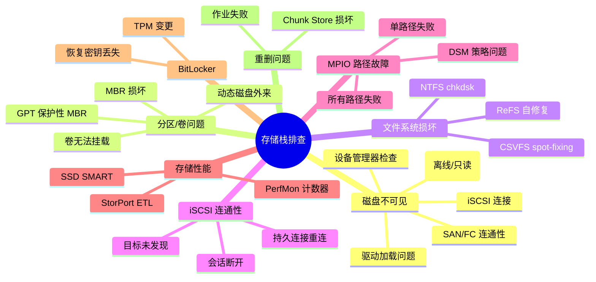
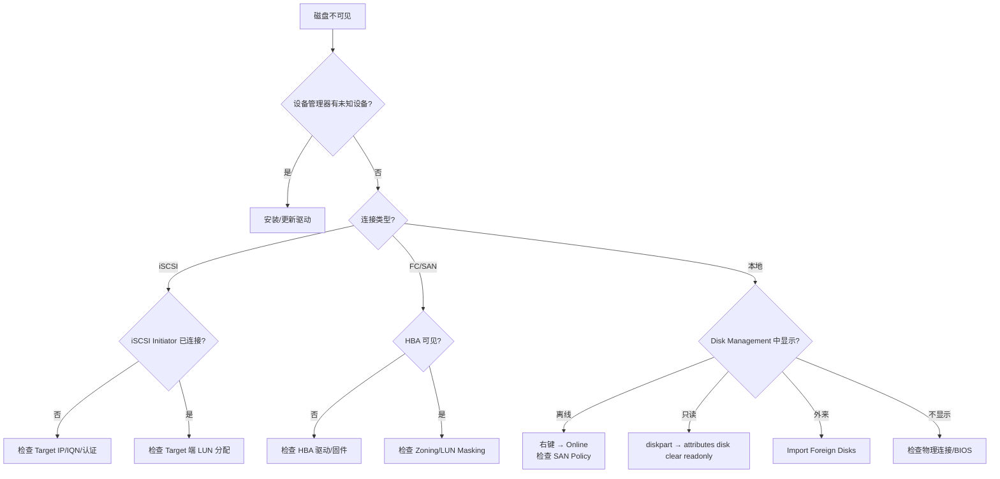
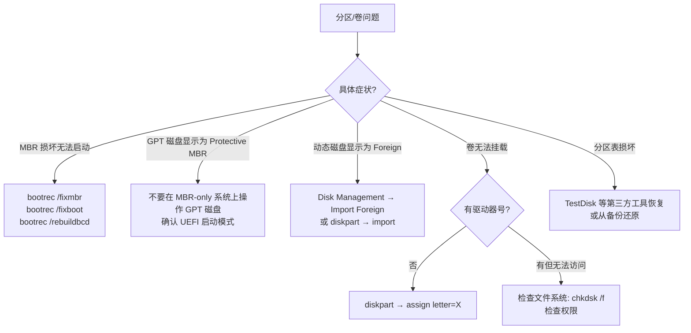
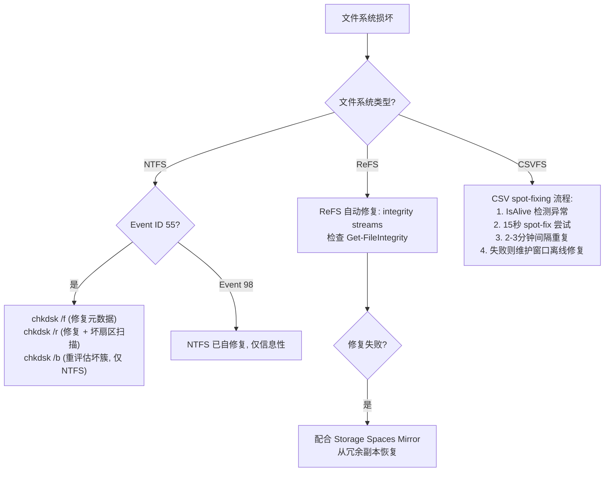
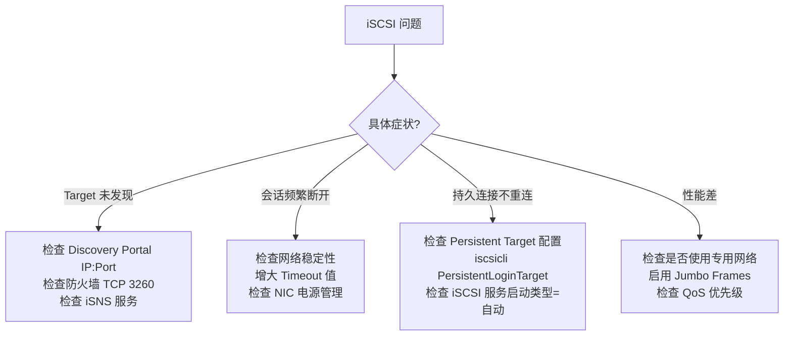
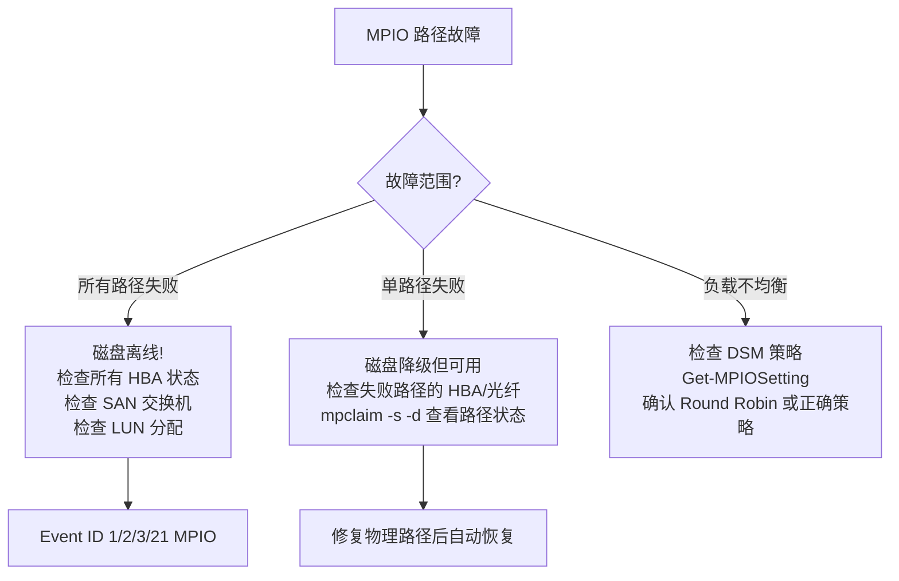
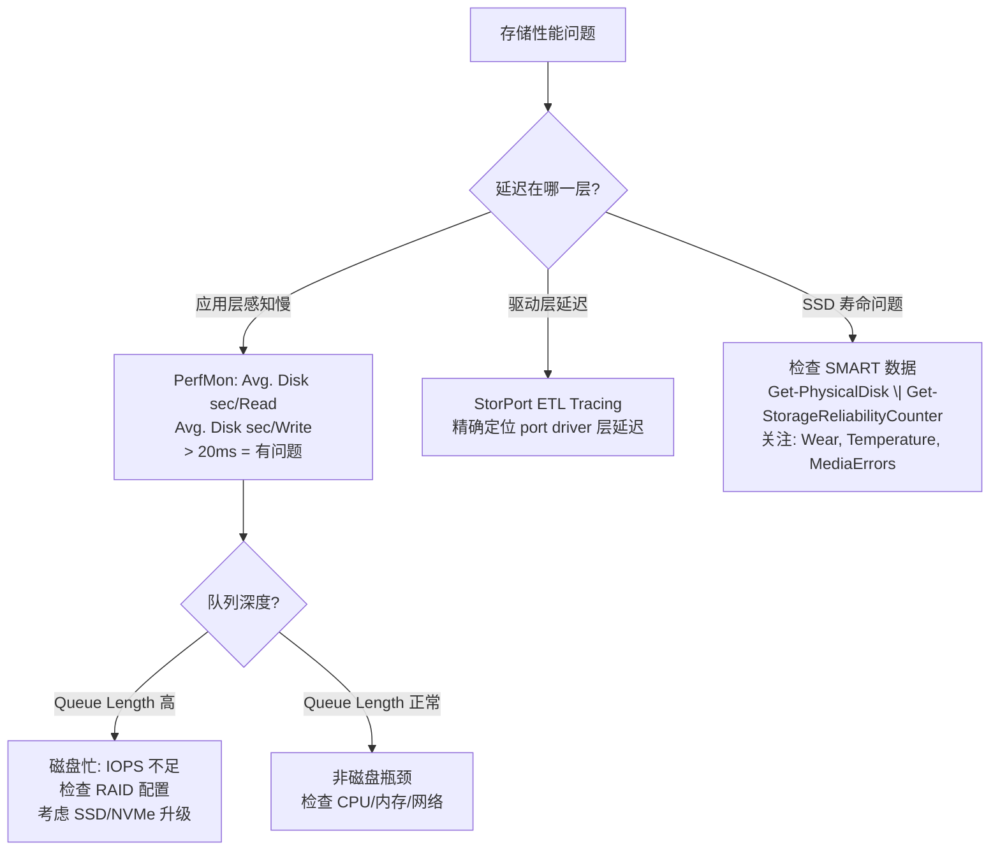
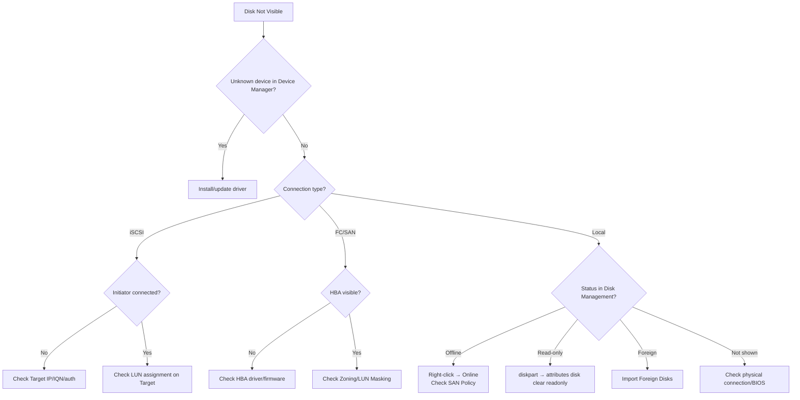

# Scenario Map: Windows 存储栈排查导航

**Topic:** Windows Storage Stack Troubleshooting  
**Category:** Storage  
**Last Updated:** 2026-03-17

---

## 总览思维导图 / Overview Mindmap

---

## 场景 A: 磁盘在 Disk Management 中不可见

### 排查要点

| 检查项 | 命令/工具 | 说明 |
|--------|----------|------|
| 磁盘列表 | `Get-Disk` / `diskpart → list disk` | 查看所有磁盘状态 |
| SAN 策略 | `diskpart → san` | Offline Shared / Online All |
| 驱动状态 | 设备管理器 | 黄色感叹号 = 驱动问题 |
| iSCSI 会话 | `iscsicli SessionList` | 查看活跃 iSCSI 会话 |
| MPIO 路径 | `mpclaim -s -d` | 查看多路径磁盘和路径状态 |

---

## 场景 B: 分区/卷问题

---

## 场景 C: 文件系统损坏

### 关键事件 ID

| Event ID | 来源 | 含义 |
|----------|------|------|
| **55** | Ntfs | NTFS 检测到文件系统损坏 |
| **98** | Ntfs | NTFS 健康检查完成（通常是自修复后） |
| **137** | Ntfs | NTFS 遇到 I/O 错误 |
| **5120** | CsvFs | CSV 文件系统错误 |
| **5121** | CsvFs | CSV 卷进入 redirected mode |
| **5142** | CsvFs | CSV 卷 I/O 暂停 |

---

## 场景 D: iSCSI 连通性

---

## 场景 E: MPIO 路径故障

---

## 场景 F: 存储性能问题

### 关键 PerfMon 计数器

| 计数器 | 正常值 | 告警阈值 | 说明 |
|--------|--------|---------|------|
| Avg. Disk sec/Read | < 10ms | > 20ms | 平均读延迟 |
| Avg. Disk sec/Write | < 10ms | > 20ms | 平均写延迟 |
| Current Disk Queue Length | < 2 | > 5 | 当前等待队列 |
| Disk Transfers/sec | - | - | IOPS |
| Disk Bytes/sec | - | - | 吞吐量 |

---

## 场景 G/H: BitLocker 与重删问题

### BitLocker

| 问题 | 解决方案 |
|------|---------|
| 恢复密钥丢失 | 检查 Microsoft 账户、Azure AD、AD、USB、打印件 |
| TPM 芯片更换 | 使用恢复密钥解锁 → 重新启用 BitLocker |
| 硬件变更后无法启动 | 进入 WinRE → 输入恢复密钥 |
| 集群 CSV 上的 BitLocker | 使用 SID-based protector (CNO 对象) |

### Data Deduplication

| 问题 | 排查 |
|------|------|
| 优化作业失败 | `Get-DedupStatus`、检查 Event Log Deduplication |
| Chunk Store 损坏 | `Start-DedupJob -Type Scrubbing` |
| 空间未回收 | 检查文件是否满足条件（>64KiB, 非加密, 非系统卷）|
| 高 CPU 使用 | 调整 Schedule: `Set-DedupSchedule` |

---

## 诊断工具总表 / Diagnostic Tools

| 工具 | 用途 | 栈层级 |
|------|------|--------|
| `diskpart` | 磁盘/分区管理 | Partition Manager |
| `chkdsk` | 文件系统修复 | File System |
| `fsutil` | 文件系统高级查询 | File System |
| StorPort ETL | I/O 延迟精确诊断 | Port Driver |
| `mpclaim -s -d` | MPIO 路径管理 | MPIO |
| `iscsicli` | iSCSI 管理 | iSCSI |
| `Get-PhysicalDisk` | 物理磁盘健康 | Storage Spaces |
| PerfMon | 性能计数器 | 全栈 |
| Event Viewer | 事件日志 | 全栈 |

---

---

# English Version

---

# Scenario Map: Windows Storage Stack Troubleshooting

**Topic:** Windows Storage Stack Troubleshooting  
**Last Updated:** 2026-03-17

---

## Scenario A: Disk Not Visible

## Scenario B: File System Corruption

| File System | Repair Method | Key Event IDs |
|-------------|---------------|--------------|
| **NTFS** | `chkdsk /f` (metadata), `/r` (+ bad sectors), `/b` (re-evaluate bad clusters) | 55 (corruption), 98 (healthy) |
| **ReFS** | Automatic via integrity streams + Storage Spaces mirror | - |
| **CSVFS** | Spot-fixing: 15s rounds → 2-3 min intervals → maintenance offline | 5120, 5121, 5142 |

## Scenario C: iSCSI Issues

| Issue | Resolution |
|-------|-----------|
| Target not discovered | Check Discovery Portal IP:3260, firewall, iSNS |
| Session drops | Check network stability, increase timeout, check NIC power management |
| Persistent not reconnecting | Verify persistent login config, iSCSI service startup = Automatic |

## Scenario D: MPIO Path Failures

| Scope | Impact | Action |
|-------|--------|--------|
| All paths failed | Disk offline | Check all HBAs, SAN switches, LUN assignment |
| Single path failed | Degraded, functional | Repair physical path, auto-recovery |
| Load imbalance | Performance impact | Check DSM policy (`Get-MPIOSetting`) |

## Scenario E: Storage Performance

**Decision tree**: Latency high? → PerfMon (`Avg Disk sec/Read > 20ms`?) → Queue Length high? → Disk bottleneck → Check RAID/upgrade to SSD. Queue normal? → Not disk issue.

**Key counters**: Avg Disk sec/Read, Avg Disk sec/Write (normal < 10ms, alert > 20ms), Current Disk Queue Length (alert > 5)

## Diagnostic Tools

| Tool | Purpose | Layer |
|------|---------|-------|
| `diskpart` | Disk/partition management | Partition |
| `chkdsk` | File system repair | File System |
| StorPort ETL | I/O latency at driver level | Port Driver |
| `mpclaim -s -d` | MPIO path management | MPIO |
| `iscsicli` | iSCSI management | iSCSI |
| `Get-PhysicalDisk` | Storage Spaces disk health | Storage Spaces |
| PerfMon | Performance counters | All layers |
