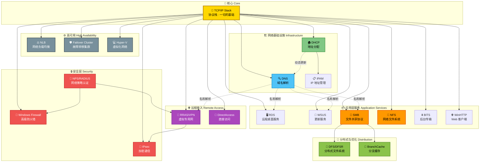
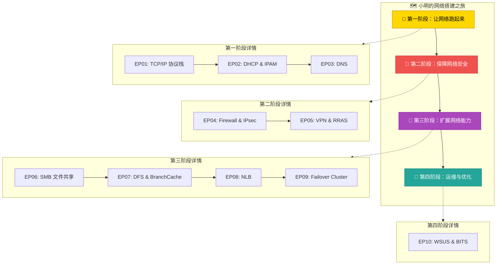

# 🗺️ EP00：一张图看懂 Windows 网络

> **系列导览篇** — 在深入任何一个技术之前，先站在高处看一看全貌。

---

## 🎬 开场白 / Opening

> 你好！欢迎来到《Windows 网络通关之路》系列课程。
>
> 你有没有过这种感觉？学了 DNS、DHCP、VPN、防火墙……每个都懂一点，但放在一起就像一堆散落的拼图？
>
> 今天这一集，我们不讲任何一个"点"，而是先看"面"。我会用**一张架构全景图**，把 Windows 网络里所有关键技术串在一起。
>
> 等你看完这张图，再去学每个技术的时候，你就知道它住在哪里、跟谁是邻居、为什么重要。
>
> 我们的旅程，从一个叫小明的故事开始。

---

## 📍 场景设定 / Scene

### 认识我们的主角：小明

小明，25 岁，计算机专业毕业两年。之前在一家小公司做 IT 运维，什么都干一点，但什么都不深。

上个月，他收到了一封 Offer：

> **星辰科技（StarTech Inc.）**
> 职位：Windows 网络工程师
> 工作内容：负责公司新办公楼的网络基础设施搭建与维护

星辰科技是一家快速成长的科技公司，刚刚搬到了全新的办公楼。这意味着——**网络要从零开始搭建**。

小明的第一天，老板把他带到空荡荡的机房，指着一排崭新的服务器和交换机说：

> "小明啊，这些设备都买好了。你的任务就是——**让整栋楼的网络跑起来**。"

小明看着这些设备，心里既兴奋又紧张。他知道这是一个巨大的挑战，但也是一个从零构建企业网络的绝佳学习机会。

> **他决定先画一张网络架构全景图，把要做的事情理清楚。**

这就是我们今天要做的事情。

---

## 🧠 核心概念 / Core Concepts

### 为什么要先看全景图？

想象你要去一个陌生城市旅游。你会怎么做？

- ❌ 直接走进一条小巷子，走到哪算哪
- ✅ 先打开地图，看看有哪些景点、怎么走最合理

学习 Windows 网络也一样。如果你直接扎进 DNS 或 DHCP 的细节，你会：

1. **不知道为什么学这个** — 缺乏动机
2. **不知道学完之后接下来学什么** — 缺乏路径
3. **不知道各技术之间的关系** — 缺乏连接

所以，我们先来一次**高空俯瞰**。

### Windows 网络技术的"六大板块"

我把 Windows 网络的所有关键技术，分成了 **六大板块**：

| 板块 | 包含技术 | 一句话解释 |
|------|----------|------------|
| 🏗️ **网络基础** | TCP/IP Stack, DNS, DHCP, IPAM | 让设备能上网、能找到彼此 |
| 🔒 **安全防护** | Windows Firewall, IPsec, NPS/RADIUS | 保护网络不被入侵 |
| 🌐 **远程接入** | RRAS/VPN, DirectAccess, RDS | 让远程员工也能安全访问公司资源 |
| 📁 **文件与存储** | SMB, DFS/DFSR, NFS, BranchCache | 文件共享和分发 |
| ⚙️ **高可用与负载** | NLB, Failover Cluster, Hyper-V | 让服务永不宕机 |
| 🔄 **运维管理** | BITS, WSUS, WinHTTP/WebClient | 系统更新和后台传输 |

这六大板块，就是小明在星辰科技要逐步搭建的所有东西。

### 各技术之间的关系

这些技术不是孤立的，它们之间有着紧密的依赖和协作关系：

- **TCP/IP 协议栈**是一切的基础 — 没有它，其他所有技术都无法工作
- **DNS** 依赖 TCP/IP 来传输查询，同时被几乎所有上层服务依赖（VPN 需要解析服务器名、SMB 需要解析文件服务器名……）
- **DHCP** 给设备分配 IP 地址，并告诉设备 DNS 服务器在哪里 — 它是 DNS 的"介绍人"
- **Windows Firewall** 和 **IPsec** 作为安全层，保护所有网络通信
- **NPS/RADIUS** 为 VPN 和无线网络提供身份验证
- **SMB** 是 Windows 文件共享的核心协议，DFS 和 BranchCache 都建立在它之上
- **Hyper-V** 的虚拟网络本身就是一个微型网络世界，TCP/IP、DNS、DHCP 在虚拟环境中照样运行

### 小明的挑战清单

按照搭建顺序，小明面对的挑战是这样的：

1. 🔌 **先让网通** — 配置 TCP/IP，让设备能互相通信
2. 🏠 **自动分地址** — 部署 DHCP，不用手动配 IP
3. 🔍 **能用名字找设备** — 部署 DNS，不用记 IP 地址
4. 🔒 **保护网络安全** — 配置防火墙和 IPsec
5. 🏠 **远程办公** — 搭建 VPN 让在家也能干活
6. 📁 **共享文件** — 配置 SMB 文件服务器
7. 🌿 **分支办公室** — 用 BranchCache 和 DFS 优化分支访问
8. ⚖️ **负载均衡** — 用 NLB 分散流量
9. 🛡️ **高可用** — 用 Failover Cluster 防止宕机
10. 🔄 **统一更新** — 用 WSUS 管理 Windows 更新

---

## 🏗️ 架构图解 / Architecture

### Windows 网络技术全景图

这是我们整个系列课程的"地图"。每学完一集，你可以回来看看，自己走到哪里了。



### 小明的学习路线图

```mermaid
graph LR
    EP01["EP01 💛<br/>TCP/IP 协议栈<br/>网络的心脏"]
    EP02["EP02 🏠<br/>DHCP & IPAM<br/>自动分地址"]
    EP03["EP03 🔍<br/>DNS<br/>名字到地址"]
    EP04["EP04 🧱<br/>Windows Firewall<br/>& IPsec 安全防线"]
    EP05["EP05 🔗<br/>VPN & RRAS<br/>远程接入"]
    EP06["EP06 📁<br/>SMB 文件共享<br/>数据流通"]
    EP07["EP07 🌿<br/>DFS & BranchCache<br/>分支优化"]
    EP08["EP08 ⚖️<br/>NLB 负载均衡<br/>分散压力"]
    EP09["EP09 🛡️<br/>Failover Cluster<br/>永不宕机"]
    EP10["EP10 🔄<br/>WSUS & BITS<br/>统一运维"]

    EP01 --> EP02 --> EP03 --> EP04 --> EP05
    EP05 --> EP06 --> EP07 --> EP08 --> EP09 --> EP10

    style EP01 fill:#FFD700,stroke:#B8860B,stroke-width:2px,color:#000
    style EP02 fill:#81C784,stroke:#388E3C,stroke-width:2px,color:#000
    style EP03 fill:#4FC3F7,stroke:#0288D1,stroke-width:2px,color:#000
    style EP04 fill:#EF5350,stroke:#C62828,stroke-width:2px,color:#fff
    style EP05 fill:#AB47BC,stroke:#7B1FA2,stroke-width:2px,color:#fff
    style EP06 fill:#FF9800,stroke:#E65100,stroke-width:2px,color:#000
    style EP07 fill:#8BC34A,stroke:#558B2F,stroke-width:2px,color:#000
    style EP08 fill:#78909C,stroke:#37474F,stroke-width:2px,color:#fff
    style EP09 fill:#78909C,stroke:#37474F,stroke-width:2px,color:#fff
    style EP10 fill:#26A69A,stroke:#00796B,stroke-width:2px,color:#fff
```



---

## 🔧 实操演示 / Demo

> 虽然这是导览集，但我们也来动手看看——先确认你的 Windows 网络环境是什么样的。

### 查看你的网络"身份证"

```powershell
# 查看所有网络适配器信息
Get-NetAdapter | Format-Table Name, Status, LinkSpeed, MacAddress

# 预期输出：
# Name           Status  LinkSpeed  MacAddress
# ----           ------  ---------  ----------
# Ethernet       Up      1 Gbps     00-15-5D-01-02-03
# Wi-Fi          Up      300 Mbps   00-15-5D-04-05-06
```

### 查看当前 IP 配置

```powershell
# 查看 IP 配置详情
Get-NetIPConfiguration | Format-List

# 预期输出：
# InterfaceAlias       : Ethernet
# InterfaceIndex       : 3
# InterfaceDescription : Microsoft Hyper-V Network Adapter
# IPv4Address          : 192.168.1.100
# IPv4DefaultGateway   : 192.168.1.1
# DNSServer            : 192.168.1.10
```

### 快速测试网络连通性

```powershell
# 测试能否到达网关
Test-NetConnection -ComputerName 192.168.1.1

# 测试能否解析域名
Resolve-DnsName www.microsoft.com

# 查看当前打开的网络连接
Get-NetTCPConnection -State Established | 
    Select-Object LocalAddress, LocalPort, RemoteAddress, RemotePort |
    Format-Table
```

### 一键查看"网络健康报告"

```powershell
# 这个小脚本可以快速检查网络基本状态
Write-Host "=== 网络适配器 ===" -ForegroundColor Cyan
Get-NetAdapter | Where-Object Status -eq 'Up' | Format-Table Name, LinkSpeed -AutoSize

Write-Host "=== IP 地址 ===" -ForegroundColor Cyan
Get-NetIPAddress -AddressFamily IPv4 | 
    Where-Object { $_.IPAddress -ne '127.0.0.1' } | 
    Format-Table InterfaceAlias, IPAddress, PrefixLength -AutoSize

Write-Host "=== DNS 服务器 ===" -ForegroundColor Cyan
Get-DnsClientServerAddress -AddressFamily IPv4 | 
    Where-Object ServerAddresses | 
    Format-Table InterfaceAlias, ServerAddresses -AutoSize

Write-Host "=== 默认网关 ===" -ForegroundColor Cyan
Get-NetRoute -DestinationPrefix '0.0.0.0/0' | 
    Format-Table InterfaceAlias, NextHop -AutoSize
```

---

## 📝 讲稿要点 / Script Notes

### 开场段 (0:00 - 0:30)
- 直接抛出问题："学了很多网络技术，但总觉得串不起来？"
- 说明本集目标：用一张图把所有技术串联
- 提到这是系列课程的"地图集"

### 故事引入 (0:30 - 1:30)
- 介绍小明：年轻的网络工程师，加入了新公司
- 描述场景：新办公楼，网络从零搭建
- 制造代入感："如果是你，你会从哪里开始？"

### 全景图讲解 (1:30 - 5:00)
- 先展示完整架构图，让观众"wow"一下
- 然后分六大板块逐个介绍
- 每个板块用一句话概括
- 重点强调：**TCP/IP 是一切的基础**，这是为什么我们从它开始
- 讲解技术之间的依赖关系（用箭头方向说明）

### 课程路线介绍 (5:00 - 8:00)
- 展示 10 集的学习路线
- 每一集用一句话描述场景和要解决的问题
- 说明为什么是这个顺序：先基础后上层，先必须后可选
- 让观众知道学完能达到什么水平

### 快速演示 (8:00 - 10:00)
- 打开 PowerShell
- 运行几个基础命令，让观众对网络命令有个"初印象"
- 不深入解释，只是展示"这些命令我们后面会详细讲"

### 总结与预告 (10:00 - 11:00)
- 回顾全景图
- 强调"先见森林，再看树木"的学习理念
- 预告下一集：TCP/IP 协议栈

---

## 📋 十集内容一览

| 集数 | 图标 | 标题 | 小明的挑战 | 涉及技术 |
|------|------|------|-----------|----------|
| EP00 | 🗺️ | 一张图看懂 Windows 网络 | 整体规划网络架构 | 全景图 |
| EP01 | 💛 | 网络的心脏 — TCP/IP 协议栈 | 插上网线却不通 | TCP/IP, OSI Model |
| EP02 | 🏠 | 自动分配门牌号 — DHCP 与 IPAM | 100 人手动配 IP 太累 | DHCP, IPAM |
| EP03 | 🔍 | 名字的力量 — DNS 解析 | 员工记不住 IP 地址 | DNS, 区域, 转发 |
| EP04 | 🧱 | 网络的城墙 — 防火墙与 IPsec | 办公网遭到外部攻击 | Windows Firewall, IPsec |
| EP05 | 🔗 | 在家也能办公 — VPN 远程接入 | 疫情来了要远程办公 | RRAS, VPN, NPS |
| EP06 | 📁 | 数据的流通 — SMB 文件共享 | 部门间需要共享文件 | SMB, 共享权限 |
| EP07 | 🌿 | 分支办公室 — DFS 与 BranchCache | 开了分公司，访问慢 | DFS, DFSR, BranchCache |
| EP08 | ⚖️ | 分散压力 — NLB 负载均衡 | 公司网站扛不住流量 | NLB |
| EP09 | 🛡️ | 永不宕机 — 故障转移集群 | 服务器突然挂了 | Failover Cluster, Hyper-V |
| EP10 | 🔄 | 统一运维 — WSUS 与 BITS | 100 台电脑要统一更新 | WSUS, BITS |

---

## 🗺️ 旅程地图：哪一集对应架构图的哪个部分？



---

## ✅ 本集总结 / Summary

### 今天你学到了什么？

1. **🧩 全景视角** — Windows 网络不是一堆散乱的技术，而是一个有层次、有依赖关系的完整体系
2. **💛 核心地位** — TCP/IP 协议栈是一切网络通信的基础，没有它其他技术都无法工作
3. **🔗 技术关联** — DNS 和 DHCP 是网络基础设施的两大支柱；安全（防火墙、IPsec）贯穿所有层次；文件共享（SMB）和远程接入（VPN）是最常用的企业功能
4. **📐 学习路径** — 从基础到高级，从必须到可选：TCP/IP → DHCP → DNS → 安全 → VPN → 文件共享 → 分布式 → 高可用 → 运维
5. **🎯 实际意义** — 每个技术都对应企业中的一个真实需求，不是为了学而学

### 带走的思维框架

> **"先见森林，再看树木"** — 在深入任何技术细节之前，先理解它在整体中的位置和作用。这会让你的学习效率提高 10 倍。

---

## 👉 下集预告 / Next Episode

> **EP01：网络的心脏 — TCP/IP 协议栈** 💛
>
> 小明第一天上班，老板说"先让办公室能上网"。
>
> 他插上网线，打开电脑……什么都不通。
>
> 这时候他意识到，要让网络工作，首先要理解数据是怎么从你的应用程序，一步步传到网线上去的。
>
> 下一集，我们从 TCP/IP 协议栈开始——理解网络通信的"心脏"。
>
> **我们下集见！** 👋

---

## 📚 系列导航

| 集数 | 标题 | 状态 |
|------|------|------|
| **EP00** | **🗺️ 一张图看懂 Windows 网络** | **📍 你在这里** |
| EP01 | 💛 网络的心脏 — TCP/IP 协议栈 | 即将发布 |
| EP02 | 🏠 自动分配门牌号 — DHCP 与 IPAM | 即将发布 |
| EP03 | 🔍 名字的力量 — DNS 解析 | 即将发布 |
| EP04 | 🧱 网络的城墙 — 防火墙与 IPsec | 即将发布 |
| EP05 | 🔗 在家也能办公 — VPN 远程接入 | 即将发布 |
| EP06 | 📁 数据的流通 — SMB 文件共享 | 即将发布 |
| EP07 | 🌿 分支办公室 — DFS 与 BranchCache | 即将发布 |
| EP08 | ⚖️ 分散压力 — NLB 负载均衡 | 即将发布 |
| EP09 | 🛡️ 永不宕机 — 故障转移集群 | 即将发布 |
| EP10 | 🔄 统一运维 — WSUS 与 BITS | 即将发布 |
