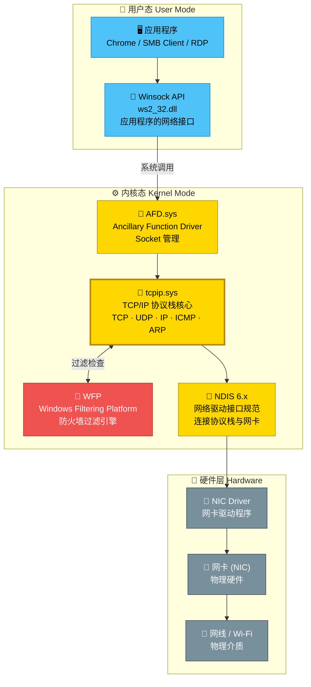
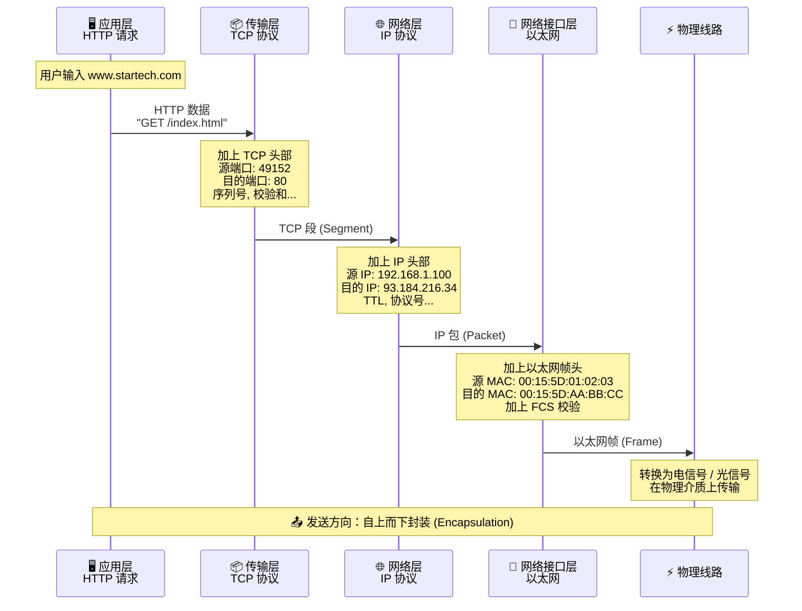
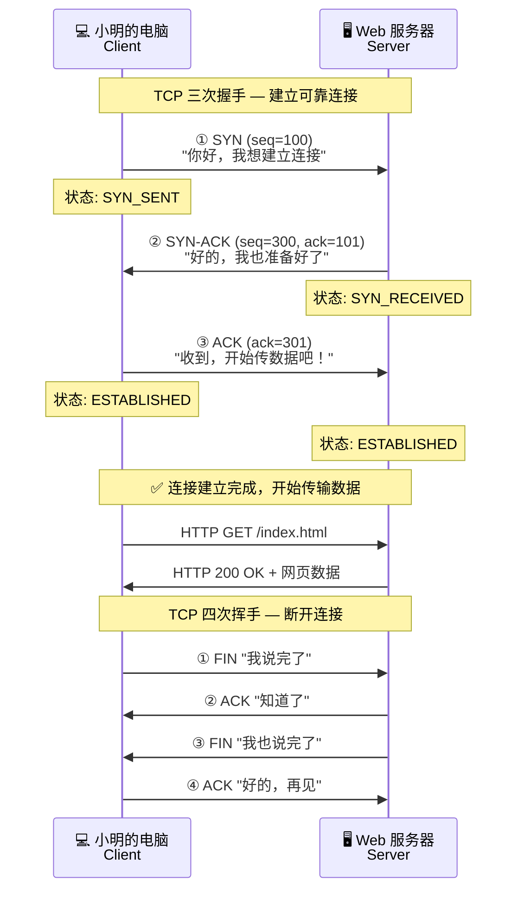

# 💛 EP01：网络的心脏 — TCP/IP 协议栈

> **一切网络通信的起点** — 理解数据如何从你的应用程序，一步步传到网线上。

---

## 🎬 开场白 / Opening

> 你有没有想过，当你在浏览器里输入一个网址按下回车的那一瞬间，到底发生了什么？
>
> 数据是怎么从你的应用程序，穿过一层又一层的"包装"，最终变成电信号在网线上飞奔的？
>
> 今天，我们就来打开网络的"心脏"——TCP/IP 协议栈，看看这个精密的"快递分拣系统"是怎么工作的。
>
> 还记得小明吗？他的第一个任务遇到了麻烦……

---

## 📍 场景设定 / Scene

### 小明的第一天

小明兴冲冲地来到星辰科技报到。他的工位上摆着一台崭新的 ThinkPad，旁边还有一根网线。

他插上网线，打开电脑，点开浏览器输入 `www.startech.com`……

> **"无法访问此网站"** ❌

小明心想："没事，可能是 DNS 问题。"他试着直接 ping 网关：

```
C:\> ping 192.168.1.1
请求超时。
请求超时。
```

> 连网关都 ping 不通？！

小明深吸一口气，他知道——**要解决问题，首先要理解网络通信的基本原理**。

数据从应用程序到网线，中间经历了哪些步骤？每一步可能出什么问题？

让我们跟着小明一起，从最底层开始理解。

---

## 🧠 核心概念 / Core Concepts

### 一个快递的旅程 — TCP/IP 协议栈类比

> 💡 **核心类比：TCP/IP 协议栈 = 快递公司的分拣系统**

想象你要从北京寄一封信给上海的朋友。你会经历这些步骤：

| 步骤 | 快递系统 | TCP/IP 对应 | 做了什么 |
|------|---------|------------|---------|
| 1 | ✉️ 你写好信，装进信封 | **应用层 (Application)** | 你的浏览器、QQ 等应用产生数据 |
| 2 | 📦 快递员接收，贴上运单号 | **传输层 (Transport)** | 加上端口号，确保数据可靠送达 |
| 3 | 🏢 分拣中心根据地址分拨 | **网络层 (Internet)** | 加上 IP 地址，决定走哪条路 |
| 4 | 🚛 装上卡车，实际运输 | **网络接口层 (Network Interface)** | 加上 MAC 地址，在物理网络上传输 |

**发送时，数据从上往下走**（一层层"打包"）。
**接收时，数据从下往上走**（一层层"拆包"）。

### 从 OSI 7 层到 TCP/IP 4 层

你可能听过 OSI 7 层模型。别怕，我们来简化它：

```
OSI 7 层模型                    TCP/IP 4 层模型
┌──────────────────┐
│  7. 应用层        │
│  (Application)    │  ───────►  应用层 (Application)
│  6. 表示层        │            HTTP, FTP, SMB, DNS, SMTP...
│  (Presentation)   │
│  5. 会话层        │
│  (Session)        │
├──────────────────┤
│  4. 传输层        │  ───────►  传输层 (Transport)
│  (Transport)      │            TCP, UDP
├──────────────────┤
│  3. 网络层        │  ───────►  网络层 (Internet)
│  (Network)        │            IP, ICMP, ARP
├──────────────────┤
│  2. 数据链路层    │  ───────►  网络接口层
│  (Data Link)      │            (Network Interface)
│  1. 物理层        │            Ethernet, Wi-Fi
│  (Physical)       │
└──────────────────┘
```

> 📌 **面试小知识**：OSI 是"理论模型"，TCP/IP 是"实际实现"。日常工作中我们主要用 TCP/IP 4 层来思考问题。

### 每一层做了什么？ — 深入理解

#### 1️⃣ 应用层 (Application Layer)

这是**离用户最近的一层**。你用的每个网络软件都工作在这一层。

| 协议 | 用途 | 端口 |
|------|------|------|
| HTTP/HTTPS | 网页浏览 | 80/443 |
| DNS | 域名解析 | 53 |
| DHCP | IP 地址分配 | 67/68 |
| SMB | Windows 文件共享 | 445 |
| RDP | 远程桌面 | 3389 |
| SMTP | 发送邮件 | 25/587 |
| FTP | 文件传输 | 21 |

**快递类比**：应用层就像**写信的人**——你决定写什么内容、寄给谁。至于怎么送，你不用管。

#### 2️⃣ 传输层 (Transport Layer)

传输层有两个主要协议：

**TCP（传输控制协议）**— 可靠传输
- 建立连接（三次握手：SYN → SYN-ACK → ACK）
- 保证数据按顺序到达
- 丢了会重发
- 适用于：网页、文件传输、邮件

**UDP（用户数据报协议）**— 快速传输
- 不建立连接，直接发
- 不保证顺序，不重发
- 速度快，开销小
- 适用于：视频通话、DNS 查询、游戏

**快递类比**：
- TCP 像**挂号信** — 有回执，确保对方收到了
- UDP 像**明信片** — 直接扔进邮筒，快但不保证到

> 📌 **一个重要的号码：端口号 (Port)**
>
> 传输层用端口号来区分同一台电脑上的不同应用。
> 就像一栋大楼有一个地址（IP），但里面有很多房间（端口）。
>
> - 0-1023：知名端口（系统保留）
> - 1024-49151：注册端口
> - 49152-65535：动态端口（临时使用）

#### 3️⃣ 网络层 (Internet Layer)

网络层的核心是 **IP 协议**，负责两件事：
1. **编址** — 给每个设备分配一个唯一的 IP 地址
2. **路由** — 决定数据走哪条路到达目的地

**关键协议**：
- **IP** — 负责寻址和路由
- **ICMP** — 网络诊断（ping 和 tracert 就是用它）
- **ARP** — 把 IP 地址"翻译"成 MAC 地址

**快递类比**：网络层就像**分拣中心** — 看收件地址，决定这个包裹应该发往哪个方向。

> 📌 **IPv4 vs IPv6**
>
> - IPv4：32 位地址，如 `192.168.1.100`，约 43 亿个地址（已经不够用了）
> - IPv6：128 位地址，如 `fe80::1`，几乎无限个地址
> - 现在大多数企业网络还是以 IPv4 为主，但 IPv6 越来越重要

#### 4️⃣ 网络接口层 (Network Interface Layer)

这是**最底层**，负责在物理介质上传输比特流。

- **Ethernet（以太网）**— 有线网络，用 MAC 地址通信
- **Wi-Fi** — 无线网络
- **MAC 地址** — 48 位硬件地址，如 `00:15:5D:01:02:03`，全球唯一

**快递类比**：这一层就像**运输车辆** — 不管你寄的是什么，最终都要装上卡车（或飞机、轮船）才能到达。

### 数据封装的全过程

当你在浏览器输入网址时，数据会经历这样的"打包"过程：

```
用户输入网址
    │
    ▼
┌─────────────────────────────────────────────┐
│  应用层：HTTP 请求                            │
│  "GET /index.html HTTP/1.1"                  │
│  Host: www.startech.com                      │
└──────────────────┬──────────────────────────┘
                   │ 加上 TCP 头部（源端口 + 目的端口）
                   ▼
┌─────────────────────────────────────────────┐
│  TCP 头部 │ HTTP 数据                        │
│  Src:49152 │ Dst:80 │ Seq:1 │ ...           │
│  ← ─ ─ ─ ─ ─ ─ TCP 段 (Segment) ─ ─ ─ ─ → │
└──────────────────┬──────────────────────────┘
                   │ 加上 IP 头部（源 IP + 目的 IP）
                   ▼
┌─────────────────────────────────────────────┐
│  IP 头部 │ TCP 头部 │ HTTP 数据              │
│  Src:192.168.1.100 │ Dst:93.184.216.34      │
│  ← ─ ─ ─ ─ ─ ─ IP 包 (Packet) ─ ─ ─ ─ ─ → │
└──────────────────┬──────────────────────────┘
                   │ 加上以太网帧头 + 帧尾
                   ▼
┌─────────────────────────────────────────────┐
│  帧头 │ IP 头部 │ TCP 头部 │ HTTP 数据 │ FCS │
│  Dst MAC │ Src MAC │ Type │ ...              │
│  ← ─ ─ ─ ─ 以太网帧 (Frame) ─ ─ ─ ─ ─ ─ → │
└──────────────────┬──────────────────────────┘
                   │
                   ▼
            ⚡ 电信号在网线上传输 ⚡
```

这个过程叫做 **数据封装 (Encapsulation)**：
- 应用层数据 → 加 TCP/UDP 头 → **段 (Segment)**
- 段 → 加 IP 头 → **包 (Packet)**
- 包 → 加帧头帧尾 → **帧 (Frame)**
- 帧 → 转成电信号 → **比特 (Bits)**

接收端则反过来，一层层拆包（**解封装 Decapsulation**）。

### Windows 中的 TCP/IP 实现

在 Windows 里，TCP/IP 协议栈是由内核驱动实现的：

| 组件 | 位置 | 功能 |
|------|------|------|
| **Winsock (ws2_32.dll)** | 用户态 | 应用程序的网络 API 接口 |
| **AFD.sys** | 内核态 | Ancillary Function Driver，管理 socket |
| **tcpip.sys** | 内核态 | TCP/IP 协议栈的核心实现 |
| **NDIS** | 内核态 | 网络驱动接口规范，连接协议栈和网卡驱动 |
| **网卡驱动 (NIC Driver)** | 内核态 | 特定网卡的硬件驱动 |

数据从应用到网线的完整路径：

```
你的应用程序 (Chrome, SMB...)
       │
       ▼
  Winsock API (用户态)
       │
       ▼ ─── 用户态/内核态 切换 ───
       │
  AFD.sys (管理 Socket)
       │
       ▼
  tcpip.sys (TCP/IP 协议处理)
       │
       ▼
  NDIS (网络驱动接口)
       │
       ▼
  NIC Driver (网卡驱动)
       │
       ▼
  ⚡ 网卡硬件 → 网线 ⚡
```

---

## 🏗️ 架构图解 / Architecture

### TCP/IP 协议栈在 Windows 中的位置



### 数据封装过程（序列图）



### TCP 三次握手过程



---

## 🔧 实操演示 / Demo

### 场景：小明排查"插上网线但不通"的问题

#### 第 1 步：检查网卡状态 — "线插好了吗？"

```powershell
# 查看所有网络适配器
Get-NetAdapter | Format-Table Name, Status, LinkSpeed, MediaConnectionState

# 预期输出：
# Name       Status    LinkSpeed  MediaConnectionState
# ----       ------    ---------  --------------------
# Ethernet   Up        1 Gbps     Connected
# Wi-Fi      Disabled  0 bps      Disconnected
```

> 💡 如果 Status 是 `Disabled` 或 MediaConnectionState 是 `Disconnected`，说明网卡有问题或网线没插好。

#### 第 2 步：检查 IP 配置 — "我有门牌号吗？"

```powershell
# 查看 IP 配置
Get-NetIPConfiguration

# 预期输出：
# InterfaceAlias       : Ethernet
# InterfaceIndex       : 5
# InterfaceDescription : Intel(R) Ethernet Connection
# NetProfile.Name      : StarTech-Network
# IPv4Address          : 192.168.1.100
# IPv4DefaultGateway   : 192.168.1.1
# DNSServer            : 192.168.1.10

# 更详细的 IP 地址信息
Get-NetIPAddress -InterfaceAlias "Ethernet" -AddressFamily IPv4

# 预期输出：
# IPAddress         : 192.168.1.100
# InterfaceIndex    : 5
# InterfaceAlias    : Ethernet
# AddressFamily     : IPv4
# PrefixLength      : 24
# PrefixOrigin      : Dhcp
# SuffixOrigin      : Dhcp
# AddressState      : Preferred
```

> 💡 如果 IP 地址是 `169.254.x.x`（APIPA 地址），说明没有从 DHCP 获取到地址——这就是小明遇到的问题！

#### 第 3 步：手动配置 IP 测试 — "先给自己一个临时地址"

```powershell
# 手动配置一个 IP 地址
New-NetIPAddress -InterfaceAlias "Ethernet" `
    -IPAddress 192.168.1.100 `
    -PrefixLength 24 `
    -DefaultGateway 192.168.1.1

# 配置 DNS 服务器
Set-DnsClientServerAddress -InterfaceAlias "Ethernet" `
    -ServerAddresses @("192.168.1.10", "8.8.8.8")
```

#### 第 4 步：测试连通性 — "能到达对面吗？"

```powershell
# 1. Ping 网关 — 测试本地网络
ping 192.168.1.1

# 预期输出（正常）：
# 来自 192.168.1.1 的回复: 字节=32 时间<1ms TTL=64
# 来自 192.168.1.1 的回复: 字节=32 时间<1ms TTL=64

# 2. Ping 外网 — 测试互联网连通性
ping 8.8.8.8

# 3. Ping 域名 — 测试 DNS 解析
ping www.microsoft.com
```

#### 第 5 步：跟踪路由 — "数据走了哪条路？"

```powershell
# 跟踪到目的地的路由
tracert 8.8.8.8

# 预期输出：
#  1    <1 ms    <1 ms    <1 ms   192.168.1.1       [网关]
#  2     2 ms     1 ms     1 ms   10.0.0.1          [ISP 路由器]
#  3     5 ms     5 ms     5 ms   72.14.209.81      [中间节点]
#  ...
#  8    10 ms    10 ms    10 ms   8.8.8.8           [目的地]

# PowerShell 版本（更详细）
Test-NetConnection -ComputerName 8.8.8.8 -TraceRoute

# 预期输出：
# ComputerName           : 8.8.8.8
# RemoteAddress          : 8.8.8.8
# PingSucceeded          : True
# PingReplyDetails (RTT) : 10 ms
# TraceRoute             : 192.168.1.1
#                          10.0.0.1
#                          ...
#                          8.8.8.8
```

#### 第 6 步：查看网络连接 — "谁在和我通信？"

```powershell
# 查看所有已建立的 TCP 连接
Get-NetTCPConnection -State Established | 
    Select-Object LocalAddress, LocalPort, RemoteAddress, RemotePort, OwningProcess |
    Format-Table

# 预期输出：
# LocalAddress  LocalPort  RemoteAddress   RemotePort  OwningProcess
# 192.168.1.100 49152      93.184.216.34   443         12345
# 192.168.1.100 49153      13.107.42.14    443         6789
# ...

# 看看是哪个进程在占用网络
Get-NetTCPConnection -State Established | 
    ForEach-Object {
        $proc = Get-Process -Id $_.OwningProcess -ErrorAction SilentlyContinue
        [PSCustomObject]@{
            LocalPort   = $_.LocalPort
            RemoteAddr  = $_.RemoteAddress
            RemotePort  = $_.RemotePort
            ProcessName = $proc.ProcessName
        }
    } | Format-Table
```

#### 第 7 步：经典的 netstat — "传统命令也要会"

```powershell
# 查看所有连接和监听端口
netstat -an

# 只看已建立的连接
netstat -an | findstr ESTABLISHED

# 查看哪个程序在用哪个端口
netstat -anb

# 查看路由表
route print

# PowerShell 版本
Get-NetRoute | Format-Table DestinationPrefix, NextHop, InterfaceAlias, RouteMetric
```

---

## 📝 讲稿要点 / Script Notes

### 开场段 (0:00 - 0:30)
- 提出引发思考的问题："按下回车的那一瞬间发生了什么？"
- 预告本集内容：打开 TCP/IP 协议栈这颗"心脏"
- 回顾小明故事线

### 场景引入 (0:30 - 1:30)
- 小明插网线、开电脑、打不开网页
- 连 ping 网关都超时
- 引出核心问题："数据从应用到网线经历了什么？"
- 制造悬念："小明最后发现问题其实很简单，但不理解协议栈就找不到"

### 快递类比讲解 (1:30 - 3:00)
- 用快递系统类比 TCP/IP 四层
- 每一层对应快递的哪个环节
- 关键点：**每一层只关心自己的事**，不需要知道其他层的细节
- 这叫做 **分层解耦 (Layered Architecture)**

### OSI vs TCP/IP (3:00 - 4:00)
- 展示对比图
- 说明 OSI 是理论，TCP/IP 是实践
- 不需要死记 7 层，理解 4 层就够用

### 每层深入讲解 (4:00 - 7:00)
- **应用层**：列举常用协议和端口号，强调"这层离用户最近"
- **传输层**：TCP vs UDP 的区别，用挂号信和明信片类比；讲端口号的概念
- **网络层**：IP 地址的作用，ARP 的作用（IP→MAC 的翻译）
- **网络接口层**：MAC 地址，以太网帧

### 数据封装过程 (7:00 - 9:00)
- 展示数据封装的完整过程
- 用动画（或手动演示）展示数据一层层"穿衣服"
- 关键术语：Segment → Packet → Frame → Bits
- 反过来，接收端是"脱衣服"的过程

### Windows 实现细节 (9:00 - 10:00)
- 快速介绍 Winsock → AFD.sys → tcpip.sys → NDIS → NIC Driver
- 不需要深入，知道有这些组件即可
- 强调 tcpip.sys 是核心

### 实操演示 (10:00 - 13:00)
- 打开 PowerShell，按排查步骤演示
- 每个命令执行后，简短解释输出
- 重点演示：
  - `Get-NetAdapter` — 看网卡状态
  - `Get-NetIPConfiguration` — 看 IP 配置
  - `ping` — 测试连通性
  - `tracert` — 跟踪路由
  - `Get-NetTCPConnection` — 看当前连接

### 总结与预告 (13:00 - 14:00)
- 回顾四层模型和数据封装
- 小明的问题答案揭晓
- 预告下一集

---

## 🧪 小明的问题揭晓

最终小明发现：

> **网卡的 IP 配置是空的！**

因为新办公楼还没有部署 DHCP 服务器，电脑无法自动获取 IP 地址。网卡拿到的是 `169.254.x.x` 的 APIPA 地址（自动私有 IP 地址），只能和同一网段的其他 APIPA 设备通信。

小明手动配了一个 IP 之后，终于能上网了。

> 但是……100 个员工都要手动配 IP？那不得累死？

这就是下一集要解决的问题——**DHCP 自动分配 IP 地址**。

---

## ✅ 本集总结 / Summary

### 今天你学到了什么？

1. **🏗️ TCP/IP 四层模型** — 应用层、传输层、网络层、网络接口层，每层各司其职
2. **📦 数据封装过程** — 应用数据 → 段(Segment) → 包(Packet) → 帧(Frame) → 比特(Bits)
3. **⚖️ TCP vs UDP** — TCP 可靠但慢（挂号信），UDP 快但不保证（明信片）
4. **🔢 关键概念** — IP 地址（网络层）、端口号（传输层）、MAC 地址（链路层）
5. **⚙️ Windows 实现** — Winsock → AFD.sys → tcpip.sys → NDIS → NIC Driver
6. **🛠️ 排查思路** — 从底层往上查：网卡状态 → IP 配置 → 连通性 → DNS 解析

### 关键命令速查

| 命令 | 用途 |
|------|------|
| `Get-NetAdapter` | 查看网卡状态 |
| `Get-NetIPConfiguration` | 查看 IP 配置 |
| `Get-NetIPAddress` | 查看详细 IP 信息 |
| `Test-NetConnection` | 测试连通性（高级 ping） |
| `Get-NetTCPConnection` | 查看 TCP 连接 |
| `Get-NetRoute` | 查看路由表 |
| `ping` | 基础连通性测试 |
| `tracert` | 跟踪路由路径 |
| `netstat -an` | 查看所有连接和端口 |

---

## 👉 下集预告 / Next Episode

> **EP02：自动分配门牌号 — DHCP 与 IPAM** 🏠
>
> 小明手动给自己配了 IP，问题解决了。但是老板说：
>
> "明天有 100 个新员工入职，你一个一个给他们配 IP 吗？"
>
> 小明意识到他需要一个"自动门牌号分配系统"——**DHCP**。
>
> 但 DHCP 到底是怎么知道该分哪个 IP 的？如果两台电脑分到了同一个 IP 怎么办？
>
> 下一集，我们来揭秘 DHCP 的"DORA 四步舞"。
>
> **我们下集见！** 👋

---

## 📚 系列导航

| 集数 | 标题 | 状态 |
|------|------|------|
| EP00 | 🗺️ 一张图看懂 Windows 网络 | ✅ 已发布 |
| **EP01** | **💛 网络的心脏 — TCP/IP 协议栈** | **📍 你在这里** |
| EP02 | 🏠 自动分配门牌号 — DHCP 与 IPAM | 即将发布 |
| EP03 | 🔍 名字的力量 — DNS 解析 | 即将发布 |
| EP04 | 🧱 网络的城墙 — 防火墙与 IPsec | 即将发布 |
| EP05 | 🔗 在家也能办公 — VPN 远程接入 | 即将发布 |
| EP06 | 📁 数据的流通 — SMB 文件共享 | 即将发布 |
| EP07 | 🌿 分支办公室 — DFS 与 BranchCache | 即将发布 |
| EP08 | ⚖️ 分散压力 — NLB 负载均衡 | 即将发布 |
| EP09 | 🛡️ 永不宕机 — 故障转移集群 | 即将发布 |
| EP10 | 🔄 统一运维 — WSUS 与 BITS | 即将发布 |
