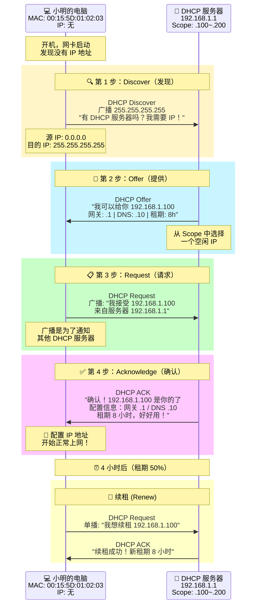
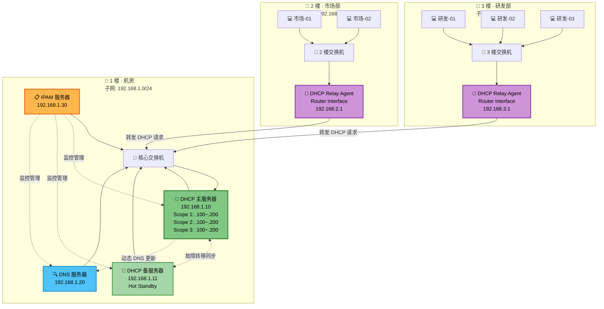
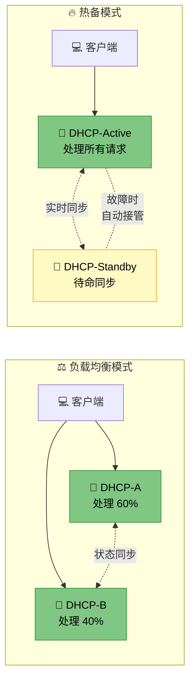

# 🏠 EP02：自动分配门牌号 — DHCP 与 IPAM

> **当员工越来越多，手动配 IP 太累了** — 让 DHCP 帮你自动管理 IP 地址分配。

---

## 🎬 开场白 / Opening

> 上一集，小明手动给自己配了一个 IP 地址，终于能上网了。
>
> 但今天老板扔过来一个炸弹："明天有 100 个新员工入职。"
>
> 小明心里一凉——难道要一个一个手动配 IP？万一两个人配了同一个地址怎么办？
>
> 今天我们就来学一个能**自动分配门牌号**的技术：DHCP。
>
> 它就像一个酒店前台——你来了，给你分房间号；你走了，房间号回收给下一位客人。

---

## 📍 场景设定 / Scene

### 小明的苦恼

星辰科技的业务发展得很快。当初搬进新办公楼时只有 10 个人，小明手动给每台电脑配 IP，不算太麻烦。

但现在，公司迅速扩张到了 100 人。

小明维护着一个 Excel 表格来记录 IP 分配：

```
| 员工   | IP 地址        | MAC 地址           | 备注     |
|--------|---------------|--------------------|----------|
| 张三   | 192.168.1.10  | 00:15:5D:01:02:03 | 市场部   |
| 李四   | 192.168.1.11  | 00:15:5D:04:05:06 | 研发部   |
| 王五   | 192.168.1.12  | 00:15:5D:07:08:09 | 财务部   |
| ...    | ...           | ...                | ...      |
```

然后问题开始频频出现：

- 🔴 **IP 冲突**：新来的实习生自己配了 `192.168.1.11`，导致李四断网了
- 🔴 **地址耗尽**：会议室的访客也需要上网，临时地址不够分了
- 🔴 **效率低下**：每来一个新员工，小明都要跑去他工位手动配置
- 🔴 **配置错误**：有人网关配错了，DNS 配错了，各种奇怪的网络问题

小明深深叹了一口气：

> "一定有更好的办法。"

于是他决定——**部署 DHCP 服务器**。

---

## 🧠 核心概念 / Core Concepts

### 酒店前台类比 — 理解 DHCP

> 💡 **核心类比：DHCP 服务器 = 酒店前台**

想象你入住一家酒店：

| 酒店流程 | DHCP 对应 | 说明 |
|---------|----------|------|
| 你走进酒店大堂 | 电脑开机连网 | 设备接入网络 |
| 喊一声："有人吗？我要住店！" | **DHCP Discover** | 广播寻找 DHCP 服务器 |
| 前台说："有的！这是 305 号房，可以给你" | **DHCP Offer** | 服务器提供一个可用 IP |
| 你说："好的，我就要 305 号房" | **DHCP Request** | 客户端确认接受这个 IP |
| 前台给你房卡："住好，3 天后退房" | **DHCP Acknowledge** | 服务器确认，并告知租期 |
| 3 天快到了，你想续住 | **DHCP Renew** | 客户端在租期过半时续租 |
| 你退房，房间号回收 | **DHCP Release** | 客户端释放 IP 地址 |

这就是 DHCP 的核心流程——**DORA 四步舞**。

### DORA 流程详解

DORA 是 DHCP 的灵魂，全称是：

- **D** = Discover（发现）
- **O** = Offer（提供）
- **R** = Request（请求）
- **A** = Acknowledge（确认）

让我们一步步来看：

#### 第 1 步：Discover — "有人吗？"

```
客户端 → 广播 (255.255.255.255)
源 IP:    0.0.0.0        (我还没有 IP)
目的 IP:  255.255.255.255 (对整个网络广播)
源 MAC:   00:15:5D:01:02:03  (我的网卡 MAC)
目的 MAC: FF:FF:FF:FF:FF:FF  (广播 MAC)
消息:     "我需要一个 IP 地址！有 DHCP 服务器吗？"
```

> 💡 为什么要广播？因为客户端此时还没有 IP 地址，也不知道 DHCP 服务器在哪里，只能大喊一声让所有人都听到。

#### 第 2 步：Offer — "我这里有空房"

```
DHCP 服务器 → 客户端（也是广播或单播）
源 IP:    192.168.1.1       (DHCP 服务器的 IP)
目的 IP:  255.255.255.255   (广播回去)
消息:     "我是 DHCP 服务器，可以给你：
          IP 地址:     192.168.1.100
          子网掩码:    255.255.255.0
          默认网关:    192.168.1.1
          DNS 服务器:  192.168.1.10
          租期:        8 小时"
```

> 💡 如果网络中有多台 DHCP 服务器，客户端会收到多个 Offer。通常接受最先到达的那个。

#### 第 3 步：Request — "我就要这个"

```
客户端 → 广播 (255.255.255.255)
消息:     "我接受来自 192.168.1.1 服务器的 Offer。
          我要 IP 地址 192.168.1.100。
          （其他 DHCP 服务器，请收回你们的 Offer）"
```

> 💡 这一步用广播而不是单播，是为了让其他 DHCP 服务器知道"这个客户没选你，你可以把那个 IP 分给别人了"。

#### 第 4 步：Acknowledge — "确认入住"

```
DHCP 服务器 → 客户端
消息:     "确认！你的 IP 是 192.168.1.100，
          配置信息如下：
          子网掩码:    255.255.255.0
          默认网关:    192.168.1.1
          DNS 服务器:  192.168.1.10
          域名:        startech.local
          租期:        8 小时
          开始使用吧！"
```

客户端收到 ACK 后，就可以使用这个 IP 地址了！

### IP 地址租期 (Lease) — 借住不是永住

DHCP 分配的 IP 地址不是永久的，而是有**租期 (Lease)** 的。这就像酒店住房不是永久的一样。

租期管理的关键时间点：

```
租期开始                                               租期结束
  |                                                       |
  |←──── 50% 续租尝试 ────→|←── 87.5% 再试 ──→|         |
  |                         |                    |         |
  T0                       T1                   T2        T3
  获得 IP                  尝试向原                尝试向任何   租期到期
                          DHCP 服务器              DHCP 服务器  IP 被回收
                          续租 (Renew)            续租 (Rebind)
```

- **50% 时 (T1)**：客户端尝试向**原来的** DHCP 服务器续租（单播）
- **87.5% 时 (T2)**：如果原服务器没响应，向**所有** DHCP 服务器续租（广播）
- **100% 时 (T3)**：租期到期，IP 被回收，客户端必须重新走 DORA 流程

> 📌 **租期设多长合适？**
> - 办公网络（固定员工）：8 小时 ~ 1 天
> - 会议室（访客频繁）：2 ~ 4 小时
> - 公共 Wi-Fi（流动性大）：30 分钟 ~ 2 小时
> - 服务器（几乎不变）：使用 DHCP Reservation（保留地址）

### DHCP 作用域 (Scope)

DHCP Scope 定义了**一个地址池**——告诉 DHCP 服务器"你可以分配哪些地址"。

一个 Scope 包含：

| 配置项 | 示例 | 说明 |
|--------|------|------|
| 地址范围 (Range) | 192.168.1.100 ~ 192.168.1.200 | 可分配的 IP 地址池 |
| 子网掩码 | 255.255.255.0 (/24) | 定义网络范围 |
| 排除范围 (Exclusion) | 192.168.1.150 ~ 192.168.1.160 | 池中保留不分配的地址 |
| 租期 (Lease Duration) | 8 小时 | IP 地址的借用时间 |
| 默认网关 (Option 003) | 192.168.1.1 | 路由器地址 |
| DNS 服务器 (Option 006) | 192.168.1.10 | DNS 服务器地址 |
| 域名 (Option 015) | startech.local | 域名后缀 |

### DHCP 保留 (Reservation) — VIP 客户专属房间

有些设备需要**固定 IP**，但你又不想手动配置。这时候用 **DHCP Reservation**。

> 💡 类比：酒店的 VIP 客户——每次来都给他同一间房，但还是走前台办手续。

比如公司的打印机，你可以设置：
- MAC 地址 `00:15:5D:AA:BB:CC` 永远分配到 `192.168.1.200`
- 这样员工打印时总能找到它，但地址还是由 DHCP 管理

### DHCP 中继代理 (Relay Agent) — 跨楼层送信

DHCP 的 Discover 是广播消息，**广播不能穿越路由器**。

那如果 DHCP 服务器在 1 楼，3 楼的电脑怎么找到它？

答案是：**DHCP Relay Agent**。

> 💡 类比：如果你住在酒店的分馆（不同子网），分馆前台（Relay Agent）会把你的住房请求转发给总馆前台（DHCP 服务器），再把房卡带回来给你。

工作流程：

```
3 楼的电脑                    3 楼的路由器               1 楼的 DHCP 服务器
(192.168.3.x)               (Relay Agent)              (192.168.1.1)
     |                            |                          |
     |-- DHCP Discover (广播) -->  |                          |
     |                            |-- DHCP Discover (单播) -->|
     |                            |  (加上 giaddr 字段)       |
     |                            |                          |
     |                            |<-- DHCP Offer (单播) ----|
     |<-- DHCP Offer (广播/单播) --|                          |
     |                            |                          |
     (后续 Request/ACK 类似)
```

> 📌 Relay Agent 在 Discover 消息中加入 `giaddr`（Gateway IP Address）字段，告诉 DHCP 服务器"这个请求来自 192.168.3.x 网段，请从对应的 Scope 分配地址"。

### DHCP 高可用 — 不能只有一个前台

如果唯一的 DHCP 服务器挂了，新设备就无法获取 IP——这在生产环境中是不可接受的。

Windows Server 提供两种 DHCP 高可用方案：

#### 方案一：负载均衡模式 (Load Balance)

```
        客户端请求
          |
     ┌────┴────┐
     ▼         ▼
 DHCP 服务器A  DHCP 服务器B
 负责 60%      负责 40%
 的请求        的请求
```

- 两台服务器共享同一个 Scope
- 按比例分担请求（默认 50/50，可调整）
- 两台都活着时提高性能
- 一台挂了，另一台接管全部

#### 方案二：热备模式 (Hot Standby)

```
正常状态：                    故障状态：
客户端 → DHCP 主服务器       客户端 → DHCP 备服务器
         (Active)                     (接管)
         DHCP 备服务器
         (Standby, 只同步不干活)
```

- 主服务器处理所有请求
- 备服务器实时同步数据，但不对外服务
- 主服务器挂了后，备服务器自动接管
- 适合分支办公室场景

### DHCP 与 DNS 的联动 — 自动更新

当 DHCP 分配了一个 IP 地址后，它可以**自动通知 DNS 服务器更新记录**。

这就意味着：

1. 新员工的电脑 `DESKTOP-ZHANGSAN` 从 DHCP 获得 IP `192.168.1.105`
2. DHCP 服务器自动告诉 DNS：`DESKTOP-ZHANGSAN.startech.local = 192.168.1.105`
3. 其他人直接 ping `DESKTOP-ZHANGSAN`，就能找到这台电脑

> 📌 这就是 **DHCP-DNS Dynamic Update**，让 DHCP 和 DNS 联手工作，不需要手动维护 DNS 记录。

### IPAM — 酒店集团的统一管理系统

当公司有多个办公楼（多个子网、多台 DHCP/DNS 服务器）时，你需要一个**统一的管理视角**。

> 💡 类比：如果说 DHCP 是单个酒店的前台，那 IPAM 就是**酒店集团的中央管理系统** — 它能看到所有酒店的房间使用情况、做统计报表、审计入住记录。

**IPAM (IP Address Management)** 提供：

| 功能 | 说明 |
|------|------|
| 🔍 统一视图 | 在一个界面看到所有 DHCP/DNS 服务器的状态 |
| 📊 地址利用率 | 哪个子网快用完了？哪个子网很空？ |
| 📝 审计日志 | 谁在什么时候获得了什么 IP？ |
| 🔧 批量管理 | 统一修改 DHCP 配置，不用一台一台登录 |
| 📋 地址空间规划 | 规划和管理 IP 地址分配方案 |

IPAM 不是必须部署的，但当网络规模超过几百台设备时，它会让管理轻松很多。

---

## 🏗️ 架构图解 / Architecture

### DHCP DORA 完整流程



### DHCP 在网络中的架构位置



### DHCP 高可用架构



---

## 🔧 实操演示 / Demo

### 场景：小明在 Windows Server 上部署 DHCP

#### 第 1 步：安装 DHCP 服务器角色

```powershell
# 安装 DHCP 服务器角色（包含管理工具）
Install-WindowsFeature DHCP -IncludeManagementTools

# 预期输出：
# Success Restart Needed Exit Code Feature Result
# ------- -------------- --------- --------------
# True    No             Success   {DHCP Server}

# 完成安装后的配置
# 在 Active Directory 中授权 DHCP 服务器
Add-DhcpServerInDC -DnsName "dhcp01.startech.local" -IPAddress 192.168.1.10
```

#### 第 2 步：创建 DHCP 作用域

```powershell
# 创建一个作用域：给 1 楼办公区分配 IP
Add-DhcpServerv4Scope `
    -Name "Floor1-Office" `
    -StartRange 192.168.1.100 `
    -EndRange 192.168.1.200 `
    -SubnetMask 255.255.255.0 `
    -LeaseDuration (New-TimeSpan -Hours 8) `
    -State Active `
    -Description "1楼办公区 - 员工工位"

# 预期输出：
# ScopeId       SubnetMask      Name          State  StartRange      EndRange
# -------       ----------      ----          -----  ----------      --------
# 192.168.1.0   255.255.255.0   Floor1-Office Active 192.168.1.100   192.168.1.200
```

#### 第 3 步：设置排除范围

```powershell
# 排除一段地址（留给服务器和网络设备手动配置）
Add-DhcpServerv4ExclusionRange `
    -ScopeId 192.168.1.0 `
    -StartRange 192.168.1.150 `
    -EndRange 192.168.1.160

# 查看排除范围
Get-DhcpServerv4ExclusionRange -ScopeId 192.168.1.0

# 预期输出：
# ScopeId      StartRange       EndRange
# -------      ----------       --------
# 192.168.1.0  192.168.1.150    192.168.1.160
```

#### 第 4 步：配置 DHCP 选项（网关、DNS、域名）

```powershell
# 设置默认网关 (Option 003)
Set-DhcpServerv4OptionValue -ScopeId 192.168.1.0 `
    -Router 192.168.1.1

# 设置 DNS 服务器 (Option 006)
Set-DhcpServerv4OptionValue -ScopeId 192.168.1.0 `
    -DnsServer 192.168.1.10, 192.168.1.11

# 设置 DNS 域名 (Option 015)
Set-DhcpServerv4OptionValue -ScopeId 192.168.1.0 `
    -DnsDomain "startech.local"

# 查看所有已配置的选项
Get-DhcpServerv4OptionValue -ScopeId 192.168.1.0

# 预期输出：
# OptionId  Name             Type    Value
# --------  ----             ----    -----
# 3         Router           IPv4    {192.168.1.1}
# 6         DNS Servers      IPv4    {192.168.1.10, 192.168.1.11}
# 15        DNS Domain Name  String  {startech.local}
```

#### 第 5 步：添加 DHCP 保留

```powershell
# 给打印机设置固定 IP 保留
Add-DhcpServerv4Reservation `
    -ScopeId 192.168.1.0 `
    -IPAddress 192.168.1.200 `
    -ClientId "00-15-5D-AA-BB-CC" `
    -Name "Printer-Floor1" `
    -Description "1楼彩色打印机"

# 查看所有保留
Get-DhcpServerv4Reservation -ScopeId 192.168.1.0

# 预期输出：
# IPAddress       ScopeId       ClientId             Name
# ---------       -------       --------             ----
# 192.168.1.200   192.168.1.0   00-15-5d-aa-bb-cc   Printer-Floor1
```

#### 第 6 步：查看已分配的地址

```powershell
# 查看作用域信息
Get-DhcpServerv4Scope

# 预期输出：
# ScopeId       SubnetMask      Name           State  StartRange      EndRange        LeaseDuration
# -------       ----------      ----           -----  ----------      --------        -------------
# 192.168.1.0   255.255.255.0   Floor1-Office  Active 192.168.1.100   192.168.1.200   08:00:00

# 查看当前已分配的租约
Get-DhcpServerv4Lease -ScopeId 192.168.1.0

# 预期输出：
# IPAddress       ScopeId       ClientId             HostName              LeaseExpiryTime
# ---------       -------       --------             --------              ---------------
# 192.168.1.100   192.168.1.0   00-15-5d-01-02-03   DESKTOP-XIAOMING      2026-04-10 20:00:00
# 192.168.1.101   192.168.1.0   00-15-5d-04-05-06   DESKTOP-ZHANGSAN      2026-04-10 18:30:00
# 192.168.1.102   192.168.1.0   00-15-5d-07-08-09   LAPTOP-LISI           2026-04-10 19:15:00

# 查看地址利用率统计
Get-DhcpServerv4ScopeStatistics -ScopeId 192.168.1.0

# 预期输出：
# ScopeId       Free  InUse  Reserved  Pending  PercentageInUse
# -------       ----  -----  --------  -------  ---------------
# 192.168.1.0   87    3      1         0        3.30
```

#### 第 7 步：配置 DHCP 故障转移

```powershell
# 配置负载均衡模式的故障转移
Add-DhcpServerv4Failover `
    -Name "StarTech-DHCP-Failover" `
    -PartnerServer "dhcp02.startech.local" `
    -ScopeId 192.168.1.0 `
    -LoadBalancePercent 60 `
    -SharedSecret "MySecretKey123!" `
    -MaxClientLeadTime (New-TimeSpan -Hours 1) `
    -AutoStateTransition $true `
    -StateSwitchInterval (New-TimeSpan -Minutes 10)

# 查看故障转移状态
Get-DhcpServerv4Failover

# 预期输出：
# Name                     PartnerServer              Mode          State
# ----                     -------------              ----          -----
# StarTech-DHCP-Failover   dhcp02.startech.local      LoadBalance   Normal
```

#### 第 8 步：配置 DHCP-DNS 动态更新

```powershell
# 启用 DHCP-DNS 动态更新
Set-DhcpServerv4DnsSetting `
    -ScopeId 192.168.1.0 `
    -DynamicUpdates "Always" `
    -DeleteDnsRROnLeaseExpiry $true `
    -UpdateDnsRRForOlderClients $true `
    -NameProtection $true

# 查看 DNS 动态更新设置
Get-DhcpServerv4DnsSetting -ScopeId 192.168.1.0

# 预期输出：
# DynamicUpdates             : Always
# DeleteDnsRROnLeaseExpiry   : True
# UpdateDnsRRForOlderClients : True
# NameProtection             : True
```

#### 客户端操作

```powershell
# 释放当前 IP（相当于酒店退房）
ipconfig /release

# 重新获取 IP（相当于重新入住）
ipconfig /renew

# 查看当前 IP 配置详情
ipconfig /all

# 预期输出（关键部分）：
# Ethernet adapter Ethernet:
#    Connection-specific DNS Suffix  . : startech.local
#    DHCP Enabled. . . . . . . . . . : Yes
#    IPv4 Address. . . . . . . . . . : 192.168.1.100
#    Subnet Mask . . . . . . . . . . : 255.255.255.0
#    Default Gateway . . . . . . . . : 192.168.1.1
#    DHCP Server . . . . . . . . . . : 192.168.1.10
#    DNS Servers . . . . . . . . . . : 192.168.1.10
#                                       192.168.1.11
#    Lease Obtained. . . . . . . . . : 2026年4月10日 12:00:00
#    Lease Expires . . . . . . . . . : 2026年4月10日 20:00:00
```

---

## 📝 讲稿要点 / Script Notes

### 开场段 (0:00 - 0:30)
- 回顾上集：小明手动配 IP 成功上网
- 抛出新问题："100 个新员工明天入职，你要一个一个配吗？"
- 引出今天主题：DHCP 自动分配

### 场景引入 (0:30 - 1:30)
- 描述小明维护 Excel 表格管理 IP 的痛苦
- 列举具体问题：IP 冲突、地址不够、配置错误
- 让观众产生共鸣："你有没有遇到过类似的情况？"

### 酒店前台类比 (1:30 - 3:00)
- 用酒店入住流程解释 DHCP
- 每一步对应 DORA 的哪个阶段
- 重点讲清楚"广播"的概念——因为你不知道前台在哪里

### DORA 流程详解 (3:00 - 6:00)
- 展示 DORA 序列图
- 每一步详细解释：
  - Discover：广播寻找，源 IP 是 0.0.0.0（因为还没有 IP）
  - Offer：服务器从 Scope 中选一个空闲 IP 提供
  - Request：客户端确认（用广播通知其他服务器）
  - Acknowledge：确认分配，附带所有配置信息
- 讲解租期的概念和续租机制

### Scope 和 Reservation (6:00 - 7:30)
- 什么是 Scope（地址池）
- DHCP Options 的作用（网关、DNS 等）
- Reservation 的使用场景（打印机、服务器等）
- 排除范围的用途

### Relay Agent (7:30 - 8:30)
- 为什么需要 Relay Agent（广播不过路由器）
- 工作原理（giaddr 字段）
- 小明公司的多楼层场景

### DHCP 高可用 (8:30 - 9:30)
- 为什么需要高可用
- 负载均衡 vs 热备
- 简单对比，推荐使用场景

### DHCP-DNS 联动和 IPAM (9:30 - 10:30)
- 动态 DNS 更新的好处
- IPAM 的统一管理价值
- 什么规模需要 IPAM

### 实操演示 (10:30 - 13:30)
- 创建 Scope
- 配置 Options
- 添加 Reservation
- 查看 Lease
- 客户端 ipconfig /release 和 /renew

### 总结与预告 (13:30 - 14:30)
- 回顾 DORA 四步
- 小明的问题解决了
- 预告下一集

---

## 🧪 小明的成果

部署 DHCP 之后，小明的生活变了：

| 之前 (手动) | 之后 (DHCP) |
|------------|------------|
| 每个新员工要手动配置 | 插上网线/连 WiFi 自动获得 IP |
| 维护 Excel 表格容易出错 | DHCP 服务器自动管理 |
| IP 冲突频繁 | DHCP 保证不重复分配 |
| 配置错误多 | 网关、DNS 统一下发 |
| 设备移动后要重新配 | 到哪个子网都能自动获得新 IP |

> 现在 100 个新员工入职，只需要把电脑插上网线就行了。

但小明又遇到了新问题——员工问他：

> "为什么我要记 `192.168.1.200` 才能找到打印机？就不能直接用 `printer.startech.local` 吗？"

这就是下一集要解决的问题——**DNS 域名解析**。

---

## ✅ 本集总结 / Summary

### 今天你学到了什么？

1. **🏨 DHCP 的核心作用** — 自动分配 IP 地址和网络配置，解放管理员的双手
2. **💃 DORA 四步舞** — Discover → Offer → Request → Acknowledge，DHCP 的灵魂流程
3. **⏰ 租期 (Lease)** — IP 地址不是永久分配的，到期需要续租或回收
4. **🎯 Scope 和 Reservation** — Scope 定义地址池，Reservation 给特定设备保留固定 IP
5. **📡 Relay Agent** — 让 DHCP 能跨子网工作，解决广播不过路由器的问题
6. **🛡️ 高可用** — 负载均衡和热备两种模式，确保 DHCP 不成为单点故障
7. **🔗 DHCP-DNS 联动** — DHCP 分配 IP 后自动更新 DNS 记录
8. **📋 IPAM** — 大规模环境下的统一 IP 地址管理工具

### 关键命令速查

| 命令 | 用途 |
|------|------|
| `Install-WindowsFeature DHCP` | 安装 DHCP 服务器角色 |
| `Add-DhcpServerv4Scope` | 创建 DHCP 作用域 |
| `Set-DhcpServerv4OptionValue` | 设置 DHCP 选项（网关、DNS 等） |
| `Add-DhcpServerv4Reservation` | 添加 IP 地址保留 |
| `Get-DhcpServerv4Lease` | 查看当前租约 |
| `Get-DhcpServerv4ScopeStatistics` | 查看地址利用率 |
| `Add-DhcpServerv4Failover` | 配置 DHCP 故障转移 |
| `ipconfig /release` | 客户端释放 IP |
| `ipconfig /renew` | 客户端重新获取 IP |
| `ipconfig /all` | 查看完整网络配置 |

### 💡 故障排查小贴士

| 症状 | 可能原因 | 排查方法 |
|------|---------|---------|
| 客户端获得 169.254.x.x | DHCP 服务器不可达 | 检查网络连通性、Relay Agent、防火墙 |
| IP 冲突告警 | 有设备使用了 DHCP 范围内的静态 IP | 检查排除范围，移除冲突的静态配置 |
| 客户端获得 IP 但无法上网 | DHCP Options 配置错误 | 检查网关和 DNS 选项是否正确 |
| 租约不续期 | DHCP 服务器故障或网络中断 | 检查服务器状态、故障转移状态 |
| DNS 记录不更新 | DHCP-DNS 动态更新未配置 | 检查 DnsSetting 配置 |

---

## 👉 下集预告 / Next Episode

> **EP03：名字的力量 — DNS 域名解析** 🔍
>
> 小明部署了 DHCP，所有人都能自动获得 IP 了。
>
> 但员工开始抱怨："为什么我要记 `192.168.1.200` 才能找到打印机？你能不能让我直接输入 `printer` 就能找到？"
>
> 小明意识到他需要一个"电话簿"——把名字翻译成地址的系统——**DNS**。
>
> 但 DNS 不只是一个简单的表格。它是一个分布式的、层级化的、全球最大的"名字数据库"。
>
> 下一集，我们来揭开 DNS 的神秘面纱。
>
> **我们下集见！** 👋

---

## 📚 系列导航

| 集数 | 标题 | 状态 |
|------|------|------|
| EP00 | 🗺️ 一张图看懂 Windows 网络 | ✅ 已发布 |
| EP01 | 💛 网络的心脏 — TCP/IP 协议栈 | ✅ 已发布 |
| **EP02** | **🏠 自动分配门牌号 — DHCP 与 IPAM** | **📍 你在这里** |
| EP03 | 🔍 名字的力量 — DNS 解析 | 即将发布 |
| EP04 | 🧱 网络的城墙 — 防火墙与 IPsec | 即将发布 |
| EP05 | 🔗 在家也能办公 — VPN 远程接入 | 即将发布 |
| EP06 | 📁 数据的流通 — SMB 文件共享 | 即将发布 |
| EP07 | 🌿 分支办公室 — DFS 与 BranchCache | 即将发布 |
| EP08 | ⚖️ 分散压力 — NLB 负载均衡 | 即将发布 |
| EP09 | 🛡️ 永不宕机 — 故障转移集群 | 即将发布 |
| EP10 | 🔄 统一运维 — WSUS 与 BITS | 即将发布 |
