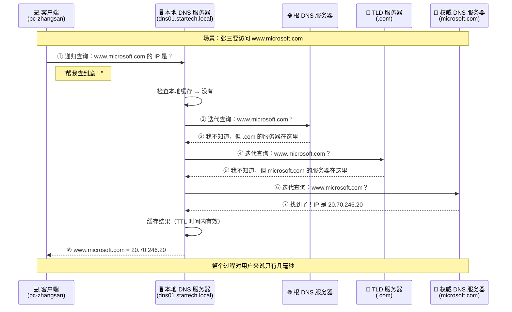
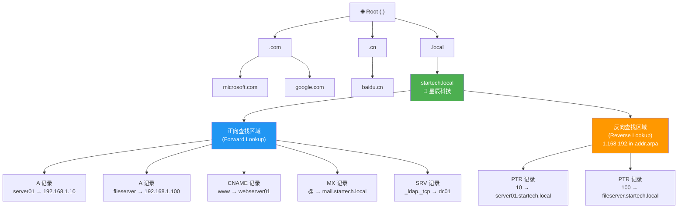
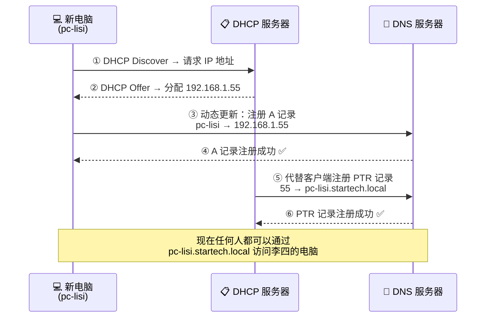

# 第三集：网络世界的电话簿 — DNS 服务器 📖

> **系列回顾**：在前两集中，小明为"星辰科技"搭建了 TCP/IP 基础网络（EP01），又用 DHCP 让电脑自动获取 IP 地址（EP02）。网络通了，IP 也有了——但新的问题来了……

---

## 🎬 开场白 / Opening（约 30 秒）

各位观众大家好！欢迎回到《Windows 网络工程师实战》系列课程。

上一集我们帮小明搭好了 DHCP 服务器，公司里每台电脑都能自动拿到 IP 地址了。问题解决了？没有！因为人脑和计算机的思维方式完全不同——

计算机喜欢数字：`192.168.1.100`
人类喜欢名字：`fileserver.startech.local`

今天，我们就来解决这个"翻译"问题。请系好安全带，我们要进入 **DNS 的世界**了！

---

## 📍 场景设定 / Scene（约 1 分钟）

### 小明的新烦恼

DHCP 上线后的第二天，小明正喝着咖啡，觉得一切都搞定了。突然——

> **市场部张姐**："小明啊，DHCP 很好用，IP 自动分配了。但我每次访问文件服务器还要输 `\\192.168.1.100\share`，能不能输个名字就行啊？"
>
> **研发部老王**："我们开发环境有十几台服务器，IP 一换我就懵了。能不能像上网一样输个名字？"
>
> **老板**："小明，我记不住这些数字。上次开会演示投影仪接的那台机器叫什么来着？你给我弄个简单点的方式！"

小明心想：所有人都在抱怨同一件事——**没人记得住 IP 地址**。看来是时候搭建 DNS 服务器了。

就像现实生活中，你不需要记住每个朋友的手机号码，因为你有**通讯录**。DNS，就是网络世界的通讯录。

---

## 🧠 核心概念 / Core Concepts（约 5-7 分钟）

### 1. DNS 是什么？—— 网络世界的电话簿 📞

**DNS**（Domain Name System，域名系统）的核心工作只有一个：

> **把人类看得懂的名字，翻译成计算机看得懂的 IP 地址。**

打个比方：

| 现实世界 | DNS 世界 |
|---------|---------|
| 你想打电话给"张三" | 你想访问 `fileserver.startech.local` |
| 打开手机通讯录 | 向 DNS 服务器发起查询 |
| 找到张三的号码 138xxxx | 查到 IP 地址 `192.168.1.100` |
| 拨号 | 建立网络连接 |

没有通讯录，你就得记住所有人的手机号——没有 DNS，你就得记住所有服务器的 IP 地址。

### 2. DNS 解析过程：递归查询 vs 迭代查询

当你在浏览器输入 `www.microsoft.com` 并按回车，背后发生了什么？

#### 递归查询（Recursive Query）

客户端对本地 DNS 服务器说："你帮我查到底！我只要最终答案。"

这就像你让秘书帮你查一个电话号码。你不关心她怎么找的——她可能翻了三本电话簿、打了两个电话——但最终她给你一个准确的号码。

#### 迭代查询（Iterative Query）

本地 DNS 服务器向外部服务器查询时用的方式。每个服务器只告诉你"下一步该问谁"。

这就像你问路：
- 你问路人甲："微软总部在哪？" → "我不知道，但你去问美国大使馆。"
- 你问美国大使馆："微软总部在哪？" → "在华盛顿州，去问那边的人。"
- 你到了华盛顿州："微软总部在哪？" → "在雷德蒙德市的 One Microsoft Way。"

### 3. DNS 层级结构 —— 全球最大的电话簿系统

DNS 不是一本巨大的电话簿，而是一个**树状的层级系统**：

| 层级 | 说明 | 例子 |
|------|------|------|
| **Root（根）** | DNS 世界的起点，全球只有 13 组根服务器 | `.`（一个点） |
| **TLD（顶级域）** | 第一级分类 | `.com` `.cn` `.org` `.net` |
| **Second-Level Domain（二级域）** | 组织的域名 | `microsoft.com` `startech.local` |
| **Subdomain（子域）** | 域名下的细分 | `mail.microsoft.com` |
| **Host（主机名）** | 具体的计算机名 | `server01.startech.local` |

把它想象成现实世界的地址：**中国 → 北京市 → 海淀区 → 中关村大街 → 100号**

每一级都有负责人（权威服务器），你只需要一级一级往下问，最终就能找到目标。

### 4. Windows DNS Server 角色

在 Windows Server 上，DNS 服务器可以扮演不同角色：

#### 主要区域（Primary Zone）
- 拥有区域数据的**原始可读写副本**
- 所有修改都在这里进行
- 相当于通讯录的"原件"

#### 辅助区域（Secondary Zone）
- 主要区域的**只读副本**
- 通过区域传输（Zone Transfer）从主服务器同步
- 提供冗余和负载均衡
- 相当于通讯录的"复印件"

#### 存根区域（Stub Zone）
- 只包含 NS（Name Server）和 SOA 记录
- 知道"该问谁"，但不存储详细数据
- 相当于一个"联系人索引"——只记录了电话簿在哪里，不记录具体号码

### 5. 区域类型：正向查找与反向查找

| 类型 | 方向 | 问题 | 答案 |
|------|------|------|------|
| **正向查找区域（Forward Lookup Zone）** | 名字 → IP | `fileserver.startech.local` 的 IP 是什么？ | `192.168.1.100` |
| **反向查找区域（Reverse Lookup Zone）** | IP → 名字 | `192.168.1.100` 是谁？ | `fileserver.startech.local` |

正向查找就像用通讯录查电话号码；反向查找就像来电显示——有人打来电话，你想知道是谁。

### 6. DNS 记录类型 —— 通讯录里的不同信息

DNS 不只是"名字→IP"这么简单。不同类型的记录存储不同的信息：

| 记录类型 | 全称 | 用途 | 示例 |
|---------|------|------|------|
| **A** | Address | 域名 → IPv4 地址 | `server01 → 192.168.1.10` |
| **AAAA** | IPv6 Address | 域名 → IPv6 地址 | `server01 → fe80::1` |
| **CNAME** | Canonical Name | 别名，指向另一个域名 | `www → webserver01.startech.local` |
| **MX** | Mail Exchanger | 指定邮件服务器 | `startech.local → mail.startech.local` |
| **SRV** | Service Locator | 定位特定服务 | `_ldap._tcp → dc01.startech.local` |
| **PTR** | Pointer | IP → 域名（反向查找） | `192.168.1.10 → server01` |
| **NS** | Name Server | 指定权威 DNS 服务器 | `startech.local → dns01.startech.local` |
| **SOA** | Start of Authority | 区域的元数据（序列号、刷新间隔等） | 每个区域必有一条 |

小明在心里默念：**A 记录是最基本的，CNAME 是别名，MX 管邮件，SRV 管服务定位。**

### 7. 转发器（Forwarder）与条件转发（Conditional Forwarder）

#### 转发器（Forwarder）
当本地 DNS 服务器无法解析某个域名时，把请求转发给另一台 DNS 服务器。

比如：小明公司的 DNS 只知道 `startech.local` 下的内容。有人要访问 `www.baidu.com`？DNS 服务器说："这个我不管，让我问问上游服务器（如 `8.8.8.8`）。"

#### 条件转发（Conditional Forwarder）
针对**特定域名**指定转发目标。

比如：星辰科技和合作伙伴"月光集团"（`moonlight.local`）有业务往来。小明设置条件转发：凡是查询 `moonlight.local` 的请求，都转发给月光集团的 DNS 服务器 `10.0.0.1`。

这就像你的通讯录里写了一条备注："如果要找月光集团的人，请拨打前台 010-xxxx。"

### 8. DNS 与 Active Directory 集成

在企业环境中，DNS 和 Active Directory（AD）是**密不可分的搭档**：

- AD 的域控制器（Domain Controller）通过 DNS 的 **SRV 记录**告诉客户端"我在哪里"
- 客户端通过 DNS 查找域控制器来登录域
- 没有 DNS，Active Directory **根本无法工作**

AD 集成区域（AD-Integrated Zone）的好处：
- 区域数据存储在 AD 数据库中，随 AD 复制
- 支持安全的动态更新（Secure Dynamic Update）
- 多主复制——每台域控都能修改 DNS 记录
- 不需要单独配置区域传输

### 9. DHCP 与 DNS 动态注册

还记得上一集搭建的 DHCP 吗？当客户端通过 DHCP 获取 IP 地址后：

1. DHCP 客户端自己注册 **A 记录**（"我叫 pc-zhangsan，我的 IP 是 192.168.1.50"）
2. DHCP 服务器代替客户端注册 **PTR 记录**（"192.168.1.50 是 pc-zhangsan"）

这样一来，**DHCP 分配 IP，DNS 自动更新名字**，一切都是自动的！这就是 DHCP-DNS 动态更新的魔力。

小明感慨：上一集 DHCP 搭好后，DNS 这一集竟然能完美衔接。这就是 Windows 网络服务的生态——每个组件都不是孤岛。

---

## 🏗️ 架构图解 / Architecture

### DNS 查询流程图



### DNS 区域层级架构



### DHCP + DNS 动态注册流程



---

## 🔧 实操演示 / Demo

### 步骤一：安装 DNS 服务器角色

```powershell
# 在 Windows Server 上安装 DNS 服务器角色
Install-WindowsFeature -Name DNS -IncludeManagementTools

# 验证安装
Get-WindowsFeature DNS
```

### 步骤二：创建正向查找区域

```powershell
# 创建 AD 集成的正向查找区域
Add-DnsServerPrimaryZone -Name "startech.local" `
    -ReplicationScope "Forest" `
    -DynamicUpdate "Secure"

# 查看所有区域
Get-DnsServerZone

# 查看特定区域详情
Get-DnsServerZone -Name "startech.local"
```

### 步骤三：创建反向查找区域

```powershell
# 创建反向查找区域（对应 192.168.1.0/24 网段）
Add-DnsServerPrimaryZone -NetworkId "192.168.1.0/24" `
    -ReplicationScope "Forest" `
    -DynamicUpdate "Secure"

# 验证反向区域
Get-DnsServerZone -Name "1.168.192.in-addr.arpa"
```

### 步骤四：添加 DNS 记录

```powershell
# 添加 A 记录 —— 文件服务器
Add-DnsServerResourceRecordA -ZoneName "startech.local" `
    -Name "fileserver" `
    -IPv4Address "192.168.1.100" `
    -CreatePtr   # 同时自动创建 PTR 记录

# 添加 A 记录 —— Web 服务器
Add-DnsServerResourceRecordA -ZoneName "startech.local" `
    -Name "webserver01" `
    -IPv4Address "192.168.1.101" `
    -CreatePtr

# 添加 CNAME 记录 —— www 别名指向 webserver01
Add-DnsServerResourceRecordCName -ZoneName "startech.local" `
    -Name "www" `
    -HostNameAlias "webserver01.startech.local"

# 添加 MX 记录 —— 邮件服务器
Add-DnsServerResourceRecordMX -ZoneName "startech.local" `
    -Name "." `
    -MailExchange "mail.startech.local" `
    -Preference 10

# 查看区域内所有记录
Get-DnsServerResourceRecord -ZoneName "startech.local"

# 查看特定类型的记录
Get-DnsServerResourceRecord -ZoneName "startech.local" -RRType A
Get-DnsServerResourceRecord -ZoneName "startech.local" -RRType CNAME
```

### 步骤五：配置转发器

```powershell
# 设置转发器（用于解析外部域名）
Set-DnsServerForwarder -IPAddress "8.8.8.8", "8.8.4.4"

# 查看当前转发器配置
Get-DnsServerForwarder

# 添加条件转发 —— 将 moonlight.local 的查询转发到合作伙伴的 DNS
Add-DnsServerConditionalForwarderZone -Name "moonlight.local" `
    -MasterServers "10.0.0.1" `
    -ReplicationScope "Forest"

# 查看条件转发
Get-DnsServerZone | Where-Object { $_.ZoneType -eq 'Forwarder' }
```

### 步骤六：客户端验证

```powershell
# --- 以下命令在客户端执行 ---

# 使用 nslookup 查询（经典工具）
nslookup fileserver.startech.local
nslookup -type=MX startech.local
nslookup -type=SRV _ldap._tcp.startech.local

# 使用 Resolve-DnsName（PowerShell 现代工具，更强大）
Resolve-DnsName -Name "fileserver.startech.local" -Type A
Resolve-DnsName -Name "startech.local" -Type MX
Resolve-DnsName -Name "www.startech.local" -Type CNAME

# 反向查询
Resolve-DnsName -Name "192.168.1.100" -Type PTR

# 查看 DNS 客户端缓存
Get-DnsClientCache

# 清除 DNS 缓存（排错常用）
Clear-DnsClientCache

# 查看本机 DNS 配置
Get-DnsClientServerAddress

# 查看 DNS 解析的详细过程
Resolve-DnsName -Name "www.microsoft.com" -Type A -DnsOnly -Server "dns01.startech.local"
```

### 步骤七：排错命令

```powershell
# 在 DNS 服务器上启用诊断日志
Set-DnsServerDiagnostics -All $true

# 检查 DNS 服务器是否正常运行
Test-DnsServer -IPAddress "192.168.1.10" -ZoneName "startech.local"

# 检查区域传输是否正常（如果有辅助区域）
Get-DnsServerZoneTransferPolicy

# 强制重新加载区域
# Invoke-Command { dnscmd /ZoneReload startech.local }
```

---

## 📝 讲稿要点 / Script Notes

### 开场段落
- "IP 地址就像电话号码，你能记住 10 个人的号码吗？100 个呢？"
- "DNS 就是网络世界的通讯录——你只要知道名字，它帮你找到号码"
- "没有 DNS，互联网根本无法运作。你每天上网，每一次点击都在用 DNS"

### 核心讲解段落
- 用通讯录的类比贯穿全程：查名字 = 正向查找，来电显示 = 反向查找
- 强调递归查询和迭代查询的区别："客户端是甩手掌柜，DNS 服务器是跑腿的"
- 记录类型用表格对比展示，每种给一个生活化的比喻
- 转发器和条件转发："你不懂的问题问百度，合作伙伴的事情直接问他们的前台"

### 实操演示段落
- 先展示安装，再创建区域，最后添加记录——循序渐进
- 每条 PowerShell 命令执行后，立刻用 `Get-` 命令验证结果
- 客户端验证环节：先用经典的 `nslookup`，再展示现代的 `Resolve-DnsName`
- 清缓存 `Clear-DnsClientCache` 是排错第一步——务必强调

### 收尾段落
- "DNS 看起来简单，但它是整个网络的基石"
- "下次你访问网站的时候，想想背后有多少台 DNS 服务器在为你跑腿"
- "记住：DNS 坏了，一切都坏了——这就是为什么我们要配置冗余"

---

## ✅ 本集总结 / Summary

### 🎯 关键知识点

1. **DNS 的作用**：把域名翻译成 IP 地址，是网络世界的"电话簿"
2. **查询方式**：客户端用递归查询（甩手掌柜），DNS 服务器间用迭代查询（自己跑腿）
3. **层级结构**：Root → TLD → Second-Level → Subdomain → Host
4. **区域类型**：
   - 正向查找区域（名字→IP）
   - 反向查找区域（IP→名字）
   - 主要区域 / 辅助区域 / 存根区域
5. **核心记录类型**：A、AAAA、CNAME、MX、SRV、PTR、NS、SOA
6. **转发器**：不认识的域名交给上游 DNS
7. **条件转发**：特定域名交给指定 DNS
8. **AD 集成**：DNS 是 Active Directory 的生命线
9. **DHCP-DNS 联动**：DHCP 分配 IP 后自动更新 DNS 记录

### 🛠️ 核心命令速查

| 命令 | 用途 |
|------|------|
| `Get-DnsServerZone` | 查看 DNS 区域 |
| `Add-DnsServerPrimaryZone` | 创建主要区域 |
| `Add-DnsServerResourceRecordA` | 添加 A 记录 |
| `Get-DnsServerResourceRecord` | 查看 DNS 记录 |
| `Set-DnsServerForwarder` | 配置转发器 |
| `Resolve-DnsName` | 客户端 DNS 查询 |
| `Clear-DnsClientCache` | 清除客户端 DNS 缓存 |
| `nslookup` | 经典 DNS 查询工具 |

### 📊 小明的成果

经过这一集，小明为星辰科技实现了：
- ✅ 搭建了公司内部 DNS 服务器
- ✅ 所有服务器都有了易记的域名
- ✅ DHCP 和 DNS 联动，新电脑自动注册域名
- ✅ 设置了外部转发器，公司内网也能访问互联网域名
- ✅ 配置了条件转发，和合作伙伴网络互通

现在，张姐终于可以输入 `\\fileserver\share` 访问文件了，再也不用记那串数字！😊

---

## 👉 下集预告 / Next Episode

> **第四集：企业网络的安全门 — 防火墙与 IPsec 🛡️**
>
> DNS 搭好了，网络畅通了。但有一天早上，小明发现服务器异常繁忙——安全团队说检测到可疑的外部连接！
>
> 老板急了："赶紧把安全搞起来！"
>
> 下一集，我们将学习 Windows 防火墙和 IPsec：
> - 防火墙如何像"小区门卫"一样过滤网络流量？
> - IPsec 如何像"装甲运钞车"一样加密数据传输？
> - 如何配置入站/出站规则？
> - 如何实现"只允许加密流量"的安全策略？
>
> 网络安全不是选修课，而是必修课。我们下集见！🔒

---

> **播放列表**：
> - EP01: TCP/IP 基础 ✅
> - EP02: DHCP 自动分配 ✅
> - **EP03: DNS 服务器** ← 你在这里
> - EP04: 防火墙与 IPsec（下集）
> - EP05: VPN 与远程接入
> - EP06: NPS 网络策略（即将推出）
