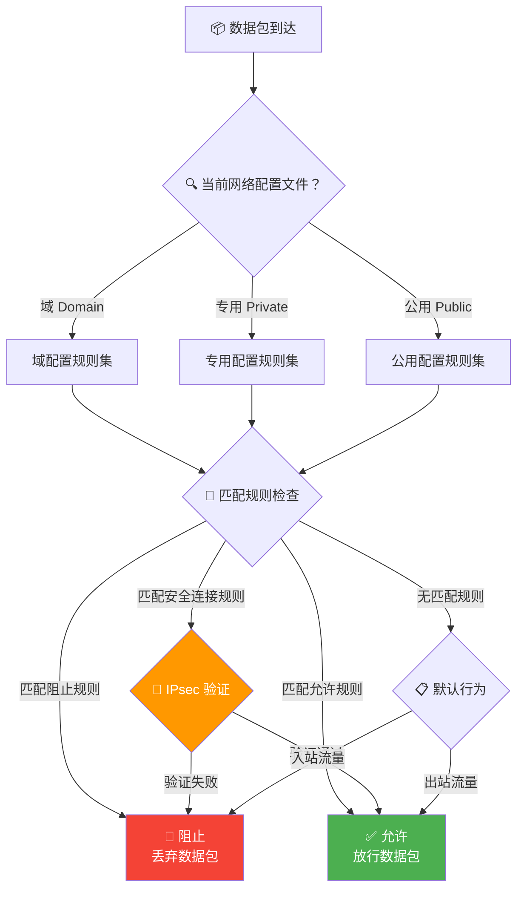
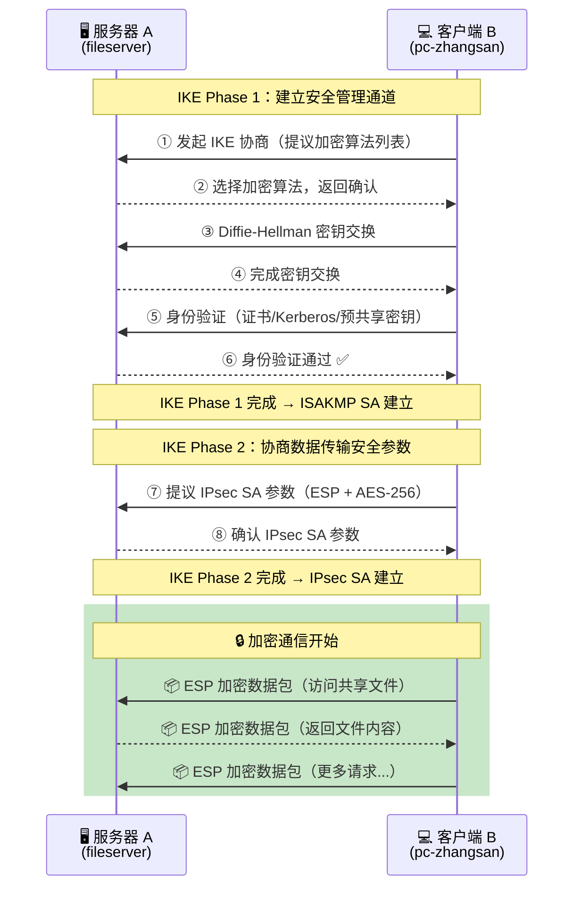
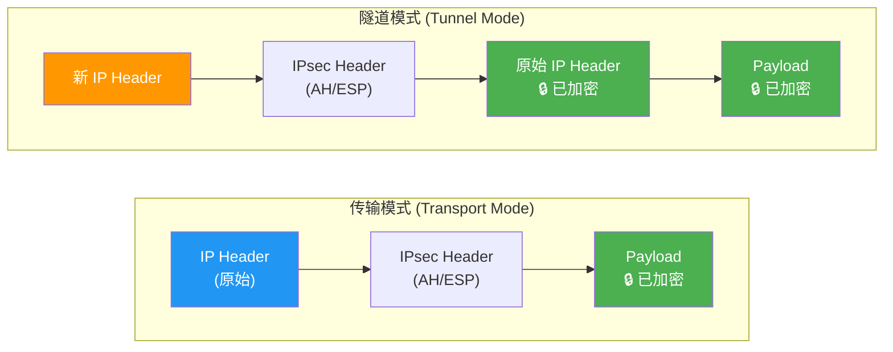
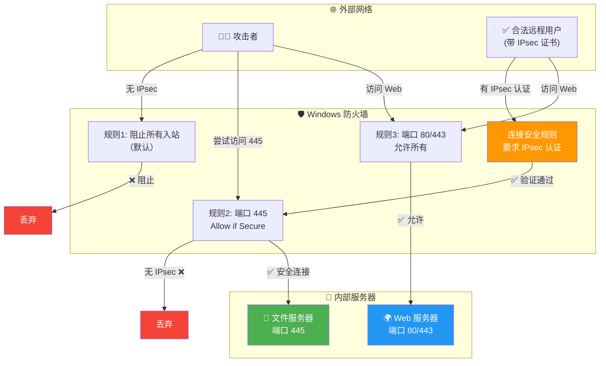

# 第四集：企业网络的安全门 — 防火墙与 IPsec 🛡️

> **系列回顾**：小明已经为"星辰科技"搭好了 TCP/IP（EP01）、DHCP（EP02）和 DNS（EP03）。网络基础架构完备了——但安全问题还没有触及。一场危机即将来临……

---

## 🎬 开场白 / Opening（约 30 秒）

各位观众大家好！欢迎回到《Windows 网络工程师实战》系列课程。

前三集我们帮小明搭建了完整的网络基础设施。IP 有了，DHCP 自动分配了，DNS 域名解析也通了。看起来一切完美——

但是，**网络通了，危险也就来了。**

你家通了水电，但如果不装门锁，任何人都能进来。网络也一样——没有安全策略，就等于"裸奔"。

今天，我们要为星辰科技的网络装上**门锁**和**保险柜**！

---

## 📍 场景设定 / Scene（约 1 分钟）

### 小明的安全危机 🚨

某个周一早上 8 点，小明照例检查服务器。突然发现——

> **监控面板**：文件服务器 CPU 使用率 98%！网络流量暴涨！
>
> **安全团队小李**："小明！我们的 IDS 检测到大量可疑的外部连接，有人在尝试暴力破解 RDP 端口！还有几台内部机器在向外发送异常流量！"
>
> **老板（脸色铁青）**："小明，这是怎么回事？上周我还夸你网络搭得好，现在这是被攻击了？赶紧把安全搞起来！"

小明冒了一身冷汗。网络是通了，但**完全没有做安全防护**——

- 没有防火墙规则：所有端口对外开放
- 没有流量加密：内部通信全是明文
- 没有访问控制：谁都可以连接任何服务

这就像建了一栋大楼，水电齐全，但**没有大门、没有门锁、没有保安**。

今天，小明要做两件事：
1. **装上防火墙** —— 控制谁能进来、谁能出去
2. **启用 IPsec** —— 就算有人偷听，也看不懂传输的数据

---

## 🧠 核心概念 / Core Concepts（约 5-7 分钟）

### 1. Windows 防火墙 —— 网络世界的门卫 🚪

**Windows Defender Firewall with Advanced Security**（简称 Windows 防火墙）是 Windows 内置的网络安全组件。

#### 生活类比

把你的服务器想象成一栋办公楼：

| 现实世界 | 防火墙世界 |
|---------|-----------|
| 门卫大叔 | 防火墙引擎 |
| 来访者登记本 | 防火墙规则 |
| "快递只能送到前台" | 入站规则（Inbound Rule） |
| "员工外出需要报备" | 出站规则（Outbound Rule） |
| 来访者的身份证 | 源 IP / 端口 |
| 来访者要找的部门 | 目标端口 / 程序 |
| "上班时间才能进" | 条件匹配（时间、用户组等） |

门卫的工作很简单：**检查每个进出的人（数据包），根据规则决定放行还是拦截。**

### 2. Windows Filtering Platform (WFP) —— 防火墙的引擎

Windows 防火墙底层使用 **WFP**（Windows Filtering Platform）——这是一个内核级的网络过滤框架：

- WFP 在 TCP/IP 协议栈的**多个层级**拦截数据包
- 不仅仅是简单的端口过滤，还支持应用程序级别的控制
- 第三方安全软件也可以通过 WFP 插入自己的过滤规则
- 比起老旧的 `netsh firewall`，WFP 更强大、更灵活

### 3. 三种网络配置文件（Profile）

Windows 防火墙会根据网络类型自动应用不同的安全级别：

| 配置文件 | 场景 | 安全级别 | 说明 |
|---------|------|---------|------|
| **域（Domain）** | 连接到公司域网络 | 中等 | 信任公司网络，允许域相关流量 |
| **专用（Private）** | 家庭或小型办公 | 中等 | 适度信任，允许网络发现 |
| **公用（Public）** | 咖啡厅、机场 WiFi | 最高 | 最严格，隐藏自己，拒绝大部分入站 |

打个比方：
- **域配置文件** = 在自己公司大楼里——安保知道你是员工，进出比较自由
- **专用配置文件** = 在自己家里——门可以不锁那么紧，但还是有基本的安全
- **公用配置文件** = 在火车站——陌生人环绕，你得把所有值钱的东西看紧了

### 4. 防火墙规则详解

每条防火墙规则包含以下关键要素：

#### 方向
- **入站规则（Inbound Rule）**：控制外部到本机的流量。"谁能进来？"
- **出站规则（Outbound Rule）**：控制本机到外部的流量。"谁能出去？"

#### 动作
- **允许（Allow）**：放行匹配的流量
- **阻止（Block）**：丢弃匹配的流量
- **允许安全连接（Allow if Secure）**：只有通过 IPsec 认证/加密的流量才放行——这是防火墙和 IPsec 结合的关键！

#### 匹配条件
- **程序（Program）**：指定可执行文件路径，如 `C:\Program Files\App\app.exe`
- **端口（Port）**：TCP/UDP 端口号，如 80, 443, 3389
- **协议（Protocol）**：TCP, UDP, ICMP, ICMPv6 等
- **IP 地址范围**：源和目标 IP
- **用户/组**：结合 AD 用户身份控制

#### 规则处理优先级

这是很多人搞混的地方，Windows 防火墙的规则优先级如下：

1. **阻止规则优先于允许规则**（除非允许规则设置了"覆盖阻止规则"）
2. 更具体的规则优先于更宽泛的规则
3. 如果没有任何规则匹配：
   - 入站默认 = **阻止**（安全！）
   - 出站默认 = **允许**（方便！）

### 5. 连接安全规则（Connection Security Rules）—— IPsec 的入口

连接安全规则不是简单的"允许/阻止"，而是要求两台计算机之间建立**安全的、经过身份验证的通信**。

这就是 IPsec 在 Windows 中的具体实现。

### 6. IPsec —— 数据的装甲运钞车 🚛

#### IPsec 是什么？

**IPsec**（Internet Protocol Security）是一套在 IP 层（第三层）提供安全服务的协议族。它做两件事：

1. **身份验证（Authentication）**：确认"你真的是你说的那个人"
2. **加密（Encryption）**：确保传输的数据即使被截获也无法读取

#### 生活类比

| 没有 IPsec | 有 IPsec |
|-----------|---------|
| 明信片——邮递员能看到内容 | 加密信件——只有收件人有钥匙 |
| 普通快递——谁都能冒充签收 | 装甲运钞车——带武装押运、防弹玻璃 |
| "我是张三"——口头承诺 | 出示身份证 + 指纹验证 |

### 7. IPsec 两种工作模式

#### 传输模式（Transport Mode）
- 只加密 IP 数据包的**有效载荷（Payload）**，IP 头不变
- 用于**端到端**通信（如：服务器 A ↔ 服务器 B）
- 适合同一网络内的两台主机之间的安全通信

#### 隧道模式（Tunnel Mode）
- 加密**整个原始 IP 数据包**，再套上新的 IP 头
- 用于**站点到站点（Site-to-Site）VPN**
- 适合两个网络之间的安全通信

类比：
- **传输模式** = 你在信封里放了加密信件，但信封外面写了你的地址和收件人地址（能看到谁在通信，看不到内容）
- **隧道模式** = 你把整封信（包括信封）放进了一个新的加密包裹——连谁在给谁写信都看不出来

### 8. IPsec 协议：AH 与 ESP

| 协议 | 全称 | 功能 | 加密？ | 验证？ |
|------|------|------|--------|--------|
| **AH** | Authentication Header | 验证数据完整性和来源 | ❌ 不加密 | ✅ 验证 |
| **ESP** | Encapsulating Security Payload | 加密数据 + 验证 | ✅ 加密 | ✅ 验证 |

**实际应用中，ESP 用得最多**——因为它既加密又验证，一步到位。AH 通常只在不需要加密但需要确保数据没被篡改的场景使用。

### 9. IKE 协商过程 —— 两台机器如何"握手"

在 IPsec 通信开始之前，两台计算机需要先"握手"协商安全参数。这个过程叫 **IKE**（Internet Key Exchange）。

#### IKE Phase 1（第一阶段）
- 建立一个安全的管理通道（ISAKMP SA）
- 双方交换身份信息、协商加密算法
- 类比：两个间谍第一次见面，先用暗号确认身份，然后约定后续用什么密码本

#### IKE Phase 2（第二阶段）
- 在第一阶段建立的安全通道内，协商实际数据传输的安全参数（IPsec SA）
- 确定用 AH 还是 ESP、用什么加密算法、密钥有效期等
- 类比：身份确认后，开始讨论"这批货用什么保险箱装、用几把锁、钥匙多久换一次"

### 10. 防火墙 + IPsec 的强大组合

这是本集最重要的知识点之一——防火墙和 IPsec 可以**联合使用**：

**场景**：小明想保护文件服务器，要求"只有通过 IPsec 身份验证和加密的流量才能访问 SMB 端口（445）"。

实现方式：
1. 创建**连接安全规则**：要求与文件服务器通信必须使用 IPsec
2. 创建**防火墙入站规则**：端口 445 的动作设为"Allow if Secure"
3. 结果：只有通过 IPsec 认证的客户端才能访问文件共享

这就像：门卫不仅检查你的门禁卡（身份验证），还要求你把文件放在保险箱里才能带进来（加密）。

---

## 🏗️ 架构图解 / Architecture

### 防火墙数据包处理流程



### IPsec 协商与通信流程



### IPsec 传输模式 vs 隧道模式



### 防火墙 + IPsec 联合保护架构



---

## 🔧 实操演示 / Demo

### 步骤一：查看防火墙当前状态

```powershell
# 查看所有配置文件的防火墙状态
Get-NetFirewallProfile | Format-Table Name, Enabled, DefaultInboundAction, DefaultOutboundAction

# 使用 netsh 查看（传统方式）
netsh advfirewall show allprofiles

# 查看特定配置文件
Get-NetFirewallProfile -Name Domain
Get-NetFirewallProfile -Name Private
Get-NetFirewallProfile -Name Public
```

### 步骤二：管理防火墙配置文件

```powershell
# 确保所有配置文件的防火墙都已启用
Set-NetFirewallProfile -Profile Domain,Private,Public -Enabled True

# 设置默认策略：入站阻止，出站允许
Set-NetFirewallProfile -Profile Domain,Private,Public `
    -DefaultInboundAction Block `
    -DefaultOutboundAction Allow

# 启用防火墙日志（排错利器！）
Set-NetFirewallProfile -Profile Domain `
    -LogAllowed True `
    -LogBlocked True `
    -LogFileName "%systemroot%\system32\LogFiles\Firewall\pfirewall.log" `
    -LogMaxSizeKilobytes 4096
```

### 步骤三：创建入站防火墙规则

```powershell
# 场景1：允许 Web 服务器的 HTTP/HTTPS 流量
New-NetFirewallRule -DisplayName "Allow HTTP Inbound" `
    -Direction Inbound `
    -Protocol TCP `
    -LocalPort 80 `
    -Action Allow `
    -Profile Domain,Private `
    -Description "允许 HTTP 流量（Web 服务器）"

New-NetFirewallRule -DisplayName "Allow HTTPS Inbound" `
    -Direction Inbound `
    -Protocol TCP `
    -LocalPort 443 `
    -Action Allow `
    -Profile Domain,Private `
    -Description "允许 HTTPS 流量（Web 服务器）"

# 场景2：限制 RDP 只能从管理网段访问
New-NetFirewallRule -DisplayName "Allow RDP from Admin Subnet" `
    -Direction Inbound `
    -Protocol TCP `
    -LocalPort 3389 `
    -RemoteAddress "192.168.10.0/24" `
    -Action Allow `
    -Profile Domain `
    -Description "只允许管理网段远程桌面"

# 场景3：阻止特定 IP 的所有入站流量
New-NetFirewallRule -DisplayName "Block Suspicious IP" `
    -Direction Inbound `
    -RemoteAddress "203.0.113.50" `
    -Action Block `
    -Description "阻止可疑 IP 地址"

# 场景4：允许 ICMP ping（方便排错）
New-NetFirewallRule -DisplayName "Allow ICMPv4 Ping" `
    -Direction Inbound `
    -Protocol ICMPv4 `
    -IcmpType 8 `
    -Action Allow `
    -Description "允许 Ping 请求"
```

### 步骤四：创建出站防火墙规则

```powershell
# 场景：阻止某个程序的外网访问（防止恶意软件外联）
New-NetFirewallRule -DisplayName "Block Suspicious App Outbound" `
    -Direction Outbound `
    -Program "C:\SuspiciousApp\app.exe" `
    -Action Block `
    -Description "阻止可疑程序的出站连接"

# 只允许 DNS 和 HTTPS 出站（严格模式）
# 注意：这很激进，需要谨慎使用
New-NetFirewallRule -DisplayName "Allow DNS Outbound" `
    -Direction Outbound `
    -Protocol UDP `
    -RemotePort 53 `
    -Action Allow

New-NetFirewallRule -DisplayName "Allow HTTPS Outbound" `
    -Direction Outbound `
    -Protocol TCP `
    -RemotePort 443 `
    -Action Allow
```

### 步骤五：管理和查看规则

```powershell
# 查看所有启用的入站规则
Get-NetFirewallRule -Direction Inbound -Enabled True |
    Format-Table DisplayName, Action, Profile -AutoSize

# 按名称搜索规则
Get-NetFirewallRule -DisplayName "*RDP*"

# 查看规则的详细信息（包括端口和地址）
Get-NetFirewallRule -DisplayName "Allow RDP from Admin Subnet" |
    Get-NetFirewallPortFilter
Get-NetFirewallRule -DisplayName "Allow RDP from Admin Subnet" |
    Get-NetFirewallAddressFilter

# 禁用某条规则（而不是删除）
Disable-NetFirewallRule -DisplayName "Block Suspicious IP"

# 删除规则
Remove-NetFirewallRule -DisplayName "Block Suspicious IP"

# 导出所有防火墙规则（备份！）
Get-NetFirewallRule | Export-Csv -Path "C:\Backup\firewall-rules.csv" -NoTypeInformation
```

### 步骤六：配置 IPsec 连接安全规则

```powershell
# 创建连接安全规则：要求与文件服务器通信必须认证
New-NetIPsecRule -DisplayName "Require Auth for FileServer" `
    -InboundSecurity Require `
    -OutboundSecurity Request `
    -RemoteAddress "192.168.1.100" `
    -Phase1AuthSet (New-NetIPsecAuthProposal -Machine -Cert `
        -Authority "CN=StarTech-CA" -AuthorityType Root).InstanceID

# 查看 IPsec 规则
Get-NetIPsecRule | Format-Table DisplayName, InboundSecurity, OutboundSecurity

# 查看 IPsec 安全关联（SA）—— 谁和谁建立了加密通道
Get-NetIPsecMainModeSA
Get-NetIPsecQuickModeSA

# 使用 Kerberos 认证的连接安全规则（AD 环境推荐）
$auth = New-NetIPsecAuthProposal -Machine -Kerberos
$authSet = New-NetIPsecPhase1AuthSet -DisplayName "Kerberos Auth" -Proposal $auth
New-NetIPsecRule -DisplayName "IPsec Kerberos Auth" `
    -InboundSecurity Require `
    -OutboundSecurity Require `
    -Phase1AuthSet $authSet.Name
```

### 步骤七：防火墙 + IPsec 联合配置

```powershell
# 关键步骤：创建"只允许安全连接"的防火墙规则
# 这条规则说：端口 445（SMB）只有通过 IPsec 认证的流量才放行
New-NetFirewallRule -DisplayName "SMB - Require IPsec" `
    -Direction Inbound `
    -Protocol TCP `
    -LocalPort 445 `
    -Action Allow `
    -Authentication Required `
    -Encryption Required `
    -Description "SMB 文件共享 - 要求 IPsec 加密"

# 验证规则
Get-NetFirewallRule -DisplayName "SMB - Require IPsec" |
    Get-NetFirewallSecurityFilter
```

### 步骤八：监控和排错

```powershell
# 查看防火墙日志
Get-Content "$env:SystemRoot\system32\LogFiles\Firewall\pfirewall.log" -Tail 50

# 实时监控 IPsec 状态
Get-NetIPsecMainModeSA | Format-List *
Get-NetIPsecQuickModeSA | Format-List *

# 检查 IPsec 策略是否生效
netsh ipsec dynamic show all

# 使用事件查看器查看防火墙相关事件
Get-WinEvent -LogName "Microsoft-Windows-Windows Firewall With Advanced Security/Firewall" `
    -MaxEvents 20 |
    Format-Table TimeCreated, Id, Message -Wrap

# 快速诊断：测试特定端口是否可达
Test-NetConnection -ComputerName "fileserver.startech.local" -Port 445
Test-NetConnection -ComputerName "webserver01.startech.local" -Port 443
```

---

## 📝 讲稿要点 / Script Notes

### 开场段落
- "网络通了是好事，但没有安全就等于裸奔"
- "防火墙不是可选项，而是必选项。就像你不会住在一间没有门的房子里"
- "今天我们要学两样东西：防火墙（门锁）和 IPsec（保险柜）"

### 核心讲解段落
- 防火墙 = 门卫，用这个类比贯穿入站/出站规则的讲解
- 三种配置文件用"在公司/在家/在火车站"来区分
- 规则优先级是重点：**阻止 > 允许 > 默认行为**——这是很多人踩的坑
- IPsec 用"装甲运钞车"的比喻：AH = 带押运员（验证但不加密），ESP = 防弹车厢（既加密又验证）
- IKE 协商用"间谍接头"来比喻——先确认身份，再约定密码本
- 重点强调 **防火墙 + IPsec 的组合**："Allow if Secure"是企业安全的利器

### 实操演示段落
- 先 `Get-` 查看现状，再 `New-/Set-` 修改——让观众养成"先看后改"的习惯
- RDP 规则限制管理网段——这是现实中最常见的需求
- 演示"阻止可疑 IP"——呼应开头的安全事件
- IPsec 配置是高级内容，简单演示即可，重点在于理解概念

### 收尾段落
- "安全不是一次性的工作，而是持续的过程"
- "今天学的防火墙和 IPsec 只是第一层防线，但它是最重要的基础"
- "记住：默认拒绝、最小权限——这是网络安全的两大原则"

---

## ✅ 本集总结 / Summary

### 🎯 关键知识点

1. **Windows 防火墙**：基于 WFP 引擎的内核级网络过滤
2. **三种配置文件**：Domain（公司）、Private（家庭）、Public（公共场所）
3. **规则要素**：方向（入站/出站）、动作（允许/阻止/安全连接）、条件（端口/IP/程序）
4. **规则优先级**：阻止 > 允许 > 默认（入站默认阻止，出站默认允许）
5. **IPsec 功能**：身份验证（Authentication）+ 加密（Encryption）
6. **IPsec 模式**：传输模式（端到端）vs 隧道模式（站点到站点）
7. **IPsec 协议**：AH（只验证）vs ESP（加密 + 验证，推荐）
8. **IKE 协商**：Phase 1（建安全通道）→ Phase 2（协商传输参数）
9. **杀手组合**：防火墙 "Allow if Secure" + IPsec = 只允许加密认证流量

### 🛠️ 核心命令速查

| 命令 | 用途 |
|------|------|
| `Get-NetFirewallProfile` | 查看防火墙配置文件状态 |
| `Set-NetFirewallProfile` | 修改防火墙配置文件 |
| `New-NetFirewallRule` | 创建防火墙规则 |
| `Get-NetFirewallRule` | 查看防火墙规则 |
| `New-NetIPsecRule` | 创建 IPsec 连接安全规则 |
| `Get-NetIPsecMainModeSA` | 查看 IPsec 主模式安全关联 |
| `Test-NetConnection` | 测试网络连接和端口 |
| `netsh advfirewall show allprofiles` | 传统方式查看防火墙状态 |

### 📊 小明的成果

经过这一集，小明为星辰科技实现了：
- ✅ 启用所有配置文件的防火墙，默认入站阻止
- ✅ 只开放必要端口（80/443 对外，3389 限管理网段）
- ✅ 阻止了可疑的外部 IP 地址
- ✅ 为文件服务器启用 IPsec 加密，SMB 通信全程加密
- ✅ 开启防火墙日志，便于后续审计和排错

那个周一早上的安全事件？小明现在可以自信地说："**我们的网络有了第一道防线。**" 🛡️

---

## 👉 下集预告 / Next Episode

> **第五集：随时随地办公 — VPN 与远程接入 🌍**
>
> 防火墙和 IPsec 搞好了，公司网络安全多了。然后突然——疫情来了！老板宣布全员居家办公。
>
> 200 个员工在家怎么安全地访问公司内网？
>
> 下一集，小明要搭建 VPN 远程接入：
> - PPTP、L2TP、SSTP、IKEv2 到底选哪个？
> - Split Tunneling 和 Full Tunneling 有什么区别？
> - DirectAccess 是什么"黑科技"？
> - 如何用今天学的 IPsec 保护 VPN 隧道？
>
> 居家办公不是放假，安全接入才是王道。下集见！🏠

---

> **播放列表**：
> - EP01: TCP/IP 基础 ✅
> - EP02: DHCP 自动分配 ✅
> - EP03: DNS 服务器 ✅
> - **EP04: 防火墙与 IPsec** ← 你在这里
> - EP05: VPN 与远程接入（下集）
> - EP06: NPS 网络策略（即将推出）
