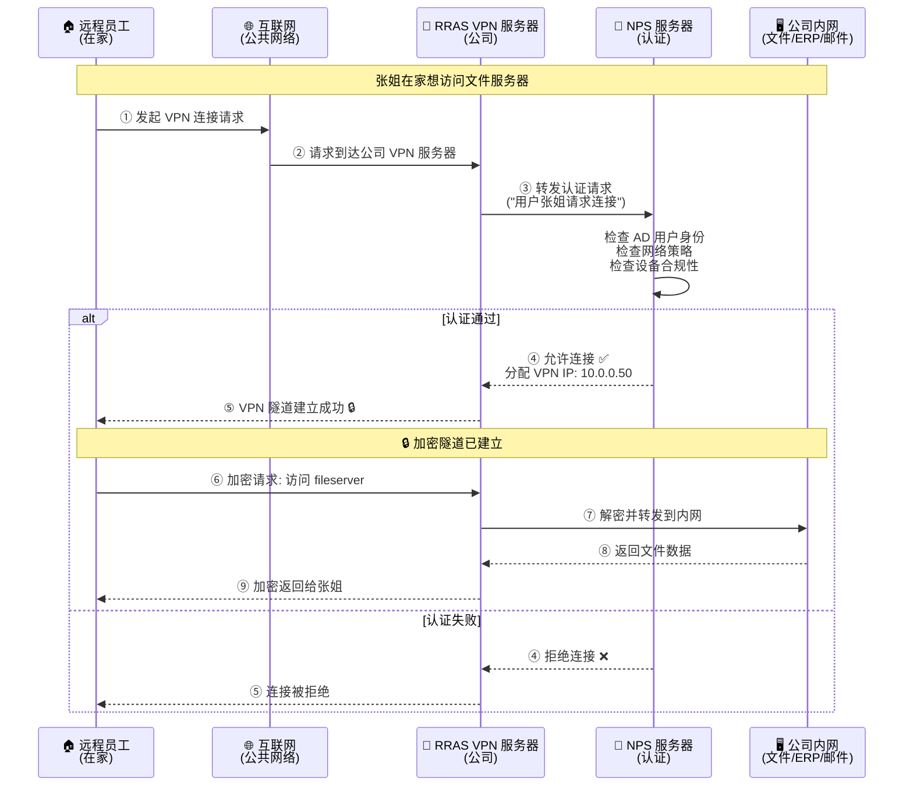
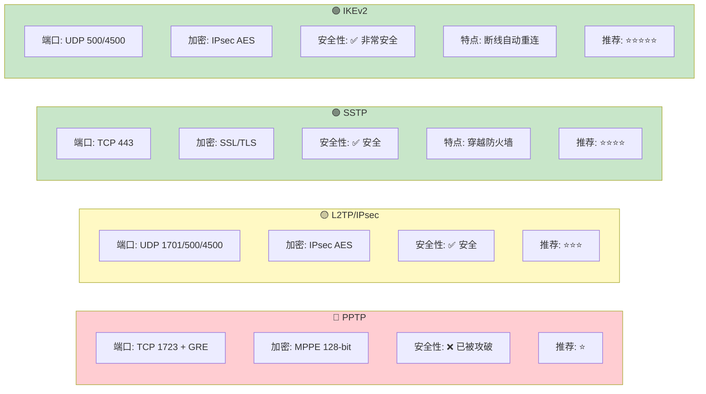
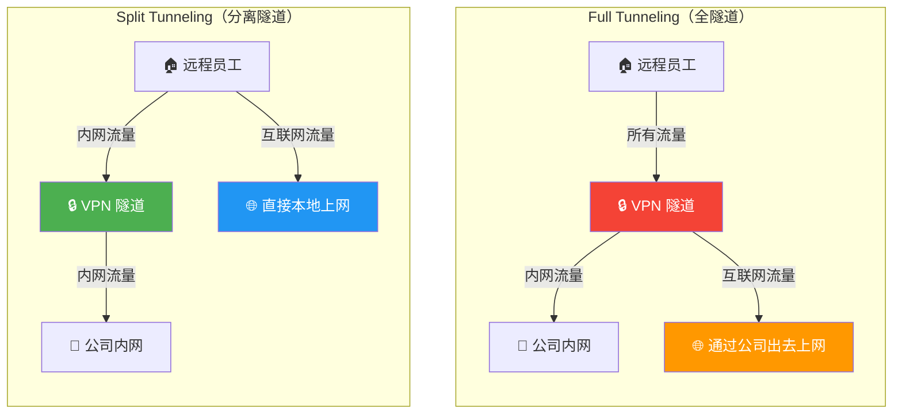
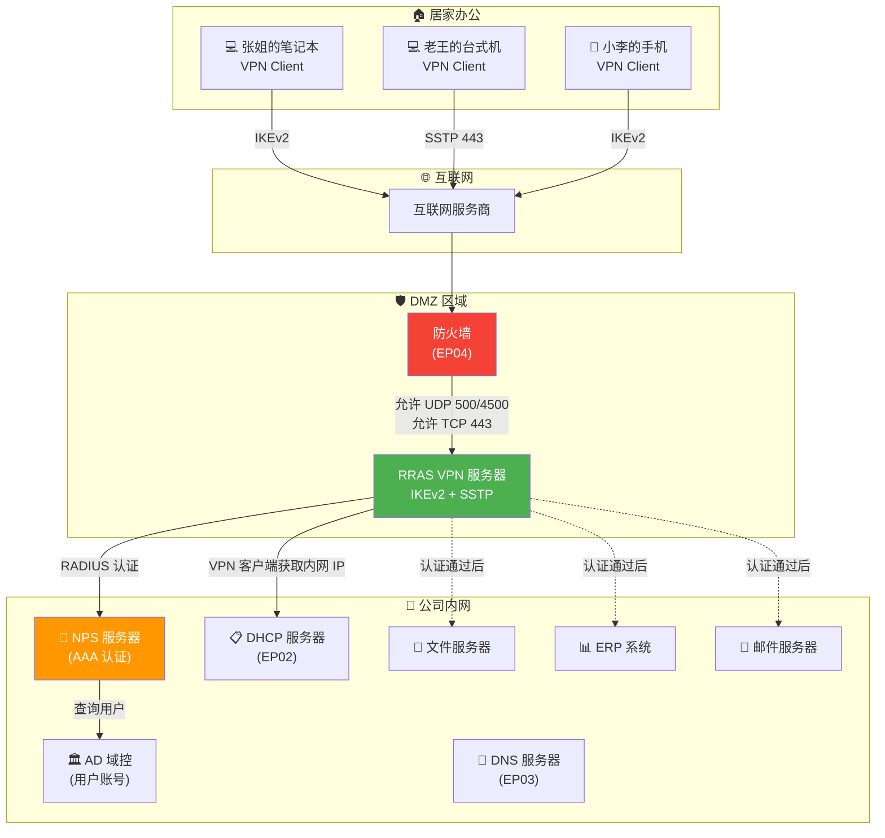

# 第五集：随时随地办公 — VPN 与远程接入 🌍

> **系列回顾**：小明为"星辰科技"从零搭建了网络。TCP/IP 基础（EP01）、DHCP 自动分配（EP02）、DNS 域名解析（EP03）、防火墙与 IPsec 安全（EP04）——公司的内部网络固若金汤。但一场突如其来的变故，让"内部网络"的概念彻底被打破……

---

## 🎬 开场白 / Opening（约 30 秒）

各位观众大家好！欢迎回到《Windows 网络工程师实战》系列课程。

前四集我们一步步搭建了一个安全、稳定的公司内部网络。但现实世界有一个问题——**员工不可能永远待在办公室里。**

出差、居家办公、分支机构……人在外面，但工作还得继续。怎么办？

答案就是 **VPN**——在公网上挖一条加密的"地下隧道"，让你无论在哪里，都像坐在办公室一样工作。

今天，我们要帮小明搭建这条隧道！

---

## 📍 场景设定 / Scene（约 1 分钟）

### 疫情来了！全员居家办公 😷

2025 年初，一切都很美好。小明刚搞定防火墙和 IPsec，正准备喝杯咖啡享受一下成果。然后——

> **老板（紧急视频会议）**："各位，由于疫情原因，从下周一开始全员居家办公！时间不确定，可能一两个月。"
>
> **全公司 200 人**："！！！"
>
> **老板（看向镜头里的小明）**："小明，你有三天时间，想办法让所有人在家也能安全地访问公司内网。邮件、文件服务器、ERP 系统，一个都不能少。"
>
> **市场部张姐**："我在家怎么访问文件服务器？"
> **研发部老王**："代码仓库在内网，在家怎么 git pull？"
> **财务部刘会计**："ERP 系统有机密数据，在家连安全吗？"

小明深吸一口气。200 个人，各种家庭网络环境（有线、Wi-Fi、4G 热点），各种设备（公司笔记本、个人电脑），各种安全需求——

**挑战**：
1. 所有人都要能访问内网资源
2. 传输必须加密（上一集学的 IPsec 终于要派上用场了）
3. 家庭网络环境复杂（很多人家里的路由器封了各种端口）
4. 操作要简单（不能让 200 个人都来问小明怎么配）

解决方案只有一个：**搭建 VPN 远程接入服务**。

---

## 🧠 核心概念 / Core Concepts（约 5-7 分钟）

### 1. VPN 是什么？—— 从你家到公司的地下隧道 🚇

**VPN**（Virtual Private Network，虚拟专用网络）的核心思想：

> 在**公共网络**（互联网）上建立一条**加密的私人通道**，让你的设备就像直接连在公司内网一样。

#### 生活类比

| 没有 VPN | 有 VPN |
|---------|--------|
| 你在家大声喊话和公司沟通——所有邻居都听得到 | 从你家到公司修了一条地下隧道——外面的人看不到你在传什么 |
| 寄明信片——邮递员能看到内容 | 走专属加密通道——只有两头的人知道里面是什么 |
| 走公共马路——谁都能看到你 | 走地下隧道——从入口到出口，中间过程完全隐蔽 |

技术上，VPN 做了三件事：
1. **封装（Encapsulation）**：把你的内网数据包装进一个"外壳"
2. **加密（Encryption）**：把数据变成密文，即使被截获也看不懂
3. **身份验证（Authentication）**：确认你是合法用户，不是冒充的

### 2. RRAS —— Windows 的 VPN 服务引擎

**RRAS**（Routing and Remote Access Service）是 Windows Server 内置的远程接入服务角色，它是 VPN 服务器的核心。

RRAS 可以提供：
- **VPN 服务器**：接受外部 VPN 客户端连接
- **路由服务**：在不同子网之间转发流量
- **NAT 服务**：网络地址转换
- **拨号接入**：传统的拨号远程访问（现在基本不用了）

把 RRAS 想象成公司大楼的**安全传达室**——外来人员（远程员工）要进入大楼，必须先在传达室登记、验证身份、领取临时通行证，然后才能通过专属通道进入内部。

### 3. VPN 协议大对比 —— 四种隧道，你选哪个？

这是本集最重要的知识点——Windows 支持四种 VPN 协议，各有优劣：

#### 🔴 PPTP（Point-to-Point Tunneling Protocol）—— 老兵迟暮

| 特性 | 详情 |
|------|------|
| **诞生时间** | 1999 年，微软主导 |
| **端口** | TCP 1723 + GRE 协议 |
| **加密** | MPPE（最高 128-bit） |
| **安全性** | ❌ **已被攻破，不安全！** |
| **优点** | 配置简单，兼容性好 |
| **缺点** | 加密弱，MS-CHAPv2 有漏洞 |
| **推荐度** | ⭐ 只用于测试，绝不用于生产 |

类比：PPTP 就像一扇木门——有总比没有强，但一脚就能踹开。

#### 🟡 L2TP/IPsec（Layer 2 Tunneling Protocol + IPsec）—— 双重保险

| 特性 | 详情 |
|------|------|
| **诞生时间** | 2000 年 |
| **端口** | UDP 1701 + UDP 500 + UDP 4500（NAT-T） |
| **加密** | IPsec（AES-256 等） |
| **安全性** | ✅ 安全，双重封装 |
| **优点** | L2TP 封装 + IPsec 加密，安全性高 |
| **缺点** | 需要多个端口，容易被防火墙拦截；配置复杂 |
| **推荐度** | ⭐⭐⭐ 可以用，但不是首选 |

类比：L2TP/IPsec 就像你先把信放进保险箱（L2TP 封装），再把保险箱放进装甲车（IPsec 加密）——双重保护，但也更重。

#### 🟢 SSTP（Secure Socket Tunneling Protocol）—— 穿墙术

| 特性 | 详情 |
|------|------|
| **诞生时间** | 2007 年，微软独家 |
| **端口** | TCP 443（和 HTTPS 一样！） |
| **加密** | SSL/TLS |
| **安全性** | ✅ 安全 |
| **优点** | 走 443 端口，**几乎不可能被防火墙拦截**（因为哪个防火墙会阻止 HTTPS？） |
| **缺点** | 微软独家，Linux/macOS 原生不支持；基于 TCP，可能有性能问题 |
| **推荐度** | ⭐⭐⭐⭐ 防火墙限制严格时的救星 |

类比：SSTP 就像把你的信伪装成正常的快递包裹（HTTPS 流量）——门卫（防火墙）看到快递包裹就放行了，根本不知道里面是加密的 VPN 数据。

#### 🟢 IKEv2（Internet Key Exchange version 2）—— 当代首选

| 特性 | 详情 |
|------|------|
| **诞生时间** | 2005 年（RFC 4306） |
| **端口** | UDP 500 + UDP 4500 |
| **加密** | IPsec（AES-256 等） |
| **安全性** | ✅ 非常安全 |
| **优点** | **支持 MOBIKE——网络切换时自动重连！** 性能最好（UDP 比 TCP 快） |
| **缺点** | 需要 UDP 500/4500 开放 |
| **推荐度** | ⭐⭐⭐⭐⭐ **微软推荐首选！** |

类比：IKEv2 就像一条智能隧道——你从 Wi-Fi 切到 4G，隧道会自动断开再重连，你甚至感觉不到中断。这对手机用户特别友好！

### 4. 协议选择决策图

```
你的需求是什么？
│
├── 员工用手机/笔记本经常切换网络 → IKEv2 ✅
│
├── 员工的家庭网络限制很严（只开了 443）→ SSTP ✅
│
├── 需要跨平台支持（Linux/macOS）→ L2TP/IPsec 或 IKEv2
│
├── 只是测试环境 → PPTP（但真的别用于生产）
│
└── 不确定 → IKEv2 优先，SSTP 作为备选
```

### 5. Split Tunneling vs Full Tunneling —— 要不要所有流量都走隧道？

这是 VPN 部署中的一个关键决策：

#### Full Tunneling（全隧道）
**所有流量**都通过 VPN 隧道传输——无论你是访问公司文件还是刷抖音。

- ✅ 公司可以监控和过滤所有流量（安全性高）
- ✅ 员工所有上网行为都受公司安全策略保护
- ❌ 公司 VPN 服务器压力大（要处理所有流量）
- ❌ 用户体验差（上网变慢，因为所有流量都要绕道公司）

类比：你出门必须先回公司，再从公司出发——去超市也得先回公司。

#### Split Tunneling（分离隧道）
只有**访问公司内网的流量**走 VPN 隧道，其他流量（如上网、看视频）走本地网络。

- ✅ 用户体验好（上网不受影响）
- ✅ VPN 服务器压力小（只处理内网流量）
- ❌ 员工在家上网不受公司安全策略保护
- ❌ 理论上存在安全风险（恶意网站可能利用客户端作为跳板）

类比：你可以直接去超市，只有去公司拿文件时才走专用通道。

**小明的选择**：考虑到 200 人同时连 VPN，VPN 服务器带宽有限，小明决定先用 **Split Tunneling**，只把公司内网 `192.168.0.0/16` 的流量走 VPN。

### 6. DirectAccess —— 永远在线的专属快车道 🚄

**DirectAccess** 是微软的"黑科技"——一种对用户**完全透明**的远程接入方案。

传统 VPN 的痛点：
- 每次要用，员工得**手动连接** VPN
- 忘了连就访问不了内网资源
- IT 没法在员工不连 VPN 时推送更新和策略

DirectAccess 的解决方案：
- 电脑一开机就**自动建立**安全连接——不需要用户操作
- 基于 **IPv6**（通过 6to4、Teredo、IP-HTTPS 等技术穿越 IPv4 网络）
- 使用 **IPsec** 加密（EP04 的知识终于用上了！）
- IT 可以随时远程管理设备，推送策略

类比：
- **传统 VPN** = 每次上班都要自己开车走地下隧道
- **DirectAccess** = 你家有一条永远连通的专属地铁线，自动运行，你都不用想

**局限性**：
- 只支持 Windows（企业版/教育版）
- 需要 IPv6 支持（配置复杂）
- 微软已推荐用 **Always On VPN** 替代 DirectAccess

### 7. NPS 与 VPN 认证 —— 谁有权限连？

当 200 个人来连 VPN 时，谁有权限？用什么方式认证？

**NPS**（Network Policy Server）是 Windows Server 的 RADIUS 服务器，负责 VPN 的**认证（Authentication）、授权（Authorization）和计费（Accounting）**——简称 AAA。

在 VPN 场景中：
1. 用户发起 VPN 连接 → RRAS 收到请求
2. RRAS 把认证请求转发给 **NPS**
3. NPS 检查用户身份（AD 用户名密码、证书等）
4. NPS 检查网络策略（你是哪个组的？用什么设备？什么时间连的？）
5. 允许或拒绝连接

这就是下一集（EP06）的内容预告——NPS 网络策略服务器！

---

## 🏗️ 架构图解 / Architecture

### VPN 隧道建立流程



### VPN 协议对比表（可视化）



### Split Tunneling vs Full Tunneling



### 完整的 VPN 远程接入架构



---

## 🔧 实操演示 / Demo

### 步骤一：安装 RRAS 角色

```powershell
# 安装远程访问角色（包含 RRAS 和 DirectAccess）
Install-WindowsFeature -Name RemoteAccess `
    -IncludeSubFeature `
    -IncludeManagementTools

# 安装 RRAS 子功能
Install-WindowsFeature -Name Routing

# 验证安装
Get-WindowsFeature RemoteAccess, Routing, DirectAccess-VPN
```

### 步骤二：配置 RRAS 作为 VPN 服务器

```powershell
# 安装并配置 VPN（IKEv2 + SSTP 双协议）
Install-RemoteAccess -VpnType Vpn

# 查看远程访问配置
Get-RemoteAccess

# 配置 VPN 地址池（给 VPN 客户端分配的 IP 范围）
# 在 RRAS MMC 中配置，或使用 netsh：
netsh ras ip set addrassign method = pool
netsh ras ip add range from = 10.0.100.1 to = 10.0.100.254
```

### 步骤三：配置 VPN 协议

```powershell
# 查看当前支持的 VPN 协议
Get-VpnServerConfiguration

# 配置 SSTP 证书（SSTP 需要 SSL 证书）
# 先确保服务器有有效的 SSL 证书
$cert = Get-ChildItem -Path Cert:\LocalMachine\My |
    Where-Object { $_.Subject -like "*vpn.startech.com*" }

# 绑定证书到 SSTP
netsh http add sslcert ipport=0.0.0.0:443 `
    certhash=$($cert.Thumbprint) `
    appid="{ba195980-cd49-458b-9e23-c84ee0adcd75}"

# 配置 IKEv2 自定义策略（推荐 AES-256 + SHA-256）
Set-VpnServerConfiguration -CustomPolicy `
    -EncryptionMethod AES256 `
    -IntegrityCheckMethod SHA256 `
    -DHGroup Group14 `
    -PfsGroup PFS2048 `
    -AuthenticationTransformConstants SHA256128 `
    -CipherTransformConstants AES256
```

### 步骤四：配置防火墙规则（呼应 EP04）

```powershell
# 为 IKEv2 开放端口
New-NetFirewallRule -DisplayName "VPN - IKEv2 UDP 500" `
    -Direction Inbound -Protocol UDP -LocalPort 500 `
    -Action Allow -Profile Any `
    -Description "IKEv2 VPN - IKE 协商端口"

New-NetFirewallRule -DisplayName "VPN - IKEv2 UDP 4500" `
    -Direction Inbound -Protocol UDP -LocalPort 4500 `
    -Action Allow -Profile Any `
    -Description "IKEv2 VPN - NAT-T 端口"

# 为 SSTP 确认 443 端口已开放
New-NetFirewallRule -DisplayName "VPN - SSTP TCP 443" `
    -Direction Inbound -Protocol TCP -LocalPort 443 `
    -Action Allow -Profile Any `
    -Description "SSTP VPN - HTTPS 端口"

# 确认 L2TP 端口（如果也要支持）
New-NetFirewallRule -DisplayName "VPN - L2TP UDP 1701" `
    -Direction Inbound -Protocol UDP -LocalPort 1701 `
    -Action Allow -Profile Any `
    -Description "L2TP VPN 端口"

# 查看 VPN 相关的防火墙规则
Get-NetFirewallRule -DisplayName "*VPN*" |
    Format-Table DisplayName, Direction, Action, Enabled
```

### 步骤五：客户端 VPN 配置

```powershell
# --- 以下命令在客户端执行 ---

# 添加 IKEv2 VPN 连接
Add-VpnConnection -Name "StarTech VPN (IKEv2)" `
    -ServerAddress "vpn.startech.com" `
    -TunnelType IKEv2 `
    -EncryptionLevel Required `
    -AuthenticationMethod EAP `
    -RememberCredential

# 添加 SSTP VPN 连接（备用，用于防火墙限制环境）
Add-VpnConnection -Name "StarTech VPN (SSTP)" `
    -ServerAddress "vpn.startech.com" `
    -TunnelType SSTP `
    -EncryptionLevel Required `
    -AuthenticationMethod EAP `
    -RememberCredential

# 查看已配置的 VPN 连接
Get-VpnConnection

# 查看 VPN 连接详细信息
Get-VpnConnection -Name "StarTech VPN (IKEv2)" | Format-List *
```

### 步骤六：配置 Split Tunneling

```powershell
# 默认情况下是 Full Tunneling（所有流量走 VPN）
# 查看当前 Split Tunneling 状态
(Get-VpnConnection -Name "StarTech VPN (IKEv2)").SplitTunneling

# 启用 Split Tunneling
Set-VpnConnection -Name "StarTech VPN (IKEv2)" -SplitTunneling $true

# 添加路由：只有公司内网流量走 VPN
Add-VpnConnectionRoute -ConnectionName "StarTech VPN (IKEv2)" `
    -DestinationPrefix "192.168.0.0/16"

Add-VpnConnectionRoute -ConnectionName "StarTech VPN (IKEv2)" `
    -DestinationPrefix "10.0.0.0/8"

# 查看 VPN 路由
Get-VpnConnectionRoute -ConnectionName "StarTech VPN (IKEv2)"
```

### 步骤七：连接和验证

```powershell
# 使用 rasdial 命令连接 VPN
rasdial "StarTech VPN (IKEv2)" username password

# 或者使用 PowerShell（需要凭据）
$cred = Get-Credential
Connect-VpnConnection -Name "StarTech VPN (IKEv2)" -Credential $cred

# 验证 VPN 连接状态
Get-VpnConnection -Name "StarTech VPN (IKEv2)" |
    Select-Object Name, ConnectionStatus, ServerAddress, TunnelType

# 检查 VPN 分配的 IP 地址
Get-NetIPAddress -InterfaceAlias "StarTech VPN (IKEv2)"

# 测试内网连通性
Test-NetConnection -ComputerName "fileserver.startech.local" -Port 445
Test-NetConnection -ComputerName "erp.startech.local" -Port 443

# 查看路由表，确认 Split Tunneling 生效
Get-NetRoute -InterfaceAlias "StarTech VPN (IKEv2)"

# 断开 VPN
rasdial "StarTech VPN (IKEv2)" /disconnect
# 或
Disconnect-VpnConnection -Name "StarTech VPN (IKEv2)"
```

### 步骤八：服务器端监控

```powershell
# --- 以下命令在 VPN 服务器执行 ---

# 查看当前连接的 VPN 用户
Get-RemoteAccessConnectionStatistics

# 查看远程访问服务状态
Get-RemoteAccess | Select-Object VpnStatus, VpnS2SStatus

# 查看 VPN 连接的详细统计
Get-RemoteAccessConnectionStatisticsSummary

# 查看 RRAS 事件日志
Get-WinEvent -LogName "Microsoft-Windows-RemoteAccess-MgmtClient/Operational" `
    -MaxEvents 20 |
    Format-Table TimeCreated, Id, Message -Wrap

# 重启远程访问服务（排错时使用）
Restart-Service RemoteAccess
```

---

## 📝 讲稿要点 / Script Notes

### 开场段落
- "人可以居家办公，但数据还在公司。VPN 就是连接家和公司的桥梁"
- "VPN 的核心就三个字：封装、加密、认证。外面的人看不到你在传什么，也冒充不了你"
- "Windows Server 内置了完整的 VPN 解决方案——RRAS，不需要买额外的软件"

### 核心讲解段落
- VPN = 地下隧道——这个类比最直观
- 四种协议用"进化论"来讲：PPTP（远古时代）→ L2TP（改进版）→ SSTP（穿墙版）→ IKEv2（当代首选）
- **重点强调 IKEv2 的 MOBIKE 特性**——手机用户从 Wi-Fi 切到 4G 不断线，这是真实场景中最实用的特性
- Split Tunneling 的选择要根据公司安全策略——没有绝对的对错，只有适不适合
- DirectAccess 简单提及即可——它正在被 Always On VPN 取代

### 实操演示段落
- 服务器端：安装 RRAS → 配置 VPN 类型 → 设置地址池 → 开防火墙端口
- 客户端：`Add-VpnConnection` → 配置 Split Tunneling → 连接测试
- 监控：`Get-RemoteAccessConnectionStatistics` 看谁连着
- 强调 **SSTP 的 443 端口优势**——给观众展示"即使只开了 HTTPS 端口也能 VPN"

### 收尾段落
- "VPN 让办公不再受地点限制——但前提是安全"
- "IKEv2 优先，SSTP 备选——这是小明的策略，也推荐给你们"
- "VPN 解决了'能不能连'的问题，但'谁有权限连'的问题呢？这就是下一集的内容——NPS"

---

## ✅ 本集总结 / Summary

### 🎯 关键知识点

1. **VPN 的本质**：在公共网络上建立加密的私人通道（封装 + 加密 + 认证）
2. **RRAS**：Windows Server 内置的远程接入服务引擎
3. **四种 VPN 协议**：
   - PPTP：❌ 已不安全，仅测试用
   - L2TP/IPsec：✅ 安全但配置复杂，多端口
   - SSTP：✅ 走 443 端口，穿越防火墙神器
   - IKEv2：✅ **首选推荐**，支持断线重连（MOBIKE）
4. **隧道模式**：
   - Full Tunneling：所有流量走 VPN（更安全，但更慢）
   - Split Tunneling：只有内网流量走 VPN（更快，但需权衡安全）
5. **DirectAccess**：对用户透明的永久连接，正被 Always On VPN 取代
6. **NPS 集成**：VPN 的认证和授权由 NPS（RADIUS）处理

### 🛠️ 核心命令速查

| 命令 | 用途 |
|------|------|
| `Install-RemoteAccess -VpnType Vpn` | 安装 VPN 服务 |
| `Get-RemoteAccess` | 查看远程访问配置 |
| `Add-VpnConnection` | 客户端添加 VPN 连接 |
| `Get-VpnConnection` | 查看 VPN 连接 |
| `Set-VpnConnection -SplitTunneling` | 配置 Split Tunneling |
| `Add-VpnConnectionRoute` | 添加 VPN 路由 |
| `rasdial` | 命令行连接/断开 VPN |
| `Get-RemoteAccessConnectionStatistics` | 查看 VPN 连接统计 |

### 📊 小明的成果

经过这一集，小明为星辰科技实现了：
- ✅ 部署了 RRAS VPN 服务器（IKEv2 + SSTP 双协议）
- ✅ 200 名员工在家都能安全接入公司内网
- ✅ 配置了 Split Tunneling，只有公司流量走 VPN
- ✅ IKEv2 让手机用户无缝切换网络
- ✅ SSTP 解决了部分员工家庭网络端口限制的问题
- ✅ 与 EP04 的防火墙配置无缝衔接

张姐在家终于能访问文件服务器了，老王也能 git pull 了，刘会计的 ERP 数据全程加密传输。老板在群里发了个大大的👍。

小明松了一口气——但很快想到一个问题：200 人连 VPN，**谁有权限访问什么？怎么控制？**

这就是下一集的内容了。

---

## 👉 下集预告 / Next Episode

> **第六集：谁有权限进来？— NPS 网络策略服务器 🔐**
>
> VPN 搭好了，所有人都能连了。但问题来了——
>
> 实习生小张也连上了 VPN，然后不小心访问了财务系统的数据库？！
>
> 不是所有人都应该有同样的权限！下一集，小明要搭建 NPS：
> - RADIUS 协议是怎么工作的？
> - 如何根据用户身份、设备类型、连接时间设置不同的访问策略？
> - 网络策略（Network Policy）和连接请求策略有什么区别？
> - 如何实现"研发只能访问代码服务器，财务只能访问 ERP"？
>
> 认证解决"你是谁"，授权解决"你能干什么"。下集见！🔑

---

> **播放列表**：
> - EP01: TCP/IP 基础 ✅
> - EP02: DHCP 自动分配 ✅
> - EP03: DNS 服务器 ✅
> - EP04: 防火墙与 IPsec ✅
> - **EP05: VPN 与远程接入** ← 你在这里
> - EP06: NPS 网络策略（下集）
