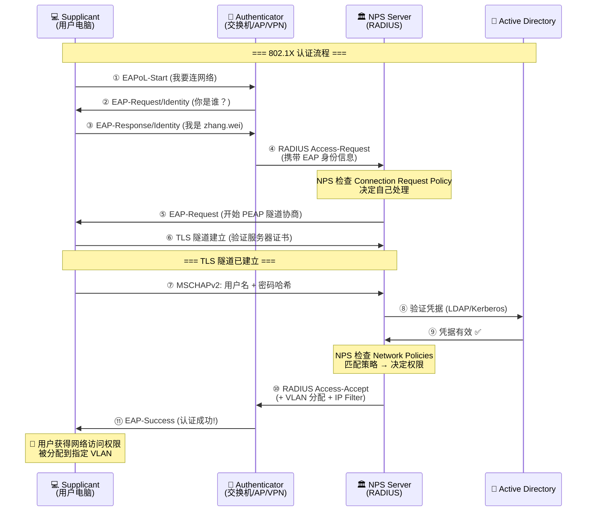
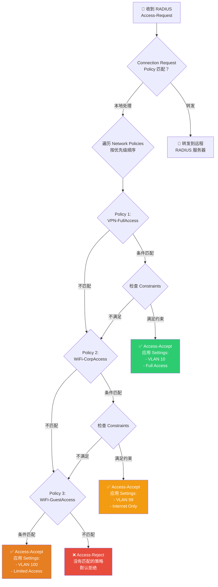
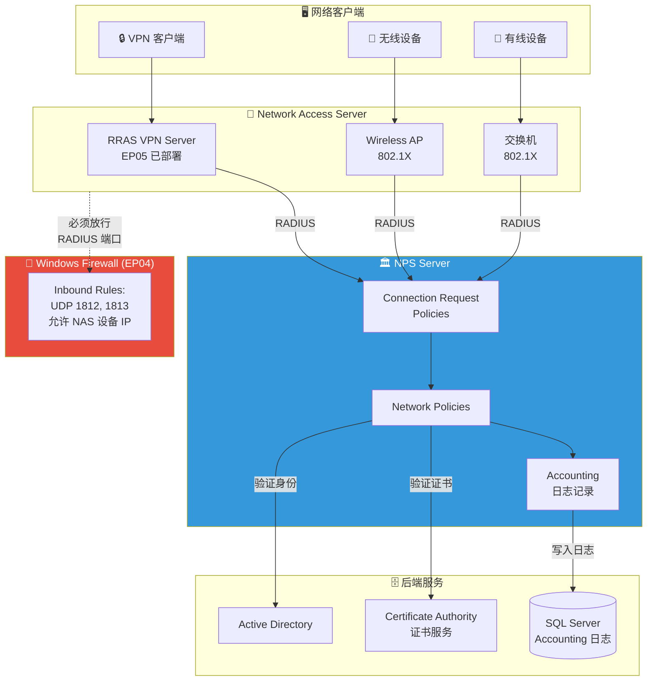

# 🔑 EP06: 网络身份验证官 — NPS/RADIUS 与 802.1X

> **预计时长**: 12-15 分钟  
> **难度级别**: ⭐⭐⭐⭐ 进阶  
> **前置知识**: EP01 TCP/IP 基础、EP04 Windows Firewall、EP05 VPN

---

## 🎬 开场白 / Opening

**[0:00 - 0:30]**

> 大家好，欢迎回到 Windows 网络系列课程！
>
> 上集我们帮小明搭建了 VPN，让出差的同事可以远程办公。但有个问题——
> **VPN 的门开了，谁来把关？**
>
> 如果有人捡到同事的账号密码，是不是就能大摇大摆地走进公司网络？
>
> 今天我们请出 Windows 世界的"网络身份验证官"——**NPS (Network Policy Server)**，
> 让它帮小明管住网络的大门。

---

## 📍 场景设定 / Scene

**[0:30 - 1:30]**

### 🏢 星辰科技的新危机

VPN 上线一周后，小明收到了安全团队的告警：

```
⚠️ 安全告警：
- 凌晨 3:17 AM，用户 "zhang.wei" 从越南 IP 登录了 VPN
- 张伟本人确认当时在家睡觉
- 怀疑账号密码已泄露
```

老板把小明叫到办公室：

> "小明啊，VPN 是方便了，但安全怎么保证？  
> **必须验证每个连接者的身份，还要控制谁能访问什么！**  
> 不是所有人都需要访问财务服务器的，对吧？"

小明意识到——光有 VPN 还不够，还需要一个**集中化的身份验证和访问控制系统**。

他搜索了一番，找到了 Windows Server 自带的 **NPS (Network Policy Server)**——微软的 RADIUS 服务器实现。

---

## 🧠 核心概念 / Core Concepts

**[1:30 - 8:30]**

### 🎯 理解 RADIUS：机场安检类比

在讲 NPS 之前，我们先来理解 **RADIUS 协议**。

想象一下**机场的安检流程**：

| 机场安检 | RADIUS 概念 | 说明 |
|---------|------------|------|
| 🧳 你（旅客） | Supplicant（请求者） | 想要通过网络的用户或设备 |
| 🛃 安检口（安检员） | Authenticator（认证者） | VPN 服务器、无线 AP、交换机 |
| 🏛️ 安检系统总部 | Authentication Server | NPS/RADIUS 服务器 |
| 🪪 出示身份证 | Authentication（认证） | 你是谁？验证身份 |
| ✅ 查签证/机票 | Authorization（授权） | 你能去哪？允许做什么 |
| 📝 登记出入记录 | Accounting（记账） | 记录你什么时候进出的 |

这就是著名的 **AAA 框架**：

- **Authentication** — 你是谁？（验证身份）
- **Authorization** — 你能做什么？（授权访问）
- **Accounting** — 你做了什么？（审计记录）

> 💡 **重要类比**：NPS 不仅仅是检查身份证（Authentication），它还要查你有没有签证（Authorization），决定你能去哪个国家——这比单纯的用户名密码验证强大得多！

### 🔄 RADIUS 协议工作原理

RADIUS (Remote Authentication Dial-In User Service) 是一个标准协议：

- **端口**: UDP 1812 (Authentication) / UDP 1813 (Accounting)
- **旧端口**: UDP 1645 / UDP 1646（仍被一些旧设备使用）
- **通信模型**: Client-Server 模型
- **加密**: 共享密钥 (Shared Secret) 加密密码字段

```
RADIUS 消息类型：
┌─────────────────────────────────────┐
│ Access-Request    → 客户端请求认证     │
│ Access-Accept     ← 服务器允许访问     │
│ Access-Reject     ← 服务器拒绝访问     │
│ Access-Challenge  ← 服务器要求更多信息  │
│ Accounting-Request → 记录会话信息      │
│ Accounting-Response ← 确认记录完成     │
└─────────────────────────────────────┘
```

### 🏗️ NPS：Windows 的 RADIUS 实现

**NPS (Network Policy Server)** 是 Windows Server 的角色，它是微软对 RADIUS 标准的实现：

| 功能 | 说明 |
|------|------|
| RADIUS Server | 接收并处理认证请求 |
| RADIUS Proxy | 转发请求到其他 RADIUS 服务器 |
| NAP Policy Server | 网络访问保护策略（已弃用） |

NPS 可以对接的身份源：
- **Active Directory Domain Services (AD DS)** — 最常用
- **本地 SAM 账户** — 独立服务器场景
- **SQL Server** — 自定义记账存储

### 🔐 802.1X：端口级别的访问控制

802.1X 是 IEEE 标准，定义了**基于端口的网络访问控制 (Port-Based Network Access Control)**。

三个角色：

1. **Supplicant（请求者）** — 你的电脑/手机上的客户端软件
2. **Authenticator（认证者）** — 交换机或无线 AP（它控制着网络端口）
3. **Authentication Server（认证服务器）** — NPS/RADIUS 服务器

> 🎯 **关键理解**：Authenticator（交换机/AP）自己不做认证决策！它只是一个"传话筒"，把你的身份信息转发给后面的 NPS 服务器，NPS 说放行才放行。

### 🔑 EAP 方法：验证身份的多种方式

**EAP (Extensible Authentication Protocol)** 是 802.1X 使用的认证框架，它支持多种验证方式：

| EAP 方法 | 凭据类型 | 安全性 | 适用场景 |
|----------|---------|--------|---------|
| **EAP-TLS** | 客户端证书 + 服务端证书 | ⭐⭐⭐⭐⭐ 最高 | 企业环境，有 PKI 基础设施 |
| **PEAP-MSCHAPv2** | 用户名密码 + 服务端证书 | ⭐⭐⭐⭐ 高 | 最常用，不需要客户端证书 |
| **EAP-TTLS** | 用户名密码 + 服务端证书 | ⭐⭐⭐⭐ 高 | 非 Windows 环境常用 |
| **MSCHAPv2** (无 EAP) | 用户名密码 | ⭐⭐⭐ 中 | 旧式 VPN 兼容 |

> 💡 **选择建议**：
> - 有 PKI → 首选 **EAP-TLS**（最安全，双向证书认证）
> - 没 PKI → 使用 **PEAP-MSCHAPv2**（用密码但通道加密）
> - 回忆 EP05 VPN 的 IKEv2？它就可以配合 EAP-TLS！

### 📋 NPS 策略：三层决策体系

NPS 使用三种策略来处理请求：

**1. Connection Request Policies（连接请求策略）**
> "这个请求我自己处理，还是转发给其他 RADIUS 服务器？"

**2. Network Policies（网络策略）** — 最核心！
> "这个用户/设备满足什么条件？允许还是拒绝？给什么权限？"

**3. Health Policies（健康策略）**
> "这台设备健康吗？防病毒更新了吗？"（NAP 已弃用，但概念仍在）

Network Policy 的三个组成部分：

```
Network Policy = Conditions + Constraints + Settings
                 ↓            ↓              ↓
             "谁来了？"    "满足什么条件？"  "给什么权限？"

Conditions（条件）:
  - Windows Groups: "Domain Users", "VPN-Users"
  - Day and Time: 工作日 8:00-20:00
  - NAS Port Type: VPN, Wireless, Ethernet
  - Client IPv4 Address: 来自哪个 NAS 设备

Constraints（约束）:
  - Authentication Methods: 要求 EAP-TLS 或 PEAP
  - Idle Timeout: 空闲 30 分钟断开
  - Session Timeout: 最长连接 8 小时
  - Called Station ID: 限定特定 SSID

Settings（设置）:
  - IP Filters: 只允许访问特定网段
  - VLAN: 分配到指定 VLAN
  - Encryption: 要求 MPPE 128-bit
```

---

## 🏗️ 架构图解 / Architecture

**[8:30 - 10:00]**

### 802.1X 认证流程



### NPS 策略决策树



### NPS 整体架构



---

## 🔧 实操演示 / Demo

**[10:00 - 13:00]**

### Step 1: 安装 NPS 角色

```powershell
# 安装 Network Policy Server 角色
Install-WindowsFeature NPAS -IncludeManagementTools

# 验证安装
Get-WindowsFeature NPAS

# 输出示例：
# Display Name                Name       Install State
# ------------                ----       -------------
# [X] Network Policy and ...  NPAS       Installed
```

### Step 2: 在 Active Directory 中注册 NPS

```powershell
# NPS 必须在 AD 中注册，才能读取用户账户信息
# 方法1：使用 netsh
netsh nps add registeredserver domain=startech.local server=NPS-SRV01

# 方法2：使用 NPS 控制台
# NPS MMC → 右键 NPS (Local) → Register Server in Active Directory
```

### Step 3: 配置 RADIUS Client（VPN 服务器）

```powershell
# 添加 RADIUS Client — 就是告诉 NPS "谁会发请求给我"
# 这里把我们 EP05 的 VPN 服务器加进来

# 使用 netsh 添加 RADIUS Client
netsh nps add client `
    name="VPN-Server-01" `
    address="10.1.1.5" `
    sharedsecret="MyStr0ng$ecret!2026"

# 查看已配置的 RADIUS Clients
netsh nps show client
```

### Step 4: 配置 Network Policy

```powershell
# 查看当前 NPS 配置
netsh nps show config

# 查看所有 Network Policies
netsh nps show np

# NPS 策略主要通过 MMC 控制台配置：
# 1. 打开 NPS MMC: nps.msc
# 2. 导航到 Policies → Network Policies
# 3. 新建策略：
#    - 策略名称: "VPN-FullTime-Employees"
#    - 条件 Conditions:
#      - Windows Groups = "VPN-Users"（AD 安全组）
#      - NAS Port Type = "Virtual (VPN)"
#    - 约束 Constraints:
#      - Authentication Methods: PEAP (EAP-MSCHAPv2)
#      - Idle Timeout: 30 minutes
#    - 设置 Settings:
#      - IP Filters: 允许访问 10.1.0.0/16
#      - Encryption: Require MPPE 128-bit
```

### Step 5: 配置 VPN 服务器使用 RADIUS

```powershell
# 在 VPN 服务器 (RRAS) 上，将认证方式改为 RADIUS
# 方法：RRAS MMC → 右键服务器 → Properties → Security
#   Authentication provider: RADIUS Authentication
#   Accounting provider: RADIUS Accounting
#   添加 RADIUS 服务器: NPS-SRV01 的 IP

# 或者通过注册表确认 RADIUS 配置
Get-ItemProperty "HKLM:\SYSTEM\CurrentControlSet\Services\RemoteAccess\Authentication"
```

### Step 6: 防火墙规则（连接 EP04）

```powershell
# 在 NPS 服务器上，确保 RADIUS 端口已开放
# 回忆 EP04 Windows Firewall 的知识

New-NetFirewallRule -DisplayName "RADIUS Authentication" `
    -Direction Inbound `
    -Protocol UDP `
    -LocalPort 1812 `
    -RemoteAddress 10.1.1.5 `
    -Action Allow `
    -Profile Domain

New-NetFirewallRule -DisplayName "RADIUS Accounting" `
    -Direction Inbound `
    -Protocol UDP `
    -LocalPort 1813 `
    -RemoteAddress 10.1.1.5 `
    -Action Allow `
    -Profile Domain

# 验证防火墙规则
Get-NetFirewallRule -DisplayName "RADIUS*" | Format-Table DisplayName, Enabled, Direction, Action
```

### Step 7: 查看 NPS 日志和事件

```powershell
# 查看 NPS 相关事件日志
Get-WinEvent -LogName "Security" -FilterXPath "*[System[EventID=6272 or EventID=6273]]" -MaxEvents 10 |
    Format-Table TimeCreated, Id, Message -Wrap

# 事件 ID 说明：
# 6272 = NPS 授予用户访问权限 (Access-Accept)
# 6273 = NPS 拒绝用户访问 (Access-Reject)
# 6274 = NPS 丢弃请求
# 6278 = NPS 授予完全访问 (Connection matched)

# 查看 NPS Accounting 日志（默认位置）
Get-ChildItem "C:\Windows\System32\LogFiles\IN*.log"

# 查看最近的 NPS 日志内容
Get-Content "C:\Windows\System32\LogFiles\IN*.log" -Tail 20

# 用 netsh 导出完整 NPS 配置（备份！）
netsh nps export filename="C:\Backup\NPS-Config-Backup.xml" exportPSK=YES
```

### Step 8: 无线 802.1X 配置要点

```powershell
# 无线 802.1X 的 NPS 端配置与 VPN 类似
# 区别在于 RADIUS Client 是无线 AP

# 添加无线 AP 作为 RADIUS Client
netsh nps add client `
    name="WiFi-AP-Floor3" `
    address="10.1.2.10" `
    sharedsecret="WiFi$ecret!2026"

# 创建无线专用的 Network Policy
# 条件: NAS Port Type = "Wireless - IEEE 802.11"
# 条件: Windows Groups = "WiFi-Corp-Users"
# 认证: PEAP-MSCHAPv2
# 设置: VLAN ID = 10 (Corporate VLAN)

# 创建访客 WiFi 策略
# 条件: NAS Port Type = "Wireless - IEEE 802.11"
# 条件: Windows Groups = "WiFi-Guest-Users"
# 设置: VLAN ID = 99 (Guest VLAN, Internet Only)
```

---

## 📝 讲稿要点 / Script Notes

**讲解节奏与过渡语建议：**

1. **开场引入恐惧感**
   - "你以为 VPN 已经安全了？如果密码泄露呢？"
   - 用真实安全事件引发观众思考

2. **机场安检类比要反复使用**
   - 每讲一个概念就拉回类比："就像安检员不仅看身份证，还要扫描你的行李"
   - AAA 对应：查身份证、查签证、登记出入

3. **强调 NPS 是"中央大脑"**
   - "交换机和 AP 自己不做决定，它们只是安检口的工作人员，真正拍板的是后面的系统"
   - 这帮助观众理解分布式认证的核心思想

4. **EAP 方法选择要给明确建议**
   - "如果你公司有 CA 服务器（证书服务），毫不犹豫选 EAP-TLS"
   - "如果没有，PEAP-MSCHAPv2 是最佳选择"

5. **关联前几集内容**
   - "记得 EP04 的防火墙吗？NPS 的 RADIUS 端口也需要放行！"
   - "EP05 的 VPN 服务器，现在要改成用 RADIUS 认证了"

6. **策略优先级要重点讲**
   - "NPS 的策略是按顺序匹配的，第一个匹配的策略就生效！"
   - "所以把最严格的策略放前面，最宽松的放后面"

7. **实际企业场景**
   - VPN 用户按部门分组，不同组有不同的 IP 过滤规则
   - 无线网络分企业内网和访客网络
   - 有线 802.1X 保护服务器机房端口

---

## ✅ 本集总结 / Summary

**[13:00 - 14:00]**

### 🔑 关键知识点回顾

| # | 知识点 | 一句话总结 |
|---|--------|-----------|
| 1 | RADIUS 协议 | AAA 三位一体：认证 + 授权 + 记账 |
| 2 | NPS 角色 | Windows Server 内置的 RADIUS 服务器 |
| 3 | 802.1X 三角 | Supplicant → Authenticator → Authentication Server |
| 4 | EAP 方法 | EAP-TLS（证书）最安全，PEAP-MSCHAPv2（密码）最常用 |
| 5 | Network Policy | Conditions + Constraints + Settings = 谁 + 怎样 + 给什么 |
| 6 | 集中化管理 | 一台 NPS 服务器管控所有 VPN、WiFi、有线接入 |

### 🧠 记忆口诀

```
RADIUS 三个 A，认证授权加记账；
NPS 是大脑，AP 交换做传达；
八零二点一 X 标准，端口控制靠三方；
EAP-TLS 最安全，PEAP 密码也不差；
策略条件加约束，设置权限分天下！
```

### ⚡ 小明的成果

经过这一集的学习，小明为星辰科技实现了：

- ✅ 部署 NPS 服务器，集中管理所有网络接入认证
- ✅ VPN 从本地认证升级为 RADIUS 认证
- ✅ 创建了基于部门的网络访问策略
- ✅ 配置了 NPS 审计日志，可以追踪谁在什么时候访问了网络
- ✅ 为后续的无线 802.1X 做好了准备

---

## 👉 下集预告 / Next Episode

**[14:00 - 14:30]**

> 认证搞定了，但小明又收到新需求——
>
> **产品经理说："能不能搞个共享文件夹？大家用 U 盘传文件太低效了！"**
>
> 而且研发部还有几台 Linux 服务器，它们用的不是 Windows 的文件共享协议...
>
> **下一集：📁 EP07 — 文件共享的秘密：SMB 与 NFS**
>
> 我们将深入 Windows 文件共享的核心协议 SMB，看看它如何从上古时代的 SMB 1.0
> 演进到今天支持加密、多通道、RDMA 的 SMB 3.1.1！
>
> 敬请期待！

---

## 📚 参考资源

- [NPS 官方文档](https://learn.microsoft.com/en-us/windows-server/networking/technologies/nps/nps-top)
- [802.1X Wired Access](https://learn.microsoft.com/en-us/windows-server/networking/core-network-guide/cncg/server-certs/deploy-server-certificates)
- [RADIUS Protocol RFC 2865](https://www.rfc-editor.org/rfc/rfc2865)
- [EAP Methods](https://learn.microsoft.com/en-us/windows-server/networking/technologies/nps/nps-plan-eap)

---

> 📺 **本集视频课程到此结束！**  
> 如果觉得有帮助，请点赞、收藏、关注，我们下集见！ 👋
