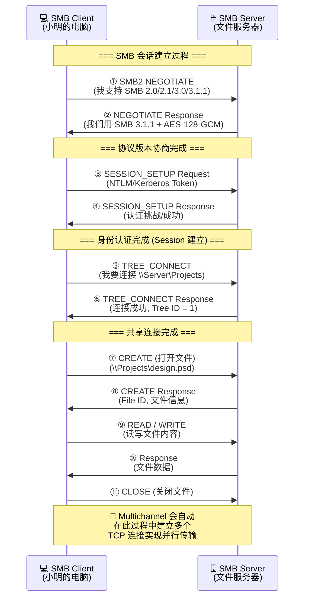
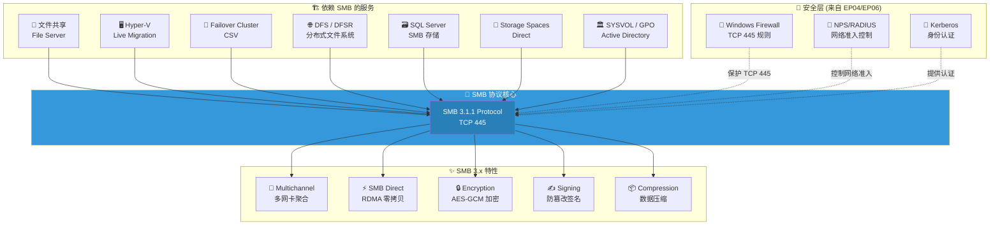
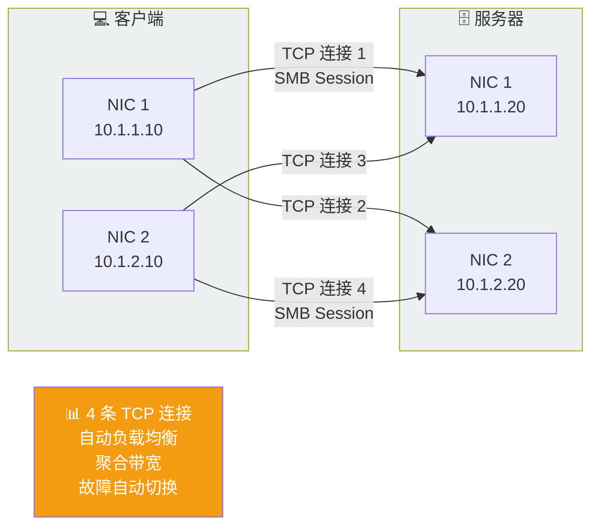

# 📁 EP07: 文件共享的秘密 — SMB 与 NFS

> **预计时长**: 12-15 分钟  
> **难度级别**: ⭐⭐⭐ 中级  
> **前置知识**: EP01 TCP/IP 基础、EP03 DNS

---

## 🎬 开场白 / Opening

**[0:00 - 0:30]**

> 大家好，欢迎回到 Windows 网络系列课程！
>
> 上一集我们用 NPS 管住了网络的大门，确保只有合法用户才能接入。
> 但用户接入网络是为了什么？——**访问资源！**
>
> 最基本的资源是什么？**文件！**
>
> 今天我们来聊聊 Windows 世界里最重要的文件共享协议——**SMB**。
> 它不仅仅是"共享文件夹"那么简单，整个 Windows 生态都建立在它之上！

---

## 📍 场景设定 / Scene

**[0:30 - 1:30]**

### 🏢 星辰科技的文件困境

项目经理老王冲进 IT 办公室：

> "小明！我们项目组 8 个人要共享设计文件，大家现在用 **U 盘**和**微信**传来传去，
> 版本都乱了！上次小李用的还是上周的旧版本，差点出大事！
> **能不能搞个共享文件夹，大家都能访问的那种？**"

小明觉得这简单——建个共享文件夹就行。但紧接着，研发部的张工也来了：

> "小明，我们有 3 台 **Linux** 服务器跑编译任务，需要和 Windows 工作站共享代码。
> Linux 那边习惯用 **NFS**，Windows 这边用 **SMB**，能不能都支持？"

而且 CTO 还提出了性能要求：

> "我们的设计文件动辄几个 GB，传输速度必须快！能不能利用好服务器上的两块网卡？"

小明意识到，"共享文件夹"背后的技术远比想象的复杂——他需要深入了解 **SMB 协议**。

---

## 🧠 核心概念 / Core Concepts

**[1:30 - 8:30]**

### 📚 SMB：图书馆借阅系统

把 SMB 想象成一个**图书馆的借阅系统**：

| 图书馆 | SMB 概念 | 说明 |
|--------|---------|------|
| 📖 书籍 | 文件/目录 | 你要访问的资源 |
| 🏛️ 图书馆 | SMB Server | 存放文件的服务器 |
| 🪪 借书证 | SMB Session | 你的身份认证凭据 |
| 📋 借阅登记 | Tree Connect | 连接到某个共享文件夹 |
| 🤝 管理员 | SMB 协议 | 你和图书馆之间的沟通规则 |

> 💡 **类比要点**：你不直接去书架拿书（不直接访问磁盘），而是告诉管理员你要哪本书（通过 SMB 协议请求），管理员帮你找到并递给你（服务器处理请求并返回数据）。

而 **NFS** 就像另一家图书馆的借阅系统——规矩不同（协议不同），但目的一样（文件共享）。Linux 世界的图书馆用 NFS 规矩，Windows 世界的用 SMB 规矩。

### 📜 SMB 协议演进史

SMB 的发展是一部"不断打补丁"的进化史：

| 版本 | 发布年份 | 引入系统 | 关键改进 |
|------|---------|---------|---------|
| **SMB 1.0 / CIFS** | 1990s | Windows NT | 最初版本，基于 NetBIOS，性能差 |
| **SMB 2.0** | 2006 | Windows Vista / Server 2008 | 大幅简化命令，减少"聊天" |
| **SMB 2.1** | 2009 | Windows 7 / Server 2008 R2 | 大 MTU 支持，持久句柄 |
| **SMB 3.0** | 2012 | Windows 8 / Server 2012 | 🔥 **革命性更新！** |
| **SMB 3.0.2** | 2013 | Windows 8.1 / Server 2012 R2 | 禁用 SMB 1.0 支持 |
| **SMB 3.1.1** | 2015 | Windows 10 / Server 2016 | 加密协商改进，预认证完整性 |

> ⚠️ **安全警告**：**SMB 1.0 必须禁用！** 2017 年的 WannaCry 勒索病毒就是利用 SMB 1.0 的 EternalBlue 漏洞传播的。如果你的环境还有 SMB 1.0，今天就关掉它！

### 🚀 SMB 3.x 的五大杀手级特性

#### 1. SMB Multichannel — 多通道并行传输

```
传统模式（单网卡）:
  [客户端 NIC1] ──────────→ [服务器 NIC1]
  带宽: 10 Gbps

Multichannel（多网卡）:
  [客户端 NIC1] ──────────→ [服务器 NIC1]
  [客户端 NIC2] ──────────→ [服务器 NIC2]
  带宽: 20 Gbps (聚合！)
```

- **自动检测**：如果客户端和服务器都有多块网卡，SMB 会**自动**建立多个连接
- **负载均衡**：数据自动分散到多个通道
- **故障转移**：一块网卡挂了，流量自动切到另一块
- **无需配置**：不需要 NIC Teaming，SMB 自己搞定！

#### 2. SMB Direct — RDMA 绕过 CPU

```
传统文件传输:
  应用 → 内核 → CPU 拷贝 → 网卡 → 网络
  (CPU 很忙，延迟高)

SMB Direct (RDMA):
  应用 → 网卡 → 网络
  (CPU 几乎不参与，延迟极低！)
```

- 需要支持 RDMA 的网卡（iWARP, RoCE, InfiniBand）
- 常用于 Hyper-V 和 Storage Spaces Direct 场景
- 延迟可降低到微秒级别

#### 3. SMB Encryption — 传输加密

- SMB 3.0: 支持 AES-128-CCM 加密
- SMB 3.1.1: 支持 AES-128-GCM 和 AES-256-GCM（更快更安全）
- 可以按共享文件夹级别或全局开启加密
- **替代方案对比**：不需要 IPsec VPN 也能保护 SMB 流量！

#### 4. SMB Signing — 防篡改

- 对每个 SMB 消息生成签名
- 防止中间人攻击修改文件内容
- Domain Controller 之间的 SMB 通信**默认**要求签名
- SMB 3.1.1 使用 AES-CMAC 算法（比旧的 HMAC-MD5 强得多）

#### 5. SMB Compression — 压缩传输

- Windows Server 2022 / Windows 11 引入
- 对可压缩数据自动压缩后传输
- 支持 LZ77, LZ77+Huffman, LZNT1 算法
- 特别适合大文本文件、日志文件的传输

### 🌐 谁在依赖 SMB？

很多人以为 SMB 只是"共享文件夹"，其实 **整个 Windows 基础设施都建立在 SMB 之上**：

| 使用者 | 如何使用 SMB | 说明 |
|--------|------------|------|
| **Hyper-V Live Migration** | 通过 SMB 3.0 传输 VM 内存 | 虚拟机不停机迁移 |
| **Failover Cluster CSV** | Cluster Shared Volumes 基于 SMB | 多节点同时读写 |
| **DFS / DFSR** | DFS Namespace 和 Replication 依赖 SMB | 分布式文件系统 |
| **SQL Server** | SMB 3.0 上的数据库文件存储 | 高性能数据库后端 |
| **Storage Spaces Direct (S2D)** | 节点间数据通过 SMB Direct 传输 | 软件定义存储 |
| **SYSVOL / NETLOGON** | 域控制器的策略和脚本共享 | Active Directory 核心 |
| **Group Policy** | GPO 模板存储在 SYSVOL (SMB 共享) | 组策略分发 |

> 💡 **关键认知**：SMB 出问题 = 整个 Windows 生态出问题。这就是为什么理解 SMB 如此重要！

### 🐧 NFS：Linux 世界的文件共享

当你的环境中有 Linux 服务器时，需要了解 NFS (Network File System)：

| 特性 | NFSv3 | NFSv4.1 |
|------|-------|---------|
| 状态 | 无状态 | 有状态 |
| 端口 | 动态端口 (portmap) | 固定 TCP 2049 |
| 安全 | AUTH_SYS (UID/GID) | Kerberos 支持 |
| 锁定 | 单独的 NLM 协议 | 内置锁定 |
| 防火墙友好 | ❌ 困难 | ✅ 单端口 |

Windows Server 可以同时充当 **SMB Server** 和 **NFS Server**：

```
Windows Server
├── SMB 共享: \\server\projects   ← Windows 客户端访问
└── NFS 导出: server:/exports     ← Linux 客户端挂载
```

### 🆚 SMB vs NFS 对比

| 维度 | SMB 3.1.1 | NFSv4.1 |
|------|-----------|---------|
| 主要平台 | Windows | Linux/Unix |
| 认证 | Kerberos / NTLM | Kerberos / AUTH_SYS |
| 加密 | 内置 AES | 需要 Kerberos 5p |
| 多通道 | ✅ Multichannel | ✅ pNFS (Parallel NFS) |
| 性能 | 优秀 | 优秀 |
| 管理工具 | PowerShell / GUI | CLI (exportfs, mount) |
| Windows 集成 | 原生 | 需安装 NFS 组件 |

---

## 🏗️ 架构图解 / Architecture

**[8:30 - 10:00]**

### SMB 会话建立流程



### SMB 生态系统全景



### SMB Multichannel 工作原理



---

## 🔧 实操演示 / Demo

**[10:00 - 13:00]**

### Step 1: 检查 SMB 协议版本

```powershell
# 查看服务器启用了哪些 SMB 版本
Get-SmbServerConfiguration | Select-Object EnableSMB1Protocol, EnableSMB2Protocol

# 确保 SMB 1.0 已禁用！(安全第一)
Set-SmbServerConfiguration -EnableSMB1Protocol $false -Force

# 检查 SMB 客户端配置
Get-SmbClientConfiguration | Select-Object EnableBandwidthThrottling, EnableMultiChannel

# 查看服务器支持的 SMB 方言版本
Get-SmbConnection | Select-Object ServerName, ShareName, Dialect
```

### Step 2: 创建和管理 SMB 共享

```powershell
# 创建一个共享文件夹
New-Item -Path "D:\SharedFolders\Projects" -ItemType Directory -Force

# 创建 SMB 共享
New-SmbShare -Name "Projects" `
    -Path "D:\SharedFolders\Projects" `
    -Description "项目组共享文件夹" `
    -FullAccess "STARTECH\ProjectManagers" `
    -ChangeAccess "STARTECH\Developers" `
    -ReadAccess "STARTECH\Domain Users" `
    -EncryptData $true  # 强制加密！

# 查看所有共享
Get-SmbShare | Format-Table Name, Path, Description, EncryptData

# 查看共享的访问权限
Get-SmbShareAccess -Name "Projects" | Format-Table AccountName, AccessControlType, AccessRight

# 修改共享属性
Set-SmbShare -Name "Projects" -CachingMode None -Force  # 禁用离线缓存
```

### Step 3: 监控 SMB 连接和会话

```powershell
# 查看当前的 SMB 连接（客户端视角）
Get-SmbConnection | Format-Table ServerName, ShareName, UserName, Dialect, NumOpens

# 查看当前的 SMB 会话（服务器视角）
Get-SmbSession | Format-Table SessionId, ClientComputerName, ClientUserName, NumOpens

# 查看打开的文件
Get-SmbOpenFile | Format-Table FileId, SessionId, Path, ClientComputerName, ClientUserName

# 断开特定用户的会话（管理员操作）
# Close-SmbSession -SessionId <ID> -Force
```

### Step 4: SMB Multichannel 验证

```powershell
# 查看 Multichannel 连接状态
Get-SmbMultichannelConnection | Format-Table ServerName, ClientInterfaceIndex,
    ServerInterfaceIndex, ClientIpAddress, ServerIpAddress, Selected

# 查看 Multichannel 约束
Get-SmbMultichannelConstraint

# 查看服务器网络接口（SMB 可见的）
Get-SmbServerNetworkInterface | Format-Table InterfaceIndex, IpAddress,
    LinkSpeed, RdmaCapable

# 查看客户端网络接口
Get-SmbClientNetworkInterface | Format-Table InterfaceIndex, IpAddress,
    LinkSpeed, RdmaCapable, RssCapable
```

### Step 5: SMB 安全配置

```powershell
# 启用 SMB 加密（全局）
Set-SmbServerConfiguration -EncryptData $true -Force

# 启用 SMB 签名（拒绝未签名的连接）
Set-SmbServerConfiguration -RequireSecuritySignature $true -Force

# 查看完整的 SMB 服务器安全配置
Get-SmbServerConfiguration | Select-Object `
    EncryptData, `
    RejectUnencryptedAccess, `
    RequireSecuritySignature, `
    EnableSMB1Protocol, `
    EnableSMB2Protocol

# 设定最低 SMB 加密算法（Server 2022+）
Set-SmbServerConfiguration -EncryptionCiphers "AES_256_GCM" -Force

# 审计 SMB 访问
Get-SmbShare -Name "Projects" | Set-SmbShare -FolderEnumerationMode AccessBased -Force
```

### Step 6: NFS 服务器配置（跨平台场景）

```powershell
# 安装 NFS Server 角色
Install-WindowsFeature FS-NFS-Service -IncludeManagementTools

# 创建 NFS 导出目录
New-Item -Path "D:\NFS-Exports\DevCode" -ItemType Directory -Force

# 创建 NFS 共享
New-NfsShare -Name "DevCode" `
    -Path "D:\NFS-Exports\DevCode" `
    -AllowRootAccess $true `
    -Permission ReadWrite

# 配置 NFS 共享权限
Grant-NfsSharePermission -Name "DevCode" `
    -ClientName "10.1.3.0/24" `
    -ClientType Subnet `
    -Permission ReadWrite `
    -AllSquash $false

# 查看 NFS 共享
Get-NfsShare | Format-Table Name, Path, NetworkName

# Linux 客户端挂载命令:
# mount -t nfs4 fileserver:/DevCode /mnt/devcode
```

### Step 7: 防火墙规则（连接 EP04）

```powershell
# SMB 防火墙规则（大多数情况已默认存在）
Get-NetFirewallRule -DisplayGroup "File and Printer Sharing" |
    Where-Object { $_.Enabled -eq "True" } |
    Format-Table DisplayName, Direction, Action, Profile

# 如果需要手动创建 SMB 规则
New-NetFirewallRule -DisplayName "SMB Inbound" `
    -Direction Inbound `
    -Protocol TCP `
    -LocalPort 445 `
    -Action Allow `
    -Profile Domain

# NFS 防火墙规则
New-NetFirewallRule -DisplayName "NFS Inbound" `
    -Direction Inbound `
    -Protocol TCP `
    -LocalPort 2049 `
    -Action Allow `
    -Profile Domain
```

### Step 8: SMB 性能诊断

```powershell
# 查看 SMB 统计信息
Get-SmbServerConfiguration | Select-Object `
    MaxChannelPerSession, `
    AsynchronousCredits, `
    MaxSessionPerConnection

# 使用 Performance Counter 监控 SMB
Get-Counter "\SMB Server Shares(*)\Current Open File Count"
Get-Counter "\SMB Server Shares(*)\Data Bytes/sec"
Get-Counter "\SMB Server Sessions(*)\*" -MaxSamples 1

# SMB 客户端诊断
Get-SmbConnection | Where-Object { $_.Dialect -lt "3.0" }
# 如果有低于 3.0 的连接，说明有旧客户端！

# 检查 SMB 直连 (RDMA) 状态
Get-NetAdapterRdma | Format-Table Name, InterfaceDescription, Enabled
```

---

## 📝 讲稿要点 / Script Notes

**讲解节奏与过渡语建议：**

1. **从痛点开始**
   - "U盘传文件？微信发文件？这是 2003 年的做法！"
   - 引发观众共鸣——大家都经历过版本混乱的痛苦

2. **SMB 不仅仅是"共享文件夹"**
   - 这是本集最重要的认知升级
   - "你以为 SMB 只是右键共享？其实 Hyper-V、集群、AD 都离不开它！"
   - 展示 SMB 生态系统图时，要逐个点亮每个依赖者

3. **版本演进要讲故事**
   - "SMB 1.0 是 90 年代的产物，那时候大家还在用拨号上网"
   - "2017 年 WannaCry 横扫全球，就是因为太多服务器还开着 SMB 1.0"
   - "SMB 3.0 是 2012 年的革命——多通道、RDMA、加密，一步到位"

4. **Multichannel 用快递类比**
   - "以前一个快递员送货，现在四个快递员同时送，速度翻倍！"
   - "而且一个快递员生病了，其他三个继续送，不影响"

5. **SMB 1.0 禁用要严肃**
   - "这不是建议，这是**必须**！SMB 1.0 就像一扇没有锁的门"
   - 演示 `Set-SmbServerConfiguration -EnableSMB1Protocol $false`

6. **NFS 简要带过**
   - "NFS 是 Linux 世界的 SMB，当你有混合环境时需要了解"
   - 不要深入 NFS 细节，点到为止

7. **关联前面的知识**
   - "TCP 445——记得 EP01 的端口知识吗？"
   - "Kerberos 认证——EP06 讲的 NPS/RADIUS 控制谁能接入网络，SMB 用 Kerberos 验证具体身份"
   - "防火墙——EP04 的知识，SMB TCP 445 需要放行"

---

## ✅ 本集总结 / Summary

**[13:00 - 14:00]**

### 📁 关键知识点回顾

| # | 知识点 | 一句话总结 |
|---|--------|-----------|
| 1 | SMB 协议 | Windows 文件共享的核心，不仅仅是共享文件夹 |
| 2 | SMB 版本 | 必须用 SMB 3.x，**禁用 SMB 1.0**！ |
| 3 | Multichannel | 多网卡自动聚合，带宽翻倍 + 故障转移 |
| 4 | SMB Direct | RDMA 绕过 CPU，微秒级延迟 |
| 5 | SMB Encryption | AES-GCM 加密，无需 VPN 保护文件传输 |
| 6 | SMB 生态 | Hyper-V、集群、DFS、AD 都依赖 SMB |
| 7 | NFS | Linux 文件共享协议，Windows 可以同时支持 |

### 🧠 记忆口诀

```
SMB 文件共享王，四四五端口来帮忙；
一零版本必须关，三幺幺版最安强；
多通道聚合快，RDMA 直传不彷徨；
加密签名防篡改，生态系统都依赖；
NFS 对应 Linux 端，混合环境两手抓！
```

### ⚡ 小明的成果

经过这一集的学习，小明为星辰科技实现了：

- ✅ 创建了加密的 SMB 共享文件夹，项目组高效协作
- ✅ 禁用了 SMB 1.0，堵住了安全隐患
- ✅ 利用 Multichannel 实现了双网卡聚合，传输速度翻倍
- ✅ 部署了 NFS Server，让研发部的 Linux 服务器也能访问共享文件
- ✅ 配置了 ABE (Access-Based Enumeration)，用户只能看到有权限的文件夹

---

## 👉 下集预告 / Next Episode

**[14:00 - 14:30]**

> 文件共享搞定了，但小明又听到新的抱怨——
>
> **深圳分公司的同事说："下载文件太慢了！每次从北京总部拉文件要等半天！"**
>
> 更糟糕的是，每月 WSUS 推送更新的时候，30 个人同时下载补丁，
> WAN 链路直接被打满，全公司上不了网...
>
> **下一集：📦 EP08 — 看不见的搬运工：WinHTTP, BITS 与 BranchCache**
>
> 我们将认识那些在后台默默工作的网络组件——
> 专业的 HTTP 代理(WinHTTP)、智能的后台传输(BITS)、以及
> 分支办公室的"本地仓库"(BranchCache)！
>
> 敬请期待！

---

## 📚 参考资源

- [SMB 概述 - Microsoft Learn](https://learn.microsoft.com/en-us/windows-server/storage/file-server/file-server-smb-overview)
- [SMB 安全增强](https://learn.microsoft.com/en-us/windows-server/storage/file-server/smb-security)
- [SMB Multichannel](https://learn.microsoft.com/en-us/previous-versions/windows/it-pro/windows-server-2012-R2-and-2012/dn610980(v=ws.11))
- [NFS on Windows Server](https://learn.microsoft.com/en-us/windows-server/storage/nfs/nfs-overview)
- [Disable SMB 1.0](https://learn.microsoft.com/en-us/windows-server/storage/file-server/troubleshoot/detect-enable-and-disable-smbv1-v2-v3)

---

> 📺 **本集视频课程到此结束！**  
> 如果觉得有帮助，请点赞、收藏、关注，我们下集见！ 👋
