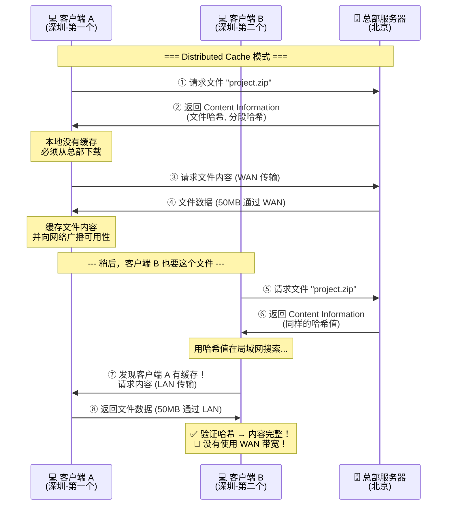
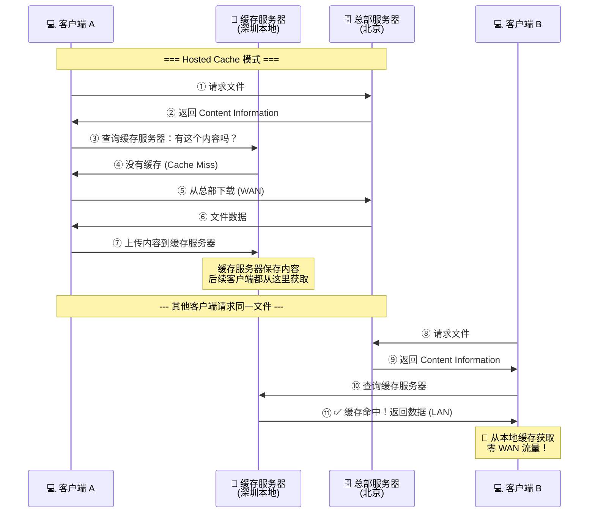
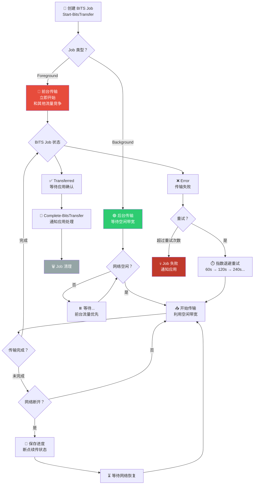
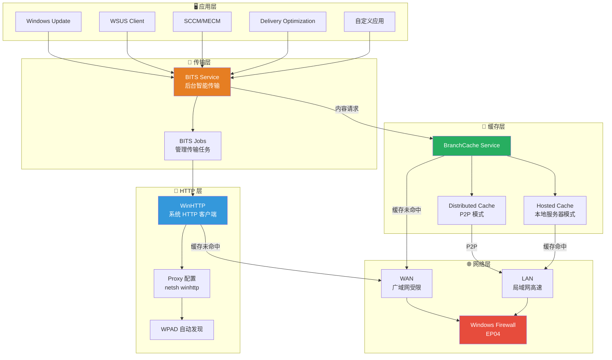

# 📦 EP08: 看不见的搬运工 — WinHTTP, BITS 与 BranchCache

> **预计时长**: 12-15 分钟  
> **难度级别**: ⭐⭐⭐ 中级  
> **前置知识**: EP01 TCP/IP 基础、EP03 DNS、EP07 SMB

---

## 🎬 开场白 / Opening

**[0:00 - 0:30]**

> 大家好，欢迎回到 Windows 网络系列课程！
>
> 前面几集我们搭建了 VPN、配置了 NPS 认证、部署了 SMB 文件共享——
> 这些都是"看得见"的网络服务。
>
> 但你知道吗？在 Windows 系统里，还有一群**看不见的搬运工**，
> 它们每天默默地搬运着数据，你甚至不知道它们的存在！
>
> 今天我们来揭开这些幕后英雄的面纱——
> **WinHTTP**、**BITS** 和 **BranchCache**。

---

## 📍 场景设定 / Scene

**[0:30 - 1:30]**

### 🏢 星辰科技的分公司困境

星辰科技开了**深圳分公司**，30 个员工通过 WAN 专线连到北京总部。

深圳办公室主任老李打来电话：

> "小明啊，我们这边上网太慢了！  
> 从总部服务器下载一个 500MB 的项目文件要等 **20 分钟**！"

小明查了一下 WAN 链路带宽——50Mbps，理论上不应该这么慢啊？

然后到了每月第二个周二——**Windows 补丁日 (Patch Tuesday)**：

> "不好了！30 个人同时下载补丁，WAN 链路**直接被打满**了！  
> 连 ERP 系统都打不开，财务部在叫了！"

小明面对三个问题：
1. **Web 请求走什么路径？** — 代理配置问题 (WinHTTP)
2. **能不能错峰下载？** — 后台智能传输 (BITS)
3. **30 个人下载同一个文件，能不能只下一次？** — 分支缓存 (BranchCache)

---

## 🧠 核心概念 / Core Concepts

**[1:30 - 8:30]**

### 🏪 三个组件的分工类比

先用一个快递公司的类比来理解这三个组件的关系：

| 角色 | 组件 | 类比说明 |
|------|------|---------|
| 📮 **专业快递收发室** | WinHTTP | 公司统一的收发室，所有快递从这里进出，知道该走哪个快递公司（代理） |
| 🚚 **凌晨搬运队** | BITS | 不急的大批货物，趁夜间车少的时候搬运，白天不占用道路 |
| 🏪 **分公司小仓库** | BranchCache | 热门商品在分公司存一份，不用每次从总部调货 |

> 💡 **核心思想**：WinHTTP 决定**怎么发请求**，BITS 决定**什么时候传**，BranchCache 决定**从哪里拿**。

---

### 📮 Part 1: WinHTTP — 专业快递收发室

#### WinHTTP vs WinINet：两套 HTTP 体系

Windows 里有**两套** HTTP 客户端库，很多人搞混：

| 特性 | WinHTTP | WinINet |
|------|---------|---------|
| 设计目的 | **系统服务**使用 | **用户应用**使用 |
| 运行环境 | 服务账户、后台进程 | 交互式用户桌面 |
| 代理设置 | 独立的代理配置 | 使用 IE/系统代理 |
| Cookie/缓存 | 不使用 IE 缓存 | 使用 IE 的 Cookie 和缓存 |
| 典型用户 | WSUS, SCCM, Windows Update | 浏览器, 桌面应用 |

```
用户空间：
  [Chrome] [Edge] [桌面App]
      └──── 使用 WinINet ──── IE/系统代理设置

系统服务空间：
  [Windows Update] [WSUS Agent] [SCCM Client]
      └──── 使用 WinHTTP ──── 独立代理设置
```

> ⚠️ **常见坑**：你在 IE/系统设置里配好了代理，但 Windows Update 还是连不上？因为 Windows Update 用的是 **WinHTTP**，它有自己的代理配置！

#### WinHTTP 代理配置

```
代理配置优先级（从高到低）：
┌──────────────────────────────────┐
│ 1. 应用自身设置                     │
│ 2. netsh winhttp set proxy        │
│ 3. WPAD 自动发现                   │
│ 4. 直接连接（无代理）               │
└──────────────────────────────────┘
```

#### 谁在使用 WinHTTP？

这是关键——很多核心 Windows 服务都依赖 WinHTTP：

| 服务 | 使用场景 |
|------|---------|
| **Windows Update** | 下载补丁和更新 |
| **WSUS Client** | 连接 WSUS 服务器 |
| **SCCM/MECM Client** | 管理点通信 |
| **Azure AD Connect** | 同步到 Azure AD |
| **Defender Antivirus** | 下载病毒定义更新 |
| **WinRM/PowerShell Remoting** | 远程管理通信 |
| **Delivery Optimization** | 对等下载优化 |

> 💡 **排障提示**：当某个 Windows 服务无法连接外部资源时，第一步检查 WinHTTP 代理配置！

#### WebClient 服务：WebDAV 访问

WebClient 是另一个相关服务：

- 让 Windows 资源管理器可以访问 **WebDAV** 共享
- 映射网络驱动器到 SharePoint Online / OneDrive
- 底层使用 WinHTTP 发送 HTTP 请求
- 默认**未启动**，需要手动启用

---

### 🚚 Part 2: BITS — 凌晨搬运队

#### 什么是 BITS？

**BITS (Background Intelligent Transfer Service)** 是 Windows 内置的后台传输服务。

它的设计哲学是：**不打扰前台工作，利用空闲带宽传输**。

```
传统下载（HTTP 直接下载）:
  ████████████████████████  ← 占满带宽
  前台应用：卡顿！

BITS 智能传输:
  ██  ██  ██  ██  ██       ← 利用空闲带宽
  前台应用：流畅！           ← 有前台流量时自动让路
```

#### BITS 的智能特性

| 特性 | 说明 |
|------|------|
| **带宽感知** | 检测网络空闲时才传输，前台有流量时自动降速 |
| **断点续传** | 网络断开后自动恢复，不需要重新下载 |
| **传输优先级** | 支持 Foreground / High / Normal / Low 四级优先级 |
| **错误重试** | 自动重试失败的传输，有指数退避机制 |
| **电源感知** | 笔记本电池供电时可暂停传输 |
| **成本感知** | 检测按流量计费网络，避免产生额外费用 |

#### BITS Job 优先级

```
优先级从高到低：
┌─────────────────────────────────────────────┐
│ 🔴 Foreground  — 和前台应用抢带宽            │
│     适用场景: 用户主动发起的下载              │
│                                              │
│ 🟠 High        — 优先于其他 BITS Job          │
│     适用场景: 紧急的安全补丁                  │
│                                              │
│ 🟡 Normal      — 默认优先级                   │
│     适用场景: 常规 Windows Update              │
│                                              │
│ 🟢 Low         — 只在完全空闲时传输            │
│     适用场景: 非关键的预下载                  │
└─────────────────────────────────────────────┘
```

#### 谁在使用 BITS？

| 服务 | 使用 BITS 的场景 |
|------|-----------------|
| **Windows Update** | 下载补丁包 |
| **WSUS** | 分发补丁到客户端 |
| **SCCM/MECM** | 分发应用包和更新 |
| **Delivery Optimization** | P2P 内容分发 |
| **Azure DevOps Agent** | 下载管道任务 |
| **Edge / Chrome** | 后台更新下载 |

> 💡 **BITS 和 WinHTTP 的关系**：BITS 在传输 HTTP/HTTPS 内容时，底层使用的就是 **WinHTTP**！所以 WinHTTP 的代理配置也会影响 BITS！

---

### 🏪 Part 3: BranchCache — 分公司的小仓库

#### 问题：分支办公室的带宽浪费

```
没有 BranchCache 的情况:

北京总部                    深圳分公司 (30 人)
┌─────────┐   WAN 50Mbps   ┌─────────────────┐
│ 文件服务器 │◄═══════════►│ 员工 A 下载文件1  │ → 50MB
│          │              │ 员工 B 下载文件1  │ → 50MB (同一个文件!)
│          │              │ 员工 C 下载文件1  │ → 50MB (又是同一个!)
│          │              │ ...               │
│          │              │ 员工 Z 下载文件1  │ → 50MB
└─────────┘              └─────────────────┘
                         总 WAN 流量: 50MB × 30 = 1.5 GB !!
```

**30 个人下载同一个文件，WAN 传了 30 次——这是巨大的浪费！**

#### BranchCache 的解决方案

```
有了 BranchCache:

北京总部                    深圳分公司
┌─────────┐   WAN 50Mbps   ┌─────────────────┐
│ 文件服务器 │═══(1次)═══►│ 员工 A 下载文件1  │ → 50MB (WAN)
│          │              │   ↓ 缓存到本地     │
│          │              │ 员工 B 获取文件1  │ → 从本地获取! (LAN)
│          │              │ 员工 C 获取文件1  │ → 从本地获取! (LAN)
│          │              │ ...               │
└─────────┘              └─────────────────┘
                         WAN 流量: 只有 50MB !!
                         节省了 97% 的 WAN 带宽！
```

#### BranchCache 的两种模式

**模式 1: Distributed Cache（分布式缓存）**
- 内容缓存在各个客户端电脑上
- 客户端之间通过 P2P 共享
- **不需要**分支办公室有服务器
- 适合小型分支办公室（< 50 台电脑）

**模式 2: Hosted Cache（托管缓存）**
- 分支办公室放一台缓存服务器
- 所有内容集中缓存在这台服务器上
- 客户端从缓存服务器获取
- 适合大型分支办公室（> 50 台电脑）

#### BranchCache 内容识别机制

BranchCache 不是简单地缓存文件——它使用**内容哈希 (Content Hash)** 来识别内容：

```
BranchCache 获取流程:
1. 客户端向总部请求文件
2. 总部服务器返回文件的 Content Information (哈希值)
3. 客户端用哈希值在本地/局域网查找:
   - 找到了 → 直接从本地获取 ✅
   - 没找到 → 从总部下载，然后缓存 📥
```

> 💡 **安全性保证**：BranchCache 使用加密哈希验证内容，即使从其他客户端获取数据，也能确保内容没有被篡改。

#### BranchCache 支持的协议

| 协议 | 场景 | 说明 |
|------|------|------|
| **SMB** | 文件共享 | 从文件服务器下载文件（连接 EP07） |
| **HTTP/HTTPS** | Web 内容 | 从 IIS/Web 服务器下载内容 |
| **BITS** | 后台传输 | WSUS 补丁下载（和 BITS 集成） |

> 💡 **三者协作**：当深圳分公司的电脑通过 BITS 从 WSUS 下载补丁时，BranchCache 会介入——第一台电脑从 WAN 下载补丁并缓存，后面 29 台电脑直接从本地缓存获取！**WinHTTP 负责 HTTP 通信 → BITS 负责后台调度 → BranchCache 负责本地缓存**。

---

## 🏗️ 架构图解 / Architecture

**[8:30 - 10:00]**

### BranchCache Distributed Mode



### BranchCache Hosted Cache Mode



### BITS Job 生命周期



### 三大组件协作关系



---

## 🔧 实操演示 / Demo

**[10:00 - 13:00]**

### 🔹 WinHTTP 配置演示

```powershell
# ===== WinHTTP 代理配置 =====

# 查看当前 WinHTTP 代理设置
netsh winhttp show proxy

# 输出示例 (无代理):
#   Current WinHTTP proxy settings:
#   Direct access (no proxy server).

# 设置 WinHTTP 代理
netsh winhttp set proxy proxy-server="proxy.startech.local:8080" `
    bypass-list="*.startech.local;10.*;192.168.*;<local>"

# 从 IE/系统设置导入代理配置
netsh winhttp import proxy source=ie

# 重置 WinHTTP 代理（恢复直连）
netsh winhttp reset proxy

# 验证 WinHTTP 连通性
# 如果 Windows Update 无法连接，先检查这个！
$webClient = New-Object System.Net.WebClient
try {
    $result = $webClient.DownloadString("https://www.microsoft.com")
    Write-Host "WinHTTP connectivity: OK" -ForegroundColor Green
} catch {
    Write-Host "WinHTTP connectivity: FAILED - $_" -ForegroundColor Red
}
```

### 🔹 WebClient 服务配置

```powershell
# 查看 WebClient 服务状态
Get-Service WebClient | Format-Table Name, Status, StartType

# 启动 WebClient 服务
Set-Service WebClient -StartupType Automatic
Start-Service WebClient

# WebClient 服务启用后，可以在资源管理器访问 WebDAV:
# \\sharepoint.startech.local@SSL\sites\projects
# 或者映射网络驱动器到 SharePoint/WebDAV

# WebClient 相关注册表配置
Get-ItemProperty "HKLM:\SYSTEM\CurrentControlSet\Services\WebClient\Parameters" |
    Select-Object FileSizeLimitInBytes, BasicAuthLevel
# FileSizeLimitInBytes: 默认 50MB 限制
# BasicAuthLevel: 0=关闭, 1=仅SSL, 2=SSL和非SSL
```

### 🔹 BITS 传输演示

```powershell
# ===== BITS 基本操作 =====

# 查看当前所有 BITS Job
Get-BitsTransfer -AllUsers | Format-Table JobId, DisplayName, JobState,
    BytesTotal, BytesTransferred

# 创建一个前台下载 Job（同步，等待完成）
Start-BitsTransfer -Source "https://download.sysinternals.com/files/SysinternalsSuite.zip" `
    -Destination "C:\Tools\SysinternalsSuite.zip" `
    -DisplayName "Download Sysinternals" `
    -Description "下载 Sysinternals 工具包"

# 创建一个后台下载 Job（异步，不阻塞）
$job = Start-BitsTransfer -Source "https://example.com/largefile.iso" `
    -Destination "C:\Downloads\largefile.iso" `
    -Asynchronous `
    -Priority Normal `
    -DisplayName "Background ISO Download"

# 监控 BITS Job 进度
$job | Format-Table DisplayName, JobState, BytesTotal, BytesTransferred

# 等待 Job 完成并确认
$job | Wait-BitsTransfer
$job | Complete-BitsTransfer

# ===== BITS Job 管理 =====

# 暂停 BITS Job
$job | Suspend-BitsTransfer

# 恢复 BITS Job
$job | Resume-BitsTransfer

# 取消 BITS Job
$job | Remove-BitsTransfer

# 查看 BITS 事件日志
Get-WinEvent -LogName "Microsoft-Windows-Bits-Client/Operational" -MaxEvents 20 |
    Format-Table TimeCreated, Id, Message -Wrap
```

### 🔹 BITS 高级用法

```powershell
# 多文件批量下载
$files = @(
    @{ Source = "https://example.com/file1.zip"; Dest = "C:\Downloads\file1.zip" },
    @{ Source = "https://example.com/file2.zip"; Dest = "C:\Downloads\file2.zip" },
    @{ Source = "https://example.com/file3.zip"; Dest = "C:\Downloads\file3.zip" }
)

$job = Start-BitsTransfer -Source ($files | ForEach-Object { $_.Source }) `
    -Destination ($files | ForEach-Object { $_.Dest }) `
    -Asynchronous `
    -Priority Low `
    -DisplayName "Batch Download"

# 设置 BITS 带宽策略 (通过组策略)
# Computer Configuration → Administrative Templates → Network → BITS
# - "Limit the maximum network bandwidth for BITS background transfers"
# - "Set up a maintenance schedule to limit bandwidth"

# 使用 bitsadmin 命令行工具（旧版工具，但仍有用）
bitsadmin /list /allusers /verbose
```

### 🔹 BranchCache 部署演示

```powershell
# ===== 总部服务器端配置 =====

# 安装 BranchCache 功能
Install-WindowsFeature BranchCache -IncludeManagementTools

# 在文件服务器上启用 BranchCache for SMB
Install-WindowsFeature FS-BranchCache

# 启用 BranchCache Hash Publication
# (允许文件服务器生成内容哈希)
Enable-BCHostedServer -RegisterSCP  # Hosted Cache 模式
# 或
Enable-BCDistributed  # Distributed Cache 模式

# ===== 分支办公室客户端配置 =====

# 查看 BranchCache 状态
Get-BCStatus

# 输出关键信息：
# BranchCacheIsEnabled        : True
# BranchCacheServiceStatus    : Running
# ContentServerIsEnabled      : False
# HostedCacheServerIsEnabled  : False
# ClientConfiguration:
#   CurrentClientMode         : DistributedCache
#   HostedCacheServerList     : {}
#   ContentCacheSize          : 5% of disk

# 详细状态
Get-BCStatus -Verbose | Format-List

# 配置客户端为 Distributed Cache 模式
Enable-BCDistributed

# 或配置为 Hosted Cache Client 模式
Enable-BCHostedClient -ServerNames "cache-server.startech.local"

# 设置缓存大小
Set-BCCache -MaxCacheSizeAsPercentageOfDiskVolume 10  # 10% 磁盘空间
```

### 🔹 BranchCache 监控和诊断

```powershell
# 查看缓存数据统计
Get-BCDataCache | Format-List

# 查看缓存内容
Get-BCHashCache | Format-List

# 查看 BranchCache 性能计数器
Get-Counter "\BranchCache\*" -MaxSamples 1

# 关键计数器：
# \BranchCache\Local Cache: Cache Complete File Segments
# \BranchCache\Local Cache: Cache Hit Bytes
# \BranchCache\Retrieval: Bytes From Cache
# \BranchCache\Retrieval: Bytes From Server

# 查看 BranchCache 事件日志
Get-WinEvent -LogName "Microsoft-Windows-BranchCache/Operational" -MaxEvents 20 |
    Format-Table TimeCreated, Id, Message -Wrap

# 清除 BranchCache 缓存（排障时使用）
Clear-BCCache -Force

# 测试 BranchCache 端口连通性
Test-NetConnection -ComputerName "cache-server.startech.local" -Port 80
Test-NetConnection -ComputerName "cache-server.startech.local" -Port 443
```

### 🔹 防火墙规则（连接 EP04）

```powershell
# BranchCache 需要的防火墙规则
# Distributed Cache 模式:
New-NetFirewallRule -DisplayName "BranchCache Content Retrieval (HTTP)" `
    -Direction Inbound -Protocol TCP -LocalPort 80 -Action Allow

New-NetFirewallRule -DisplayName "BranchCache Peer Discovery (WSD)" `
    -Direction Inbound -Protocol UDP -LocalPort 3702 -Action Allow

# Hosted Cache 模式:
New-NetFirewallRule -DisplayName "BranchCache Hosted Cache (HTTPS)" `
    -Direction Inbound -Protocol TCP -LocalPort 443 -Action Allow

# 验证防火墙规则
Get-NetFirewallRule -DisplayGroup "BranchCache*" |
    Format-Table DisplayName, Enabled, Direction, Action
```

---

## 📝 讲稿要点 / Script Notes

**讲解节奏与过渡语建议：**

1. **从痛点切入**
   - "分公司下载慢？30个人重复下载？这些问题在企业里太常见了！"
   - 用带宽计算引发共鸣："50Mbps 的 WAN，30 个人同时下载，每个人分到多少？"

2. **WinHTTP 是"隐形杀手"**
   - "很多人排障排了一天，最后发现是 WinHTTP 代理配置的问题"
   - "IE 代理设好了没用！系统服务用的是 WinHTTP！"
   - 强调 `netsh winhttp show proxy` 这个命令的重要性

3. **BITS 的"绅士精神"**
   - "BITS 就像一个有教养的绅士——你忙的时候它让路，你闲的时候它才干活"
   - "而且它还记得上次搬到哪了，断电了也不怕"
   - 对比普通下载 vs BITS 的行为差异

4. **BranchCache 用数学说话**
   - "30 个人下 500MB 的文件"
   - "没有 BranchCache: 500MB × 30 = 15GB WAN 流量"
   - "有了 BranchCache: 500MB × 1 = 500MB WAN 流量"
   - "节省了 97%！"

5. **三者的协作是重点**
   - "WinHTTP 决定怎么发请求（通过代理还是直连）"
   - "BITS 决定什么时候传（白天还是晚上，前台还是后台）"
   - "BranchCache 决定从哪里拿（从总部 WAN 还是本地 LAN）"
   - 展示三层协作图时，逐层点亮

6. **关联前面的知识**
   - "SMB 文件传输（EP07）可以被 BranchCache 加速"
   - "防火墙（EP04）需要放行 BranchCache 的端口"
   - "DNS（EP03）用于 WPAD 自动代理发现"

7. **实际部署建议**
   - "小于 50 人的分支：Distributed Cache，不需要额外服务器"
   - "大于 50 人的分支：Hosted Cache，放一台便宜的服务器当缓存"

---

## ✅ 本集总结 / Summary

**[13:00 - 14:00]**

### 📦 关键知识点回顾

| # | 知识点 | 一句话总结 |
|---|--------|-----------|
| 1 | WinHTTP | 系统服务的 HTTP 客户端，代理配置独立于 IE |
| 2 | WinHTTP vs WinINet | 系统服务用 WinHTTP，用户应用用 WinINet |
| 3 | WebClient | WebDAV 访问服务，映射 SharePoint 网络驱动器 |
| 4 | BITS | 后台智能传输，利用空闲带宽 + 断点续传 |
| 5 | BITS 优先级 | Foreground > High > Normal > Low |
| 6 | BranchCache | 分支办公室本地缓存，节省 WAN 带宽 |
| 7 | Distributed vs Hosted | P2P 模式(小办公室) vs 缓存服务器模式(大办公室) |
| 8 | 三者协作 | WinHTTP(怎么发) → BITS(何时传) → BranchCache(从哪拿) |

### 🧠 记忆口诀

```
WinHTTP 发请求，代理配置要牢记；
WinINet 给用户，系统服务分开理；
BITS 后台搬运忙，空闲带宽巧利用；
断点续传不怕断，优先级别要分清；
BranchCache 省带宽，分支缓存显神通；
分布托管两模式，WAN 流量降九成；
三个搬运齐协作，企业网络更轻松！
```

### ⚡ 小明的成果

经过这一集的学习，小明为星辰科技实现了：

- ✅ 正确配置了 WinHTTP 代理，解决了 Windows Update 无法连接的问题
- ✅ 通过 BITS 策略实现了补丁错峰下载，不再影响白天办公
- ✅ 在深圳分公司部署了 BranchCache Hosted Cache，WAN 流量下降 90%
- ✅ 同一个文件只需通过 WAN 下载一次，后续从本地缓存获取
- ✅ 每月补丁日再也没有网络拥堵的投诉了！

---

## 👉 下集预告 / Next Episode

**[14:00 - 14:30]**

> 到目前为止，我们已经搭建了一个相当完整的 Windows 网络环境：
>
> - 🌐 TCP/IP 基础 → 📡 DHCP → 🔍 DNS → 🧱 防火墙
> - 🔒 VPN → 🔑 NPS 认证 → 📁 文件共享 → 📦 后台传输优化
>
> 但网络环境一旦复杂起来，各种奇怪的问题就开始出现了——
>
> **"为什么 DNS 解析有时候快有时候慢？"**  
> **"SMB 文件传输为什么突然变慢了？"**  
> **"VPN 连接莫名其妙断开是怎么回事？"**
>
> **下一集，我们将进入排障的世界！**
> 掌握 Windows 网络诊断的核心工具和方法论。
>
> 敬请期待！

---

## 📚 参考资源

- [WinHTTP 概述](https://learn.microsoft.com/en-us/windows/win32/winhttp/about-winhttp)
- [WinHTTP Proxy Configuration](https://learn.microsoft.com/en-us/windows/win32/winhttp/netsh-exe-commands)
- [BITS 概述](https://learn.microsoft.com/en-us/windows/win32/bits/background-intelligent-transfer-service-portal)
- [BranchCache 概述](https://learn.microsoft.com/en-us/windows-server/networking/branchcache/branchcache)
- [BranchCache 部署指南](https://learn.microsoft.com/en-us/windows-server/networking/branchcache/deploy/deploy-branchcache)
- [BITS PowerShell Cmdlets](https://learn.microsoft.com/en-us/powershell/module/bitstransfer/)

---

> 📺 **本集视频课程到此结束！**  
> 如果觉得有帮助，请点赞、收藏、关注，我们下集见！ 👋
