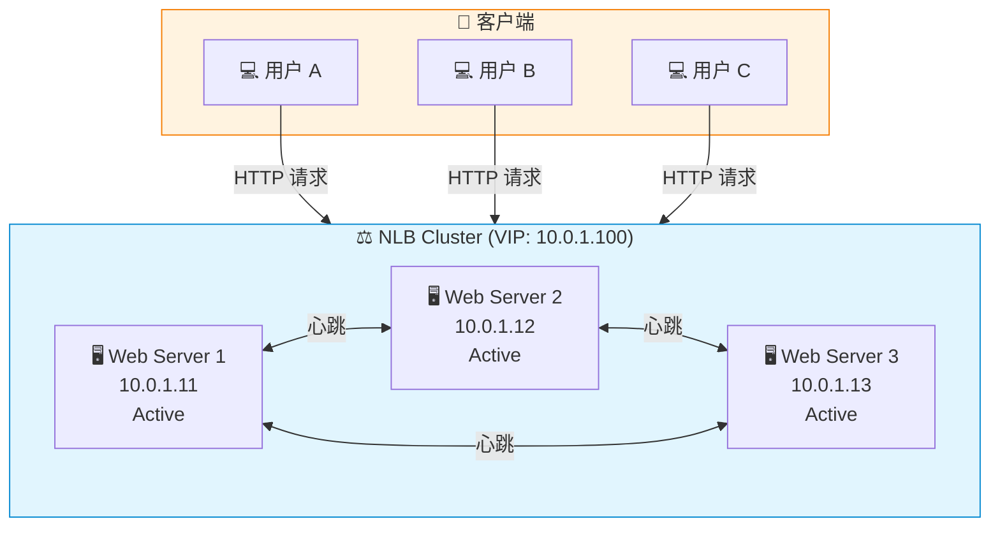
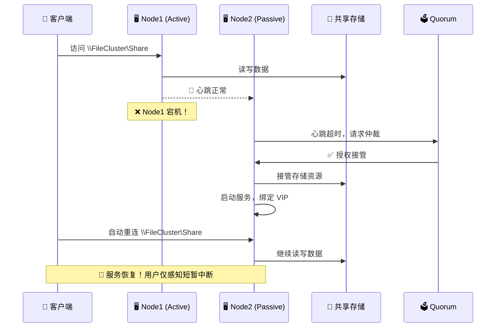
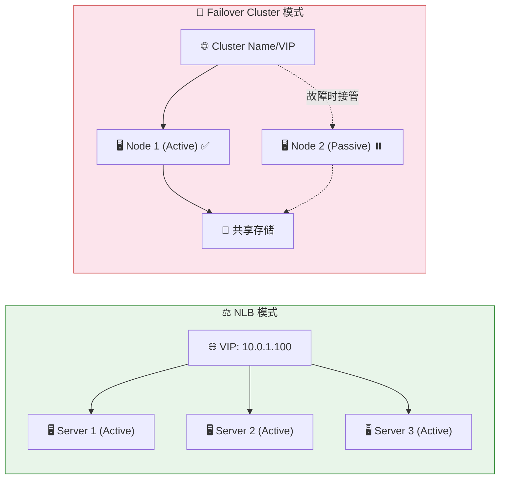

## 🎬 开场白 / Opening

> "你有没有见过那种不倒翁玩具？不管你怎么推它、打它，它总能自己站起来。今天我们要做的事情，就是把企业的关键服务变成'不倒翁'——无论发生什么故障，业务都不会倒下。这一集，我们来聊 Network Load Balancing 和 Failover Clustering！"

**本集时长：** 约 12-15 分钟
**难度等级：** ⭐⭐⭐⭐（进阶）
**前置知识：** EP01-EP08 的基础知识，特别是 EP07（SMB/NFS）和 EP05（VPN）

---

## 📍 场景设定 / Scene

星辰科技（StarTech）的业务蒸蒸日上，客户量翻了好几倍。但是上周发生了一件让所有人都心惊肉跳的事情——

**CEO 在全公司大会上说：**

> "各位，上次我们的文件服务器挂了整整半天，3 个大客户的合同差点丢了，损失了好几十万！我不管你们用什么技术手段，我只有一个要求——**我们的内部系统绝对不能宕机！** 客户 7×24 小时都要能访问我们的服务！"

小明坐在会议室里，感受到了前所未有的压力。他心里默默盘算：

- 📁 **文件服务器**（File Server）——如果挂了，几百人的文档都没法访问
- 🌐 **内部网站/应用**（IIS Web Server）——客户门户和内部工具
- 🖥️ **远程桌面服务**（RDS）——分公司员工全靠它办公
- 🗄️ **数据库服务器**（SQL Server）——核心业务数据

> 💡 **小明的思考：** "单台服务器就像只有一个飞行员的飞机，一旦飞行员身体不适，整架飞机就危险了。我需要一个机制，让关键服务变成'双机长'甚至'多机长'模式！"

这就是今天的主题——**高可用性（High Availability）**。Windows Server 提供了两个核心武器：**NLB（Network Load Balancing）** 和 **Failover Clustering**。

---

## 🧠 核心概念 / Core Concepts

### 一、先搞清楚：什么是高可用？

**高可用性（High Availability, HA）** 的核心思想很简单：

> **"不要把所有鸡蛋放在一个篮子里。"**

| 指标 | 含义 | 每年允许宕机时间 |
|------|------|-----------------|
| 99% | "两个 9" | 约 3.65 天 |
| 99.9% | "三个 9" | 约 8.76 小时 |
| 99.99% | "四个 9" | 约 52.6 分钟 |
| 99.999% | "五个 9" | 约 5.26 分钟 |

CEO 要求的"不能宕机"，至少需要达到 **99.9%** 以上的可用性。

### 二、NLB — 银行多柜台模式

#### 🏦 生活类比

想象你去银行办理业务：

- **没有 NLB 的世界：** 银行只有 1 个柜台，100 个人排一条长队，前面的人办得慢，后面的人急得跳脚。如果那个柜员请假了——整个银行停业！
- **有 NLB 的世界：** 银行开了 5 个柜台，门口有个智能排队系统（叫号机），自动把客户分配到空闲的柜台。某个柜员请假了？没关系，剩下 4 个柜台继续服务，客户甚至感觉不到区别。

**NLB 就是那个"智能排队叫号系统"！**

#### 🔧 NLB 的工作原理

NLB 是 Windows Server 的内置功能，不需要额外的硬件负载均衡器。

**核心机制：**
1. 多台服务器共享同一个 **Virtual IP（VIP）**
2. 客户端访问这个 VIP
3. NLB 根据算法将请求分配到不同的节点
4. 所有节点提供 **完全相同** 的服务

#### 📡 NLB 模式对比

| 特性 | Unicast 模式 | Multicast 模式 |
|------|-------------|----------------|
| MAC 地址 | 所有节点共享同一个虚拟 MAC | 每个节点保留自己的 MAC，增加虚拟 MAC |
| 节点间通信 | ❌ 不能直接通信（需要额外网卡） | ✅ 可以直接通信 |
| 交换机要求 | 普通交换机即可 | 可能需要配置静态 ARP 或 IGMP |
| 适用场景 | 简单环境，节点不需要互相通信 | 需要节点间通信的环境 |
| 推荐程度 | 小规模 | ⭐ 大多数生产环境 |

> 💡 **小明的选择：** "我们用 Multicast 模式，这样服务器之间还能互相通信，方便管理。"

#### 🎯 Affinity 设置（亲和性）

Affinity 决定了"同一个客户是否总是被分配到同一个柜台"。

| Affinity | 行为 | 适用场景 |
|----------|------|---------|
| **None** | 完全随机分配，每次请求可能去不同节点 | 纯无状态服务（静态网站） |
| **Single** | 同一 IP 的客户始终去同一节点 | 需要 Session 的 Web 应用 |
| **Network** | 同一子网的客户去同一节点 | 通过 NAT 出来的企业用户 |

#### 📋 Port Rules（端口规则）

Port Rules 定义了 NLB 处理哪些流量：

- **端口范围：** 指定 NLB 管理的端口（如 80, 443）
- **协议：** TCP, UDP, 或两者
- **过滤模式：**
  - **Multiple Hosts（多主机）：** 流量分布到所有节点 ← 最常用
  - **Single Host（单主机）：** 所有流量去优先级最高的节点
  - **Disabled（禁用）：** 阻止该端口的流量

#### ✅ NLB 最适合的场景

- 🌐 **IIS Web Server** — 无状态 HTTP/HTTPS 请求
- 🚪 **RDS Gateway** — 远程桌面网关负载均衡
- 📧 **Exchange CAS** — 客户端访问服务器（旧版本）
- 🔐 **ADFS Server** — 身份验证代理

#### ⚠️ NLB 的局限性

- **没有真正的健康检查：** NLB 不会主动检测应用是否健康，只检测节点是否在线
- **只能工作在 L4（传输层）：** 不理解 HTTP 内容，无法做 URL 路由
- **不适合有状态服务：** 数据库、文件服务器等有状态数据的服务不适用
- **最多 32 个节点：** 有上限限制

### 三、Failover Clustering — 备份飞行员模式

#### ✈️ 生活类比

这次我们用飞机来类比：

- **没有 Failover Cluster：** 飞机只有一个飞行员。如果他突然不舒服——全机乘客都有危险！
- **有 Failover Cluster：** 飞机有机长和副驾驶。机长突然无法操作时，副驾驶 **立刻无缝接管**，乘客可能完全不知道发生了什么。

**Failover Cluster 就是那个"副驾驶自动接管"的机制！**

#### 🔧 Failover Cluster 的工作原理

与 NLB 的"分散流量"不同，Failover Cluster 的核心是 **"待命接管"**：

1. **正常情况：** 主节点（Active）提供服务，备节点（Passive）在旁待命
2. **故障发生：** 主节点心跳丢失
3. **自动转移：** 备节点自动接管服务和资源（IP、磁盘、服务名称）
4. **客户端感知：** 可能有短暂中断（几秒到几十秒），但服务自动恢复

#### 🧩 Cluster 核心组件

| 组件 | 作用 | 类比 |
|------|------|------|
| **Cluster Nodes** | 组成集群的服务器 | 飞行员们 |
| **Shared Storage** | 所有节点都能访问的共享存储 | 飞机的仪表盘（所有飞行员都能看到） |
| **Cluster Network** | 节点间的心跳网络 | 飞行员之间的对讲机 |
| **Quorum** | 决定哪个节点有权接管 | 航空公司的指挥中心 |
| **Cluster Resources** | 被集群管理的服务/IP/磁盘 | 飞机的各项控制权 |

#### 🗳️ Quorum 模型 — "谁说了算？"

Quorum（仲裁）解决的是一个关键问题：**当节点之间通信中断时，谁有权接管服务？**

这就像一个投票系统——必须有 **超过半数的投票权** 才能做决定。

| Quorum 模型 | 描述 | 适用场景 |
|-------------|------|---------|
| **Node Majority** | 只靠节点投票，超过半数节点在线即可 | 奇数节点（3, 5, 7...） |
| **Node and Disk Majority** | 节点 + 共享磁盘（Disk Witness）投票 | 偶数节点 + 共享存储 |
| **Node and File Share Majority** | 节点 + 文件共享见证（File Share Witness） | 没有共享存储的环境 |
| **Cloud Witness** | 节点 + Azure Blob Storage 投票 | ⭐ 跨站点集群，推荐 |

> 💡 **Cloud Witness 是目前的最佳实践！** 用 Azure Storage 做见证，不需要额外的物理服务器，而且天然跨地域。

#### 💾 Cluster Shared Volumes (CSV)

传统的 Failover Cluster 有个问题：一个磁盘同一时间 **只能被一个节点** 拥有。

**CSV 解决了这个问题：**
- 所有节点可以 **同时读写** 同一个卷
- 使用 SMB 3.0 协议在节点间传输数据（还记得 EP07 吗？）
- 路径统一挂载在 `C:\ClusterStorage\Volume1`
- 非常适合 Hyper-V 虚拟机存储

> 📌 **连接 EP07（SMB/NFS）：** CSV 底层使用 SMB 3.0 Multichannel 在节点间通信。这就是为什么我们在 EP07 强调 SMB 3.0 的重要性——它不仅仅是文件共享，还是集群基础设施的核心！

#### ✅ Failover Cluster 最适合的场景

- 📁 **File Server（Scale-Out）** — 高可用文件服务器
- 🗄️ **SQL Server Always On** — 数据库高可用
- 🖥️ **Hyper-V** — 虚拟机实时迁移和故障转移
- 📧 **Exchange DAG** — 邮箱数据库可用性组
- 🖨️ **Print Server** — 打印服务集群

### 四、NLB vs Failover Cluster — 终极对比

| 特性 | NLB | Failover Cluster |
|------|-----|-------------------|
| **核心目的** | 分散负载 | 故障接管 |
| **工作模式** | Active-Active（所有节点同时工作） | Active-Passive（主备模式）* |
| **共享存储** | ❌ 不需要 | ✅ 通常需要 |
| **适合的服务** | 无状态服务 | 有状态服务 |
| **健康检查** | 基础（心跳） | 高级（资源级别） |
| **故障转移时间** | 几乎无感知（请求自动去其他节点） | 几秒到几十秒 |
| **最大节点数** | 32 | 64 |
| **成本** | 低（无需额外硬件） | 较高（共享存储） |
| **典型例子** | IIS 网站集群 | SQL Server 集群 |

> *注：Failover Cluster 也支持 Active-Active 模式，如 Multi-Site Cluster。

### 五、整合场景 — 实战组合拳

#### 场景 1：RDS 网关 + NLB

```
分公司员工 → NLB VIP (443) → RDS Gateway 1
                             → RDS Gateway 2
                             → RDS Gateway 3
```

多个 RDS Gateway 通过 NLB 负载均衡，用户通过同一个域名访问。

#### 场景 2：文件服务器 + Failover Cluster

```
用户访问 \\FileCluster\Share → Active Node (Node1)
                             → [故障] → Passive Node (Node2) 自动接管
```

文件服务器使用 Failover Cluster，文件存在共享存储上。

#### 场景 3：SQL Server Always On

```
应用程序 → Listener VIP → Primary Replica (读写)
                        → Secondary Replica (只读/待命)
```

SQL Server 的 Always On Availability Groups 是 Failover Cluster 的高级应用。

---

## 🏗️ 架构图解 / Architecture

### NLB 架构图



### Failover Cluster 故障转移流程



### NLB vs Failover Cluster 对比图



---

## 🔧 实操演示 / Demo

### Part 1: NLB 操作命令

```powershell
# ============================================================
# 查看 NLB 集群信息
# ============================================================

# 获取当前服务器上的 NLB 集群
Get-NlbCluster

# 查看 NLB 集群的详细参数
Get-NlbCluster | Format-List *

# 查看集群中的所有节点
Get-NlbClusterNode

# 查看端口规则
Get-NlbClusterPortRule

# ============================================================
# 创建 NLB 集群（在第一台服务器上执行）
# ============================================================

# 创建新的 NLB 集群
New-NlbCluster -InterfaceName "Ethernet" `
    -ClusterName "WebCluster" `
    -ClusterPrimaryIP "10.0.1.100" `
    -SubnetMask "255.255.255.0" `
    -OperationMode "Multicast"

# 添加第二个节点
Add-NlbClusterNode -InterfaceName "Ethernet" `
    -NewNodeName "WEB-02" `
    -NewNodeInterface "Ethernet"

# 添加第三个节点
Add-NlbClusterNode -InterfaceName "Ethernet" `
    -NewNodeName "WEB-03" `
    -NewNodeInterface "Ethernet"

# ============================================================
# 配置端口规则
# ============================================================

# 删除默认的 "所有端口" 规则
Get-NlbClusterPortRule | Remove-NlbClusterPortRule -Force

# 添加 HTTP (80) 端口规则
Add-NlbClusterPortRule -StartPort 80 -EndPort 80 `
    -Protocol TCP `
    -Mode Multiple `
    -Affinity Single

# 添加 HTTPS (443) 端口规则
Add-NlbClusterPortRule -StartPort 443 -EndPort 443 `
    -Protocol TCP `
    -Mode Multiple `
    -Affinity Single

# ============================================================
# NLB 管理操作
# ============================================================

# 停止某个节点（维护时用）
Stop-NlbClusterNode -HostName "WEB-02"

# 优雅地排空连接后停止（Drainstop）
Stop-NlbClusterNode -HostName "WEB-02" -Drain

# 启动节点
Start-NlbClusterNode -HostName "WEB-02"

# 查看集群状态
Get-NlbClusterNode | Select-Object Name, State, StatusCode
```

### Part 2: Failover Clustering 操作命令

```powershell
# ============================================================
# 安装 Failover Clustering 功能
# ============================================================

# 安装集群功能（所有节点都要执行）
Install-WindowsFeature -Name Failover-Clustering `
    -IncludeManagementTools

# ============================================================
# 验证集群配置
# ============================================================

# 运行集群验证测试（非常重要！创建集群前必须通过）
Test-Cluster -Node "NODE-01","NODE-02" -ReportName "ClusterValidation"

# ============================================================
# 创建 Failover Cluster
# ============================================================

# 创建新集群
New-Cluster -Name "FileCluster" `
    -Node "NODE-01","NODE-02" `
    -StaticAddress "10.0.1.200" `
    -NoStorage

# ============================================================
# 配置 Quorum（Cloud Witness 推荐）
# ============================================================

# 使用 Cloud Witness（Azure Storage Account）
Set-ClusterQuorum -CloudWitness `
    -AccountName "stcsclusterwitness" `
    -AccessKey "YourAzureStorageAccessKey"

# 查看当前 Quorum 配置
Get-ClusterQuorum | Format-List *

# ============================================================
# 集群管理命令
# ============================================================

# 查看集群信息
Get-Cluster | Format-List *

# 查看集群节点
Get-ClusterNode | Select-Object Name, State, NodeWeight

# 查看集群资源
Get-ClusterResource | Select-Object Name, ResourceType, State, OwnerNode

# 查看集群组（角色）
Get-ClusterGroup | Select-Object Name, State, OwnerNode

# ============================================================
# Cluster Shared Volumes (CSV)
# ============================================================

# 添加磁盘到集群
Get-ClusterAvailableDisk | Add-ClusterDisk

# 将集群磁盘转换为 CSV
Add-ClusterSharedVolume -Name "Cluster Disk 1"

# 查看 CSV 状态
Get-ClusterSharedVolume | Select-Object Name, State, SharedVolumeInfo

# CSV 路径确认
Get-ChildItem "C:\ClusterStorage\"

# ============================================================
# 故障转移测试
# ============================================================

# 手动移动资源到另一个节点（模拟故障转移）
Move-ClusterGroup -Name "FileServer" -Node "NODE-02"

# 查看故障转移历史
Get-ClusterLog -Destination "C:\Logs" -TimeSpan 60
```

### Part 3: 高可用文件服务器快速部署

```powershell
# ============================================================
# 在 Failover Cluster 上创建文件服务器角色
# ============================================================

# 添加文件服务器角色到集群
Add-ClusterFileServerRole -Name "FSCluster" `
    -Storage "Cluster Disk 1" `
    -StaticAddress "10.0.1.201"

# 创建 SMB 共享
New-SmbShare -Name "CompanyDocs" `
    -Path "C:\ClusterStorage\Volume1\Shares\CompanyDocs" `
    -FullAccess "STARTECH\Domain Admins" `
    -ReadAccess "STARTECH\Domain Users" `
    -CimSession "FSCluster"

# 验证共享可访问
Test-Path "\\FSCluster\CompanyDocs"
```

---

## 📝 讲稿要点 / Script Notes

### 开场（30 秒）
- 🎯 开门见山：企业服务"不能倒"的需求
- 🎯 引入不倒翁概念：被推倒也能自动站起来
- 🎯 预告：NLB 和 Failover Clustering 两大核心技术

### 场景设定（1 分钟）
- 🎯 CEO 的要求：7×24 不宕机
- 🎯 上次文件服务器宕机事故的教训
- 🎯 小明面对的挑战：哪些服务需要保护？如何保护？

### 核心概念 — NLB（3 分钟）
- 🎯 银行多柜台的比喻帮助理解负载分发
- 🎯 Unicast vs Multicast：重点推荐 Multicast
- 🎯 Affinity 设置：根据应用类型选择
- 🎯 Port Rules：精确控制哪些流量走 NLB
- 🎯 NLB 的局限性——为什么还需要 Failover Cluster

### 核心概念 — Failover Cluster（3 分钟）
- 🎯 备份飞行员比喻：副驾驶自动接管
- 🎯 五大核心组件要记住
- 🎯 Quorum 投票机制——避免"脑裂"
- 🎯 Cloud Witness 是当前最佳实践
- 🎯 CSV 与 SMB 3.0 的关系（回顾 EP07）

### 对比总结（1 分钟）
- 🎯 NLB = 分流（所有人都干活）
- 🎯 Failover Cluster = 接管（一个干活，一个待命）
- 🎯 选择标准：无状态用 NLB，有状态用 Cluster

### 实操演示（3-4 分钟）
- 🎯 NLB 命令组：创建集群、添加节点、配置端口规则
- 🎯 Cluster 命令组：验证、创建、Quorum、CSV
- 🎯 模拟故障转移，观察自动接管过程

---

## ✅ 本集总结 / Summary

### 🔑 核心知识点

1. **高可用的两种模式：**
   - **NLB（负载均衡）：** 多个服务器同时工作，分散流量 → 适合无状态服务
   - **Failover Cluster（故障转移）：** 主备模式，主节点故障时备节点自动接管 → 适合有状态服务

2. **NLB 关键配置：**
   - Multicast 模式优于 Unicast（生产环境推荐）
   - Affinity 根据应用需求选择
   - Port Rules 精确控制流量

3. **Failover Cluster 关键组件：**
   - Quorum 防止"脑裂"，推荐 Cloud Witness
   - CSV 让多个节点同时访问存储
   - CSV 底层依赖 SMB 3.0（EP07 知识点串联！）

4. **选型指南：**
   - Web 服务器、RDS Gateway → NLB
   - 文件服务器、SQL Server、Hyper-V → Failover Cluster
   - 复杂场景可以组合使用

### 🧠 记忆口诀

> **"NLB 像银行开多窗，人人干活效率棒；Cluster 像飞机双机长，一个倒下另一个上！"**

### 📚 技术速查卡

| 场景 | 选择 | 原因 |
|------|------|------|
| IIS 网站负载均衡 | NLB | 无状态，可水平扩展 |
| RDS Gateway 负载均衡 | NLB | 网关本身无状态 |
| 文件服务器高可用 | Failover Cluster | 有状态数据，需保证数据一致性 |
| SQL Server 高可用 | Failover Cluster / Always On | 数据库是典型的有状态服务 |
| Hyper-V 虚拟机高可用 | Failover Cluster | VM 需要实时迁移和故障转移 |
| 打印服务器高可用 | Failover Cluster | 打印队列是有状态的 |

---

## 👉 下集预告 / Next Episode

> **第十集 — 🏢 企业网络完整蓝图：整合与实战**

下一集是我们整个系列的 **大结局**！

小明回顾他在星辰科技一年的旅程，从一根网线开始，到现在搭建了完整的企业网络基础设施。我们将学习最后几项关键技术——**Hyper-V 虚拟化网络、DFS 分布式文件系统、RDS 远程桌面服务、WSUS 更新服务**——然后把从 EP01 到 EP10 的所有技术整合成一张 **完整的企业网络蓝图**。

这将是整个系列最精彩的一集——不要错过！🎉

---

> 📌 **EP09 → EP10 知识桥梁：** 本集的 NLB 和 Failover Cluster 为下一集的企业蓝图提供了"可靠性基石"。在 EP10 中，你会看到 NLB 如何保护 RDS Gateway，Failover Cluster 如何让 Hyper-V 虚拟机永不停机，CSV 如何通过 SMB 3.0 为整个虚拟化平台提供高性能存储。**一切都将串联在一起！**
