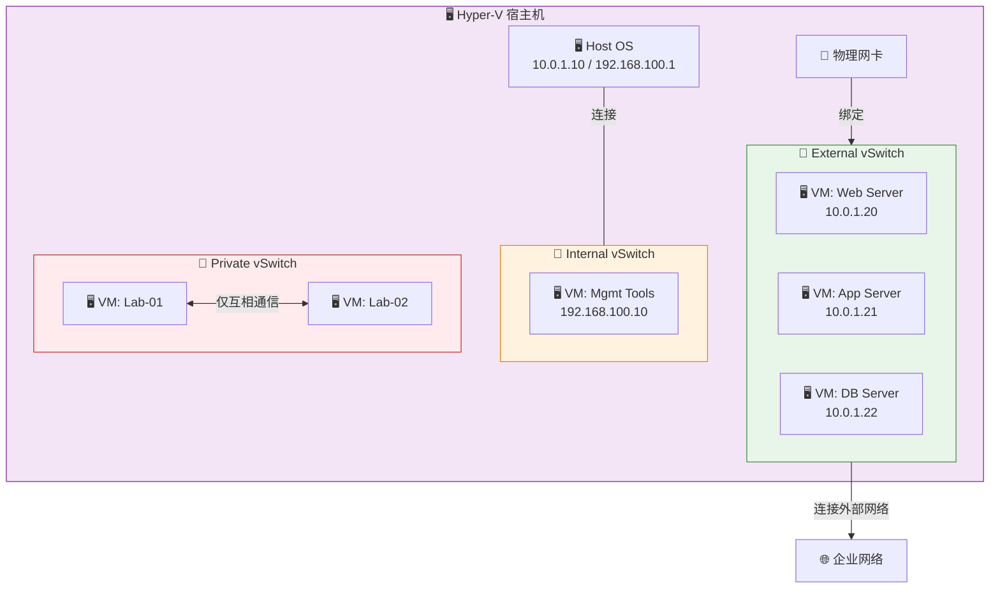
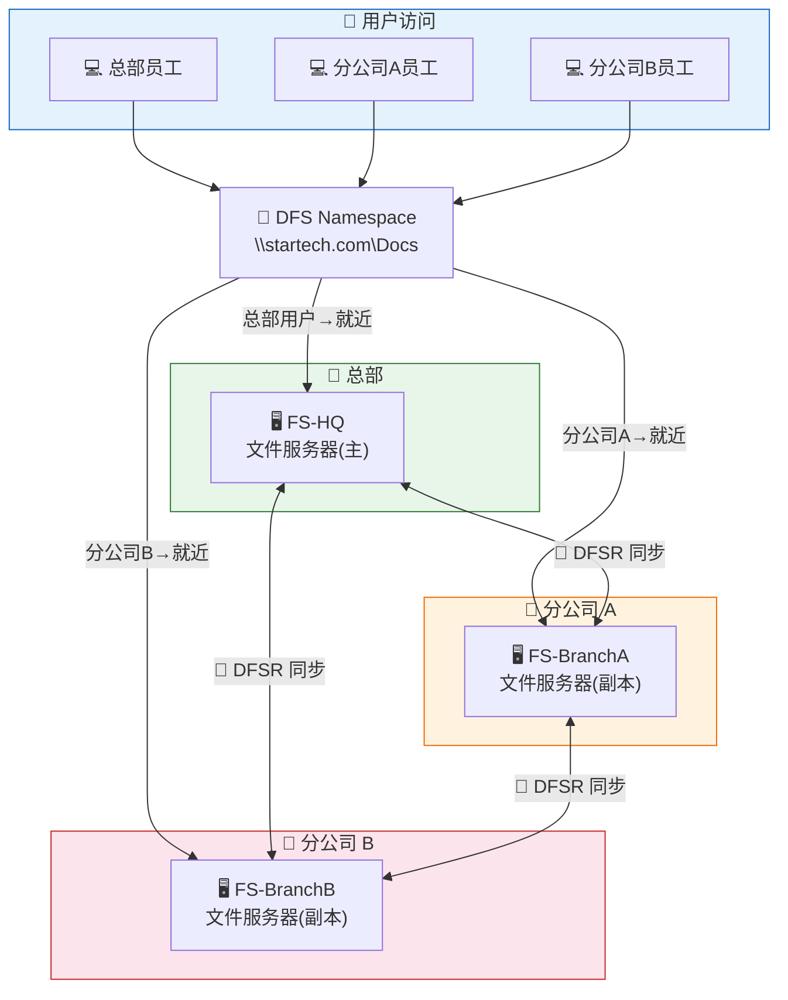
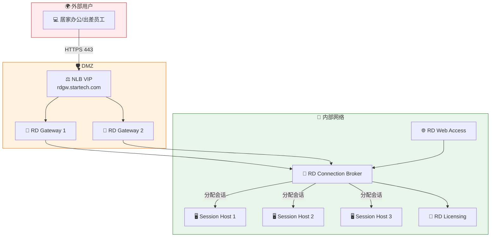
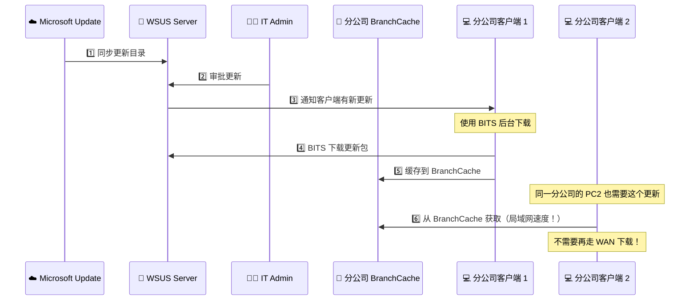
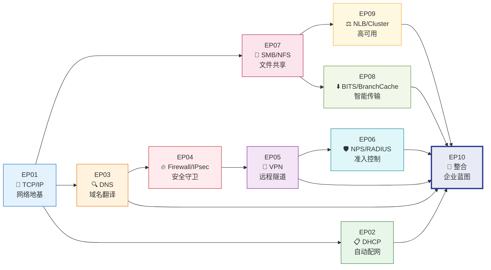

## 🎬 开场白 / Opening

> "还记得第一集那个刚入职、只会插网线的小明吗？一年过去了，他已经把星辰科技从 50 人的小公司，支撑到了 500 人、3 个分公司的企业规模。今天是我们这个系列的最后一集——大结局！我们要把前九集学到的所有技术，像拼图一样拼成一张完整的企业网络蓝图。准备好了吗？让我们开始这最后的旅程！"

**本集时长：** 约 15 分钟
**难度等级：** ⭐⭐⭐⭐⭐（综合实战）
**前置知识：** EP01-EP09 全部内容

---

## 📍 场景设定 / Scene

一年前，小明加入星辰科技（StarTech）时，公司只有 50 个人，挤在一层楼里，网络就是几台交换机加一条光纤。

**现在的星辰科技：**

| 项目 | 一年前 | 现在 |
|------|--------|------|
| 员工人数 | 50 人 | 500 人 |
| 办公地点 | 1 个 | 3 个（总部 + 2 个分公司） |
| 服务器数量 | 5 台物理机 | 30+ 台（含虚拟机） |
| 网络服务 | 基础上网 | 完整企业基础设施 |
| 远程办公 | 不支持 | 全员支持 VPN / RDS |

**最后一个挑战来了——**

CTO 找到小明说：

> "小明啊，我们要给董事会做一次技术汇报。你能不能画一张完整的网络架构图，展示我们公司所有的 IT 基础设施？要让不懂技术的人也能看懂我们建了什么。"

小明打开了他的笔记本，开始回顾这一年走过的每一步……

---

## 🧠 核心概念 / Core Concepts

### 一、Hyper-V 虚拟化网络 — 一台机器变出十台

#### 🎭 生活类比

想象一栋写字楼：

- **没有虚拟化：** 每个部门都要自己盖一栋楼，空间浪费、成本高昂
- **有了 Hyper-V：** 一栋大楼（物理服务器）被划分成多个独立的办公空间（虚拟机），每个空间有自己的门牌号（IP 地址）、独立的电话线（网络连接）、独立的钥匙（安全隔离）

**Hyper-V 就是这栋"智能大楼"的物业管理系统！**

#### 🔌 Virtual Switch 类型

Hyper-V 的网络核心是 **Virtual Switch（虚拟交换机）**。它有三种类型：

| 类型 | 连接对象 | 能访问外网？ | 能访问宿主机？ | 适用场景 |
|------|---------|-------------|---------------|---------|
| **External** | 绑定物理网卡 | ✅ 是 | ✅ 是 | 生产虚拟机（最常用） |
| **Internal** | 仅宿主机和虚拟机 | ❌ 否 | ✅ 是 | 管理网络、测试环境 |
| **Private** | 仅虚拟机之间 | ❌ 否 | ❌ 否 | 完全隔离的实验环境 |

> 💡 **类比理解：**
> - **External** = 大楼连接到城市道路（能上街）
> - **Internal** = 大楼内部走廊（只能楼内走动，不能上街）
> - **Private** = 某一层的走廊（只能同层走动，连大楼大厅都去不了）

#### 🔗 Hyper-V 与其他技术的整合

| 整合场景 | 涉及技术 | 说明 |
|---------|---------|------|
| **VM 存储** | Hyper-V + SMB 3.0（EP07） | 虚拟机磁盘可以存放在 SMB 共享上 |
| **实时迁移** | Hyper-V + SMB + Cluster（EP09） | Live Migration 通过 SMB 3.0 传输 VM 内存 |
| **高可用 VM** | Hyper-V + Failover Cluster（EP09） | VM 自动故障转移到其他节点 |
| **VM 网络** | Hyper-V + TCP/IP（EP01） | 虚拟机需要 IP、网关、DNS |
| **VM 自动配置** | Hyper-V + DHCP（EP02） | 虚拟机通过 DHCP 获取 IP |

> 📌 **连接 EP07 & EP09：** 在我们 EP09 讲的 Failover Cluster 中，Hyper-V 虚拟机的磁盘文件（.vhdx）存放在 CSV 上，而 CSV 底层就是 SMB 3.0。所以你看，**Hyper-V + Cluster + SMB 形成了一个铁三角**，支撑着整个虚拟化平台！

### 二、DFS — 分布式文件系统

#### 📚 生活类比

想象一个连锁图书馆：

- **没有 DFS：** 每个分馆有自己的书目编号系统，你要借一本书必须知道它在 **哪个分馆的哪个书架**（`\\Server-A\Share1`，`\\Server-B\Share2`）
- **有了 DFS Namespace：** 所有分馆统一使用一个目录系统，你只需要查 **"星辰图书馆→技术类→网络工程"**（`\\startech.com\公共文档\技术部`），系统自动把你导向最近的分馆
- **有了 DFS Replication：** 总馆买了一本新书，它会自动复印几份发到各个分馆，保证每个分馆都有最新的藏书

#### 📁 DFS Namespace（命名空间）

**问题：** 公司有 10 台文件服务器，用户记不住每台服务器的名字和共享路径。

**解决：** DFS Namespace 提供一个 **统一的入口路径**。

```
用户看到的：                  实际指向：
\\startech.com\Docs\          
  ├── 财务部\                 → \\FS-01\FinanceDocs
  ├── 技术部\                 → \\FS-02\TechDocs
  ├── 市场部\                 → \\FS-03\MarketingDocs
  └── 人力资源\               → \\FS-04\HRDocs
```

用户永远只需要记住 `\\startech.com\Docs\`，不需要知道文件实际存在哪台服务器上。

#### 🔄 DFS Replication（DFSR）

**问题：** 总部和分公司都需要访问同一套文件，但跨 WAN 访问太慢了。

**解决：** DFSR 自动将文件在多台服务器之间 **双向同步**。

| 特性 | 说明 |
|------|------|
| **RDC（Remote Differential Compression）** | 只传输文件变化的部分，不传整个文件 |
| **压缩传输** | 自动压缩，节省 WAN 带宽 |
| **冲突处理** | 最后写入者胜出，冲突文件保存到特殊文件夹 |
| **带宽调度** | 可以设置只在非工作时间同步 |
| **初始同步** | 首次会传输完整数据，之后只传增量 |

> 📌 **连接 EP07（SMB）：** DFS 的底层仍然是 SMB 共享。DFS Namespace 只是在 SMB 共享之上加了一层"目录导航"，让用户不需要直接记住每台服务器的 UNC 路径。

### 三、RDS — 远程桌面服务

#### 🖥️ 生活类比

RDS 就像一个 **"云端办公桌"**：

- **传统模式：** 每个人自己的电脑上装软件、存数据、配环境
- **RDS 模式：** 所有人都坐在一个超大的办公室里（服务器），每个人通过窗户（Remote Desktop）看到自己的桌面

#### 🏗️ RDS 架构组件

| 组件 | 角色 | 类比 |
|------|------|------|
| **RD Connection Broker** | 管理用户连接，决定去哪台 Session Host | 酒店前台（分配房间） |
| **RD Session Host** | 实际运行用户桌面/应用 | 酒店客房（用户实际住的地方） |
| **RD Gateway** | 允许外部用户通过 HTTPS 安全连接 | 酒店大门保安（检查身份后放行） |
| **RD Web Access** | 提供 Web 页面让用户选择应用/桌面 | 酒店的在线预订网站 |
| **RD Licensing** | 管理 RDS CAL 许可证 | 酒店的房卡管理系统 |

#### 🔗 RDS 与其他技术的整合

| 整合场景 | 说明 |
|---------|------|
| **RDS + NLB（EP09）** | 多个 RD Gateway 通过 NLB 负载均衡 |
| **RDS + NPS（EP06）** | NPS 可以作为 RD Gateway 的认证后端 |
| **RDS + VPN（EP05）** | VPN 是另一种远程接入方式，与 RDS Gateway 互补 |
| **RDS + Certificates** | RD Gateway 需要 SSL 证书确保安全连接 |
| **RDS + Hyper-V** | Session Host 通常部署为虚拟机 |

### 四、WSUS — 更新服务

#### 📦 生活类比

WSUS 就像公司的 **"内部快递仓库"**：

- **没有 WSUS：** 500 台电脑各自连到微软官网下载更新，每台下载 1GB = 占用 500GB 互联网带宽
- **有了 WSUS：** WSUS 服务器统一从微软下载一份更新（1GB），然后在内网分发给 500 台电脑。IT 管理员还能先测试，确认没问题再推送

#### 🔗 WSUS 与其他技术的整合

| 整合场景 | 涉及技术 | 说明 |
|---------|---------|------|
| **后台下载** | WSUS + BITS（EP08） | 客户端用 BITS 在后台低优先级下载更新 |
| **分支机构** | WSUS + BranchCache（EP08） | 分公司用 BranchCache 互相共享已下载的更新 |
| **自动部署** | WSUS + Group Policy | 通过 GPO 配置客户端指向 WSUS 服务器 |
| **审批流程** | WSUS 管理控制台 | IT 管理员审批后更新才会推送 |

> 📌 **连接 EP08（WinHTTP/BITS/BranchCache）：** WSUS 是 BITS 和 BranchCache 最经典的应用场景。BITS 确保下载不影响用户正常工作，BranchCache 确保分公司不会重复占用 WAN 带宽下载同一个更新包。**三者联手 = 高效、低成本的企业更新分发系统！**

---

## 🏗️ 架构图解 / Architecture

### Hyper-V 虚拟网络架构



### DFS Namespace + Replication 架构



### RDS 完整架构



### WSUS + BITS + BranchCache 更新分发链



### 🌟 完整企业网络蓝图 — 星辰科技架构全景

这是整个系列的 **"王冠上的宝石"** — 把 EP01 到 EP10 的所有技术整合在一张图中！

```mermaid
graph TB
    subgraph Internet["☁️ Internet / WAN"]
        MS_UPDATE["☁️ Microsoft Update"]
        CLOUD["☁️ Azure Cloud<br/>(Cloud Witness)"]
    end

    subgraph DMZ["🛡️ DMZ 区域"]
        FW["🔥 Firewall / IPsec<br/>(EP04)"]
        VPN_GW["🔐 VPN Gateway<br/>(EP05)"]
        RDG_NLB["⚖️ RD Gateway NLB<br/>(EP09)"]
        RDG1["🚪 RD Gateway 1"]
        RDG2["🚪 RD Gateway 2"]
    end

    subgraph HQ_Core["🏢 总部核心网络"]
        subgraph Identity["🔑 身份认证层"]
            AD["🏛️ AD Domain Controller<br/>DNS Server (EP03)"]
            NPS["🛡️ NPS / RADIUS<br/>(EP06)"]
            DHCP["📋 DHCP Server<br/>(EP02)"]
        end

        subgraph Compute["💻 计算层 (Hyper-V Cluster)"]
            HV1["🖥️ Hyper-V Node 1<br/>(EP10)"]
            HV2["🖥️ Hyper-V Node 2<br/>(EP10)"]
            CSV["💾 CSV / SMB 3.0<br/>(EP07+EP09)"]
        end

        subgraph App_Layer["📱 应用服务层"]
            WEB_NLB["⚖️ Web NLB Cluster<br/>(EP09)"]
            IIS1["🌐 IIS Web 1"]
            IIS2["🌐 IIS Web 2"]
            RDS_CB["🔀 RDS Broker<br/>(EP10)"]
            RDS_SH["🖥️ RDS Session Hosts<br/>(EP10)"]
        end

        subgraph Storage_Layer["💾 存储层"]
            FC["🔄 File Server Cluster<br/>(EP09)"]
            DFS_NS["📂 DFS Namespace<br/>(EP10)"]
            SQL["🗄️ SQL Always On<br/>(EP09)"]
        end

        subgraph Mgmt["🔧 管理层"]
            WSUS["📦 WSUS Server<br/>(EP10)"]
            BITS_SVC["⬇️ BITS Service<br/>(EP08)"]
        end

        NETWORK["🔌 TCP/IP 网络 (EP01)"]
    end

    subgraph Branch["🏢 分公司网络"]
        BR_DHCP["📋 DHCP Relay"]
        BR_DFS["📂 DFS 副本服务器"]
        BR_BC["📦 BranchCache<br/>(EP08)"]
        BR_PC["💻 分公司客户端"]
    end

    subgraph Remote["🏠 远程用户"]
        HOME["💻 居家办公"]
        MOBILE["📱 移动办公"]
    end

    %% Internet 连接
    MS_UPDATE -.->|"更新同步"| WSUS
    CLOUD -.->|"Cloud Witness"| CSV

    %% 远程访问路径
    HOME -->|"VPN (EP05)"| VPN_GW
    MOBILE -->|"HTTPS"| RDG_NLB
    VPN_GW --> FW
    RDG_NLB --> RDG1
    RDG_NLB --> RDG2
    FW --> NETWORK
    RDG1 --> RDS_CB
    RDG2 --> RDS_CB

    %% VPN 认证
    VPN_GW -->|"RADIUS 认证"| NPS

    %% 核心网络互联
    NETWORK --> Identity
    NETWORK --> Compute
    NETWORK --> App_Layer
    NETWORK --> Storage_Layer
    NETWORK --> Mgmt

    %% Hyper-V 集群
    HV1 <-->|"Failover"| HV2
    HV1 --> CSV
    HV2 --> CSV

    %% Web NLB
    WEB_NLB --> IIS1
    WEB_NLB --> IIS2

    %% RDS
    RDS_CB --> RDS_SH

    %% 存储
    DFS_NS --> FC
    FC --> SQL

    %% 更新分发链
    WSUS -->|"BITS"| BITS_SVC

    %% 分公司连接
    NETWORK ===|"WAN 专线"| Branch
    DFS_NS -->|"DFSR 同步"| BR_DFS
    WSUS -->|"更新推送"| BR_BC
    BR_BC --> BR_PC
    BR_DFS --> BR_PC
    BR_DHCP -->|"DHCP Relay (EP02)"| DHCP

    %% 样式
    style Internet fill:#e3f2fd,stroke:#1565c0
    style DMZ fill:#fff3e0,stroke:#ef6c00
    style HQ_Core fill:#f1f8e9,stroke:#558b2f
    style Identity fill:#f3e5f5,stroke:#7b1fa2
    style Compute fill:#e8eaf6,stroke:#283593
    style App_Layer fill:#e0f2f1,stroke:#00695c
    style Storage_Layer fill:#fce4ec,stroke:#c62828
    style Mgmt fill:#fff8e1,stroke:#f9a825
    style Branch fill:#e8f5e9,stroke:#2e7d32
    style Remote fill:#fbe9e7,stroke:#bf360c
```



---

## 🔧 实操演示 / Demo

### Part 1: Hyper-V 虚拟网络管理

```powershell
# ============================================================
# Hyper-V Virtual Switch 管理
# ============================================================

# 查看现有的虚拟交换机
Get-VMSwitch | Select-Object Name, SwitchType, NetAdapterInterfaceDescription

# 创建 External vSwitch（绑定到物理网卡）
New-VMSwitch -Name "External-Production" `
    -NetAdapterName "Ethernet" `
    -AllowManagementOS $true

# 创建 Internal vSwitch（管理用途）
New-VMSwitch -Name "Internal-Management" `
    -SwitchType Internal

# 创建 Private vSwitch（隔离实验环境）
New-VMSwitch -Name "Private-Lab" `
    -SwitchType Private

# 查看虚拟机的网络适配器
Get-VM | Get-VMNetworkAdapter | Select-Object VMName, SwitchName, IPAddresses, MacAddress

# 连接虚拟机到指定交换机
Connect-VMNetworkAdapter -VMName "WebServer-01" -SwitchName "External-Production"
```

### Part 2: DFS 命名空间和复制

```powershell
# ============================================================
# DFS Namespace 管理
# ============================================================

# 查看 DFS 命名空间
Get-DfsnRoot | Select-Object Path, State, Type

# 创建域名空间
New-DfsnRoot -TargetPath "\\FS-HQ\DFSRoot" `
    -Path "\\startech.com\Docs" `
    -Type DomainV2

# 添加文件夹链接
New-DfsnFolder -Path "\\startech.com\Docs\技术部" `
    -TargetPath "\\FS-HQ\TechDocs"

# 添加分公司的文件夹目标（同一路径指向多个服务器）
New-DfsnFolderTarget -Path "\\startech.com\Docs\技术部" `
    -TargetPath "\\FS-BranchA\TechDocs"

# 查看文件夹目标
Get-DfsnFolderTarget -Path "\\startech.com\Docs\技术部"

# ============================================================
# DFS Replication (DFSR) 管理
# ============================================================

# 查看复制组
Get-DfsReplicationGroup | Select-Object GroupName, State

# 查看复制状态
Get-DfsrBacklog -GroupName "TechDocs-Replication" `
    -SourceComputerName "FS-HQ" `
    -DestinationComputerName "FS-BranchA"

# 查看 DFSR 连接健康状态
Get-DfsrConnectionSchedule -GroupName "TechDocs-Replication" `
    -SourceComputerName "FS-HQ" `
    -DestinationComputerName "FS-BranchA"

# 强制立即同步
Sync-DfsReplicationGroup -GroupName "TechDocs-Replication" -SourceComputerName "FS-HQ"
```

### Part 3: RDS 环境管理

```powershell
# ============================================================
# RDS 部署查看与管理
# ============================================================

# 查看 RDS 部署概览
Get-RDServer | Select-Object Server, Roles

# 查看 Session Host 状态
Get-RDSessionHost -CollectionName "DesktopCollection" |
    Select-Object SessionHost, NewConnectionAllowed, SessionLimit

# 查看当前用户会话
Get-RDUserSession | Select-Object UserName, HostServer, SessionState, CreateTime

# 查看 RDS 许可证状态
Get-RDLicenseConfiguration

# 查看 RD Gateway 策略
Get-Item "RDS:\GatewayServer\CAP\*" | Select-Object Name, Status
Get-Item "RDS:\GatewayServer\RAP\*" | Select-Object Name, Status

# 断开闲置会话（超过 60 分钟无操作）
Get-RDUserSession | Where-Object { $_.SessionState -eq 'Disconnected' } |
    ForEach-Object { Invoke-RDUserLogoff -HostServer $_.HostServer -UnifiedSessionID $_.UnifiedSessionId -Force }
```

### Part 4: WSUS 管理

```powershell
# ============================================================
# WSUS 管理命令
# ============================================================

# 连接到 WSUS 服务器
$wsus = Get-WsusServer -Name "WSUS-01" -PortNumber 8530

# 查看 WSUS 服务器状态
Get-WsusServer | Select-Object Name, PortNumber, ServerProtocolVersion

# 查看同步状态
$wsus.GetSubscription().GetLastSynchronizationInfo() |
    Select-Object LastSyncTime, LastSyncResult

# 查看等待审批的更新数量
Get-WsusUpdate -Approval Unapproved -Status FailedOrNeeded |
    Measure-Object | Select-Object Count

# 审批更新到特定计算机组
Get-WsusUpdate -UpdateId "特定更新GUID" |
    Approve-WsusUpdate -Action Install -TargetGroupName "Production Servers"

# 查看客户端报告状态
$wsus.GetComputerTargets() |
    Select-Object FullDomainName, LastReportedStatusTime, LastSyncTime |
    Sort-Object LastSyncTime -Descending | Select-Object -First 20

# 清理过期内容
Invoke-WsusServerCleanup -CleanupObsoleteUpdates `
    -CompressUpdates `
    -DeclineExpiredUpdates `
    -DeclineSupersededUpdates
```

### Part 5: 全系列关键命令速查

```powershell
# ============================================================
# EP01-EP10 核心命令速查表
# ============================================================

# --- EP01: TCP/IP ---
Get-NetIPConfiguration                        # 查看 IP 配置
Test-NetConnection -ComputerName 10.0.1.1     # 网络连通性测试
Get-NetTCPConnection                          # TCP 连接状态

# --- EP02: DHCP ---
Get-DhcpServerv4Scope                         # DHCP 作用域
Get-DhcpServerv4Lease -ScopeId 10.0.1.0       # DHCP 租约

# --- EP03: DNS ---
Resolve-DnsName "www.startech.com"             # DNS 解析
Get-DnsServerZone                              # DNS 区域
Get-DnsServerResourceRecord -ZoneName "startech.com"  # DNS 记录

# --- EP04: Firewall / IPsec ---
Get-NetFirewallRule | Where-Object Enabled -eq True   # 活跃防火墙规则
Get-NetIPsecMainModeSA                         # IPsec SA 状态

# --- EP05: VPN ---
Get-VpnConnection                              # VPN 连接
Get-RemoteAccessConnectionStatistics           # VPN 统计

# --- EP06: NPS ---
Get-NpsRadiusClient                            # RADIUS 客户端
netsh nps show config                          # NPS 配置

# --- EP07: SMB / NFS ---
Get-SmbShare                                   # SMB 共享列表
Get-SmbSession                                 # SMB 会话
Get-SmbConnection                              # SMB 连接

# --- EP08: WinHTTP / BITS / BranchCache ---
netsh winhttp show proxy                       # WinHTTP 代理
Get-BitsTransfer -AllUsers                     # BITS 传输
Get-BCStatus                                   # BranchCache 状态

# --- EP09: NLB / Failover Cluster ---
Get-NlbCluster                                 # NLB 集群
Get-Cluster                                    # Failover Cluster
Get-ClusterNode                                # 集群节点
Get-ClusterSharedVolume                         # CSV 状态

# --- EP10: Hyper-V / DFS / RDS / WSUS ---
Get-VMSwitch                                    # 虚拟交换机
Get-DfsnRoot                                    # DFS 命名空间
Get-RDServer                                    # RDS 服务器
Get-WsusServer                                  # WSUS 服务器
```

---

## 📝 讲稿要点 / Script Notes

### 开场（30 秒）
- 🎯 情感唤起：回忆第一集的小明 vs 现在的小明
- 🎯 大结局宣告：把所有拼图拼完整
- 🎯 预告：Hyper-V、DFS、RDS、WSUS + 完整架构蓝图

### 场景设定（1 分钟）
- 🎯 公司从 50 人到 500 人的成长
- 🎯 CTO 的要求：画一张技术人和非技术人都能看懂的架构图
- 🎯 小明的回顾：这一年走过的技术旅程

### Hyper-V 虚拟化网络（2 分钟）
- 🎯 写字楼比喻：一栋楼划分多个独立办公空间
- 🎯 三种 vSwitch 类型及适用场景
- 🎯 Hyper-V + SMB + Cluster 铁三角
- 🎯 连接 EP07（SMB 3.0）和 EP09（Failover Cluster）

### DFS 分布式文件系统（2 分钟）
- 🎯 连锁图书馆比喻
- 🎯 Namespace 统一入口 — 用户只需记一个路径
- 🎯 Replication 自动同步 — 分公司就近访问
- 🎯 连接 EP07（SMB 共享是 DFS 的底层）

### RDS 远程桌面服务（2 分钟）
- 🎯 "云端办公桌"比喻
- 🎯 五大组件及其角色
- 🎯 RDS + NLB 实现 Gateway 高可用（连接 EP09）
- 🎯 RDS + NPS 实现认证（连接 EP06）

### WSUS 更新服务（1.5 分钟）
- 🎯 "内部快递仓库"比喻
- 🎯 WSUS + BITS + BranchCache 的完美组合（连接 EP08）
- 🎯 审批流程确保更新安全

### 完整企业蓝图（3 分钟）⭐ 重点中的重点
- 🎯 展示全景 Mermaid 图，逐层讲解
- 🎯 用五个场景演示数据流：
  1. 员工开机联网
  2. 访问共享文件
  3. 居家 VPN 办公
  4. 分公司下载文件
  5. 系统更新推送
- 🎯 让观众看到所有技术如何协同工作

### 系列回顾与结语（2 分钟）
- 🎯 小明的成长 = 观众的成长
- 🎯 技术关系总图
- 🎯 鼓励继续学习
- 🎯 感性结尾

---

## ✅ 本集总结 / Summary

### 🔑 本集新技术

| 技术 | 一句话总结 |
|------|----------|
| **Hyper-V Virtual Switch** | 把物理网络虚拟化，一台服务器跑多个独立网络环境 |
| **DFS Namespace** | 统一文件路径入口，用户不需要记住每台服务器 |
| **DFS Replication** | 跨站点文件同步，分公司就近访问 |
| **RDS** | 远程桌面服务，让员工随时随地办公 |
| **WSUS** | 内部更新服务器，统一管理和分发系统更新 |

### 🗺️ 完整技术关系图



### 📋 五大数据流场景回顾

#### 场景 1：员工开机联网 🖥️→🌐
```
电脑启动 → DHCP(EP02) 获取 IP → DNS(EP03) 注册主机名
→ AD 域认证 → Group Policy 下发 → 加入企业网络
```

#### 场景 2：访问共享文件 📁
```
用户输入 \\startech.com\Docs → DNS(EP03) 解析 DFS 路径(EP10)
→ DFS Namespace 定位最近服务器 → SMB 3.0(EP07) 建立连接
→ File Server Cluster(EP09) 提供高可用服务
```

#### 场景 3：居家 VPN 办公 🏠→🔐
```
员工在家启动 VPN(EP05) → Firewall(EP04) 放行 VPN 流量
→ NPS/RADIUS(EP06) 验证身份 → 建立加密隧道
→ 访问内部所有资源（文件、应用、桌面）
```

#### 场景 4：分公司下载文件 🏢→📥
```
分公司员工访问共享 → DFS(EP10) 指向本地副本
→ 若文件已在 BranchCache(EP08)，直接命中
→ 若未缓存，通过 BITS(EP08) 后台从总部下载
→ 下载完成后自动缓存到 BranchCache，惠及同事
```

#### 场景 5：系统更新推送 📦→💻
```
WSUS(EP10) 从 Microsoft 同步更新 → IT Admin 审批
→ 客户端通过 BITS(EP08) 后台下载
→ 分公司 BranchCache(EP08) 共享已下载内容
→ 按计划自动安装更新 → 向 WSUS 报告状态
```

---

## 🎬 系列收官 / Series Finale

### 📖 小明的成长故事

一年前的小明：
> "我刚来的时候，连 IP 地址是什么都说不清楚。看着机房里密密麻麻的线缆和嗡嗡响的服务器，感觉像走进了外星飞船。"

现在的小明：
> "现在我能搭建完整的企业网络，从一根网线到数百人的高可用架构。每一项技术都不是孤立的，它们就像乐高积木，组合在一起才能搭出宏伟的城堡。"

### 🛤️ 推荐学习路径

如果你跟着这个系列走到了最后，恭喜你！以下是继续深造的方向：

| 方向 | 建议学习内容 |
|------|------------|
| 🔒 **安全方向** | Active Directory Certificate Services (AD CS), Microsoft Defender, Azure Security |
| ☁️ **云端方向** | Azure Networking, Azure VPN, Azure Load Balancer, Azure AD |
| 🖥️ **虚拟化方向** | Hyper-V 深入（Nested, Shielded VMs）, Azure Stack HCI |
| 📊 **监控方向** | SCOM, Azure Monitor, Log Analytics |
| 🤖 **自动化方向** | PowerShell DSC, Ansible for Windows, Azure Automation |

### 💌 结语

> "感谢你花时间看完这整个系列。Windows 网络的世界很大，我们只是打开了一扇门。记住，技术不是用来死记硬背的——它是用来解决问题的。当你真正理解了每项技术解决什么问题、为什么这样设计，你就不需要背命令了，因为一切都变得合情合理。
>
> 小明的故事结束了，但你的故事才刚刚开始。
>
> **网络不断，学习不止。我们下一个系列再见！** 🚀"

---

> 📌 **全系列索引：**
> - EP01 🔌 TCP/IP — 网络的地基
> - EP02 📋 DHCP — 自动发 IP 的"居委会"
> - EP03 🔍 DNS — 互联网的电话簿
> - EP04 🔥 Firewall & IPsec — 网络安全守卫
> - EP05 🔐 VPN — 穿越互联网的秘密隧道
> - EP06 🛡️ NPS & RADIUS — 网络准入控制台
> - EP07 📁 SMB & NFS — 文件共享的艺术
> - EP08 ⬇️ WinHTTP, BITS & BranchCache — 智能传输三剑客
> - EP09 ⚖️ NLB & Failover Cluster — 不倒翁架构
> - EP10 🏢 企业网络完整蓝图 — 整合与实战 ← **你在这里！**
